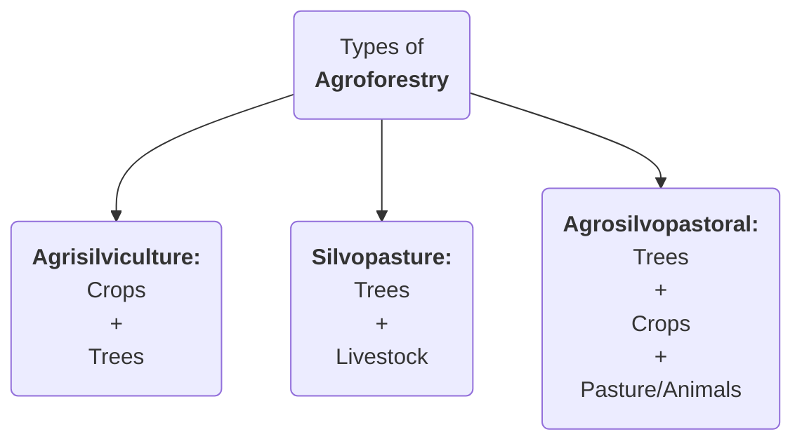

### **CROP DIVERSIFICATION CHALLENGES IN PUNJAB**
#GS3 #Agriculture #Environment 

<b><u>NEWS:</u></b> Despite Punjab government's **pilot project** to **divert 12K Ha** from **Paddy** to **Maize** and to increase **cotton cultivation by 15%**, the state saw an all-time-high of **32.44LHa under paddy**.
- **35-36 Lakh Ha** under cultivation in Punjab during the Kharif season
- **91% of Kharif** area is under Paddy 

<b><u>CHALLENGES:</u></b>
1. Growing the same crops year after year on the same land **increases vulnerability to pest and disease** attacks
2. Paddy cultivation specifically **depletes soil** which **increases dependence of chemical feritlisers**
3. Paddy is a **water guzzling crop** and leads to **GW table reduction**
	- Punjab's GW table has been declining by **0.5m per annum** on average
4. **Farmer's propensity to deny work around government mandates:** for instance the **Punjab Preservation of Subsoil Water Act, 2009** *barred* any *nursery-sowing before May 15* and *transplanting before June 15*. However, farmers **pushed the cropping cycle back**, **shortening the window** between the Kharif harvest and sowing of wheat, leading to **stubble burning** problem.
5. **Unintended consequences of MSP:** MSP procurement is skewed in favor of Punjab and makes paddy attractive while alternatives are ignored by farmers.
6. **Flawed policy making and freebies:** like **8-hours free electricity** have increased GW depletion. Similar is the case for **subsidies on fertilizers**.
---
### **DATA ON SUB-SECTORS OF AGRICULTURE**
#GS3 #Agriculture #Data 

<b><u>DATA ON AGRICULTURE:</u></b>
- ***Economic contribution***: **16% GDP** for FY24 (Economic Survey 2024-25)
-  ***Livelihood:*** Supports **46% population**

<b><u>HIGHLIGHTS OF MoSPI 2025 REPORT:</u></b>
- **Gross Value Added (GVA) and Gross Value of Output (GVO):** in agriculture and allied sector 
	- **DECADAL GROWTH:**
		- **GVA** rose by **225%** (current prices) from *FY12* to *FY24*
		- **GVO** rose by **54.6%** (current prices) from *FY12** to *FY24*
	- **GVO IN FY24:**
		- *Crops* - **54%**
		- ***Livestock*** - **31%** (increased from **25.6% in FY12)
		- *Forestry & logging* - **7.7%**
		- ***Fishing & aquaculture*** - **7%**
			- The share of **inland fisheries** has **decreased** to ***50.2% (still majority)*** whereas the share of **marine fisheries increased**
- **Rising share or allied sector:** ***~46%*** of total GVO from *37.6% in FY12*

---
### **MONSOON DEPENDENCE OF INDIAN AGRICULTURE**
#GS1 #Agriculture #Irrigation #Monsoon

<b><u>QUOTE:</u></b> ***Agriculture is back-bone of Indian economy and Indian agriculture growth is monsoon dependent. This dependence is so significant that the popular magazine Down to Earth once quipped "<b><i><u>the monsoon is the chief finance minister of India</u></i></b>"***.

---
### **AGROFORESTRY**
#GS3 #Environment #Agriculture #AgroForestry #Rules

<b><u>NEWS/DATA:</u></b>
- Government released **model rules** for ***"Felling of Trees in Agricultural Land"*** to **promote Agroforestry**. The rules will ***ease tree falling and transit rules*** to boost **timber production**, by simplifying obtaining **felling permit and NOC** through the ***National Timber Management System** portal.
- Agroforestry covers ***8.65%** (28.42 million hectares)* of India's total geographical area
- Share of **agroforesrty and logging** in the **agiculture GVO** is around ****7.7%***, as per **NSO 2025 Report** 

<b><u>WHAT IS AGROFORESTRY:</b></u>
- #Definition Agroforestry involves **growing trees & agricultural crops** together on the **same land**
	- Government defines agroforestry land, for all calculation purposes, as having over **10% tree cover on agricultural land**
- **Types of Agroforestry:**

<b><u>BENEFITS OF AGROFORESTRY:</b></u>
- **Environmental benefits:** 
	1. ***Tree cover:*** supports **increasing tree cover outside forests** and help reach **33%** target under **National Forest Policy** 
	2. Promotes **sustainable land use**
	3. ***Carbon sequestration:*** helps in achieving India's **NDCs** by creating additional **carbon sink** and help **counter climate change**
- **Economic benefits:** 
	1. It helps ***double farmer's income*** through **diversified income streams** and **increased economic resilience**
	2. It boosts ***crop productivity*** by ***improving nutrient recycling***
	3. It improves ***soil fertility*** by contributing to **soil organic matter** through ***leaf litter*** and enhances fertility
	4. The tree roots help in ***water retention*** and improve ***water infiltration***, learning to better water availability to crops
	5. It helps by **reduce erosion** and **counter desertification**
	6. Diverse agroforestry systems can ****reduce pests*** and ***disease pressure*** through promoting **biodiversity**
	7. ***Microclimate regulation:*** agroforestry also provides **shade** to crops and **reduce heat stress**
- **Social benefits:** improvement in **rural living standards** from sustained employment and higher incomes
 
<b><u>INITIATIVES TO PROMOTE AGROFORESTRY:</u></b>
- **National Agroforestry Policy, 2014:** to promote agroforestry and to create a framework for research, development, and scaling up agroforestry practices.
- **Sub-Mission on Agroforestry (SMAF):** it is under the **National Mission for Sustainable Agriculture**
- **GROW initiative:** launched by **NITI Aayog**, aiming to transform India's wastelands through agroforestry
- **Amendments to the Forest Act 1927 in 2017:** redefined **bamboo** as **grass** instead of a tree, simplifying its harvesting and transit

<b><u>CONSLUSION:</u></b> ***"The future of agriculture depends on widespread adoption of dynamic agroforestry, as it is the best means to improve land productivity and best link between environment and economy"***

---
