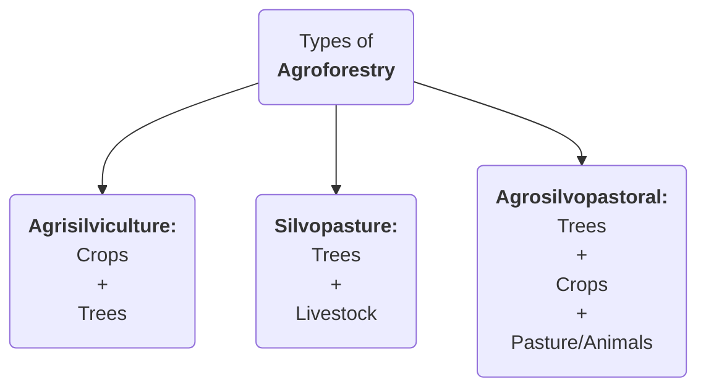

### **CROP DIVERSIFICATION CHALLENGES IN PUNJAB**
#GS3 #Agriculture #Environment 

<b><u>NEWS:</u></b> Despite Punjab government's **pilot project** to **divert 12K Ha** from **Paddy** to **Maize** and to increase **cotton cultivation by 15%**, the state saw an all-time-high of **32.44LHa under paddy**.
- **35-36 Lakh Ha** under cultivation in Punjab during the Kharif season
- **91% of Kharif** area is under Paddy 

<b><u>CHALLENGES:</u></b>
1. Growing the same crops year after year on the same land **increases vulnerability to pest and disease** attacks
2. Paddy cultivation specifically **depletes soil** which **increases dependence of chemical feritlisers**
3. Paddy is a **water guzzling crop** and leads to **GW table reduction**
	- Punjab's GW table has been declining by **0.5m per annum** on average
4. **Farmer's propensity to deny work around government mandates:** for instance the **Punjab Preservation of Subsoil Water Act, 2009** *barred* any *nursery-sowing before May 15* and *transplanting before June 15*. However, farmers **pushed the cropping cycle back**, **shortening the window** between the Kharif harvest and sowing of wheat, leading to **stubble burning** problem.
5. **Unintended consequences of MSP:** MSP procurement is skewed in favor of Punjab and makes paddy attractive while alternatives are ignored by farmers.
6. **Flawed policy making and freebies:** like **8-hours free electricity** have increased GW depletion. Similar is the case for **subsidies on fertilizers**.
---
### **DATA ON SUB-SECTORS OF AGRICULTURE**
#GS3 #Agriculture #Data 

<b><u>DATA ON AGRICULTURE:</u></b>
- ***Economic contribution***: **16% GDP** for FY24 (Economic Survey 2024-25)
-  ***Livelihood:*** Supports **46% population**

<b><u>HIGHLIGHTS OF MoSPI 2025 REPORT:</u></b>
- **Gross Value Added (GVA) and Gross Value of Output (GVO):** in agriculture and allied sector 
	- **DECADAL GROWTH:**
		- **GVA** rose by **225%** (current prices) from *FY12* to *FY24*
		- **GVO** rose by **54.6%** (current prices) from *FY12** to *FY24*
	- **GVO IN FY24:**
		- *Crops* - **54%**
		- ***Livestock*** - **31%** (increased from **25.6% in FY12)
		- *Forestry & logging* - **7.7%**
		- ***Fishing & aquaculture*** - **7%**
			- The share of **inland fisheries** has **decreased** to ***50.2% (still majority)*** whereas the share of **marine fisheries increased**
- **Rising share or allied sector:** ***~46%*** of total GVO from *37.6% in FY12*

---
### **MONSOON DEPENDENCE OF INDIAN AGRICULTURE**
#GS1 #Agriculture #Irrigation #Monsoon

<b><u>QUOTE:</u></b> ***Agriculture is back-bone of Indian economy and Indian agriculture growth is monsoon dependent. This dependence is so significant that the popular magazine Down to Earth once quipped "<b><i><u>the monsoon is the chief finance minister of India</u></i></b>"***.

---
### **AGROFORESTRY**
#GS3 #Environment #Agriculture #AgroForestry #Rules

<b><u>NEWS/DATA:</u></b>
- Government released **model rules** for ***"Felling of Trees in Agricultural Land"*** to **promote Agroforestry**. The rules will ***ease tree falling and transit rules*** to boost **timber production**, by simplifying obtaining **felling permit and NOC** through the ***National Timber Management System** portal.
- Agroforestry covers ***8.65%** (28.42 million hectares)* of India's total geographical area
- Share of **agroforesrty and logging** in the **agiculture GVO** is around ****7.7%***, as per **NSO 2025 Report** 

<b><u>WHAT IS AGROFORESTRY:</b></u>
- #Definition Agroforestry involves **growing trees & agricultural crops** together on the **same land**
	- Government defines agroforestry land, for all calculation purposes, as having over **10% tree cover on agricultural land**
- **Types of Agroforestry:**

<b><u>BENEFITS OF AGROFORESTRY:</b></u>
- **Environmental benefits:** 
	1. ***Tree cover:*** supports **increasing tree cover outside forests** and help reach **33%** target under **National Forest Policy** 
	2. Promotes **sustainable land use**
	3. ***Carbon sequestration:*** helps in achieving India's **NDCs** by creating additional **carbon sink** and help **counter climate change**
- **Economic benefits:** 
	1. It helps ***double farmer's income*** through **diversified income streams** and **increased economic resilience**
	2. It boosts ***crop productivity*** by ***improving nutrient recycling***
	3. It improves ***soil fertility*** by contributing to **soil organic matter** through ***leaf litter*** and enhances fertility
	4. The tree roots help in ***water retention*** and improve ***water infiltration***, learning to better water availability to crops
	5. It helps by **reduce erosion** and **counter desertification**
	6. Diverse agroforestry systems can ****reduce pests*** and ***disease pressure*** through promoting **biodiversity**
	7. ***Microclimate regulation:*** agroforestry also provides **shade** to crops and **reduce heat stress**
- **Social benefits:** improvement in **rural living standards** from sustained employment and higher incomes
 
<b><u>INITIATIVES TO PROMOTE AGROFORESTRY:</u></b>
- **National Agroforestry Policy, 2014:** to promote agroforestry and to create a framework for research, development, and scaling up agroforestry practices.
- **Sub-Mission on Agroforestry (SMAF):** it is under the **National Mission for Sustainable Agriculture**
- **GROW initiative:** launched by **NITI Aayog**, aiming to transform India's wastelands through agroforestry
- **Amendments to the Forest Act 1927 in 2017:** redefined **bamboo** as **grass** instead of a tree, simplifying its harvesting and transit

<b><u>CONSLUSION:</u></b> ***"The future of agriculture depends on widespread adoption of dynamic agroforestry, as it is the best means to improve land productivity and best link between environment and economy"***

---
### **GENETIC-TECHNOLOGY IN AGRICULTURE**

<b><u>NEWS/DATA:</u></b> 
- **USA** is urging India to open its agriculture market to imports of **Genetically Modified (GM) crops**.
- **Global GM crop adoption** has skyrocketed since 1996, with **200 MnHa** of GM soybean, maize, canola being grown in **2023** across 76 countries.

<b><u>CASE STUDY OF BT-COTTON:</u></b>
- In **2002, Atal Bihari Vajpayee's government took a bold decision to allow BT-Cotton** in India and today **90% India's cotton area** is under **BT-Cotton** with ***193% cotton growth*** between **FY03-FY14**, with ***87% productivity increase.***
- India became **2nd largest cotton producer** and **second largest cotton exporter** with around **USD 4 Billion** in exports.
- **Bt-Cotton seed** is consumed by livestock and the **BT-Cotton seed oil** is consumed by humans. ***Although, some scientist suggest the oil does not the carry the protein that the seed has.***
  

- However, since 2015 the **productivity gains flattened and then dipped** with yield **decreasing to even below global average** in 2023-24. This corresponds to ***2% average annual drop in cotton production since 2015***
	- In 2023-24, the Cotton Yields are 
		- **India: 436 kg/Ha**
		- **Global avg: 770 Kg/Ha**
		- **China: 1945 Kg/Ha (around 5 times of India! )**
	- **Reasons:**
		1. Largely drive by **pests outbreaks** - ***Pink Bollworms*** and ***Whiteflies***
		2. **Prohibition** on **next generation cotton seeds** i.e, **Herbicide-tolerant (HT) BT-Cotton**
			- **HT-BT-Cotton** is engineered to survive **Glyphosate spraying** never received official clearance and trials were suspended
			- Still, **seeds have been leaked to farmers** with estimates that **GT-Bt Cotton** covers around ***15-25% acreage***.
				- This represents **disconnect between government and farmers**
		3. Tangled regulations like, **Price Control Order of 2015** through which government entered into **private seed contracts**, by **slashing Bt cotton seed royalties to Rs. 39/packet - to low to entice biotech firms to invest in new seed technologies.**
		4. **Activism** and **idealogical opposition** to GM crops in India
	- India now has turned to a ***net importer of cotton*** with net imports of USD 400 Mn

<b><u>OTHER GM CROPS:</u></b>
- Approval of **Bt Brinjal** and **GM mustard (DMH 11)** still remains on hold despite being **cleared by GEAC**
	- **Bt Brinjal** is still under moratorium since 2009
	- **GM Mustard** got **conditional environmental release in 2022**, but still **not approved for commercialization** 

<b><u>GM CROPS AND FUTURE:</u></b> India **must approve GM crops** and **must produce them itself** rather than **importing them from USA**
1. **India falling behind the world:** around  **200 MnHa** of GM soybean, maize, canola being grown in **2023** across 76 countries.
2. **Successful implementation of Bt Cotton** as an example with ***193% cotton growth*** between **FY03-FY14**, with ***87% productivity increase.***
3. **GM crops are already in our food system:** Indians already consume **Bt cotton seed oil** and **GM-soya and corn already being imported as poultry feed**
4. Delay in adopting GM crops has resulted in **productivity decline in India** #Eg **HT-Bt cotton** not being adopted as the next gen cotton seed
5. Farmers already growing unapproved GM crops **illegally through leaked seeds** - around **15-25% cotton acreage is estimated by some firms to be under unapproved HT-Bt cotton**. This shows, **willingness of farmers to grow GM crops.**
6. Huge **potential to boost horticulture** and to **diversify India's cropping pattern** #Eg **Bt Brinjal** , **GM Mustard (DMH-11)**, and **GM ssoy**.
7. Huge potential for **GM seed exports** to **Asia and Africa**

<b><u>CONCLUSION:</u></b> 
>***Honbl. PM Atal Bihari Vajpayee was instrumental in allowing Bt-Cotton cultivation in India and he quipped, "IT (Information Technology) is for India and BT (Biotechnology) is for Bharat". We must proceed with advanced biotechnology in agriculture as "from plate to plough, India's future depends on embracing gene technology."***

---
