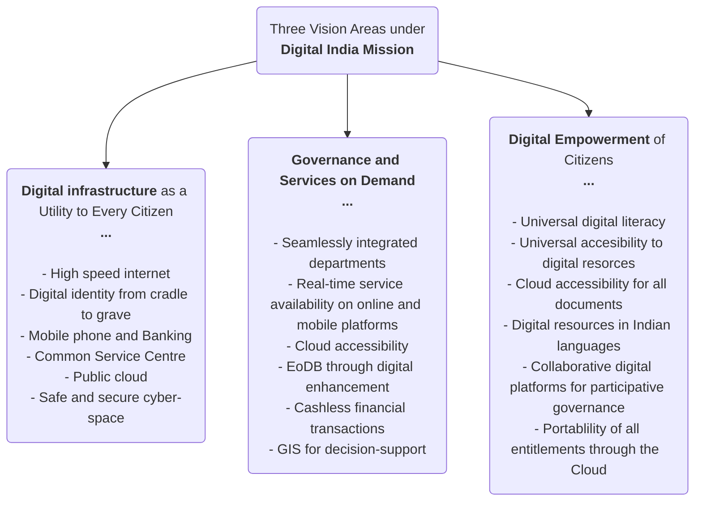

```table-of-contents
```
---
### **INDIA AND R&D ECOSYSTEM**
#GS2 #Governance #Education #Gs3 #Research
  
<b><u>NEWS:</u></b>  
- India has **54 universities in the Rankings**, making it **4th** after **US, UK, and China** in terms of **most represented country**  
- **IIT Delhi - 123rd**, is India's top ranked institution  
- India ranked **39th/133** in the **Global Innovation Index 2024**  
  
<b><u>CONCERNS:</u></b>  
1. **Low GERD (Gross Expenditure on Research & Development): 0.64% of GDP**  
	- China - 2.43%  
	- USA - 3.5  
	- **Economic Survey 2020-2021:** India needs to increase its GERD to **2%**  
2. **Inadequate private sector participation:**  
	- Central government - 43.7%  
	- **Private sector - 36.4%**  
		- Compared to **70%** in countries like **USA, and China** 
	- State governments - 6.7%  
	- Higher Education Institutions - 8.8%  
	- Public Sector Industries - 4.4%  
3. **Poor utilization of funds:** in FY23  
	- **DoBT - 72%** utilization of allocated budget  
	- **DoST - 61%** utilization of allocated budget  
4. **Sub-optimal Industry-Academia convergence:** poor transformation of technologies developed in Indian labs for larger good of society  
5. **Brain drain:** to developed countries  
  
<b><u>INITIATIVES:</u></b>  
- **Draft National Science, Technology, and Innovation (STIP) (2020):** to **double** the number of Full-Time Equivalent (FTE) researchers, GERD and private sector contribution to GERD **every 5 years**.  
- **Anusandhan National Research Foundation (ANRF):** Established under the **ANRF Act, 2023** to seed, grow and promote R&D and foster a culture of research and innovation throughout the country  
- **IMPacting Research INnovation and Technology (IMPRINT):** aimed at bridging gap between **scientific knowledge base** created through **fundamental research** and **applied research** and fruitful translation to engineering innovation  

<b><u>STATES ROLE IN SCIENCE AND TECHNOLOGY:</u></b> 
- **NITI** Aayog recently released the report titled, **"A Roadmap for strengthening State S&T Councils,"** outlining the issues and challenges along with pathways pertaining the ***State Science and Technology Councils***.
- <b><u>Recommendations of NITI Aayog:</u></b>
	- **Financial support and resources:**
		- State government should allocate at least ***0.5% of GSDP*** as ***S&T budget***
		- Shifting from *core-grant by the Central government* to ***project-based and performance based grants***
	- **Human Resources:**
		- Maintain a ***70:30 scientific to non-scientific*** **staff ratio**
		- Enhance capabilities via ***Faculty and Researcher secondment*** and utilizing ***retired scientists*** from central-level.
	- **Collaborations and linkages** with industries and **redefine programs** by mapping state resources with institutional partnerships.

---
### **MGNREGS SPENDING CAP**
#GS2 #GS3 #Scheme #Employment #SocialSecurity

<b><u>NEWS:</u></b> Union Finance Ministry has **capped spending** under the **MGNREGS** at **60%** of its **annual allocation** for the **first half of FY26**

<b><u>FEATURES OF MGNREGS:</u></b>
- Largest **social security** programme offering ** demand based employment as a statutory right**
- **Section 3(1) of MGNREGA Act 2005:** ***guarantees 100 days of employment*** in a year to **ruaral HH** whose adult members volunteer to do **unskilled manual labor**
	- **Legally back guarantee** for any rural adult to **get work within 15 days** of demanding it
- **1/3 of MGNREGA beneficiaries** are **women**
- 100 days have not became **de facto upper limit** as the **NREGA software** does not allow data entries for employment above 100 days to a household in a financial year **unless specifically requested by state/UT**
	- In some cases, **government** allows **additional 50 days of wage** employment like, **ST HHs in forest areas** are entitled to get **150 days** provided that such families have no other private property expect for land rights under the FRA, 2006
	- Under the **Section3(4)**, the government can also provide an **additional 50 days** of unskilled work in **rural areas** where a **drought** or any **natural calamity** is notified by **MHA**.

<b><u>NEED FOR THE CAP:</u></b>
1. Financial troubles with MGNREGA - thus, brought under the MEP/QEP
2. High pending dues - 70% funds are exhausted by September and 100% exhausted by January

<b><u>ISSUES WITH MGNREGS EXPENDITURE CAP</u></b>
1. MGNREGS has been brought under the **Monthly Expenditure Plan/Quarterly Expenditure Plan (MEP/QEP)**, a **spending control mechanism** introduced by Finance Ministry in 2017. Earlier, it was exempt on account of being demand driven.
2. **Issue of fluctuating demand:** work demand fluctuates throughout the year linked with agricultural activities and weather patterns. **Expenditure cap does not take into account these contingencies**.
	- In **2023**, low rainfall led to 20% higher work demand than usual in July and August, with **Karnataka in particular spending more than 70% of the annual MGNREGS budget within 6 months due to extreme drought**.
	3.**Legality issues:** for social security schemes which are based on specific legislations, the **government has limited power to determine the implementation modalities**
	- #Judgement <b><u>Swaraj Abhiyan Vs Union of India (2016):</u></b> SC has held that **financial inability cannot** be a reason to **disregard statutory or constitutional duties**.
---
### **DATA GOVERNANCE**
#GS2 #GS3 #Governance #SciTech #DataGovernance #Report 

<b><u>NEWS:</u></b>
- **NITI Aayog** released the report titled, **"India's Data Imperative: The Pivot Towards Quality"*** highlighting that over past decade, India has emerged as a ***global leader in digital public infrastructure***.
- India now enters the **next phase of its digital journey** where the focus must shift from ***merely scaling*** to ***prioritizing quality data***

<b><u>DATA QUALITY:</u></b>
- **Quality data** consists of **6 core attributes:**
	- ***Accuracy***, 
	- ***Completeness***, 
	- ***Timeliness***, 
	- ***Consistency***,
	- ***Validity***, and 
	- ***Uniqueness***
- The report introduces a ***Data-Quality Scorecard*** to monitor and improve datasets, as well as a ***Data-Quality Maturity Framework*** having **7 dimensions** and **5 levels of maturities:**
	1. *Data Governance & Ownership*
	2. *Standards & Metadata*
	3. *Data Capture & Validation Controls*
	4. *Quality Monitoring & Reporting*
	5. *Standards & Metadata*
	6. *Data Capture & Validation Controls*
	7. *Quality Monitoring & Reporting*

<b><u>NEED OF QUALITY DATA FOR GOVERNANCE:</u></b>
1. **Fortifies digital governance:** powering efficient digital platforms, such as UPI and Aadhar, and ensures the smoother delivery of government services
2. **Prevents wastage:** ***errors or duplicate entries can inflate welfare budgets by 4-7% annually***
3. **Cultivate public trust:** poor data leads to incorrect targeting, delays, and citizen frustration. Quality data avoids such mismatches, and rejected claims

<b><u>CHALLENGES IN LEVERAGING QUALITY DATA FOR GOOF GOVERNANCE:</u></b>
1. **Faulty data capture:** field programs prioritize **speed over correctness**, resulting in a culture where, *80% accuracy is considered "good enough*
2. **Fragmented Data storage:** some systems utilize *modern cloud tools*, but any rely on *outdated databases* that lack audit trails and a standardized structure
3. **Inconsistent Data sharing:** different departments employ varying formats and update schedules, resulting in *slow and expensive data integration.*
4. **Poor archival practices:** old, outdated records are rarely removes, cluttering systems and slowing performance 

<b><u>WAY FORWARD:</u></b>
1. ***Three fast fixes:***
	1. **Fix at the source** - build validation, de-duplication, and metadata standards into data capture stages
	2. **Maintain cleanliness** - monthly audits, designate data stewards and connect public grievances to correction processes
	3. **Embed accountability** - deploy dashboards tracking key data quality KPIs
2. **For structural transformation:**
	1. Appoint dedicated **data stewards** at national, state and district levels
	2. **Linking budget allocations and departmental performance to data quality**
	3. **Driving interoperability** with **standardized schemas** and APIs
	4. Embedding **data ownership** within departmental roles, backed by incentives

<b><u>CONCLUSION:</u></b> ***"Trust, not volume, defines the future of digital India"***

---
### **GUIDELINE FOR DIRECT RELEASE OF CENTRAL SECTOR (CSS) FUNDS**
#GS3 #Economy #Scheme #Funding #Finances #Ethics
- Issued by **Finance Ministry**
- **Guidelines:**
	- **Central Nodal Agency (CNA):** concerned ministry will appoint an agency for each CSS. The CNA can be autonomous body, PSU or State agency, etc.
	- **Budgeting and Savings:** Ministers should estimate scheme budgets realistically and flag any saving earl, especially by the 3rd quarter.
	- **Unused funds** will **lapse** at the end of financial year and cannot be carried forward.
	- ***"Just-In-Time"* Fund Release:** 
		- **Not more than 25%** disbursement at a time that too when needed.
		- **75% prior utilization of funds** and meeting all previous conditions.
- **Other measures to ensure effectiveness of Central scheme:**
	- **Mandatory** use of **PFMS** (Public Finance Management System): for Fund tracking, real-time monitoring and control unspent balances.
	- **Sunset clauses:** mandated by the Finance Ministry in 2017 to align schemes with financial resources cycle.
	- A private member bill, **The Government Legislative Proposal and Schemes Bill, 2022** was introduced to bring accountability and Parliamentary oversight.
---
### **DATA ON CHILD AND MATERNAL HEALTH**
#GS1 #GS2 #Governance #Health #Data #Report #MainsValueAddition 

<b><u>NEWS:</u></b>
- Reports by **UN Inter-agency groups:**
	- ***Trends in maternal mortality 2000 to 2023***
	- ***Levels & Trends in Child Mortality 2024***

<b><u>ACHIEVEMENTS OF INDIA:</u></b>
- **Decline in *"zero-dose children"*:** Reduced from *0.11% (2023)* to <b><u>0.06%</u> (2024)</b> of total population
	- "<b><u><i>Zero-dose children</i></u></b>" are those who did not receive their first dose on **DPT** *(Diptheria-Tetanus-Pertussis)* vaccine
- **Polio-Free Status:** maintained since *2014* through **National Immunization Days**
- **Reduction in mortality indicators:**

| **INDICATOR**                           | **DEFINITION**                                                                         | **INDIAN DECLINE SINCE 1990** | **GLOBAL DECLINE SINCE 1990** |
| --------------------------------------- | -------------------------------------------------------------------------------------- | ----------------------------- | ----------------------------- |
| 1. **Maternal Mortality Rate (MMR)**    | Number of maternal deaths during a given time period per 1,00,000 (1 lakh) live births | **86%**                       | 48%                           |
| 2. **Under-Five Mortality Rate (U5MR)** | Number of deaths of children under 5 years of age per 1,000 live births                | **78%**                       | 61%                           |
| 3. **Neonatal Mortality Rate (NMR)**    | Number of neonatal (birth to 29 days) deaths per 1,000 live births                     | **70%**                       | 54%                           |

- **Achievements of Universal Immunization Programme (UIP):**
	- **Reach:** provides free vaccination services annually to **~3 crore pregnant women** and **~2.6 crore infants*** (0-1 year)
	- **Vaccines:** includes **12 vaccine-preventable diseases** (up from 6 in 2013)

<b><u>INITIATIVES BY INDIA FOR VACCINATION:</u></b>
1. ***Zero Dose Implementation Plan 2024:*** rolled across 143 districts in 11 states with high burden on unvaccinated children
2. **Mission Indradhanush:** vaccinated **5.5 crore children** and **1.32 crore pregnant women** in 2017
3. **Village Health and Nutrition Days (VHNDs):** community-level immunization and outreach
4. **U-WIN** portal for tracking of immunization status

---
### **DATA ON E-GOVERNANCE**
#GS2 #Governance #e-Governance #DPI #Data 

<b><u>NEWS:</b></u>
- **Digital India Mission** completed **10 years**

<b><u>DIMENSIONS OF DIGITAL GOVERNANCE:</u></b>



<b><u>ACHIEVEMENTS OF DIGITAL INDIA MISSION: DATA ON E-GOVERNANCE:</u></b> #MainsValueAddition
1. **Digital Economy:** #Data contributing ***11.75% to national income in FY23*** and expected to reach ***13.4% by FY25***
	- India ranks **3rd** in the world for **digitization of economy**
2. **Connectivity and Infrastructure:**
	- #Data **Internet connections** increased from *25 crore (2014)* to ***97 crore (2024)*** and **BharatNet** connected ***2.18 lakh Gram Panchayats*** with high speed internet
3. **Digital Finance and Financial inclusion:**
	- **Digital payments:** #Data India accounts for **49% of global real-time digital payments** in 2023 with ***UPI*** being live in 7 countries
	- **Aadhar-enabled DBT:** #Data saved **Rs. 3.5 lakh crore** by eliminating ***fake beneficiaries*** 
		- <i><u><b>ALWAYS USE THIS DATA ON DBT/GHOST-BENEFECIARIES</b></u></i>
4. **Advancing strategic tech capabilities:** through ***IndiaAI Mission**, ***India Semiconductor Mission*** (six projects approved), and ***SEMICON India 2025***
5. **e-Goverance:** training of civil servants on ***Karmayogi Bharat iGOT platform**,* and improving access to central and state government services through ***UMANG***

---
### **HEALTH TAX**
#GS2 #Governance #Health #Agriculture #FoodProcessing 

<b><u>NEWS:</u></b>
- **WHO** launched ***"3 by 35"*** initiatives aiming to ***raise prices on tobacco, alcohol, and sugary drinks*** by ***at least 50%*** through ***health taxes*** over the next 10 years.

<b><u>HEALTH TAX:</u></b>
- Levied on products that have **negative public health impact** #Eg Tobacco, Alcohol, etc.
- **WHO** recommends **taxation** as one of the most cost-effective tools for addressing population levels of **obesity** and other related **non-communicable diseases (NCDs)**

<b><u>NEED FOR HEALTH TAX:</u></b>
1. **Health impact:** consumption of tobacco, alcohol, and sugary drinks **fuels the NCD epidemic** which accounts for over **75% of global deaths**
2. **Economic impact:** these products create **negative externatlities** *(costs to others)* and **negative internalities** *(hidden costs to customers)*
	- ***Tobacco use costed the global economy USD 1.4 Trillion in 2012***
3. **Revenue generation:** ***50% tax*** generate up to **USD 3.7 Trillion** in new revenue globally within five years, or an average of **USD 740 Billion** per year - equivalently to **0.75% of global GDP**
4. **Promote equity:** as NCDs impact lower-income populations disproportionately

<b><u>STEPS TAKEN IN INDIA FOR CURBING CONSUMPTION FOR UNHEALTHY PRODUCTS:</u></b>
1. **Areated beverages in India** are taxed at **28% GST** and an additional **12% compensation cess**
2. **High-Fat Sugar Salt <b><u>(HFSS)</u></b>** foods in India are taxed at **12% GST rate**
3. **FSSAI limits Trans Fatty Acids (TFA)** in food products to 2% y mass of total oils and fats

<b><u>SUCCESSFUL GLOBAL CASE STUDIES:</u></b> #MainsValueAddition 
- **Colombia (2016):** Increase in taxation of cigarettes in Colombia causes **34% drop in cigarette consumption**
- **Saudi Arabia:** A **50% <b><u>SSB</u></b> (Sugar, Sweet and Beverages) tax** resulted in a **19% decrease** in consumption of SSBs within a year

---
### **AI IN TRADITIONAL MEDICINE**
#GS2 #GS3 #Govenance #IR #SciTech #Health 

<b><u>NEWS:</u></b>
- **WHO's first ever technical brief** titled, *"Mapping the Application of Artificial Intelligence in Traditional Medicine"*, under the ***Global Initiative on AI for Health (GI-AI4H)*** **praised India's leadership** in integrating **AI** with **Traditional 

<b><u>AI APPLICATIONS IN INDIAN TRADITIONAL MEDICINE:</u></b>
1. **Smarted diagnosis:** AI combined with traditional techniques like *pulse reading, tongue analysis* and *Prakriti assessment* with deep learning
2. **Ayurgenomics:** merges **genomics** with **Ayurvedic principles**. AI helps identify **disease risk amrkers** and tailor health advice based on person's Ayurvedic constitution.
3. **Indentify drug action pathways:** develop **chemical sensors** to assess Ayurvedic concepts like *Rasa, Guna* and *Virya*.

<b><u>CHALLENGES IN INTEGRATING AI WITH TRADITIONAL MEDICINE:</u></b>
1. **Biopiracy risk:** indigenous knowledge and resources may be misused without consent for profit
2. **Digital gaps:** poor infrastructure and low digital literacy limits access and usage
3. **Lack of quality data:** AI needs large, reliable datasets, which are often missing in TM
4. **Localization Vs. Integration:** hard to balance local relevance of AI tools with global use and standardization

<b><u>INDIAN INITIATIVES FOR AI IN TRADITIONAL MEDICINE:</u></b>
1. **Traditional Knowledge Digital Library (TKDL):** digitized TM practices from Ayurveda, Siddha, Sowa-Rigpa, and Yoga
2. **Ayush Grid:** launched in 2018, is central digital platform for TM, It supports key initiatives like,
	- **AYUSH Health Management Information System (AHIMS):** *cloud-based* information system used by various clinical establishments
	- **SAHI Portal:** *Showcase of Ayurvedic Historical Imprints*
	- **NAMASTE Portal:** for traditional medicine services by standardizing terminology and morbidity codes
	- **Ayush Research Portal:** centralized research access
3. **Ayush Sanjivni** mobile app and the **Yoga locator** mobile app
4. **Gobal Partnership on AI (GPAI) Summit, 2023:** a *multi-stakeholder initiative* which aims to bridge the gap between *theory and practice in AI*.

---
