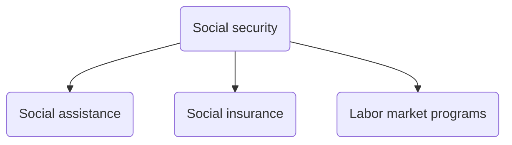
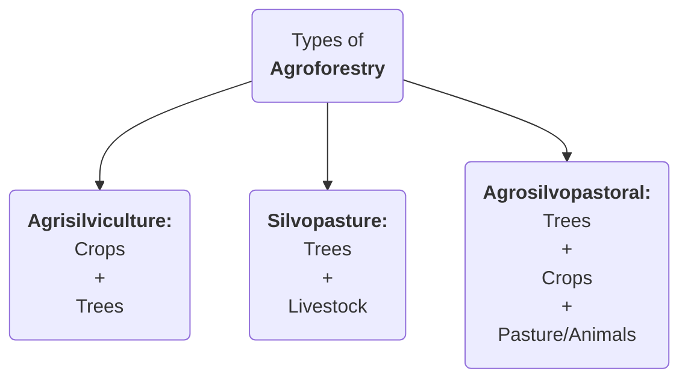
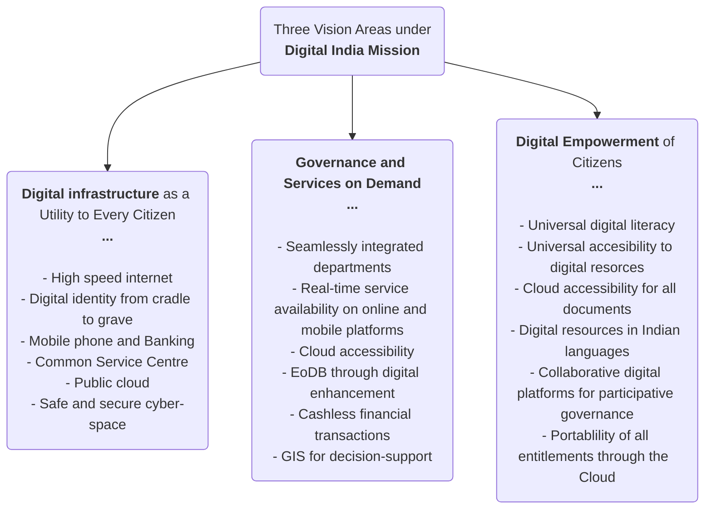
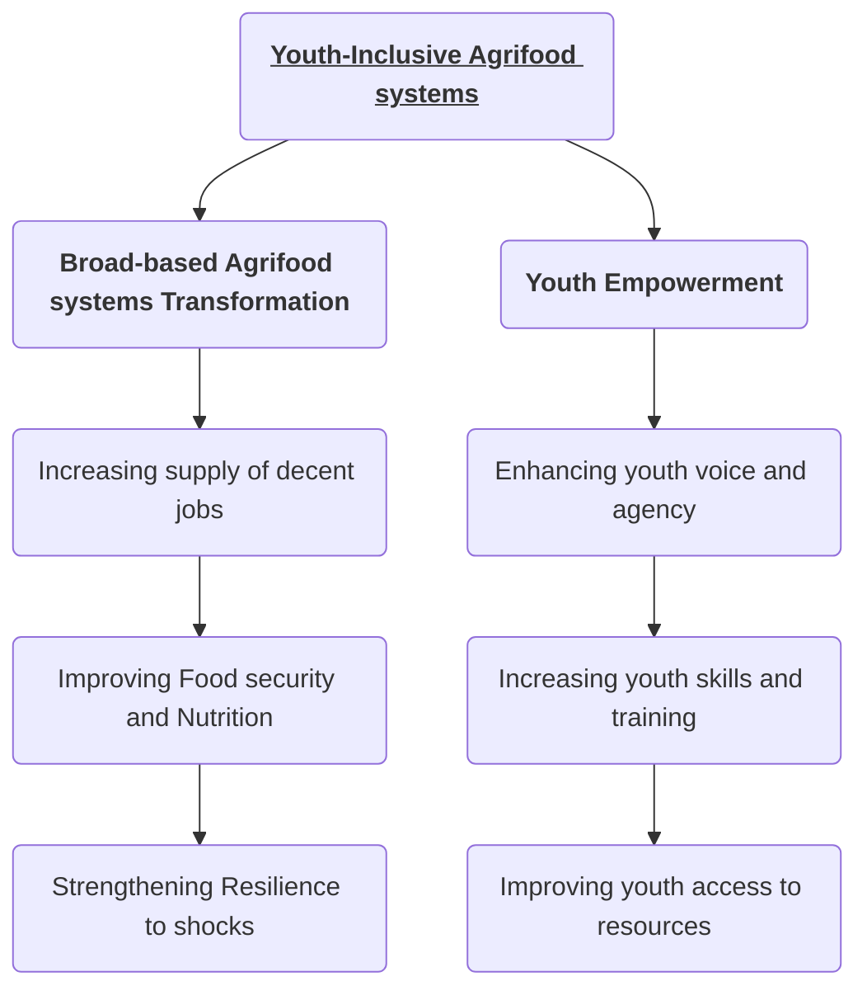
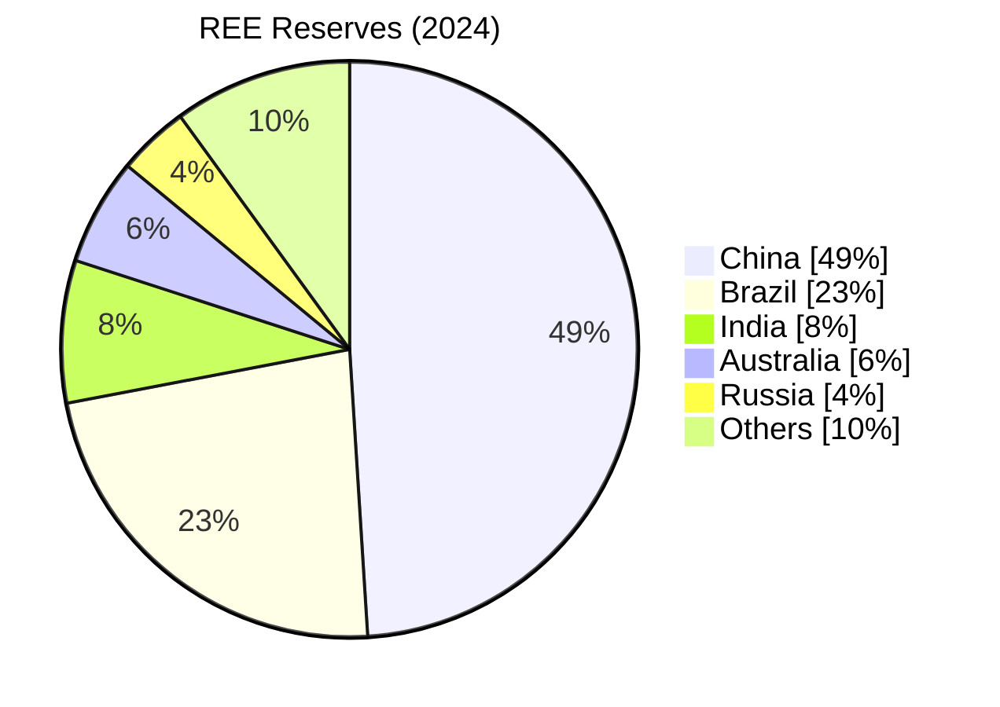

## TOPICS
- **[[AGRICULTURE & PRIMARY SECTOR]]**
- **[[ART & CULTURE]]**
- **[[BIODIVERSITY]]**
- **[[DOMESTIC ORGANISATIONS]]**
- **[[CURRENT AFFAIRS/DAILY PRELIMS CURRENT AFFAIRS/ECONOMY|ECONOMY]]**
- **[[CURRENT AFFAIRS/DAILY PRELIMS CURRENT AFFAIRS/ENVIRONMENT|ENVIRONMENT]]**
- **[[GEOGRAPHY & DISASTER MANAGEMENT]]**
- **[[INTERNAL SECURITY & MILITARY EXERCISES]]**
- **[[IR & INTERNATIONAL ORGANISATIONS]]**
- **[[MINERALS]]**
- **[[PLACES IN NEWS & MAPPING]]**
- **[[CURRENT AFFAIRS/DAILY PRELIMS CURRENT AFFAIRS/POLITY|POLITY]]**
- **[[SCHEMES, ACTS, REPORTS & REGULATIONS]]**
- **[[SCIENCE & TECHNOLOGY]]**
- **[[SOCIETY]]**

---
## JUNE 2025
---
### ILO Social Security Report
#GS1 #GS2 #Society #SocialJustice #InternationalOrganizations #Data
- Social security coverage of India increased from **19% (2015)** to **64.3% (2025)**.
- <u><b>Social Security</b></u>:
	- Protection that a society provides to individuals and households to ensure *access to healthcare* and to *guarantee income security*, particularly in cases of old-age, unemployment, sickness, invalidity, and maternity, etc.
	- **3 pillars of social security**:

- <u><b>Initiatives in India</b></u>:
	1. **PM-SYM (Old Age Protection) (18-40 years):** 50%-50% contribution by the subscriber and GoI.
	2. **PM-JJBY (18-50 years):** life insurance up to ₹2 Lakh on death due to any cause. 
	3. **PM-SBY (18-70 years)**
	4. **PDS**
	5. **NSAP**
		1. IGNOAPS
		2. IGNWPS
		3. IGNDPS
		4. NFBS
		5. Annapurna scheme
	6. **PMAY-Gramin**
---
### PMUY (Ujjawala Yojana)
#Scheme
- By **MoPNG**
- To provide clean cooking fuel such as LPG available to rural and deprived households which were using traditional cooking fuels.
- **Ujjwala 2.0**: Additional allocation of **1.6 Cr** LPG connections by Dec 2022 with special focus on migrants, over the **8 Cr** target already achieved by 2020.
- **Eligibility**:
	- Women only with >18 age eligible under various social assistance schemes as per SECC
- **Data:** March 2025 --> **10.33 Cr** PMUY connections
- **PAHAL**: Aadhar based **DBT** under PMUY
---
### UGC's Anti-Ragging Regualtions 
#GS2 #Education #SocialIssues
- **2009 UGC Regulation on Anti-Ragging**: UGC issued notices to multiple **HEI** to comply with the regulations.
	- **Before admission:** Institutions must include anti-ragging **warnings** and must collect **signed undertakings** from students and parents.
	- **On admission:** comprehensive information leaflets about their rights and join sensitization programs.
	- **Setting up committees**:
		- Anti-Ragging Committee
		- Anti-Ragging Squad
		- Monitoring Cell on Ragging
	- **Punishments:** ranging from suspension, expulsion to fines.
- **Other anti-ragging measures:** #MainsValueAddition
	- **National Anti-Ragging Helpline:** to register complaints etc.
	- <b><u>Raghvan Committee (2007)</u></b>: #committee Recommended making **ragging** a **criminal offense** and recommended **collective responsibility** among faculty, staff etc.
	- **Supreme Court Judgement (2009):** toll-free anti-ragging helpline and engagement with NGOs.
---
### Maritime Disasters
#GS3 #DisasterManagement
- **News**: A cargo ship caught fire off the coast of Kerala and drifted within India's EEZ.
- Rescue work by **Indian Coast Guards (ICG)**
- **Impact**:
	- **Environment**: marine pollution, loss of biodiversity, ballast water contamination.
	- **Health**: toxic chemicals can affect the local fishing communities.
	- **Economic loss**: devaluation of the shores, beach cleanup operations, loss of coastal livelihoods, tourism deteriorates, shipping delays.
- **Various International Conventions under IMO related to maritime disasters and pollution**: #MainsValueAddition 
	- <b><u>Bunker Convention (2001)</u></b>: #convention Holds shipowners liable for bunker oil pollution i.e, **civil liability**. Ensures victim compensation and compulsory insurance.
		- 🚫 India is **NOT** a member
	- <b><u>Nirobi International Convention on the Removal of Wrecks(2007)</u></b>: #convention **Legally binding** for states to remove shipwrecks that may effect the safety.
		- 🚫 India is **NOT** a member
	- <b><u>HNS Convention (1996)</u></b>: #convention to ensure compensation for damages, cleanup and reinstatement measures.
		- 🚫 India is **NOT** a member
	- <b><u>MAROPL Convention (1973)</u></b>: #convention preventing marine pollution from ships specifically addressing oil pollution prevention and control.
		- ✅ India is a member
- **UNCLOS --> defines EEZ**:
<p align="center"></p>

---
### Edible oil imports
#GS3 #Agriculture #Data
- **News**: India **reduced BCD** on major imported crude **edible oils** from 20% to **10%**.
- **Status**:
	- India accounts for:
		- **15-20%** of the **global oilseed area**
		- **6-7%** of **vegetable oil production**
		- **9-10%** of total **oilseed consumption**
	- **India** is world's **largest importer** of edible oilseeds followed by **China** and **USA**. India imports **57% (2022-23)** of its edible oil consumption.
	  
	- India imports the following oilseeds:
	```mermaid
	%%{init: {"pie": {"textPosition": 0.5}, "themeVariables":{"pieOuterStrokeWidth": "2px", "pieTitleTextSize":"25px", "pieSectionTextSize":"25px", "pieLegendTextSize":"25px"} } }%%
		pie title Share of India's total oilseed import
	    "Palm oil      (Indonesia & Malaysia) [57%]" : 57
	    "Soyabean oil  (Argentina & Brazil)   [29%]" : 29
	    "Sunflower oil (Ukraine & Russia)     [14%]" : 14
	```

	-  India's **oilseed production** among **9 major oilseeds**:
	```mermaid
	%%{init: {"pie": {"textPosition": 0.5}, "themeVariables":{"pieOuterStrokeWidth": "2px", "pieTitleTextSize":"20px", "pieSectionTextSize":"20px", "pieLegendTextSize":"20px"} } }%%
	pie title India's oil-seed production
	    "Soyabean" : 34
	    "Rapeseed & Mustard" : 31
	    "Groundnut" : 27
	    "Others" : 8
	```
	
- **Initiatives to promote domestic oil edible oilseed production**:
  - **NMEO-OP**
  - **NFSM-OS&OP**: for 9 oilseed crops area expansion and Oil Palm & Tree Borne Oilseeds.
---
### State of World Marine Fishery Resources 2025 Report
#GS3 #Environment #Fisheries #Report
- By **FAO**
- **Data**:
	- Only **29% of deep-sea** fish stocks are being **sustainably fished**
	- **64.5%** of all fishery stocks are **exploited within sustainable levels**, while **35.5% are overfished**
	- **>50% of migratory shark stocks** are unsustainable
	  
- **Challenges:** late maturation, slow growth, infrequent spawning, **IUU fishing**
  
- <b><u>WTO Agreement on Fisheries Subsidies at 12th MC 2022:</u></b>
	- Bans subsidies for vessels or operators involved in IUU fishing.
	- Prohibits subsidies for fishing overfished stocks unless measures are in place to rebuild them to sustainable levels.
	- Forbids subsidies for fishing activities outside coastal state jurisdiction
	- **India's concerns:**
		- What about small scale fishermen of India? They need subsidies but they lack technical supports compared to mechanized fishermen of developed countries.
		- Apply **"Polluter pays"** and **"CBDR"** principles.
---
### Exercise Khaan Quest
#GS3 #MilitaryExercise
- **Multinational** military exercise at **Mongolia**, Ulaanbaatar.
- 1st in 2006 between USA and Mongolia.
---
### International Organization for Marine Aids to Navigation and Lighthouse Authorities (IALA) 
#GS3 #GS2 #InternationalOrganizations 
- In **2024** its status changed from an NGO to an **intergovernmental organization**.
- ✅ India a member and current Vice President of IALA
---
### Lokpal's Motto 
#GS2 #NonConstitutionalBodies
- New motto - ***"Empower Citizens, Expose Corruption***.
- Statutory body under **Lokpal and Lokayutas Act 2013**
- Applies to public servants **in and outside** India and **Prime Minister** and Ministers.
- **Composition:** Chair + 8 member (1/2 judicial)
	- Member shall **NOT** be:
		- MP or MLA
		- Convicted of any offence
		- Less than **45 age**
	- **Chairperson:** CJI or SC judge or eminent jurist
	- **Term:** 5 years or 70 age
---
### Schengen Area 
#GS2 #InternationalGroupings
- **29 countries** 
	- **25 EU members** out of the total 27 EU members
		- Except **Cyprus** and **Ireland**
	- **4 non-EU EFTA countries**: Iceland, Norway, Switzerland and Liechtenstein
---
### Bhagirathi Eco Sensitive Zone
#GS3 #Environment 
- A solid-waste incerator installed at **Gangotri** inside the **Bhagirathi ESZ**, declared under **EPA 1986**.
---
### State of World Population Report 2025
#GS1 #Society #Demography #Report #Data 
- Released by **UNFPA** (United Nations Population Fund) based on the new data from **UNFPA-YouGov** survey.
- Report title: ***"The real fertility crisis: The pursuit of reproductive agency in a changing world"***
- <b><u>Takeaways:</u></b>
	1. **1 in 3 Indians (36%)** face **unintended pregnancies**, challenging the narratives around ***"population explosion" vs. "population collapse"***.
	2. Real crisis is that **1 million** individuals are **unable to achieve their true fertility goals**
	3. **1 in 5 people globally** expect not to have the number of children they desire. This is driven by, **prohibitive cost of parenthood, job insecurity, housing concerns, lack of suitable partner, sexism and economic precarity**, etc.
	4. For **India**, **financial limitations** are the biggest **barrier to reproductive freedom**. The issues along with % of Indian's surveyed facing the issue:
		- Job insecurity - 21%
		- Housing constraints - 22%
		- Lack of reliable childcare - 18%
		- Poor general well-being - 15%
		- Infertility - 13%
		- Limited access to pregnancy-related care - 14%

- <b><u>India's demographic indicators:</u></b>

| **INDICATOR**            | **VALUES**   |
| ------------------------ | ------------ |
| Population               | 1.46 Billion |
| Population% (Age 0-14)   | 24%          |
| Population% (Age 15-64)  | 68%          |
| Population% (Age 65+)    | 7%           |
| TFR                      | 1.9          |
| Life expectancy (Male)   | 71           |
| Life expectancy (Female) | 74           |
- <b><u>High fertility and low fertility duality case of India:</u></b>
	1. **Below replacement level TFR** (1.9 below 2.1). However, many people especially **women, face significant barriers to making free and informed decisions** about their reproductive choices.
	2. **Inter-state disparity:**
		- Below 2.1 TFR in **31 states/UT**
		- High TFR in **Bihar (3.0), Meghalaya (2.9) & UP (2.7)**
	3. **Urban-rural gap:** Rural areas generally have higher TFR. Still, 7 states still to achieve below 2.1 TFR in rural areas.
- **Infertility in India:** estimate of **27.5 million couples** face the issue and GoI need to consider inclusion of infertility under government's health insurance scheme.
--- 
### Global Gender Gap Report 2025
#GS2 #VulnerableSections #Women #Report 
- Released by **World Economic Forum (WEF)** and **India** ranked **131/148** with a parity score of **64.4%**. India's score improved by rank decreased from 129 in 2024.
- **4 dimensions:**
	1. Economic participation and opportunity (India increased 📈)
	2. Educational attainment (India increased 📈)
	3. Health & survival (India increased 📈)
	4. Political empowerment (India decreased 📉)
- Index ranges from 0(inequality) to 1(equality) i.e, **measure of equality**.
- <b><u>Takeaways:</u></b>
	- **Global gender gap** is at **68.8%** for 148 countries
	- ***Full parity still remains 123 years away at current rates***
	- **Various sub-indices:**
		- Health & survival gap- 96.2%
		- Educational attainment gap - 95.1%
		- Economic participation & opportunity gap - 61%
		- Political empowerment gap - 22.9%
	- Women represent **41.2%** of the **global workforce**
	- Still, women only hold **28.8%** of **top leadership positions**
- **Top performers:** Iceland > Finland > Norway > UK > Nzw
	- **Bangladesh** top performer in South Asia
- <b><u>Other Gender Indices:</u></b>
	- **GENDER INEQUALITY INDEX:** by **UNDP** -> India = 102/172 (2023)
	- **GENDER DEVELOPMENT INDEX:** by **UNDP**
	- **GLOBAL GENDER PARITY INDEX (GGPI):** by **UNDP** & **UN Women**
	- **WOMEN's EMPOWERMENT INDEX:** by **UNDP** & **UN Women**
---
### **CROPIC**
#GS3 #Agriculture #SciTech
- **CROPIC** is **Collection of Real Time Observations & Photo of Crops** which is planned by the **Ministry of Agriculture & Farmers Welfare** using **AI**.
- Crops will be photographed 4-5 times during their cycle, and pictures will be analysed to assess their health and potential mid-season losses using AI.
- Initiative under **PMFBY** with dual purpose of monitoring crop health and automation of crop loss assessment and payment of claims to affected farmers.
---
### SEBI's new verified UPI IDs
#GS3 #Economy #DPI
- Structured UPI address mechanism by SEBI for its **registered intermediaries** with an exclusive **@valid** handle.
- SEBI is also developing **"SEBI Check"** to verify the veracity of the UPI IDs or bank details of registered intermediaries.
	- SEBI Check will allow authentication of UPI IDs through QR code or by manually entering UPI ID. It will also confirm details like bank account and IFSC code.
- The **validated ids** will be allocated by **NPCI** only for payment collection by SEBI registered intermediaries.
- ID format: "<readable_name>.suffix@valid<XYZ_bank>" where, suffix will be .brk for broker and .mf for mutual fund.
- There will also be a **thumbs up inside a green triangle**
- SEBI made the new IDs **mandatory** for all intermediaries. However, it will be **optional for investors to use UPI**. Investors can choose any of their preferred mode of payment.
- **Benefits:**
	- To reduce **misleading incidents by unregistered entities** i.e, **fraud** like collecting funds without authorization, siphoning etc.
	- Address the increasing issue of **impersonation** in stock markets.
	- **Enhance investor confidence** in securities market.
---
### Global Trends Report: Forced Displacement
#GS1 #GS3 #VulnerableSections #Refugees #Migration
- Released by **UNHCR*** (United Nations High Commissioner for Refugees)
- **Highlights:**
	- Estimated **123.2 million** people worldwide were forcibly displaces at the end of 2024
		- **Children** account for **40%** of all forcibly displaces people
	- More than 1/3 of all forcibly displaced are due to **armed conflicts** and were from Sudanese, Syrian, Afghan and Ukraine.
	- **Internally displaced people: 73.5 million** at the end of 2024
- **Challenges posed by Forced Displacement:**
	- Vulnerability to **food insecurity** due to disrupted livelihood and dependency on aid.
	- **Public expenditure shock:** increase in government spending on the part of host governments.
	- **Social tensions:** due to competition over scarce resources.
	- **Unemployment issue:** due to changes in labor and consumer market.
- **Initiatives undertaken for forced displacement:** #MainsValueAddition 
	- **Global Compact for Migration (2018):** #convention Adopted by majority of UN members, with provides framework for international migration.
		- It is **NOT legally binding**
	- **Global Program on Forced Displacement (2009):** #convention established by **World Bank** to enhance development of forcefully displaced population.
---
### IAEA Sanctions:
#GS2 #InternationalOrganizations 
- **Autonomous** organization within the **UN**
- It reports to both **UNGA** and **UNSC**
- **Structure:**
	- **General conference:** all member states, meeting annually
	- **Board of Governors:** comprising of **35 members**, meeting 5 times a year. Elected by the General conference.
	- **Secretariat:** led by **Director General**
- IAEA Board censures Iran for having 60% enriched Uranium, enough to make 9 nuclear bombs.
	- Resolution moved by **USA** and **E3** (France, UK and Germany).
- Issue may go to **UNSC** which could reimpose sanctions under the **JCPOA (2015)**.
- **JCPOA:** signed between **Iran** and **P5+1(Germany)** ad=nd was endorsed by **UNSC Resolution**
	- Obligations for Iran - **Uranium Enrichment Cap** and **IAEA inspections** under the **NPT** (Iran has signed NPT).
	- Sanctions relief for Iran
- **IAEA:**
	- Formed in **1957**
	- Result of ***"Atoms for Peace"*** address of President Eisenhower at UNGA, which became it's motto.
	- **3 types of safeguard agreements** and each may be complemented with the **additional Protocol (AP):**
		1. **Comprehensive safeguards agreements** with **non-nuclear-weapon state parties** to the Nuclear Non-Proliferation Treaty **(NPT)**.
		2. **Voluntary offer safeguards** with **nuclear-weapon state parties** to the **NPT**.
		3. **Item-specific safeguards agreements** with **non-NPT states**.
			- In 2014, **India** ratified the **Additional Protocol**, which granted the IAEA greater access to India's civil nuclear programme. The same **item-specific safeguard agreement** has been signed by **Pakistan and Israel** along with **India**
---
### Hybrid UAV, "RUDRASTRA":
#GS3 #InternalSecurity #Drones
- **Rudrastra** a **Hybrid Vertical Take-Off & Landing (VTOL)** manufactured by **SDAL** was tested at **Pokhran**.
	- It has both **rotary** and **fixed-wings**.
- **Features:**
	- Total range (including loitering over the target) - 170 Km, with an estimated endurance of 1.5 hours
	- Equipped with precision-guided anti-personnel warheads and can relay back live video and return to the launch position in automated mode.
- **Types of UAV:**
<p align="center"></p>

---

### Contributions of Srimanta Sankaradeva:
#GS1 #ArtCulture #BhaktiMovement
- From **14th CE Assam**. Contemporary **Srimanta Sankardeva Award** is Assam's highest cultural honour.
- Pioneer of **Eksarana Dharma**, a **Neo-Vaishnavite movement** emphasizing devotion to Lord krishna
- **Cultural work**:
	- **Kirtana Ghosha:** a devotional scripture composed in Assamere, focussing on glorification of Lord krishna
	- **Gunamala:** a condensed version of the Bhagvata Purana
	- **Ankiya Naat:** one-act play combining dance, music, and storytelling
	- **Bhaona:** theatrical performance originating from Ankiya Naat, often performed in the **Satras (Vaishnavite monastries)**. It is performed with **masks**.
	- **Sattriya dance:** recognized as one of India's 8 classical dance forms
- **Literary work:**
	- ***BHAKTI PRADIPA***
	- ***BHAKTI RATNAKARA***
	- ***KIRTAN-GHOSHA***
---
### Price Support Scheme (PSS):
#GS3 #Agriculture #Scheme 
- <b><u>PM-AASHA (PM-Annadata Aay Sanrakshan Abhiyan)</u></b> encompasses:
	1. **PSS: Price Support Scheme**
	2. **PDPS: Price Deficiency Payment Scheme**
	3. **MIS: Market Intervention Scheme**
	4. **PSF: Price Stabilization Fund**
---
### PASSEX:
#GS3 #MilitaryExercise 
- Join **naval** exercise between **India** and **UK**, held in Northern Arabian Sea
- It stands for **Passage Exercise** ***(PASSEX)***
- Indian Navy's stealth **frigate** ***INS Tabar*** along with a *submarine* and a **P-8I maritime patrol aircraft** too part.
---
### Montreal Convention, 1999 (***"MC99"***):
#GS3 #Aviation #convention 
- International treaty that governs **airline responsibility for death or injury to passengers, as well as for damage, loss, or delay of baggage and cargo**.
- As per the treaty, Air India is liable to pay a fixed amount of **1,51,880 SDR per victim** ~ 1.8 Cr ***(NOTE: 1 SDR = 1.36 $)***.
- It requires airlines to carry **liability insurance** to ensure they can meet their compensation obligations to passengers and cargo owners in the events of accidents, injury, or loss.
- India signed in 2009 and implemented through **Air (Amendment) Act, 2009**.
### Cape Town Convention, 2001:
#GS3 #Aviation #convention 
- Protects **lessors and creditors** by ensuring legal remedies in case of default
- India ratified it through **Protection of Interests in Aircraft objects Bill, 2025**
### Chicago Convention, 1944:
#GS3 #Aviation #convention 
- Establishes **ICAO** (International Civil Aviation Organization), a specialized **UN agency (ECOSOC)**.
- Establishes rules, privileges and obligations for international air transport.
- Conventions's **technical standards** are overseen by **ICAO**
- An important feature are the <b><u>Annex 13</u></b> which lays out the **international protocols for investigation aircraft accidents and serious incidents**
	- <b><u>Chapter 5 of Annex 13</u></b> outlines core **responsibilities** for conducting such investigations. it is based on the principle that ***"air safety is a shared international responsibility"***.
		- As per, Chapter 5 the responsibility to investigate an aircraft accident lies with the ***"State of Occurrence"***. In addition, **other countries connected** to the aircraft have a **formal right to participate**. The include:
			- **State of Registry** - where the aircraft is registered
			- **State of the Operator** of the flight
			- **State of Design**
			- **State of Manufacture**
---
### CORSIA (Carbon Offsetting and Reduction Scheme for International Aviation):
#GS3 #Environment #Aviation #Scheme 
- By **ICAO (International Civil Aviation Organization)**
- As per **IEA,** aviation sector accounted for **2.5% of global energy-related CO2 emissions** in 2023
- CORSIA will take **effect from 2027**, and will applies to international flights, requiring airlines to **offset any growth in CO2 emissions beyond 2020 levels**.
- Nudge towards **Sustainable Aviation Fuel (SAF)** and **SAF-ATF** blend to reduce emissions.
---
### STATE & TRENDS OF CARBON PRICING REPORT 2025
#GS3 #Environment #ClimateChange #Report 
- By **World Bank**
- **Carbon Pricing (CP):** policy tools that assign cost to GHG emissions
	- **Carbon Taxes:** fee levied on certain carbon-intensive entities.
	- **Emissions Trading Systems:** govt. places a **limit** on the amount/intensity of GHG emissions generated by covered entities.
	- **Carbon Crediting Mechanisms:** **Tradable credits** generated through **voluntary activities** that reduce emissions.
- **Highlights:**
	1. **Coverage:** Carbon pricing(CP) covers around **28%** of the **GHG emissions** with around 43 ***Carbon-Taxes*** and 37 ***Emission Trading Systems(ETs)***
	2. **Revenue Generation:** ETs and Carbon-Taxes generate **$100 Bn (2024)** for public budgets
	3. **Sector wise coverage:**
		1. **Power**
		2. **Industry**
		- **Agriculture** and **Waste** are largely **uncovered**
	4. **Carbon credit supply vs demand:** supply outstrips demand by **1 billion tons** of un-retired credits in 2024, globally.
- **Global Examples:**
	- **Article 6 of Paris Agreement (COP21, UNFCC):** international recognition
		- **COP29 (Baku)** adopted final rules for 
			- <b><u>Article 6.2:</u></b> ***Cooperative approaches***
			- <b><u>Article 6.4:</u></b> ***Paris agreement crediting mechanisms***
- **Carbon Pricing in India:**
	- **Carbon Credit Trading Scheme (2023):** under the **Energy Conservation Act, 2001** and offers two mechanisms:
		1. **Compliance Mechanism:** ***obligated entities*** to comply with prescribed GHG emission reduction norms
		2. **Offset Mechanism:** ***Non-obligated entities*** registers projects for GHG emission reduction/removal/avoidance for Carbon Credit Certificates.
	- **ECOMARK:** for voluntary practices by **CPCB** and **BIS** under the **EPA, 1986**

- <b><u>NOTE:</u></b> **PAT** schemes with **Energy Saving Certificates** by **BEE** under the **Energy Conservation Act, 2001**
---
### Draft Greenhouse Gas (GHG) Emission Intensity Target Rules, 2025
#GS3 #Environment #ClimateChange #Rules #Scheme
- **MoEFCC** issued *Draft Emission Target Rules for Industries* under the **Carbon Credit Trading Scheme (CCTS)**. These are officially called ***Draft Greenhouse Gas (GHG) Emission Intensity Target Rules, 2025***
- **Provisions of Draft Rules:**
	- Defines **GHG emission intensity (GHI)** as *tonnes of CO2 equivalent emitted per unit of output or product*
	- Proposed **legally binding** GHG emission targets for over *400 industrial units*
	- *Emission targets* to be determined by **BEE** *(Bureau of Energy Efficiency)*
	- It applies to sectors like *aluminium, iron & steel, petroleum refining, petrochemicals, and textiles*
	- Failure to comply will attract financial **penalties** under the **Environment (Protection) Act, 1986**
- **Carbon Credit Trading Scheme (CCTS):**
	- Legally backed by the **Energy Conservation Act, 2022** and empowers the **central government** in consultation with **BEE** to specify the CCTS
	- It is **administered** by **BEE**
	- **Regulator of carbon trading:** Central Electricity Regulatory Commission - **CERC**
	- The two mechanisms under CCTS are **Compliance mechanism** and **Voluntary offset mechanism**
- **Carbon Markets in India:**
	1. ***Perform Achieve and Trade (PAT) Scheme:***
		- Reduced *specific eenergy consumption (SEC)* in energy-intensive industries through issuance of **Energy Saving Certificates** for efficiency improvements
	2. ***Renewable Energy Certificates (REC):***
		- Trading certificates to help meet **Renewable Purchase Obligations (RPO)**
	3. ***Rate-based Emissions Trading Scheme:***
		- To accelerate transition towards *performance-based emissions trading* with **CCTS adoption**
			- Note that, **total emissions are NOT capped**. Individual entities get performance benchmarks as emission intensity limits
	4. ***Clean Development Mechanism:***
		- Part of **Kyoto Protocol (1997)**
		- It allow industrialized countries to invest in emission-reduction projects in developing countries through **Certified Emission Reduction (CER)** credits for trading

---
### FOREST RIGHTS ACT (FRA) CELLS:
#GS3 #GS1 #Society #Environment #Tribals #Scheme 
- **MoTA** under the **Dharti Aba Janjatiya Gram Utkarsh Abhiyaan (DAJGUA)** sanctioned setting up of 324 **district-level FRA cells** for implementing the forest rights law. Further **state-level FRA cells** are also setup
- <u><b><i>These FRA Cells are OUTSIDE FRA, 2006 and are under the DAJGUA rules</i></b></u>
	- **CONCERNS regarding FRA-cells:**
		- Creation of a *parallel FRA mechanism* by the Central government, outside the principal legislation which is against **Federalism** #Federalism #MainsValueAddition 
		- Adding more cells may not resolve structural issues in FRA implementation
- **FRA mandates** that **State** government establishes:
	- Gram Sabha **Forest Rights Committees** (FRCs)
	- Sub-Divisional Level Committees **(SDLCs)**
	- District Level Committees **(DLCs)**
	- **State Monitoring Committees**
- **Forest Rights under FRA 2006:**
	1. **Right to Land Ownership:** upto 4 Ha
	2. **Right to collect Minor Forest Produce
	3. **Right to self-cultivation and grazing**, etc.
	4. **Community Rights** to mains community resources like water bodies
	5. **Right to Rehabilitation & Relief** in case of expulsion
- **Features of FRA Rights:**
	- **Heritable**
	- **Jointly registered** in names of both spouses
	- **Exempt** from **Van Sanrakshan Adhiniyam 2023** i.e, Forest (Conservation) Act, 1980
- **Critical Wildlife Habitats (CWH)** are declared under **FRA**
- <b><u>DAJGUA:</u></b>
	- ***Dharti Abba** - **Birsa Munda**
	- DAJGUA is a **Central Sector Scheme** under **MoTA**
---

### Digital Agriculture Mission (DAM):
#GS3 #Agriculture #SciTech #DPI
- At the **National Conference on Agri Stack***, GoI announced:
	- Rs.4000 Cr for developing Farmer Registries (including legal heir status) and Rs.2000 Cr for digital crop surveys.
	- Introduced **Digitally Verifiable Credential (DVC)** or **Kisan Pehchan Patra**
- <b><u>Digital Agriculture Mission:</u></b> for DPI in Agriculture
	- **Agri Stack**: digital good like *Aadhar* built in a *federal architecture* with collaboration between Union and States.
		- **3 registries under Agri Stack:**
			1. **Farmer's Registry:** created and managed by States
			2. **Geo-referenced village maps:** for conducting digital crop surveys
			3. **Crop Sown Registry** through **Digital Crop Survey (DCS)**
	- **Krishi Decision Support System (KDSS):** a **GIS** integrating geospatial and non-geospatial data including satellite, weather, soil, etc.
	- **Nationwide Soil Resource Mapping Project:** initiated by the *Soul and Land Use Survey of India* **(SLUSI)**, at village level.
	- **Digital General Crop Estimation Survey (DGCES):** automates General Crop Estimation Survey process
---

### Forest Fires:
#GS3 #DisasterManagement 
- <b><u>NEWS:</u></b> Forest fires in **Reasi** district of **J&K** expanded across hundreds of hectares of forest land.
- **Causes:**
	- ***Natural:***
		1. Lightning
		2. Prolonged droughts
		3. Dry winds like **Santa Ana winds** caused **California** wildfires
	- ***Anthropogenic:***
		1. **Slash-and-Burn Agriculture:** like *Jhum cultivation*
		2. **Negligence:** careless disposal of cigarettes, unattended campfires by tourists
		3. **Climate change:** extended dry spells, heat waves, rainfall variability, and *Hydro-climatic whiplash* due to human induced climate change
- **Existing Measures to Prevent and Mitigate Forest Fires:**
	- **Forest Fire Prevention and Management Scheme (FPMFS):** Centrally funded program dedicated to assisting states in prevention, preparedness and management of forest fires.
	- **National Action Plan on Forest Fires:** aims to minimize forest fires through **community involvement** and **technology integration**.
	- **Forest Fire Alert System (FIRE 3.0)** by the **FSI**: is an **Early Warning System** using:
		- **MODIS** (Moderate Resolution Imaging Spectroradiometer)
		- **SNPP-VIIRS** (Visible Infrared Imaging Radiometer Suite) **satellite** data
--- 

### Guidelines for direct release of Central Sector Scheme (CSS) Funds
#GS3 #Economy #Scheme #Funding
- Issued by **Finance Ministry**
- **Guidelines:**
	- **Central Nodal Agency (CNA):** concerned ministry will appoint an agency for each CSS. The CNA can be autonomous body, PSU or State agency, etc.
	- **Budgeting and Savings:** Ministers should estimate scheme budgets realistically and flag any saving earl, especially by the 3rd quarter.
	- **Unused funds** will **lapse** at the end of financial year and cannot be carried forward.
	- ***"Just-In-Time"* Fund Release:** 
		- **Not more than 25%** disbursement at a time that too when needed.
		- **75% prior utilization of funds** and meeting all previous conditions.
- **Other measures to ensure effectiveness of Central scheme:**
	- **Mandatory** use of **PFMS** (Public Finance Management System): for Fund tracking, real-time monitoring and control unspent balances.
	- **Sunset clauses:** mandated by the Finance Ministry in 2017 to align schemes with financial resources cycle.
	- A private member bill, **The Government Legislative Proposal and Schemes Bill, 2022** was introduced to bring accountability and Parliamentary oversight.
---
### Tax on VDA:
#GS3 #Economy #Taxation 
- CBDT's **NUDGE** (Non-intrusive Usage of Data to Guide and Enable) approach: ***"Trust first"*** philosophy to encourage **voluntary tax disclosures** and update any income on account of VDA transaction.
- **Tax rates:** as per Finance Act 2022
	- **30% capital-gains tax** on VDA
	- **1% TDS** on transfer of VDAs to residents

---
### Aircraft Accident Investigation Bureau (AAIB):
#GS3 #Aviation #Organizations 
- Attached office under **Ministry of Civil Aviation**
- Responsibility to fulfill obligations of the state under **Annex 13** to the **Convention on International Civil Aviation, 1944**
- **Mandate of AAIB:**
	- Facilitate **investigations** and **administrative work** of Assessors appointed by the Central government under **Air (Investigation of Accidents and Incidents) Rules, 2017***
	- All accidents and serious incidents involving All-up Weight (AUW) aircraft more than 2250 Kg or Turbojet aircraft.
---
### AviList:
#GS3 #Environment #Biodiversity #Wildlife
- 1st ever **unified global checklist of avian/bird species** to replace the **International Ornithological Committee (IOC)** and **Clements list**
- It will be updated **annually**.
---
### Satins:
#GS3 #SciTech #Health
- Satins are group of **medicines for cardiovascular diseases**, that help lower the **bad cholesterol/Low-Density Lipoprotein**
- They mitigate excessive inflammatory response, restore endothelial functions and potential antimicrobial activities.
---
### AC temperature-control norms:
#GS3 #Environment #UrbanHeatIsland #ClimateChange 
- **BEE Guidelines:
	- <b><u>2018 guidelines</u></b> by **BEE** under **MoPower**: for commercial establishments to conserve energy through *optimum temperature settings* for AC.
	- <b><u>2020 mandate:</u></b> *default* setting of **24 degree Celsius**
- **Estimates/Data by BEE:** #Data #MainsValueAddition 
	- **Total connected load** in India due to **air conditioning** will be **~200 GW by 2030**, and could further increase as currently, only **6%** of households use **one or more ACs**.
	- **India's cooling demand:** ***50 GW*** ~ ***1/5th (20%) of India's peak power demand***
	- There are **10 Cr** ACs in India with **1.5 Cr** being added each year
- **Global examples:**
	- **JAPAN** encourages a *default setting* of *28 degree Celsius* in offices and public offices
---
### Silver & Climate Change:
#GS3 #Environment #Minerals #EnergyTransition #ClimateChange 
- **Data on Silver:**
	- Used to capture sunlight through **rooftop solar panels**
	- Each **mobile phone** contains about 100-200 mg of Silver
	- Each **laptop** contains around 350 mg of Silver
	- Only **15% of Silver** is **recuperated** and the rest is discarded.
- **Silver and Energy Transition:**
	- ***2025 Sprott Silver Report***: Silver demand is expected to increase by **170% a year**, due to the higher demand for **solar panels**.
	- **IEA** predicts that by **2035**, ***every other car sold worldwide will be electric***, which will increase demand for Silver.
- <b><u>NEWS:</u></b> **Finnish** researchers have come up with an efficient **chemical method to recycle Silver** - using ***organic fatty acids***, such as linolenic or oleic acids found in seeds, nuts, and vegetable oils.
	-  Traditional methods of silver recycling requires toxic substances like cyanide.
	- The proposed method can also be used for ***"Urban Mining"***, where silver retrieval from waste electrical and electronic wastes (**WEEE**).
- <b><u>SILVER PRODUCTION:</u></b>
	- **Country wise:** ***{"MCP"}***
		1. Mexico - 24.8%
		2. China - 13.2%
		3. Peru - 12%
	- **India** is **12th largest Silver producer**
		1. Rajasthan - 56.6%
			- *Khetri Copper mines*
		2. Andhra Pradesh - 12-15%
		3. Telanganga - 6-7.5%
---
### Sustainable Nickel:
#GS3 #Environment #Minerals #EnergyTransition #EVs 
- Importance of Nickel is in various *clean energy technologies*, especially ***Electric Vehicles (EVs)***. The **demand** for Nickel is expected to surpass **6MnT a year by 2040**.
	- Nickel is used in **batteries**
- Nickel **extraction** is **highly carbon-intensive**: For **1T Nickel** around **20T CO2** is emitted
- <b><u>NEWS:</u></b> New method developed by researchers using **Hydrogen plasma**, which is about **18% energy efficient** and **cut 84% CO2** compared to present.
- <b><u>NICKEL PRODUCTION:</u></b>
	- **Country wise:** ***{"IPR"}***
		1. Indonesia
		2. Philippines
		3. Russia
	- **India:**
		1. Odisha - 92%
		2. Jharkhand
		3. Nagaland
		4. Karnataka
- **Nickel Laterite Deposits:** *soil based* ores are often overlooked, but the new method particularly deals with Laterite deposits.
	- Contains 0.4-0.9% Nickel as ***nickeliferous limonite*** in ***chromite mine***.
	- In **India**, found in **Odisha's Sukinda** region
---
### Suez Canal & Panama Canal:
#GS2 #IR #Geography #PlacesInNews #Mapping
<p align="center">

<br>
<b><i>Suez Canal</i></b>
</p>

<p align="center"> 
<br>
<b><i>Panama Canal</i></b>
</p>

---

### Census 2027:
#GS1 #Demography #Census
- <b><u>Legal provisions:</u></b> under the provisions of ***Census Act, 1948*** and ***Census Rules, 1990***
- <b><u>Census 2011:</u></b> conducted in 2-phases with various reference dates
	1. *Phase 1:* *"House Listing"*
	2. *Phase 2:* "*Population Enumeration (PE)*"
- <b><u>Proposed Census 2027:</u></b> ***India's 16th population census***, will be conducted again in **2 phases** along with **enumeration of caste**:
	- *Phase 1: "House Listing"* in **2026**
	- *Phase 2: "Population Enumeration"* in **Feb 2027**
	- **Reference date** will be ***00:00 hrs*** of <b><u><i>1st March 2027</i></u></b>
		- For **UT of Ladakh** and *non-synchronous snow bound areas of* **UT of J&K** and the states of **Uttarakhand** and **Himachal Pradesh**, the **Reference date** will be ***00:00 hrs*** of ***1st Oct 2027***
	- It will be India's **1st digital census** conducted through mobile apps available in *16 languages* (Hindi + Eng + 14 regional).
	- It will also be the **1st census in Independent India** to include **enumeration of caste** as well.
	- The government may **merge Central and State OBC lists**
- <b><u>Details of the Notified Census 2027:</u></b>
	- The two phases with details are:
		1. **House-listing phase:** enumerators collect data on the head of the HH, the number of members, use of the building, material of construction, number of rooms, ownership status, sources of water & electricity, type of toilet, assets like TV, phone etc.
		2. **Population enumeration:** focuses on individual data - age, sex, DoB, education, occupation, religion, caste/tribe, disability status etc.
	- It will allow **self-enumeration** for the first time and offers nearly **real-time monitoring**
	- The **Census Managmeent and Monitoring System (CMMS)** will allow supervision and resolution of field issues without delay
	- Around **30 lakh enumerators**, primarily **school teachers** are to be deployed in addition to **1.2 Lakh functionaries** at district and sub-district levels and **46K trainers**  
	- <b><u>Changes in Process and Technology:</u></b>
		1. **Self-enumeration**
		2. **GPS integration:** while 2011 used physical maps. This time there will be **GPS tagging** and **geo-fencing** to avoid coverage gaps
		3. **Mobile tracking and validation**: real-time alerts and error correction
		4. **Coding system:** The **Registrar General of India**, has introduced a new coding system to make data collection more accurate.
		5. **New questions in 2027 Census questionnaire** for higher granularity of the collected data

---
### India's Copper cathode imports 
#GS3 #SciTech #Economy #Minerals 
- <b><u>NEWS:</u></b> India's **Copper cathode** imports declined **34% y-o-y** due to a 3 month supply disruption triggered by a **quality control order (QCO)**.
- <b><u>COPPER PRODUCTION:</u></b>
	- **Highest Copper producing countries:**
		1. Chile - 23%
		2. DRC - 11%
		3. Peru
		4. China
			- In ***Refined Copper*** China is global leader with **44% global refined Copper** production
		5. Indonesia
	- **Copper production in India:**
		1. Madhya Pradesh - 46%
			- ***Bahghat (Malanjkhand)*** mines
		2. Rajasthan - 33%
			- ***Khetri (Jhunjhunu & Alwar)*** mines
		3. Jharkhand - 21%
			- ***Singhbum*** mines
---
### DIGIPIN: 
#GS3 #GS2 #Scheme 
- New **digital address system** called **DIGIPIN**
- **Unique** ***10 character alphanumeric code*** that can be generated for any **property** that is approximately **4x4 sq.m.**
	- All types of properties, including rural, urban and even **maritime** zones
- Developed by **Department of Posts** with collaboration with **IIT Hyderabad** and the **National Remote Sensing Centre** (under **SRO**)
- DIGIPIN is **encoded geographic coordinates** and do **not store personal information**.
- DIGPIN is intended act as an extra layer of precision on top of existing postal addresses and is **not to replace** the traditional **6 digit PIN code**.
---
### INS Arnala (P68)
#GS3 #InternalSecurity #Defence #PPP #Eg 
- A warship to be inducted by the India Navy called **Anti-Submarine Warfare Shallow-Water Crast (ASW-SWC) ***Arnala*** at Vishakhapatnam
- It is a propelled by **diesel-engine-waterjet** combination and has become the **largest Indian naval warship to be propelled by disesel engine-waterjet**
- It is equipped with **sub-surface surveillance and interdiction, search and rescue missions** and **LIMO** (Low Intensity Maritime Operations)
- Designed by GRSE, Kolkata under **PPP** with L&T shipbuilders
- Named after the **historic** <b><u>Arnala fort</u></b> at **Vasai, Maharashtra**
- **Indigenous design, engineering & manufacturing:** signifying a transition from ***"Buyer's Navy" to "Builder's Navy"***
<p align="center"></p>

---
### Nomadic Elephant 
#GS3 #InternalSecurity #MilitaryExercise 
- India-**Mongolia** joint military exercise at Ulaanbaatar, Mongolia
- Conducted **annually** - in 2024 was conducted at *Umroi, Meghalaya*.
---
### Declaring Vermin
#GS3 #Environment #Biodiversity 
- <b><u>Sec 62 of WLPA 1972:</u></b> the **Union government** can **notify** any wilds animal in **Schedule II** *(Not Schedule I)* as vermin for a period of **time** in an **area/state**.
- <b><u>Sec 11 of WLPA 1972:</u></b> 
	- <b><u>(1)(a)</u></b> the **Chief Wildlife Warden (CWC)** of a **state** may - if satisfied that a wild animal specified in **Schedule** has become **dangerous to human life** or **disabled** or **diseased beyond recovery** - permit **hunting** or **killing** of such animal in **writing** stating the **reasons** thereof.
		- Provided that no wild animal shall be ordered to be killed unless the Chief Wild Life Warden is satisfied that such animal cannot be captured, tranquilised or translocated
	 - <b><u>(1)(b)</u></b> the **Chief Wild Life Warden** or the **authorised officer** may, if he is satisfied that any wild animal specified in **Schedule II**, has become **dangerous to human life** or to **property** *(including standing crops on any land)* or is so **disabled** or **diseased as to be beyond recovery**, by order in **writing** and stating the **reasons** therefor, permit **any person to hunt** (such animal or group of animals in a **specified area** or cause such animal or group of animals in that specified area to be hunted).  
	 - <b><u>(2)</u></b> The killing or wounding in **good faith** of any wild animal in **defence of oneself or of any other person** shall **not** be an **offence**
	 - <b><u>(3)</u></b> Any **wild animal killed** or **wounded in defence of any person** shall be **Government property**.  
---
### Places in Iran 
#GS1 #Geography #PlacesInNews #Mapping 
- **Natanz** - ***Kuhpe Kolang Gaz La (Pickax Mountain)***
- **Arak** - houses a Heavy water Reactor
<p align="center"> 

</p>
<p align="center"> 

</p>

---
### Lidder River
#GS1 #Geography #Mapping 
- Tributary of **Jhelum River** originating from the ***Kolahoi Glacier*** located in the upper reaches of the **Pir Panjal** range in **Jammu & Kashmir***
- ***Eurasian Otter*** was spotted in the Lidder river
---
### SPArc: Step-and-shoot spot-scanning proton arc therapy
#GS3 #SciTech #Health
- **SPArC** has been used to treat an **ACC (Adenoid Cystic Carcinoma)**, which develops in salivary glands and head and neck
- It is an advanced **radiation therapy technique** - where cancer cells are killed or their growth is slowed by damaging their DNA
- It works by targeting tumors with **protons** while **sparing surrounding tissue** - highly effective in reducing radiation exposure to the healthy cells compared to other radiation therapies like **SFO-IMPT** (Single Field Optimization Intensity Modulated Proton Therapy)
- SPArc is based on a **computer programme** that scans all spots and energy layers to deliver proton beams
---

### Judgements on Preventive Detention
#GS2 #Judgement #FundamentalRights #MainsValueAddition 
- <b><u>Dhanya M vs State of Kerala and OThers 2025:</u></b> SC set aside the the preventive detention under the **Kerala Anti-Social Activities (Preventive) Act, 2007**
	- Sc underscored the difference between ***"public order"*** and ***"law and order"*** citing the following cases:
		- ***SK Naznned Vs State of Telangana (2023)***
		- ***Nenavath Bujji Vs State of Telangana (2024)***
	- The distinction between ***"public order"*** and ***"law and order"*** is one of **degree and extent of the reach** of the act in question in society
	- Court, declared the detention order as **unjustified** as it was dealing with **law and order** situation and **not** a **public order** situation
- <b><u>Preventive Detantion:</u></b>
	- **Article 22(4)** allows preventive detention by the Parliament as well as the state legislative assemblies for preventive reasons like maintenance of **public order** and **national security**.
		- No detention beyond **3 months** unless an **Advisory Board** approves it.
		- Ground of the detention must be communicated at the earliest
		- Provide earliest opportunity to make a representation
			- No 24 hr magistrate rule
- <b><u>Other Preventive Detention Cases:</u></b>
	- **Rekha Vs State of Tamil Nadu (2011):** preventive detention is an *exception to Article 21* and should be applied rarely
	- **Vijay Narayan Singh Vs State of Bihar (1984):** preventive detention must *not* be used to *circumvent regular criminal procedures*
	- **Icchu Devi Vs Union of India (1980):** *burden of justifying* preventive detention is on the *detaining authority*
	- **AK Gopalan Vs State of madras (1950):** SC upheld the constitutional validity of the *Preventive Detention Act, 1950*
---
### India's Wind Energy Capacity: 
#GS3 #Energy #Wind
- **NEWS:** ***Global Wind Day*** on ***15th June***
	- India's total renewable energy capacity grew **17.13%** y-o-y to **226.74GW (48% of total)** out of the total **472GW**
	- Out of the total, **solar capacity** expanded the highest by **31.5% y-o-y**
- India's installed capacity is:
	- **4th** largest in **wind**
	- **3rd** largest in **solar**
	- **3rd** largest in **renewable**

- **Government initiatives of wind energy in India:**
	- **Centralized Data Collection and Coordination (CCDC) Wind Initiative:** to identify most prominent wind energy projects
	- **National Wind-Solar Hybrid Policy, 2018:** promotion of large grid connected wind-solar PV hybrid systems for efficient utilization
	- **Viability Gap Funding (VGF) scheme for offshore wind energy projects:** in line with National Offshore Wind Energy Policy, 2015
	- **Green Energy Open Access Rules, 2022**
	- **Renewable Energy Purchase Obligations (RPO)** including **Wind Purchase Obligations**
- **Issues with wind power in India:**
	- Infrastructure limitations - can cause grid instability, lack of mechanism for power evacuation
	- Economic factors - minimum project size is very heavy, high investment costs and financial risks due to fluctuating tariffs
	- Technical challenges - complex installation, transportation of equipment in remote areas, maintenance and operations challenges.
- **India's Energy Data:**
	[INDIA ENERGY DASHBOARD](https://iced.niti.gov.in/energy/electricity/generation)

| **ENERGY SOURCE** | **INSTALLED CAPACITY %** | **GENERATION %** |
| ----------------- | ------------------------ | ---------------- |
| Coal              | 46.42%                   | 75.58%           |
| Solar             | 22.85%                   | 9.61%            |
| Wind              | 10.81%                   | 3.91%            |
| Hydro             | 10.14%                   | 6.17%            |
| Oil & Gas         | 4.39%                    | 2.05%            |
| Bio Power         | 2.45%                    | 0.33%            |
| Nuclear           | 1.86%                    | 3.11%            |
| Small Hydro       | 1.08%                    | 0.24%            |
- **India's Wind Energy state wise:**
	- **Installed Capacity:**
		1. Gujarat
		2. Tamil Nadu
		3. Karnataka
		4. Maharashtra
		5. Rajasthan
	- **Potential Capacity:**
		- Total **695.5 GW** at **120m** and **1,164 GW** at **150m**
			1. Rajasthan
			2. Gujarat
			3. Maharashtra
			4. Karnataka
			5. Andhra Pradesh
		- India's **offshore wind power** is around **70 GW** along the coasts of **Gujarat & Tamil Nadu**
	- **Major plants:**
		- ***Kutch wind farm*** - Gujarat
		- ***Muppandal wind farm*** - Kanyakumari, Tamil Nadu
		- ***Jaiselmer wind farm*** - Rajasthan

- **India's Solar Energy state wise:**
	- **Installed Capacity:**
		1. Rajasthan
		2. Gujarat
		3. Karnataka
		4. Tamil Nadu
		5. Maharashtra
	- **Potential Capacity:**
		- Total **749 GW** 
			1. Rajasthan
			2. Jammu & Kashmir (UT)
			3. Gujarat
			4. Maharashtra
			5. Madhya Pradesh
	- **Major plants:**
		- ***Bhadla solar park*** is the largest in India- Rajasthan
		- ***Pavagada solar park*** - Karnataka
		- **NTPC solar park*** at ***Simhadri*** - Andhra Pradesh
		- ***Omkareshwar floating power plant*** - Madhya Pradesh
---
### Cyprus: 
#GS2 #IR #Mapping 
- Island in **Eastern Mediterranean** sea
- Capital **Nicosia**
- Cyprus is a member of **European Union (EU)**
- 3rd largest island in Mediterrania:
	1. **Sicily** - Italy
	2. **Sardinia** - Italy
	3. **Cyprus** - Greece
		- ***Northern Cyprus*** - only recognized by **Turkiye**
- It has **Kyrenia** and **Troodos Mountains**
	- Mix of **fold** and **block** mountains
	- Highest peak is ***Mt. Olympus***
<p align="center">

</p>

---

### Simhachalam Temple
#GS1 #ArtCulture 
- Also known as **Varaha Lakshmi Narasimha temple** located at **Visakhapatnam, Andhra Pradesh**
- It bears a **10thCE** inscription of **Kuttunga-I Chola** 
- It combines **Orrisan** and **Chalukyan** features of temple architecture
- Its unique feature is that it **faces west instead of east**, symbolising divine forces winning out over evil forces.
<p align="center">

</p>

---
### NAKSHA
#GS2 #GS3 #Scheme 
- Under **DoLR** (Department of Land Records), **MoRD** (Ministry of Rural Development)
- NAKSHA or **National Geospatial Knowledge-based land Survey of urban HAbitations** is *pilot programme* under the Digital India Land Records Modernization Programme **(DILRMP)**
- **100% centrally funded** initiative
- Applicable to **cities** with an **area < 35 sq. km** and **population < 2 lakhs** and covers **157 Urban Local Bodies (ULBs)** in **27 states and 3 UTs**
- Uses advanced **aerial** and **on-ground survey** methods to create a detailed, **GIS** based digital maps
---
### UNOC3
#GS2 #IR #InternationalGroupings 
- 3rd **United Nations Ocean Conference** was held in **Nice, France** and was co-hosted by **France** and **Costa Rica**
- Adopted the **Nine Ocean Action Plan:**
	- To support **SDG14**, recognizing that SDG14 is least funded of all SDGs
	- Reaffirms commitment to develop an international legally binding instrument on **plastic pollution**
	- Called for global action to reduce climate and acidification impacts on oceans and coastal communities
---
### DNA Fingerprinting
#GS3 #SciTech #Biotech
- The 4 methods are:
	- **Short tandem repeat (STR) analysis:** typically found on the **nuclear DNA** and is used when the extracted DNA is not degraded.
	- **Mitochondrial DNA (mtDNA) analysis:** used when nuclear DNA is degraded or unavailable. It is easier to recover from human remains that are not well preserved i.e, it is less susceptible to degradation.
	- **Y chromosome analysis:** for males
	- **Single nucleotide polymorphism (SNPs) analysis:** typically used when the DNA is highly degraded. A SNP is a variation in the DNA sequence where a **single base** - A,T,C,G - at a **specific location differs among people**.
		- SNP is **unique to each person** and can be used for identification.
---
### Bonn Climate Change Conference
#GS3 #Environment #convention #ClimateChange 
- Under the **UNFCCC** being held in **Bonn, Germany**
- <b><u>NOTE: NOT BONN CONVENTION (CMS)</u></b>
- Earlier it was called the **Sessions of the UNFCCC Subsidiary Bodies (SBs)** and is the only second regular climate summit hosted by UNFCCC including the annual **Conference of Parties (COP)**
- **OBJECTIVES:**
	- Discuss **technical** and **scientific** aspects of climate negotiations
	- **Sets agenda for COP**, which takes place in November
	- **Implementation** of agreements set at previous COP are also discussed
- It is attended by the **members of the Subsidiary Bodies (SBs)** - committees that assist UNFCCC's governing bodies in implementing and reviewing climate change agreements. It is also attended by indigenous representatives and international organisations.
	- **Two permanent SBs** of the UNFCCC are:
		1. **Subsidiary Body for Implementation (SBI)**
		2. **Subsidiary Body for Scientific and Technological Advice (SBSTA)**
			- It serves as a **link** between policymakers and scientific advisors at IPCC
- **2025 Bonn climate change conference:** discuss the **Global Goal on Adaption (GGA)**
---

### International Labour Conference (ILC)
#GS2 #IR #InternationalOrganizations 
- 113th **ILC** concluded as the **annual meeting** of the **ILO (International Labour Organization)** in **Geneva, Switzerland**
- **Outcomes:**
	1. Adopted **Biological Hazards in the Working Environment Convention, 2025** #convention ***No. 192***: first international instrument to specifically address biological hazards in the working environments
		- Member states must formulate **national policy** and adopt adequate measures
	2. Approved an **Amendment to Maritime Labour Convention, 2006 (MLC)**: #convention calls for the **right to shore leave and repatriation** and calls for **recognizing seafarers as** ***"key workers"***
		- It is **legally binding** and India has also ratified it. It ensures minimum working conditions and living conditions for seafarers on ships.
	3. **Decent Work in the Platform Economy:** held first *standard-setting* discussion on decent work in the platform economy
	4. **Resolution on Reducing Informality:** to support transition to formal work
	5. Formal approval given to **ILO's tripartite contribution** to the **Second World Summit for Social Development**, to be held in November 2025 at Doha
- <b><u>GLOBAL COALITION FOR SOCIAL JUSTICE:</u></b> 2nd edition of the annual forum took place on the sidelines of the 113th ILC
	- It is an **initiative of ILO**, launched in **2023** with an aim to bring together global, regional, and national actors to advance social justice through policy and action coherence.
---
### SIPRI Yearbook 2025: ***"New Arms Race"***
#GS2 #GS3 #IR #InternalSecurity #Report 
- **Global nuclear stockpile decline:** since the end of the Col War and retired warheads has exceeded new developments
- **Expansion of stockpile:**
	- **China** expanding fastest - **600 warheads**
	- **India** increased to **180** (Now more than **170** of **Pakistan**)
	- All 9 nuclear-armed countries continue to **mordernise their arsenals**
- **Fissile materials:**
	- **HEU** (Highly Enriched Uranium) - produced by **China** and **Pakistan**
	- **Separated Plutonium** - produced by **India** and **Israel**
- Emerging threat of **modern technologies** like AI etc.
- **Arms control in crisis:** no sign of negotiations to renew or replace the **New Start** treaty
- <b><u>INITIATIVES TO CONTAIN NUCLEAR PROLIFERATION:</u></b>
	- ***Partial Test Ban Treaty, 1903***
		- Basic nuclear weapons tests in **atmosphere**, **outer space** and **under water**
		- India ✅ has **singed** and **ratified** 
	- ***Treaty on the Non-Proliferation of Nuclear Weapons (NPT), 1970***
		- **Only binding** treaty with goal of disarmament
		- India, Pakistan, Israel, South Sudan **never** joined it. North Korea withdrew in 2003.
	- ***Comprehensive Nuclear Test Ban Treaty (CTBT), 1996***
		- Bans **all nuclear explosions** (military and peaceful)
		- India did **not** joined
		- ***Not legally binding***
	- ***New START Treaty, 2011***
		- Bilateral nuclear arms control treaty between Russia and USA
	- ***Treaty on Prohibition of Nuclear Weapons (TPNW), 2017***
		- Comprehensive prohibitions on nuclear weapon activities
		- India did **not** joined
		- ***Legally binding*** on the **ratified states**
---
### Rinderpest
#GS3 #SciTech #Health 
- **Rinderpest** or **Cattle Plague** is a **contagious viral disease** affecting cloven-hoofed animals (mainly cattle and buffalo)
- Caused by Paramyxoviridae family, genus **Morbiliivirus**
- It does **NOT** affect **Humans**
- It is the **second infectious disease** to have been **eradicated** from the world after **smallpox**
---
### Samarth Program 
#GS3 #Economy #Scheme 
- By **C-DOT** (Center for Development of Telematics) under the **Department of Telecommunications, Ministry of Communications
- It is a cutting edged **Startup Incubation Program** for development of India's telecommunications and IT sectos
	- It aids with **Startup grants:** upto **Rs.5 lakh/startup**, world class **infrastructure**, mentorship and networking
- Implemented by Software Technology Parks of India (**STPI**) and The Indus Entrepreneurs (**TiE**)
	- <b><u>NOTES:</u></b> **STPI** is a science and technology organization under the **MeiTY**
---
### Switch Auction
#GS3 #Economy #Debt
- Performed by **RBI** on the **behalf of GoI**
- It is to manage **maturity profile of public debt** by **replacing short-term securities ("source" securities)** with **longer-dated securities ("destination" securities)**. This is done at a **quoted price** where, **source securities** are **exchanged** for **destination securities**
- It is executed through **e-Kuber portal** via the ***Switch Transaction module***
---
### Orchha Ramaraja Temple
#GS1 #ArtCulture #PlacesInNews #TempleArchitecture
- **Prana Pratishta** of the ***Ram Darbar*** performed at the **Ayodhaya Temple**, where Lord Rama is worshiped as a **king** and the **head of family**
- **Lord Rama is worshiped as a king only at the  *"Orchha's Ramaraja temple":****
	- Located in **Orchha, Madhya Pradesh** where lord Rama is worshiped as the ***"King of Orchha"***. It is the **only temple** where lord Rama is worshiped as a king.
	- Built by Madhukar Shah of **Bundela dynasty** in the **16th CE**
	- The temple does **not have the *shikhara*** as the origins of the temple was a **fort**. There is a story behind the temple's sanctum being the Queen's chambers of the fort.
	- It has **arched entrances** and **domed chhatris**, symbolizing the palace.
	- The deity gets **guard of honor** and **gun salute** along with the aarti
	- Instead of the *prasada(sweet offering)*, guests are offered ***beera (betel nut)*** and ***itar(perfume)*** in accordance with the tradition of King's palace.
		<p align="center">
		
		<br>
		<i>Ramaraja temple at Orchha, MP. It has no Shikhara!</i>
		</p>

- Beside the Orchha temple, there is the **Chaturbhuj Temple** dedicated to Lord Vishnu
  	<p align="center">
  	
  	<br>
  	<i>Chaturbhuj temple, Orchha, MP</i>
  	</p>
- <b><u>Various forms of Lord Rama worshiped in temples:</u></b>
	- ***Ramlala*** or ***Balak Ram*** - Rama the Chils
	- ***Ram Darbar*** - Lord Rama as a King and head of family
	- ***Raja Ram*** - Lord Ram as King
	- ***Kodanddhari Ram*** - Ram the warrior carrying his **bow**, ***Kodanda*** and arrows
---
### Global Drought Outlook 2025
#GS1 #GS3 #DisasterManagement #Report #Data #MainsValueAddition 
- Report released by **OECD** (Organisation for Economic Co-operation and Development)
- **Findings:**
	- **Increase in severity:** ***40%*** of the **world's land area** faces increasingly frequent and severe droughts
	- **Economic impact:** ***3%-7.5%*** **annual increase** in the **economic cost** of an average drought episode
		- **Inland waterways** are adversely affected
		- **Crop yields** can decline by **22%**
	- **Ecological impact:**
		- **Reduction in soil moisture:** since 1980, **37%** of global land has experienced significant moisture decline
		- **Ground-water decline:** falling globally, with **62%** monitored aquifers in deline
- **WMO, 2021:** Droughts are responsible for **34% of disaster-related deaths** and exacerbate **poverty, inequality and displacement**
- **Types of droughts:**
	1. **Meteorological droughts**
	2. **Hydrological droughts**
	3. **Agricultural (Ecological) droughts**
	   <p align="center">
		 
		</p>
- **Initiatives for prevention of droughts:**
	- **Global:**
		- **UNCCD** convention to combat desertification - to achieve **Land Degradation Neutrality (LDN)** by **2030**
		- **International Drought Management Program**, jointly led by the World Meteorological Organization **(WMO)** and the **Global Water Partnership**
		- **India:**
			- National Agricultural Drought Assessment and Monitoring System **(NADAMS)**
			- **Watershed Development**, a component of **WDC-PMKSY**
			- **Atal Bhujal Yojana**
---
### Location of "Missing" Ordinary Matter in the Universe
#GS3 #SciTech #Space
- Researchers detected the universe's **missing ordinary matter** using powerful **cosmic signals** known as **Fast Radio Bursts (FRBs)**. Previously we have known that **at least half of the universe's ordinary/baryonic matter** was unaccounted.
- **Distribution of Baryonic(Ordinary) Matter:**
	- **76%** in the **intergalactic medium (IGM)** i.e, the *thin gas between galaxies*
	- **15%** in the **galaxy halos** - *outer regions surrounding galaxies*
	- **9%** within **galaxies** - consisting of *start, planets, and vast clouds of gas and dust* all bound together by gravity
- **Fast Radio Bursts (FRBs):**
	- Are blasts of **electromagnetic radiation** in the form of **radio waves** usually emanating from the **galaxies beyond our own**
	- FRBs have duration ranging from **milliseconds** to just a **few seconds**
- **Using FRBs to locate the missing baryonic matter:**
	- FRBs act as ***"cosmic flashlights"*** and as they travel through the space:
		- They **disperse into different wavelengths**, like a prism
		- The **degree of dispersion** reveals the **amount of matter** in their **path**
	- They provided the **first direct measurement** of **matter distribution** across the cosmic web and establish themselves as a reliable **cosmological probe**
- <b><u>NOTE: Ordinary (Baryonic) Matter Vs. Dark Matter:</u></b>
	- **Baryonic matter:** includes
		- Gas, dust, starts, planets and ever day substances that **interacts with EM radiation**
		- It constitutes **15% of all matter** in the universe
		- It is composed of **Baryons** - including ***Protons & Neutrons***
	- **Dark matter:** is a mysterious substance that accounts for around **85%** of the **material universe** but remains invisible because it **doesn't interact with light**
	- Both are matter and they have **mass**, take up **space** and **exert gravitational force**
	```mermaid
	%%{init: {"pie": {"textPosition": 0.5}, "themeVariables":{"pieOuterStrokeWidth": "4px", "pieTitleTextSize":"20px", "pieSectionTextSize":"18px", "pieLegendTextSize":"20px"} } }%%
	pie title Building blocks of the Universe
	    "Dark Energy [68%]" : 68
	    "Dark Matter [27%]" : 27
	    "Ordinary/Bryonic/Visible Matter [5%]" : 5
	```
---
### Green India Mission
#GS3 #Environment #Scheme 
- It is one of the **8 missions** under the **National Action Plan on Climate Change (NAPCC)**, launched in **2011**
- **Objectives:**
	1. Increase forest and tree cover on forest/non-forest lands - through afforestation
	2. Improve ecosystem services including carbon sequestration
	3. Creation of an **additional carbon sink** of **2.5-3.0 Bn Tn of CO2** equivalent by **2030**
- **Three sub-missions:**
	1. **Improve forest quality and ecosystem services**
	2. **Increase forest/tree cover and restore ecosystems**
	3. **Enhanced and diversify incomes of forest-dependent communities**
- **Funding:** part from **Mission's allocation** and rest from the **National CAMPA Fund**
- **Implementation:** follows a **bottom-up** model with **Joint Forest Management Committees (JFMCs)** as key implementers.
- <b><u>Key Mission Strategies:</u> linked to India's NDC committments</b> #MainsValueAddition 
	- **Adoption of Micro-Ecosystem approach:** focus on highly **vulnerable** landscapes like **Aravallis, Wester Ghats, Arid regions, Magroves, and Indian Himalayan Region (IHR)**
	- **Private Sector Involvement:** using **CSR** for restoring critical areas or supporting villages
	- **Carbon Markets:** voluntary carbon markets to sell carbon credits
	- **Pro-active Green India Force:** cadre of willing, dedicated and trained youths to implement various interventions and for the upkeep.
---
### G7 Summit
#GS2 #IR 
- **51st G7 Summit (2025)** held in **Kananaskis, Canada**
- **Outcomes:**
	- **Kananaskis Wildlife Charter:** commitments to halt and reverse deforestation and forest and land degradation by 2030 globally
		- **India endorsed** the charter
	- Launch of **G7 Critical Minerals Action Plan:** building on the previous 5-point plan established in Japan
		- **India endorsed** the charter
	- G7 committed to strengthen the **World Bank** led **RISE** (Resilient and Inclusive Supply Chain Enhancement) Partnership
	- G7 condemned the **Transnational Repression (TNR)** - TNR is an aggressive form of foreign interference whereby states or their proxies attempt to intimidate, harass, harm or coerce individuals or communities outside their borders.
	- Commitment to **Prevent Migrant Smuggling:** through the *G7 Coalition to Prevent and Counter the Smuggling of Migrants* and the *2024 Action Plant to Prevent and Counter the Smuggling of Migrants*.
	- **Canada** as the G7 Presidency launched:
		- The *G7 GovAI Grand Chellenge* and will host a series of *Rapid Solution Labs* to address barriers to AI adoption
- <b><u>G7 Members:</u></b> (7 countries + EU) ***USA, France, UK, Germany, Canada, Japan, Italy***, and the ***European Union***
- **G6** was formed in the **1975 (during energy crisis due to the Arab oil embargo)**
	- **Canada** joined in 1976 making it **G7**
	- **Russia** joined in 1998 making it **G8**
	- However, **Russia** was **expelled** in **2014** after the *Crimean Annexation*
- G7 lacks permanent administrative structure

---
### Crocodile Conservation Project
#GS3 #Environment #Biodiversity 
- **50 years** of the **Crocodile Conservation Project**, which was launched in **1975** based on ***H.R. Bustard's* recommendations**.
- **Three species of Crocodile:**
	1. **Saltwater Crocodile:** LC ~2,500 individuals
		- ***Bhitarkanika, Odisha:*** hosting largest share
		- ***Andaman & Nicobar***
		- ***Sundarbans***
	2. **Marsh Crocodile/ Mugger:** VU ~8,000-10,000 individuals
		- ***Ganga river drainage***
	3. **Gharial:** CR
		- ***Ganges, Brahmaputra, Indus, and Mahanadi**
		- ***National Chambal Sanctuary*** - 3 states
		- ***Katarnia Ghat Wildlife Sanctuary***, UP
			- ### Girwa River 
			  #PlacesInNews #Mapping 
				- Some **Gharial yearlings** were released into the **Girwa river** at the **Katarniaghat Wildlife Sanctury** in **Uttar Pradesh**
				- Originates in **Nepal** and joins the **Ghaghra** river
		- ***Gandak*** river
		- ***Corbett Tiger Reserve***
		- ***Son Gharial Sanctuary***
- <b><u>Odisha's</u></b> unique role as it is the only state with all **three native crocodilian species**
	- ***Tikarpada (satkosia)*** for **Gharials**
	- ***Dangamal (Bhitarkanika)*** for **Saltwater crocodiles**
	- ***Ramatirtha (Simlipal)*** for **Mugger crocodiles**
- India has a **Madras Crocodile Bank** for breeding crocodiles and to supprot reintroduction programmes.
- <b><u>Facts about Crocodiles:</u></b>
	- Total **13 species** out of which **3 species** are in **India**
	- **Largest living reptile:** is the ***Saltwater Crocodile***
	- **Nocturnal**
---
### Shipki La Mountain Pass
#GS1 #Geography #Mapping #PlacesInNews 
- In **Himachal Pradesh** and got opened in 2025
- It connects **India** and **Tibet** and was closed after the Dokhlam standoff in 2020.
- The **Sutlej River** known as *Langqen Zangbo* in Tiber **enters India** through the **Shipki La** pass
- **Old names:** *Pema La, Shared Gate*, but the **ITBP** named it **Shipki La**
- <b><u>Other Mountain Passes in Himachal Pradesh:</u></b>
	- ***Baralacha La:*** connects *Lahul and Spiti to Ladakh*
	- ***Rohtang La:*** connects *Kullu valley to Lahul and Spiti*
	- ***Singo La/ Shinku La:*** connects *HP to Ladakh*
	- ***Borasu Pass:*** connects *HP to Uttarakhand*
---
### Barak Magen
#GS3 #InternalSecurity 
- Israel's ***Lightning Shield***, an **advance naval air defence** system
- **Other air defence systems:**
	- *Iron Dome*
	- *David's Sling*
	- *Arrow*
	- *Laser Iron Beam*
---
### Exercise Shakti
#GS3 #InternalSecurity #MilitaryExercise 
- **Biennial** joint military exercise between **India** and **France**
- To be held at ***Camp Larzac***, ***La Calaerie*** in France
- **Other exercises with France:**
	- Exercise ***Varuna*** - **Navy**
	- Exercise ***Garuda*** - **Airforce**
---
### Nothopegia
#GS1 #History #Geography #Biodiversity #GS3 #Environment 
- Fossils of **Nothopegia leaves** found in **Western Ghats** - ***oldest known fossils of genus, Nothopegia***
- Earlier, was restricted to ***India, Bangladesh, and Sri Lanka*** - got extinct in North East during formation of Himalayas and migrated to Western Ghats.
---
### Nonia Rebellion, 1770-1800
- Happened in consonance with the **Sanyasi Rebellion**
- **Epicentre:** *Hajipur, Tirhut, Saran & Purnia of Bihar* by the *Lonia community*
- ***Lonia*** community - derived from *lavan* i.e, *salt*
	- community was associated with making **saltpetre, acid & sulphur**
- During the ***Salt Satyagraha*** and Gandhiji's call ***Buddhu Nonia*** took part in making salt and was arrested.
---
### Dhansiri river
#GS1 #Geography #GS3 #Environment 
- Researchers developed proposals to **revive Dhansiri** river after studying its **pollution status**
- **Origin:**
	- ***Laisang peak*** of **Nagaland**
	- Joins **Brahmaputra**
- Flanked by the ***Dhansiri Reserved Forest*** and ***Intangki National Park*** in Nagaland
---
### SCIAP: Sustainable Cities Integrated Approach Pilot in India
#GS3 #Economy #Environment #Urbanisation #Scheme 
- **GEF** launched the **SCIAP** in 2016
- **Implemented** by ***UNIDO*** (United Nations Industrial Development Organisation) in collaboration with ***UN-Habitat*** and **MoHUA's, *NIUA***
- Implemented in **5 cities** in India - *Bhopal, jaipur, Musyru, Vijaywada, and Guntur*
- Three main project components are:
	1. **Sustainable Urban Planning and Management** handled by the ***UN-Habitat***
	2. **Investment Projects and Technology Demonstrations** handled by **UNIDO**
	3. ***Partnerships and Knowledge Management Platform*** handled by **NIUA**
---
### Unemployment Rate
#GS3 #Economy #Data #PLFS
- **Unemployment Rate (UR)** increased by *50bp* to **5.6%** in May, 2025 as per monthly **PLFS data**
	- **Male UR: 5.6%** and **Female UR: 5.1%**, the increase in female UR was higher than in male UR
		- **Rural Female UR (15-29 age): 13%**
			- Highest increase is unemployment is among the **young rural women**
		- **Urban Female UR (15-29 age): 24.4%**
	- **Urban UR: 6.9%** and **Rural UR: 5.1%**, the increase in rural UR was higher
- **Monthly UR** is based on the **CWS** (Current Weekly Status) - activity of a person is measure for 7 days preceding the date of the survey
	- ***Even if a person pursues any one or more gainful activities for at lest 1 hour on ant day of the reference week, is considered employed***
- Fall in the **LFPR: 54.8%** from 55.6%
	- **Male LFPR: 77.2%**
	- **Female LFPR: 33.2%**
	- **Urban LFPR: 50.4%**
	- **Rural LFPR: 56.9%**
- **WPR: 51.7%** - <b><u>NOTE:</u></b> *While the LFPR is the fraction of the population that is seeking or available for work, the WPR is the percentage of employed persons in the population*
---
### Defence Procurement Reforms
#GS3 #InternalSecurity #Defence 
- **MoD** in talks with **MoFinance** to reform Defence procurement procedures to ***reduce procurement timelines, faster contract awards and quicker payments*** to private vendors.
- The core issue is ***slow absorptive capacity of capex*** of **MoD**
	- As per **CAG**, in *April 2024*, the capex has been **1%** of the *budgeted amount* in *FY25*
- **Measures cited by MoD:**
	- Earlier in **2020**, the ***"defence offsets"*** were removed from the contracts
	- Replacement of **field evaluation trials** with **digitisation & simulation**
	- **Fast-tracking of negotiations** to **speed up procurement** and **incentivizing private sector**
---
### Heatwaves
#GS3 #DisasterManagement #Report 
- New study by **CEEW** (Council on Energy, Environment and Water) on ***District-level heat Risk*** developed a ***Heat Risk Index (HRI)***
	- It suggests, ***57% of districts are at high hear risk*** in India
- **Heat Risk Index (HRI)** is based on **35 indicators**. Some indicators are:
	- Increase in frequency of very hot days
	- Population density
	- % persons with disability
	- Change in land use and land cover
- <b><u>Heat wave:</u></b> As per **IMD**, heatwave is considered if **maximum temperature** of a **station** reaches **at least 40 degree C** for **plains** and **at least 30 degree C** for **Hilly** regions. The two criteria are as follows, and they have to be **met for at least 2 stations** in a Meteorological sub-division:
	- **Based on departure from normal:**
		- **Heat Wave:** Departure from the normal is **4.5 - 6.4 degree C**
		- **Severe Heat Wave:** Departure from the normal is **>6.4 degree C**
	- **Based on actual maximum temperature:
		- **Heat Wave:** When actual temperature **>=45 degree C**
		- **Severe Heat Wave:** When actual temperature **>=47 degree C**
- <b><u>Heat  risk:</u></b> is ***probability* of experiencing heat-related illness or death due to exposure to extreme temperatures**. As per **CEEW**, it depends on 3 crucial factors:
	1. **Intensity of heat:** and its compounding effects like *humidity*
	2. **Degree of exposure**
	3. **Underlying vulnerabilities of affected communities**
---
### E-voting for Urban polls in Bihar
#GS2 #Polity #Elections #GS3 #SciTech #DPI 
- **Bihar Election Commission** decided to toll-out an **e-voting system** using **Android-based mobile application** for upcoming **municipal & urban body polls**
- **FEATURES:**
	- **Mobile Applications:** the e-voting process with use **two Android-based mobile apps** named ***"e-Voting SECBHR"***
		- One by **C-DAC**, and
		- Another by **Bihar State Election Commission**
	- **Security:** includes **blockchain, liveness detection, and facial recognition**
	- **Audit Trail:** like VVPAT, an audit trail is included to track and verify each vote with tamper-proof records
- **SIGNIFICANCE:**
	- **Improved accessibility:** to population groups who face barriers in traditional voting - like migrants, PWDs, etc.
	- **Tamper-proof** voting with proven underlying technologies like blockchain
	- **Increase in voter-turnout:** lowering the effort required to vote
- **CONCERNS:**
	- Vulnerable to **hacking, manipulation, and fraud**
	- Voting from home makes it **hard to ensure coercion-free environment**
	- May **exclude citizens without internet access or digital literacy**
---
### Global Ocean Darkening
#GS3 #Environment 
- #Data #MainsValueAddition Recent study found out that **21% of the global ocean had become darker** between 2003 and 2022, especially in the Arctic, Antarctic, and the Gulf Stream.
- **Darkening of the Ocean:**
	- It refers to **reduction in light penetration** into the global oceans, **shrinking the photic zone**
		- **Photic zone:** is the **sunlit layer**(~200m) where most **90% marine life** thrives
- **Reasons for Ocean darkening:**
	- Due to **ecological shifts** and,
	- **Phytoplankton & zooplankton blooms**
	- **Specific reasons:
		- In **coastal oceans:**
			- Combination of *nutrient, organic material and sedimentation loading* near the coast, caused by:
				- *Agricultural runoff*
				- *Increased rainfall*
		- In **open oceans:**
				- Driven by *warming of the surface oceans* leading to *algal bloom*
			- *Climate driven* changes in *ocean circulation patterns*
- **Impact of the Ocean Darkening:**
	- On **marine ecology and productivity:** ocean darkening **limits light-dependent processes** such as *growth, communication, reproduction, photosynthesis, etc.* thus, limiting ocean productivity
	- **Fisheries industry:** *fish stocks decline* due to **habitat compression** and **disrupted reproductive cycles**
	- **Regulation of climate:** hampers **carbon absorption** and **oxygen production**
---
### Performance Grade Index (PGI) 2.0 - MoEducation
#GS2 #Governance #Education #Scheme 
- **PGI** is released by **Ministry of Education** to holistically assess the performance of school education systems across all the states and UTs utilising data from:
	- **UDISE+**
	- **NAS** - National Achievement Survey
	- **PM-POSHAN** portal
	- **PRABAND** portal - for Samagra Siksha fund managment
	- **Vidyanjali** portal - school volunteer programme with support from private sector
- **Structure for PGI2.0:** total weight-age of **1000 points** across **73 indicators** which are grouped under 2 categories:
	1. **Outcome**
	2. **Governance & Management**
- The categories are further divided into **6 domains:**
	1. *Learning Outcomes*
	2. *Access*
	3. *Infrastructure & Facilities*
	4. *Equity*
	5. *Governance Process*
	6. *Teacher Education & Training*
- Based on the score there are **10 grades**"
	- **Daksh**: 941-100 score
	- **Utkarsh**
	- **Atti-Uttam**
	- **Uttam**
	- **Prachesta** - 3 levels
	- **Akanshi** - 3 levels
- <b><u>TRENDS:</u></b>
	- No state achieved the top 4 grades i.e, **no state** in **Daksh, Utkarsh, Atti-Uttam or Uttam** grade
	- **Top performer:** **Only** ***CHANDIGARH*** the ***Prachesta-1** grade
	- **Lowest performer:** ***MEGHALAYA*** is the **only** state in 10th grade, **Akanshi-3**
	- 24 states/UTs **improved scores** in FY24 compared to FY23
	- 12 states/UTs including ***Bihar, Andaman & NIcobar, Chattisgarh, Jharkhand, Karnataka*** etc. **saw decline** in scores
---
### Croatia
#GS2 #IR #Mapping #PlacesInNews 
- **Bordering countries(5)**: 
	- ***Slovenia, Hungary, Serbia, Bosnia-Herzgovina, and Montenegro***
- It is a member of both **NATO** and **EU**
- ***Dinaric Alps*** mountains - combination of both fold and block
- **Rivers:**
	- ***Sava, Drava***, and ***Karka***
- Capital- **Zagreb**
<p align="center">

</p>

---
### Armenia
#GS2 #IR #Mapping #PlacesInNews 
- **Bordering countries(4):** 
	- ***Turkey, Georgia, Azerbaijan, and Iran***
- ***Lesser Caucasus*** mountains - fold
- **Rivers:** ***Arkas***
- Capital- **Yerevan**
- ***Sevan Lake***
<p align="center">

</p>

---
### Operation Sindhu
#GS2 #IR #Evacuation
- Launched to evacuate Indian nations from **Iran** in the backdrop of rising tensions between Iran and Israel
- 110 Indian nationals evacuated with assistance of **Armenia**
	- Through **land route** from Norther Iran to **Yerevan** through the ***Nurduz-Agarak border***
---
### Agarwood
#GS3 #Environment #Biodiversity 
- Also called ***Audh*** or ***Gaharu***
- It is a **fragrant resinous wood** derived from trees of **Aquilaria** and **Gyrinops**
- It is created when trees are **wounded or infected by fungi**, producing **resin** as a **defence mechanism**
- **Found in:**
	- Northeast India -> *Tripura's capital **Agartala** is named from Agarwood*
	- India has **2 species** of **Agarwood**
		- *Aquilaria Khasiana* {Khasiana}
		- ***Aquilaria Malaccensis*** {Malacca} - **CR**
			- India has **prevented inclusion** of Malaccenesis in the **Review of Significant Trade (RST) of CITES**, ***easing trade restrictions***
- **Uses:** perfume making, traditional medicine
---
### The Seville Commitment of FFD:  
#GS2 #GS3 #IR #Economy #SustainableDevelopment  
- ***Compromiso de Sevilla***, or ***The Seville Commitment*** is the final outcome document for the **UN's 4th International Conference on Financing for Development (FFD4)** 
- It is held **once in a decade**
- **FINANCING FOR DEVELOPMENT:**  
	- ***Monterrery Consensus (2002):***  
		- Focused on **increased Official Development Assistance (ODA)**, aid effectiveness, IMF governance reforms, and innovative financing mechanisms  
	- ***Doha Declaration (2008):***  
		- Reaffirmed the Monterrey Consensus amif the **GFC 2008**  
		- Added **genger-sensitive finance, climate finance (Green Climate Fund)**, etc.  
	- ***Adis Ababa Action Agenda (2015):***  
		- Aligned with the **SDGs**, introduced **Integrated National Financing Frameworks (INFFs)**  
		- **INFFs** are country-owned and country-led planning and delivery tools that help governments mobilize and align financing with sustainable development priorities  
- Approved at ***Sevilla, Spain*** #PlacesInNews  
- **Participants:** Government leaders, institutions, businesses, and civil society  
- **Outcome Document in FFD4:  
	- ***Global Financing Framework:*** renews commitments for **Addis Ababa Action Agenda,** **Monterrey Consensus**, and **Doha Declaration**.  
	- ***International Financial Architecture Reforms:*** call for inclusive governance like IMF quota reforms, World bank shareholding  
	- ***Debt sustainability:*** UN to lead IMF/World Bank group proposing **voluntary principles for responsible sovereign debt practices**  
	- ***Tax reforms:*** It recognized **Pillar II** implementation under **OCED/G20 Inclusive Framework on Base Erosion and Profit Shifting** - mandating minimum corporate tax  
- **Aim** to close the **USD 4 Trillion** **financing gap** in developing countries  
- There are ***other major initiatives*** by individual countries:

| **INITIATIVE**                                                    | **LED BY**                                                                                                    | **PURPOSE**                                                                                   |
| :---------------------------------------------------------------- | :------------------------------------------------------------------------------------------------------------ | --------------------------------------------------------------------------------------------- |
| ***Debt Swaps for Development Hub***                              | Spain & <br>World Bank                                                                                        | Scale up **debt swaps** and lower debt service burdens                                        |
| ***Debt-for-Development Swap Programme***                         | Italy                                                                                                         | **Convert debt obligations** of **African** countries into investments                        |
| ***Debt "Pause Clause" Alliance***                                | Multilateral Development Banks                                                                                | **"Pause clause"** to suspend debt service payments during crises                             |
| ***Sevilla Forun on Debt***                                       | **Spain**                                                                                                     | Coordination in debt management and restructuring                                             |
| ***Coalition for Global Solidarity Levies***                      | **France**, Kenya & Barbados                                                                                  | **Taxing premium-class flying** and private jets to raise funds for climate change            |
| ***SCALED***                                                      | **Germany**, Canada, **France**, UK, Denmark & South Africa                                                   | **Blended finance** (public + private) platform for development impact                        |
| ***FX EDGE***                                                     | Inter-American Development Bank and DELTA (Development Effectiveness, Learning, Tracking and Assessment tool) | Toolbox to **increase local currency lending**                                                |
| ***Effective Taxation of High-Net-Worth individuals initiative*** | **Brazil** and **Spain**                                                                                      | Ensure HNI pay their fair share                                                               |
| ***Scale up "Pre-arranged financing" for disasters***             | **UK** and **Bridgetown initiative**                                                                          | To **scale-up pre-arranged financing from *2%* to *20%*** of total disaster financing by 2035 |


---
### Women in STEM  
#GS2 #Governance #Education #Women #Data  
- As per **MoEducation**, for the first time in over a decade, ***more girls passed Class 12 with Science (~28 lakh) than with Arts (~27 lakh) in 2024***  
- It marks **shift from traditional gender trend**  
- **Data:**  
	- **Gender-gap in science (Class 12th)** is narrowing and stands at **46%**  
	- **AISHE 2021-22:** Women comprises **52%** of students in sciense disciplines  
	- In **medicine**, female representation is on par with men and their presence is steadily increasing  
- **Initiatives:**  
	- ***Vigyan Jyoti:*** aims to encourage girls to pursue higher education and career in STEM  
	- ***CURIE initiative:*** supports R&D infrastructure in women universities to attract, train and retain promising girl students in S&T domain  
	- ***WISE-KIRAN scheme:*** encourages women scientists to engage in groundbreaking research in Science & Engineering  
---  
### World Investment Report 2025:  
#GS3 #Economy #Report  
- By **UNCTAD (UN Conference on Trade and Development)**  
- **Highlights of the report:**  
	- **FDI declined:** FDI fell by *11%* in 2024, to *USD 1.5 Trillion*  
		- Inflows declined in most developing economies  
		- **US** remained largest recipient of FDI  
		- **India** is **16th** largest recipient of FDI  
	- **Uneven FDI growth:**  
		- **Africa** saw **75% rise** in FDI driven by a **single large project in Egypt**  
		- **Latin America and Caribbean** experienced **12% decline**  
	- **Stagnant investment in job-creating industries:** capital is stagnating/bypassing the sectors that matter the most - infrastructure, energy, & industries that drive job-growth  
	- **Decline in sectors critical for SDGs:**  
		- **Renewable energy: 31% decline**  
		- **Water & Sanitation: 30% decline**  
		- **Reasons for decline:**  
			- Geopolitical tensions  
			- Trade fragmentation  
			- Intensifying Industrial policy competition  
			- Elevated financial risk & uncertaininty  
			- Eroding long term investor confidence  
- **Recommendations:**  
	- Scale up the catalytic role of **Multilateral Development Banks**  
	- Expanding the use of **guarantees**  
	- **Hybrid capital** and de-risking instruments to **crowd in private investment**  
---
### World of Debt Report 2025
#GS3 #Economy #Report #Data 
- By **UNCTAD (UN Conference on Trade and Development)**
- It highlights **surge in global public debt**, aggravated by cascading crises in recent years and its **disproportionate burden on developing countries.**
- **Status of Global Public Debt (GPD):**
	- **High Public Debt:** reached a **record high** of **USD 102 Trillion in 2024**
		- ***GPD could increase to 100% of GDP*** by ***2030*** if the current trends continue
	- **Disproportionate debt growth:** developing countries accounted for **less than 1/3 = USD 31 Trillion**. However, it has grown **twice as fast as in developed economies** since 2010
		- *Asia and Oceania* - *24% of GPD*
		- *Lain America and Caribbean* - *5% of GPD*
		- *Africa* - *2% of GPD*
	- **High borrowing consts:** developing countries face higher borrowing costs - ***2 to 4 times higher than those for USA***
		- ***A record of 61 developing countries allocates 10% or more of government revenues to interest payments***
- **Impact of rising GPD:**
	- Widening **Development financing** gaps
	- Decline in **aid flows**
	- Constraining spending in **critical areas** like *education and health*
- **Public Debt can also be important:**
	- Helps to **finance development expenditure**
	- External debt **complements domestic savings** and provides **forex**
	- Stimulate **economic growth** and help **manage economic downturns**
- **Recommendations for Debt Management and Sustainable Financing:*** the ***UN Secretary General's Expert Group on Public Debt*** recommends the following:
	- **Multilateral reforms:** 
		- **Normalize debt service pauses** during crises
		- Reform the **G20 Common Framework**
		- **Re-channel SDR** through **IMF's Resilience and Sustainability Trust**
	- **Cooperation between countries:** establish a **shared information hub** to provide technical assistance on innovative financial instruments
	- **National measures:** strengthen institutional capacities to address liquidity risks, currency mismatch, improve quality of project pipeline and increase impact of debt swaps

---
### QS World University Rankings 2026  
#GS2 #Governance #Education  
- India has **54 universities in the Rankings**, making it **4th** after **US, UK, and China** in terms of **most represented country**  
- **IIT Delhi - 123rd**, is India's top ranked institution  
  
<b><u>India's Research and Development Ecosystem:</u></b>  
- India ranked **39th/133** in the **Global Innovation Index 2024**  
- **CONCERNS:**  
	1. **Low GERD (Gross Expenditure on Research & Development): 0.64% of GDP**  
		- China - 2.43%  
		- USA - 3.5  
		- **Economic Survey 2020-2021:** India needs to increase its GERD to **2%**  
	2. **Inadequate private sector participation:**  
		- Central government - 43.7%  
		- **Private sector - 36.4%**  
			- Compared to **70%** in countries like **USA, and China**
		- State governments - 6.7%  
		- Higher Education Institutions - 8.8%  
		- Public Sector Industries - 4.4%  
	3. **Poor utilization of funds:** in FY23  
		- **DoBT - 72%** utilization of allocated budget  
		- **DoST - 61%** utilization of allocated budget  
	4. **Sub-optimal Industry-Academia convergence:** poor transformation of technologies developed in Indian labs for larger good of society  
	5. **Brain drain:** to developed countries  
- **INITIATIVES:**  
	- **Draft National Science, Technology, and Innovation (STIP) (2020):** to **double** the number of Full-Time Equivalent (FTE) researchers, GERD and private sector contribution to GERD **every 5 years**.  
	- **Anusandhan National Research Foundation (ANRF):** Established under the **ANRF Act, 2023** to seed, grow and promote R&D and foster a culture of research and innovation throughout the country  
	- **IMPacting Research INnovation and Technology (IMPRINT):** aimed at bridging gap between **scientific knowledge base** created through **fundamental research** and **applied research** and fruitful translation to engineering innovation  
---  
### Energy Transition Index (ETI), 2025  
#GS3 #Environment #Report  
- Released by **World Economic Forum (WEF)**  
- **Findings:**  
	- Top performers area:  
		1. Sweden  
		2. Finland  
		3. Denmark  
		4. Norway  
	- **India** ranked **71 (2025)** which *dropped from 63 (2024)*  
- It ranks countries on their *progress towards energy transition from fossil fuels to clean energy*  
- It uses **43 indicators** under **two main categories:**  
	- **System Performance (energy security, equity & sustainability)**  
	- **Transition Readiness (regulation, infrastructure, investment)**  
- It is based on **43 indicators** with data from multiple sources on a scale from **0 to 100**  
---  
### Annual report on Children in Armed Conflict  
#GS2 #GS1 #Society #IR #Report #VulnerableSections  
- Released by **UN Secretary-General**  
- **Findings:**  
	- **25% surge** in grave violations against children under the age of 18  
	- **40K grave violations** against children in 2024  
	- Highest number of children affected are in **Israel, Palestine, DRC, Somalia, Nigeria, and Haiti**  
	- **Most prevalent violations in 2024:** Killing and maiming, denial of humanitarian access, recruitment and use  
	- **Perpetrators:**  
		- Non-State armed groups - 50%  
		- Government forces - killing and attack on schools  
---
### Extreme Helium (EHe) Stars  
#GS3 #SciTech #Space  
- Researchers have detected **Germanium** for the first time in a **EHe star**  
- **EHe Stars:**  
	- **Low mass supergiant** star that is **almost devoid of Hydrogen**  
	- Their atmospheres are dominated by **Helium**, with high amount of **Carbon, Nitrogen, and Oxygen**  
	- Their exact origin and evolution are debatable  
---
### NAKSHATRA  
#GS3 #SciTech #Health  
- **ICMR** has launched its **first HPC facility, NAKSHATRA** at **National Institute of Virology, Pune**  
- It is developed under **PM Ayushman Bharat Health Infrastructure Mission (PM-ABHIM)**  
- It aims to improve early detection of diseases, faster outbreak response, and support AI driven vaccine and drug research.  
--- 
### NIXI (National Internet Exchange of India)  
#GS3 #SciTech #Organizations  
- **NPO** under **Section 8 of Companies Act, 2013**  
- It was setup to enable **peering among ISPs within India**, allowing domestic internet traffic to remain within the country.  
- It was delegated the responsibility to **manage India's .IN Country Code Top-Level Domain (ccTLD)** through the **INRegistry**  
- It operated on a **neutral** and **non-discriminatory** basis  
---
### Nuclear Security
#GS2 #IR #convention 
- Nuclear Security is the **prevention and detection of, and response to** ***unauthorised access or removal, sabotage, and illegal transfer or other malicious acts*** involving **nuclear or radiological material** or their associated facilities
- **Nuclear safety Vs. Nuclear security:** Nuclear safety involves **prevention and protection against accidents involving nuclear material** while, Nuclear security deals with international threats
- **IAEA conventions on Nuclear safety and security:**
	- <b><u><i>Convention on the Physical Protection of Nuclear material:</i></u></b> #convention first multilateral agreement and the **only internationally legally binding treaty** for physical protection of nuclear material
		- India is a **member**
	- <b><u><i>Code of Conduct in Safety and Security of Radioactive Source:</i></u></b> a **non-legally binding instrument** issues by IAEA
	- <b><u><i>Convention on Nuclear Safety:</i></u></b> #convention aims to commit contracting party operating **land-based civil nuclear power plants** to maintain a high level of safety
		- India is a **member**
	- <b><u><i>Vienna Declaration on Nuclear Safety:</i></u></b> to prevent **accidents and mitigate radiological consequences**
		- India is a **member**
- **UN initiatives for Nuclear safety and security:**
	- <b><u><i>Terrorists Bombings Convention:</i></u></b> of **UN** covers **explosive attacks** including those using radioactive materials
	- <b><u><i>Nuclear Terrorism Convention:</i></u></b> required **states to criminalize nuclear terrorism** offences
	- **UNSC Resolutions:**
		- Comprehensive **counter-terrorism measures**
		- Preventing **non-state** actors for acquiring **WMDs**
---
### Fintech
#GS3 #Economy #DPI 
- Fintech sector comprises of companies that rely primarily on technology to provide financial services. The sector comprises:
	- **Digital payment**
	- **Alternative lending** (crowd funding)
	- **InsureTech**
	- **WealthTech** (investment platform)
	- **EnablingTech** (services using AI, big data to support Fintech)
- India's Fintech ecosystem is the ***3rd largest in the world*** and ***growing at 14% CAGR***
---
### Logistics and NTRS (National Time Release Study)
#GS3 #Economy #Infrastructure #Ports
- **CBIC** prepared the **5th edition** of the **NTRS study** assessing the speed the at which goods are cleared at ports across land, sea, and air to boost *India's logistics efficiency*.
- **Findings:**
	- **Reduction in average release time b/w 2023-2025:**
		- ***Seaports:*** reduction of **6 hours**
		- ***Air cargo (ACCS):*** reduction of  **5 hours**
		- ***ICPs (Check posts):*** reduction of **18 hours**
	- **Increase in average release time:* b/w 2023-2025*
		- **Inland Container Depots (ICDs):** increase of **12 hours**
- **Importance of logistics:**
	1. Logistics **supports trade, reduces business consts**, and **connects Indian industries** to **global markets**
	2. **Employment:** over **22 million**
	3. **Competitiveness:** lower logistics costs can help Indian products compete globally. Current logistics cost is around **14% of GDP** and India aims for the **global benchmark of 8%** i.e, **less than 10%**
- India is **38th/139** in the **World Bank's Logistics Performance Index 2023** improving from 44th in 2018
- **Steps taken to improve India's logistics sectors:**
	1. **Dedicated Freight Corridors (DFCs):** the Eastern and Western DFCs have **cut goods transit time** by **20-30%**
	2. **E-way Bill system:** introduced under GST, **making goods tracking easier and reduced road transport delays**
	3. **National Logistic Policy (2022):** aims to lower the cost of logistics from **13-14% to around 8-9%** of the GDP
	4. **National Trade Facilitation Action Plan (NTFAP) 3.0 for 2024-2027:** launched by **CBIC**, focusing on **reducing cargo release time** across ports.
---
### Lenacapavir and HIV
#GS3 #SciTech #Health 
- **Lenacapavir** is an **antiretroviral medicine** that is used for **HIV prevention** as a **Pre-Exposure Prophylaxis (PrEP)**
	- **PrEP** is a medication that can **reduce the risk of HIV infection for individuals** who are **HIV negative** but are at a **risk of contracting the virus**
	- **WHO recommended PrEP:**
		- Oral PrEP
		- Dapivirine vaginal ring
		- Long-active injectable cabotegravir (CAB-LA)
- **India's initiatives against HIV:**
	- **National AIDS Control Programme Phase-V (2021-26):** aims at achieving **80% reduction** in **new infections**
		- **95-95-95 Target:** 95% of HIV-positive individuals know their status, 95% those diagnosed are on treatment, and 95% of those patients achieve viral suppression
	- **HIV and AIDS (Prevention and Control) Act, 2017:** prohibits discrimination against HIV-positive people
	- Commitment to **End HIV/AIDS as a public health threat** by **2030**
	- **Youth-targeted individuals** like ***Red Ribbon Clubs*** in educational institutions
---
### Atlantic Meridional Overturning Circulation (AMOC)
#GS1 #Geography #OceanCurrents #Environment #ClimateChange 
- A recent study found out that under moderate emissions, **global warming may not be enough to offset the cooling** caused by a potential collapse of the AMOC
- **AMOC:**
	- A system of ocean currents that **circulates water within the Atlantic Ocean, bringing warm water North and cold water South**
	<p align="center">
	
	</p>

	- **Mechanism of AMOC:** based on **temperature and salinity differences:**
		- ***Warm surface water moves towards poles*** and cools down
		- As sea ice forms, it leaves behind salt, making surrounding water denser
		- ***Dense cool water sinks and flows southward*** at ***deep ocean levels***
		- This **deep water eventually rises** again through upwelling, warms up, and restarts the cycle
- **Significance of AMOC:**
	- AMOC is a part of a, **"global conveyor belt"** of ocean currents, exchanging cool and warm water
	- AMOC helps **distribute heat, moisture, and nutrients** across oceans over long periods of time
	- **Carbon sequestration** as carbon rich nutrients go deep into the ocean ad remain for decades
- **Reasons for weakening of AMOC:** ***Climate Change***
	- Melting of ice adds cold, fresh water to north Atlantic, therby reducing water's salinity and density
	- The dense water becomes scarce, weakening the AMOC
- **Impact of AMOC weakening:** ***Climate tipping point***
	- **Climate disruptions:** even with a slight weakening of the AMOC
		- **Cool Europe** and changes in **precipitation patterns** of Europe, South America and Africa
		- Affect the **timing of Indian monsson**
		- Lead the **tropical rain belt to shift southwards**, resulting in **droughts over African Sahel**
	- **Threat to ocean life:** as fewer nutrients reaches the surface harming the marine food chains
---
### Transposons
#GS3 #SciTech #Biotech 
- Transposons are also called **Jumping Genes** which are DNA sequences that move from one location to another on the genome, affecting the expression of genes
	- They can do so by either **physically cutting and pasting** themselves or by **copying** themselves to new locations
	- They may **increase or decrease the amount of DNA** and **may cause mutations** int he cell genome
- In human beings -> ***more than 50% of the genome*** is composed of transposable elements
---
### Srisailam Mallikarjunaswamy Temple
#GS1 #ArtCulture #TempleArchitecture 
- Located at **Srisailam, Andhra Pradesh** on the **Nallamalai Hills** along the **Krishna** river
- Dedicated to **Lord Shiva** and **Goddess Parvati**
	- It is both a ***Jyotirlinga*** and ***Shakti Peetha***
- **Patrons:** Initially by *Satvahanas*, later *Rashtrakutas* and *Vijaynagara* rules
- The temple contains first Indian ***epigraphical reference*** to the ***Halley's Comet*** found in a copper plate inscription preserved at the temple.
	- The inscription is in **Sanskrit** and **Nagari** script
	- It records a grant made by *Vijaynagara ruler*, ***Mallikarjuna*** to a Vedic scholar
---
### Ottawa Convention
#GS2 #IR #GS3 #InternalSecurity #convention 
- **Finland**'s parliament approved **withdrawl** from **Ottawa Convention** or **Anti-Personnel Mine Ban Convention**
	- Earlier, **Estonia, Lithuania, Latvia**, and **Poland** also announced their withdrawal from the treaty
- Its objective is to **end harm from anti-personnel mines** by promoting global participation, clearing mines, destroying stockpiles, and helping victims
- It was concluded in **Oslo, 1997**
- **Membersip:** **165 countries** have joined the treaty
	- ***India has joined the Ottawa convention***
---
### Anti-dumping duty
#GS3 #Economy #Environment 
- India imposed a **5 year Anti-dumping duty** on ***Pretilachlor*** and ***Acetonitrile*** from **Russia, China, and Taiwan**. Including, on **imports of Chinese aluminium foil**.
	- ***PRETILACHLOR:*** a **herbicide**
	- ***ACETONITRILE:*** a solvent
---
### Black Ditch
#GS1 #Geography #PlacesInNews #Mapping 
- **Black Ditch** is the **Taiwan Strait**
- Also knows as **Formosa** (Portuguese name after "beautiful" in 16th CE)
- Connects the **South China Sea** and **East China Sea**
- More than **40% of world's container fleet** moves through it
- **Median Line** or **Davis Line:** runs approximately down the middle of the Taiwan Strait
---
### Manosphere
#GS1 #Society #VulnerableSections #Women 
- As per **UN Women**, rising ***manosphere*** is as serious threat to gender equality
- ***Manosphere*** is an umbrella term for a **"network of online communities"** that promote **narrow and aggressive definitions of masculinity**, along with the *false narrative* that feminism and gender equality have harmed men's rights.
	- Rooted in **misogyny**
	- **Anti-feminism** rhetoric
	- **Weaponisation of digital platforms**
- **Initiatives to counter Manosphere:**
	- **Global:**
		- ***Beijing Platform for Acction (1995)*** #MainsValueAddition : calls for **balanced & non-stereotypical portrayals of women in media**, including digital spaces
		- ***"Making All Spaces Safe" Initiative of UNFPA*** #MainsValueAddition : to combat **technology facilitated gene-based violence**
		- ***EU's Digital Services Act:*** prohibits misogynistic and gender-based hate content on digital platforms
	- **India:**
		- ***Indecent Representation of Women (Prohibition) Act, 1986*** #MainsValueAddition : outlaws indecent/derogatory portrayal of women in digital media
		- ***IT Rules, 2021:*** requires social media to remove objectionable content within 24 hours of complaint
		- ***Digital Shakti*** #MainsValueAddition : **Digitally empowering women & girls in cyberspace**, creating safer online environments for them
---
### Political Financing in India
#GS2 #Polity #Elections #ElectoralReforms #Report #Data
- **ADR (Association for Democratic Reforms) Report*** highlighted that ***many parties delayed submitting expenditure statements (by 1 to 232 days), and some failed to report altogether after the 2024 general elections***
	- <b><u>ECI's mandate:</u></b>
		- **Expenditure limits:**
			- **INR 95 lakh** for **Lok Sabha**
			- **INR 40 Lakh** for **Assembly**
		- Political parties are required to submit election expenditure statements to ECI within,
			- **90 days** for **general elections**
			- **75 days** for **assembly elections**
- **Issues in political financing in India:** #Data 
	- **Expensive elections:** the **2024 Lok Sabha Elections** became the ****most expensive electoral event in the world***, with expenditure reaching ***INR 1.35 Lakh Cr***
	- **Lack of transparency:** approximately **60% contributions** to the **6 major political parties** from 2005-2023 **came from undisclosed sources**
	- **Disparity in political funding** in **2024 elections**: **National parties** collected **93% of total funds**
	- **Electoral overspending:** despite ECI's expenditure limits, actual spending **exceed these caps**, often with the help of **third-party campaigners** and loopholes in **MCC**
	- **Wealth emerging as a key factor in electoral success:** limiting opportunities for affluent contenders
		- In **Madhya Pradesh**, **44%** of winning candidates declared assets over **INR 5 Cr**
- **Recommendations:** #MainsValueAddition 
	- ***Law Commission*** recommends **cap on the expenditure** to be incurred for an election by the **political party**
	- ***Indrajit Gupta committee:*** #committee recommended **state funding of elections** to **reduce disparities** among political parties
	- ***ADR*** recommends expenditure must be limited to **transactions via cheque/DD/RTGS** so as to reduce the use of black money
---
### Subarnarekha river
#GS1 #Geography #Mapping 
- Flash floods in **Subarnarekha river** created havoc in **Odisha**
- **Origin:** close to Ranchi, **Jharkhand**
- **Mouth:** into the **Bay of Bengal**
- **Tributaries:** ***Kanchi, Karkari, & Kharkai*
- **Hundru Falls** is located on it, in **Jharkhand**
- Declared as **National Waterway-96** as per the National Waterway Act, 2016
---
### CaTRAT
- **CaTRAT** used to identify ***Himalayan snow leopards***
- **CaTRAT** stands for ***Camera Trap data Repository and Analysis Tool*** and is a **software** that processed automated segregation of camera trap photographs of species using **AI**
- **Other technologies to track big cats:**
	- **Tigers:**
		- ***M-STrIPES*** **(Monitoring System for tigers - intensive protection and ecological status)**, that used **GPS** to **geotag** photo-evidences
	- **Lion:**
		- AI driven systems like ***SIMBA***, ***E-GujForest***, and Alert Generation System, etc.
---
### Coffee
#GS3 #Agriculture #Crops
- India's coffee **exports** jumped about **125%** to **USD 1.8 Billion** in the last 11 years
- Coffee is a **tropical plant** and there are more than **60 different species**. However, two dominates the world trade:
	- **Arabica** - represents **75% production**
	- **Robusta** (bitter and stronger)
		- ****India majorly produces ROBUSTA (72%) and exports the same***
- **Climatic conditions:**
	- Annual rainfall of **150-300cm** 
	- Temperature range between 
		- **15-24 degree Celsius (Arabica)**
		- **24-30 degree Celsius (Robusta)**
	- **Soils:** deep, fertile, rich in *organic matter*, *well drained* and *slightly acidic*
- **Production of Coffee:**
	- **Global:**
		1. **Brazil** - 30.8%
		2. Vietnam
		3. Indonesia
		4. Columbia
		5. Ethiopia
	- **India:**
		1. **Karnataka** - 70%
		2. Kerala - 23%
		3. Tamil Nadu - 6%
	- **Various coffee producing hills in India:** #GS1 #Geography #Hills
		- ***Anaimalais*** - Tamil Nadu
		- ***Araku Valley*** - Andhra Pradesh
		- ***Bababudangiris*** - Karnataka
		- ***Bilgiris*** - Karnataka
		- ***Manjarabad*** - Karnataka
		- ***Pulneys*** - Tamil Nadu
		- ***Shevroys*** - Tamil Nadu
---
### E-Rakt Kosh
#GS3 #SciTech #Health 
- **UMoH&FW** is planning to integrate country's **Rare Donor Registry** with **e-Rakt Kosh**
- **e-Rakt Kosh** is an **online blood bank management system** under the **National Health Mission**
	- It provided information about blood banks, blood availability, blood donation camps, etc.
	- It enforces the **Drug & Cosmetic Act** and **National blood policy standards** and guidelines
- <b><u>National Rare Blood Donor Registry</u></b>:
	- Created by **National Institute of Immunohaematology (NIIH under ICMR)**, Mumbai, has created a ***National Rare Blood Donor Registry*** to support patients with uncommon blood types requiring frequent transfusions
	- <b><u>Rare blood donors:</u></b> 
		- are generally defined as being **negative for a high prevalence antigen** with a **frequency** of **less than 1 in 1000**. ***(OR)***
		- can be rare by **being negative for multiple common antigens** that are rarely found together.
		- #Eg **Rhnull, Bombay (Oh), Jr(a-)**
---
### Gwada Negative
#GS3 #SciTech #Health 
- It is a **newly identified blood type** - found in a *French woman* from the *Caribbean island* of ***Guadeloupe*** - only known carrier of a new blood type
- It is a **negative blood group system**, officially registered by *International Society of Blood Transfusion (ISBT)*
	- It is defined by the **absence of the EMM antigen**, which is normally found on RBC and is considered a **high-incidence antigen**.
		- High-incidence antigens are present in **nearly all humans**
- It is **48th blood group system** in the world
---
### Complex Proliferation Financing and Sanctions Evasion Scheme Report
#GS3 #InternalSecurity #FATF #Terrorism #Report #MainsValueAddition 
- Released by **FATF (Financial Action Task Force)** and highlights major vulnerabilities across the global financial system in **countering the Proliferation Financing (PF)**
- <b><u>Proliferation Financing (PF):</u></b> involves raising, moving or making available funds, other assets or resources to persons or entities for the purposes of ***Weapons of Mass Destruction (WMD)***, posing a serious threat to global security and international financial system.
- **Findings of the report:**
	- **Global Risks:**
		- Risk environment is characterized by *state and non-state actors* acquiring and/or sourcing *dual-use goods, technology, and knowledge* through the use of *procurement networks*.
	- **Global Gaps:**
		- Only **16% countries effectively implement targeted UN sanctions** to stop WMD proliferation
	- **Techniques used bu Illicit actors:**
		- **Use of intermediaries to evade sanctions:** *Procurement Networks* use *front/shell companies*, financial facilitators, and *third-country routes* to hide end-users.
		- **Concealing ownership:** *Falsifying beneficial ownership* obscures true parties, especially through *digital means*, complicating detection.
		- **Using virtual assets:** Sanctioned actors exploit *virtual currencies and new technologies* to bypass sanctions, moving funds directly or through *non-compliant countries*.
		- **Exploiting Maritime sector:** including ***"dark fleet"***, is exploited to *disguise vessels* and evade sanctions.
			- #Eg Indian investigators confirmed a *mis-declared dual-use* equipment on a Pakistan-bound ship
- **Recommendations of the Report:**
	- Regularly **update threat assessments** to keep pace with evolving **PF tactics**
	- **Enhance information sharing** to strengthen public and private sector's ability to **detect PF** and/or **sanctions evasion**.
	- **Add a WMD PF definition** to the **FATF Glossary** within five years to improve global coordination.
	- Conduct a **global review of PF risk assessments** within 3 years to **identify best practices** and strengthen responses.
---
### Digital Payment Intelligence Platform (DPIP)
#GS3 #Economy #Economy #SciTech #FinancialInclusion #DPI 
- DPIP will be developed as a *Digital Public Infrastructure (DPI)* by **RBI** and **Banks**
- ***A.P. Hota committee*** #committee #MainsValueAddition was constituted to examine various aspects of setting up of DPIP
- **RBIH (Reserve Bank Innovation Hub)** has been assigned to build a **prototype** of DPIP in consultation of 5-10 banks.
- **Functions of DPIP:**
	- **Bolsters fraud risk management** by facilitating **real intelligence sharing & gathering** by harnessing advanced technologies
	- Strengthen **fraud detection systems** by **enabling coordination among banks**
- **Need of DPIP/Data on Bank Frauds:** #Data #MainsValueAddition 
	- **RBI's annual report -** fraud cases in the banking sector saw a significant increase - total value of frauds jumped to **INR 36,000 Cr (FY25)** compared to **INR 12,000 Cr (FY24)**
- **Other initiatives by RBI to curb bank frauds:**
	- **Multi factor authentication:** to be implemented by all banks for all payments through electronic modes
	- **Zero liability for customers:** for losses due to **negligence by bank** or a **third-party breach**
	- ***bank.in*** and ***fin.in***: to help customers to **easily distinguish legitimate banking websites** from fraudulent ones.
---
### Global Tobacco Epidemic 2025 Report
#GS2 #Governance #Health #Agriculture 
- It is the **10th report** released by **WHO** on *global tobacco epidemic that tracks the progress* made by countries in tobacco control since 2008
	- Countries reduce harms caused by tobacco by adopting and implementing **Tobacco Control Provisions** of the ***WHO Framework Convention on Tobacco Control (WHO-FCTC)*** #convention 
- **WHO-FCTC's Tobacco Control Provisions** reduce the demand for tobacco as well as others reduce tobacco production, distribution, availability and supply.
- To support countries in implementation, **WHO** launched ***"MPOWER"*** in 2008
- <b><u>WHO "MPOWER" Tobacco Control Measures</u></b> ***(total 6)*** to reduce tobacco use are:
	- ***MPOWER:*** ***"Monitor, Protect, Offer, Warn, Enforce and Raise"***
		1. <b><u>Monitor</u></b> *tobacco use* and *prevention policies*
		2. <b><u>Protect</u></b> people from tobacco smoke with **smoke-free air legislation**
		3. <b><u>Offer</u></b> **help to quit tobacco use**
		4. <b><u>Warn</u></b> about the dangers of tobacco with **pack labels & mass-media**
		5. <b><u>Enforce</u></b> **bans** on **tobacco advertising**, promotion and sponsorship
		6. <b><u>Raise</u></b> **taxes** on tobacco
- **Findings of the 2025 report:**
	- **155 countries** have implemented **at least one** policy prescription which has benefited **1.6 billion people**
	- Out of the ***6 "MPOWER"*** measures, most progress has been in **large graphic health warning on cigarette packages**
	- India has implemented stringent measures to **curb tobaccco advertising, promotion and sponsorship (TAPS)** across all forms of media
	- Least-adopted MPOWER measure is **tobacco-tax**, even in India
	- India became the **first country globally to apply tobacco control regulations** specifically to **digital streaming content**
---
### Intergovernmental Science-Policy Panel on Chemicals, Waste and Pollution (IPCWP)
#GS2 #GS3 #IR #Environment #InternationalOrganizations 
- Established following a **United Nations Environment Assembly (UNEA)** resolution in 2022
- The negotiation were convened by UNEP and the **panel will be hosted** by ***UNEP* (UN Environment Programme)**
- Still **not a UN body** 
- It will provide countries with ***independent, policy-relevant scientific advice*** on issues related to chemicals, waste and pollution prevention
- Its establishment completed the ***global scientific trifecta*** consisting of:
	- <b><u>IPCC:</u></b> ***Intergovernmental Panel on Climate Change***
	- <b><u>IPBES:</u></b> ***Intergovernmental Science-Policy Platform on Biodiversity and Ecosystem Services***
	- <b><u>IPCWP:</u></b> ***Intergovernmental Science-Policy Platform on Chemicals, Waste and Pollution***
- **Need for the panel:**
	- **To reduce the impact of the triple planetary crisis:**
		- Crisis of *climate change*
		- Crisis of *nature and biodiversity loss*
		- Crisis of *pollution and waste*
	- **To reduce the impact of Chemicals, Waste and Pollution**
		- **Chemicals** used in daily modern life have increased with unintended negative impacts
		- **Municipal solid waste generation** is predicted to grow from **2.1 BnT (2023)** to **3.8 BnT (2050)**
		- Modern forms of pollution have risen by **66%** over the past two decades
---
### Environmental impact of Wars
#GS3 #Environment #InternalSecurity #IR #convention #MainsValueAddition 
- **Impact of conflicts/wars on Environment:**
	- **GHG emission:** Global **militaries** contribute around **5.5%** worldwide emissions
	- **Pollution and contamination:**
		- In **Ukraine**, landmines and unexploded ordnance pose long-term risks and the **cleanup may cost USD 34.6 Billion**
	- **Resource depletion and biodiversity loss:** wars drive deforestation, disrupt agriculture resulting into habitat lost
		- #Eg In the **Vietnam war** - widespread use of **herbicides** like ***Agent Orange*** resulted in **defoliation of forest areas**
- **International Agreements:** #convention #MainsValueAddition 
	- ***Paris Agreement, 2015:*** It made **reporting of military emissions** ***voluntary***
	- ***Rome Statute of the International Criminal Court, 1998:*** describes widespread, long-term and sever damage to environment during international armed conflicts
		- India is **NOT** a member
	- ***Convention on the Prohibition of Military or Any Other Hostile Use of Environmental Modification Techniques (ENMOD):*** prohibits use of environmental modification techniques like *weather manipulation*
		- India is a **party**
---
### Qatar
#GS1 #Geography #Mapping #PlacesInNews 
<p align="center">

</p>

- Houses the ***a-Udeid Air Base*** hosting the UN CENTCOM HQ
- **Land border (1):** only with **Saudi Arabia**
	- ***No land border with UAE***
- **Maritime border (3):** with **Iran, UAE, & Baharain**
- Surrounded by the **Persian Gulf (Arabian Gulf), Gulf of Baharain, and Dawhat Salwa Bay**
	- ***NOTE: Hawar island is in BAHARAIN***
- Qatar has scattered **carbonate mountains** in the North (**Dukhan** area), and it has **salt pans**
- **No rivers or permanent lakes** are there in Qatar -  primary water source is Rainfall and ground water.
---
### Thirstwave
#Gs1 #Geography #Climatology
- **Thirstwaves** are described by the ***extended periods of atmospheric thirst**
	- **Atmoshperic thirst** is measured through **Evaporative demand** 
- A thirstwave has **at least 3 consecutive days** when **daily evaporative demand** is **greater** than its **historical 90th percentile value for that period**
- **Evaporative demand** is driven by:
	- Temperature
	- Wind speed
	- Humidity
	- Sunshine
- Thirstwave studies can help **farmers** better manage their **water resources** and **improve crop yields**
---
### State of the Climate in Asia 2024 Report
#GS3 #Environment #ClimateChange #Report #Data 
- Released by **World Meteorological Organization(WMO)**, a specialized agency of UN
- **Findings:** #Data #MainsValueAddition
	- **Hottest year:** ***2024 was Asia'a warmest or second warmest year*** on record with temperatures **1.04 degree C above 1991-2020 avg.**
	- **Rapid warming:** Asia is warming ***twice as fast*** as the global average
	- **Glacial Loss:** drive by *extreme heat* and *reduced snowfall*, particularly in ***Central Himalayas**** and ***Tian Shan (Central Asia & NW China)***
	- **Record sea temperature:** Highest sea-surface temperatures recorded in Asia, with **decadal warming rate** being **double** of the global average.
---
### Blowout
#GS3 #DisasterManagement #NaturalGas 
- **Natural Gas leak** due to a **"blowout"** occurred in an **oil well** in **Assam**
- A **blowout** is an **oil/gas well accident** where **underground pressure forces gas/oil to the surface uncontrollably**
	- On its way out, the gas becomes **mixed with drilling fluid, sand** and shoots out at the surface in an ***uncontrolled jet***
- **CAUSE:**
	- **Valve failure** or **Underestimated pressure** leading to sudden release of **flammable materials**
- **RISKS:**
	- Massive fires
	- Explosions
	- Air pollution
---
### Ambubachi Mela
#GS1 #ArtCulture #TempleArchitecture 
- It is held **annually** during the **Monsoon** at the **Kamakhya Temple** in **Assam**
	- Located on the **Nilachal Hills** near Guwahati
	- Major center for **Tantric worship** and one of the biggest **Shakti shrine**
- The festival symbolizes **fertility**, *the arrival of the monsoon*, and the traditional belief of the *Earth as a fertile woman* across cultures
- People worship the **process: a formal process of menstruation** at Kamakhya and not the image/idol of the goddess
---
### OIC
#GS2 #IR #InternationalGroupings 
- Established in 1969 at a summit held in **Rabat, Morocco** in the background of a fire at Al-Aqsa
- HQ at **Riyadh, Saudi Arabia**
- Membership - **57 countries** across **4 continents**
	- ***OIC is the second largest intergovernmental organization after the UN***
- **Facts:**
	- **48**/57 members are **muslim-majority**
	- Only **European member** is **Albania**
	- **Russia** is an **observer status**
	- **India** also applied for a membership, but was opposed by **Pakistan**, a founding member of OIC 
- It represents the **collective voice of the Muslim world**
---
### ULLAS - Nav Bharat Saaksharta Karyakram/ New India Literacy Programme
#GS2 #Governance #Education #Scheme 
- **Centrally SPONSORED scheme** - 60:40%
- Under **Ministry of Education** for FY 2022-2027 to **cover non-literates of the age 15 and above** in **all states/UTs**
- **Targets** **Foundational Literacy and Numeracy** for **5 Crore** learners
- It is being implemented in **Hybrid mode** (both online and offline)
- **Tripura** became the **3rd fully literate** state under ULLAS
	- The three states are:
		- **Mizoram**
		- **Goa**
		- **Tripura**
	- State must achieve a **benchmark of 95% literacy** among the **individuals aged 15 years and above**
---
### Relaxed PSL norms for SFBs
#GS3 #Economy #Banking
- **RBI** issued new **PSL ruled for SFBs** under the ***Section 22(1)*** of the ***Banking Regulation Act, 1949***
- **PSL norms for Small Finance Banks (SFBs):**
	- **EARLIER RULE:**
		- SFBs had to lend **75% of ANBC to PSL sectors**
			- **40%** - ***Mandatory allocation*** to PSL sectors like *agriculture, micro-enterprises*
			- **35%** - ***Flexible allocation*** - could choose PSL sectors of competitive advantage
	- **NEW RULE (EFFECTIVE FY 2025-26):**
		- Total PSL reduced to **60% of ANBC** (Adjusted Bank Net Credit)
			- **40%** - ***Mandatory*** for PSL sectors
			- **20%** - ***Flexible*** - *can now be used for non-PSL secured loans*
- **Impact on SFBs:**
	- Frees up to *INR 40,000 crore* for lending to lower-risk secured segments, such as - **Loans Against Property (LAP), Personal Loans**, etc.
	- Help SFBs **diversify loan portfolios** beyond *microfinance*, reducing risks.
- <b><u>Small Finance Banks:</u></b>
	- Registered as public limited companies under the *Companies Act, 2013* and **licensed** under **Section 22** of the **Banking Regulation Act, 1949**
	- **Capital requirement:**
		- Minimum paid-up voting equity capital/new worth requirement shall be **INR 200 crore**
		- For **Primary (Urban) Co-operative Banks**, transiting into **SFBs** initial requirement of net worth shall be at **INR 100 crore** which will have to be increased to **INR 200 crore**
- <b><u>Priority Sector Lending (PSL):</u></b>
	- Established in **1970s**
	- Under PSL framework, RBI mandated banks to *allocate a specific percentage of their ANBC priority sectors*
		- **NOTE:** ***ANBC*** consists of:
			- **Net Bank Credit (NBC)**
			- **Bank's investments** in **non-SLR bonds**
	- **Categories under Priority sectors:**
		- *Agriculture, MSMEs, Export Credit, Education, Housing, Social Infrastructure, Renewable Energy, Others*
	- **PSL** applies to:
		- *Commercial banks* including RRBs, SFBs, LABs
			- Commercial Banks - **40%** PSL
				- Agriculture - **18%**
				- Micro Enterprises - **7.5%**
				- Advances to weaker sections - **10%**
			- RRBs - **75%** PSL
			- SFBs - **60%** PSL
			- LABs - **40%** PSL
		- *Primary (Urban) Co-operative Bank*s (UCBs) - **60%** reduced from earlier 75%
		- ***NOT applicable to SALARY EARNER's BANK***
---
### Sree Narayan Guru
#GS1 #ArtCulture
- 100 years of the conversation between **Mahatama Gandhi** and **Sree Narayan Guru** held in **1925** at ***Sivagiri Mutt***, where they discussed **Vaikom Satyagraha, non-violence, untouchability abolition, and upliftment of the downtrodden**.
- Sree Narayan Guru was born into ***Ezhava community*** in Kerala abs was a saint, seer, philosopher, poet and a social reformer.
- ***Sree Narayan Dharma Paripalana (SNDP) Yogam*** was founded by one of his **follower**, ***Dr. Padmanabhan Palpu***
- His works include:
	- ***Atmopadesa Satakam***
	- ***Nivritti Panchakam***
- **Relevance of Sree Narayan Guru's teachings:**
	- **Equality:**
		- ***"One Caste, One Religion, One God"***
	- **Social justice movement:**
		- Supported the *Vaikom Satyagraha (1924-25)* and the *temple entry rights*
	- **Religious harmony:**
		- Emphasis on **universal brotherhood** and respect for all faiths and **foster interfaith dialogue and counter radicalization for peaceful coexistence**.
---
### CDS empowered to issue Joint Orders for the three forces
#GS3 #InternalSecurity #Defence 
- **Defence Minister** authorized CDS to issue **joint orders** for the **Army, Navy, and Air Force** -  it replaces the old system where each service issued separate orders - this will ensure **jointness and integration**. 
 - **2025**, has been declared as the ***"year of reforms"*** by the **MoD**
- **Initiatives taken for Jointness and Integration:**
	- **Proposal for theatrisation:** proposal for **Integrated Theatre Commands (ITCs)** and **Integrated Battle Groups (IBGs)**
	- **Inter-Services Organisations (Command, Control, and Discipline) Rules, 2025:** to ensure *effective command, control, and efficient functioning of Inter-Services Organisations (ISOs)*.
	- **Appointment of CDS:** CDS is mandated to bring about jointness in the operation, logistics, transport, training, etc. of the three armed services.
	- **Department of Military Affairs (DMA):** established under the Defence Minister with CDS as Secretary
	- **Joint Commands:** The ***Andaman and Nicobar Command (A&NC)*** and the ***Strategic Forces Command*** (looks after nuclear assets)
	- **Headquarters Integrated Defence Staff (HQ IDS):** to provide a *single point, tri-service military advice* to the government.
---
### "India's Data Imperative: The Pivot Towards Quality" Report
#GS2 #GS3 #Governance #SciTech #DataGovernance #Report 
- **NITI Aayog** released the report titled, **"India's Data Imperative: The Pivot Towards Quality"*** highlighting that over past decade, India has emerged as a ***global leader in digital public infrastructure***.
- India now enters the **next phase of its digital journey** - the focus must shift from **merely scaling** to **prioritizing quality data**
	- **Quality data** consists of **6 core attributes:**
		- ***Accuracy, Completeness, Timeliness, Consistency, Validity, and Uniqueness***
- The report introduces a ***Data-Quality Scorecard*** to monitor and improve datasets, as well as a ***Data-Quality Maturity Framework*** having **7 dimensions** and **5 levels of maturities:**
	1. *Data Governance & Ownership*
	2. *Standards & Metadata*
	3. *Data Capture & Validation Controls*
	4. *Quality Monitoring & Reporting*
	5. *Standards & Metadata*
	6. *Data Capture & Validation Controls*
	7. *Quality Monitoring & Reporting*
- **Need of Quality Data for Governance:**
	- **Fortify digital governance:** powering efficient digital platforms, such as UPI and Aadhar, and ensures the smoother delivery of government services
	- **Prevent wastage:** errors or duplicate entries can inflate welfare budgets by 4-7% annually
	- **Cultivate public trust:** poor data leads to incorrect targeting, delays, and citizen frustration. Quality data avoids such mismatches, and rejected claims
- **Challenges in leveraging quality data for governance:**
	- **Faulty data capture:** field programs prioritize **speed over correctness**, resulting in a culture where, *80% accuracy is considered "good enough*.
	- **Fragmented Data storage:** some systems utilize *modern cloud tools*, but any rely on *outdated databases* that lack audit trails and a standardized structure
	- **Inconsistent Data sharing:** different departments employ varying formats and update schedules, resulting in *slow and expensive data integration.*
	- **Poor archival practices:** old, outdated records are rarely removes, cluttering systems and slowing performance 
---
### South Africa
#GS1 #Geography #Mapping #PlacesInNews 
- **India** and **South Africa** signed agreements for **submarine cooperation** during the ***9th Joint Defence Committee (JDC)*** held in South Africa.
<p align="center"></p>

- The 3 capitals are:
	- **Pretoria** - Administrative
	- **Cape Town** - Legislative
	- **Bloemfontein** - Judicial
- **Southernmost** country in Africa
- Land neighbours (***NBZ-MEL***)- ***Namibia, Botswana, Zimbabwe, Mozambique, Eswatini, and Lesotho***
	- **Lesotho** is completely surrounded by South Africa
- **Atlantic Ocean** in the West and **India Ocean** in the East
- **Geographical features:**
	- **Limpopo** river - drains into **Atlantic**
	- **Orange** river - drains into **Indian Ocean**
	- **Drakensberg** mountain (South Africa and Lesotho) is a part of the **Cape-fold mountain range**
- **Natural resources:** Gold, Antimony, Iron ore, Coal, Manganese, Nickel, Gem Diamonds
	- ***South Africa was world's largest <b><u><i>Chromite ore</i></u></b> producer in 2022***
---
### Committee on Estimates
#GS2 #Polity #Parliament 
- **Estimates Committee** has completed **75 years** since its formation in **1950**
- **3 financial committees**
	- **Estimates Committee** - ***largest***
	- **Public Accounts Committee**
	- **Committee on Public Undertakings**
- **Composition:**
	- **30 members** all from **Lok Sabha** 
	- **Ministers** are **NOT** eligible to be members
	- Chairperson is **appointed** by the **Speaker**
	- **Term:** ***1 year***
- **Fucntions:**
	- To report on potential economies and organizational imptovements
	- Suggest alternative policies to bring about efficiency
	- Expenditure review of the policies
	- Suggest the form in which the estimates shall be presented to Parliament
- **Recommendation submission:** submitted to Lok Sabha and the concerned ministry must **take action within 6 months** or when required by the committee.
- <b><u>General conclusion on Parliamentary committees:</u></b> #Quote #MainsValueAddition 
	- ***“Parliamentary committees are devices to overcome the limitations of organisational and technical complexity of large legislatures. Independent India inherited the modern committee system from the British parliamentary system and innovated new techniques to effectively manage the voluminous tasks in the large Parliament.”***
---
### NAVYA Initiative
#GS3 #Economy #Skilling #Scheme 
- It stands for ***Nurturing Aspirations through Vocational Training for Young Adolescent Girls***
- A **joint initiative** of the ***Ministry of Skill Development & Entrepreneurship*** and ***Ministry of Women & Child Development***
- Objective is to provide **vocational training** to **adolescent girls (aged 16-18 years)** through ***PMKVY 4.0***, with a **minimum qualification of Class 10**.
	- **PMKVY 4.0** provides **NSQF aligned skill development training** including reskilling and upskilling
- Larger aim is to **link girls with employment and entrepreneurship opportunities** beyond conventional boundaries, such as graphic designer, smartphone technician, drone assembly expert, etc.
- **Target:** **27 aspirational districts** across **19 states**
---
### Amended BharatNet Program (ABP)
#GS3 #Economy #SciTech #Scheme 
- **Gujarat** became the **first state** to implement the **ABP** under a ***state-led model***
- **Background:**
	- BharatNet was launched to provide **broadband connectivity** to **all Gram Panchayats (GPs)** across the country
- **Amended BharatNet Program (ABP)** was approved in 2023 as a **design improvement**
- **Purpose:**
	- **Optical Fibre (OF) connectivity:** to **2.64 lakh GPs** in a ***ring topology**
		- **Ring topology** is a network design where connected devices form a circular data channel
		- OF connectivity to the remaining **non-GP** villages on **demand**
- **Features:**
	- **IP-MPLS (Internet Protocol Multi-Purpose Label Switching)** network with router at blocks and GPs
	- **Operation and maintenance** for **10 years**
	- **Minimum 25 Mbps download speed** for each FTHH subscriber
	- **Last Mile network** to be  implemented through **BharatNet Udyami mdoel**
---
### Emergency Procurement (EP)
#GS3 #InternalSecurity #Defence #Scheme 
- **Ministry of Defence** has conducted 6th phase of contracts under the **EP mechanism**
- **Emergency Procurement (EP)** aims to enhance **situational awareness, lethallity, mobility, and protection for troops** deployed in the counter-terrorism (CT) operations.
- It allows **fast-track procurement** instead of lengthy standard procedures.
- **Armed Forces** can now use up to **15% of their capital budget for urgent purchase** of weapons and equipment to refill operational stocks.
- It was introduced after key events like the **2016 surgical strikes**, the **2019 Balakot strikes**, and the **2020 Ladakh standoff.**
---
### Critical and Emerging Technologies Index
#GS3 #SciTech #EmergingTech #Report 
- **Critical and Emerging Technologies Index** has been published by the **Havard Kennedy School** to assess hoe <b><u>25 countries</u></b> perform across <b><u>5 technology sectors</u></b>:
	- AI
	- Biotechnology
	- Semiconductors
	- Space
	- Quantum
- It identifies **6 criterias** to define each technology sector:
	- *Geopolitical significance*
	- *Systemic leverage*
	- *GDP contribution*
	- *Dual-use potential*
	- *Supply chain risk*
	- *Time to maturity*
- **Key findings of the report:**
	- **India lags significantly** behind the top three - ***USA, China, and Europe*** - across most technology sectors
	- **India trails** in **critical tech**, particularly ***semiconductor technology***
---
### Epigenetic Programming
#GS3 #SciTech #Biotech 
- Researchers in **China** used **DNA editing** to produce **fertile mice** from **two male parents** for the first time. This advances **epigenetic programming** as a reproductive tool to breed motherless mice without compromising on their health and fertility
- **Epigenetics** is the study of heritable changes in gene expression that occur without alterations to the underlying DNA sequence
- **Epigenetic Programming:** refers to **genetic modifications** that **impact gene activity** without changing DNA sequence
	- These modifications are **attached to DNA** and **do not change the sequence of DNA building blocks**
- **Epigenome:** within the **genome** (complete set of DNA in a cell), all of the modifications that regulate the activity (expression) of the genes is the ***epigenome***
---
### Black Mass Recovery Technology
#GS3 #SciTech #EVs #Recycling
- The **Technology Development Board** has extended financial support for the commercialization of an **indigenous battery recycling technology** that utilizes **dual-mode (wet & dry) black mass recovery**
- <b><u>Technology Development Board:</u></b>
	- ***Statutory*** body under the ***Technology Development Board Act, 1995***, to:
		- **promote development and commercialization of indigenous technology**, and 
		- **adaptation of imported technology for wider applications**
	- The board consists of **11 members**
	- Provides **equity capital or loans** to industrial concerns - **5% simple interest rate**
	- **Financial assistance** to **R&D institutions**
	- The Funding is through **government grants**, **loans**, and **investments**.
- **BLACK MASS:**
	- When a Lithium-ion battery reaches the end of its life, it doesn't stop being valuable. Inside that used battery is a **dark, powdery substance** known as **black mass** -  ***a mixture of critical minerals***
	- This can be **recovered, refined, and reused** to power the next generation of clean energy.
- **Black Mass Recovery Technology** is a **process** that ***extracts materials like Lithium, Cobalt, and Nickel from used Lithium-ion batteries***
	- It ensures **high separation efficiency** and **recovery rates** up to ***97-99%***
---
### Global Peace Index
#GS2 #IR #Report #Data 
- **10th edition** of the **Global Peace Index** is released by the **Institute for Economics and Peace (IEP)** covering 163 countries and 99.7% of world's population - there are ***59 active state-based conflicts,*** most since the WWI
- The report is published **annually** since *2007* and provides data-driven analysis of:
	- Trends in peace
	- Economic value of peace
	- Ways to develop peaceful societies
- The index is based on **23 qualitative and quantitative indicators** across **3 domains:**
	1. ***Level of Societal Safety***
	2. ***The extent of ongoing domestic and international conflict***
	3. ***Degree of militarisation***
- **Findings:**
	- **Deterioration of global peacefulness** by *0.36%* - ***94/163 countries recorded deterioration, while 66 recorded improvements***
	- **Internationalization of conflicts** is becoming more common, leading to difficulty in reaching solutions. The reasons are:
		- **Geopolitical fragmentation**
		- Increasing **power competition**
		- Rise of **influential middle-level powers**
	- **Shift towards *"Forever Wars"* and failure of traditional resolution strategies** #Data #MainsValueAddition - ***only 9% of conflicts today result in a decisive military victory*** and just ***4% end with negotiated settlements***
		- The report suggests the following to **de-escalate** the conflicts:
			- Need for sustained investments in **positive peace** which is **correlated** with *higher GDP growth, lower interest rates, societal well-being* and *more resilience to shocks*
	- **17/23 indicators** recorded **deterioration**
	- **Nuclear-armed states expanding their arsenal since 2022** - especially in Asia (as per SIPRI)
	- **Arms race in advanced technologies** - *AI-enabled drones and counter-space systems*
	- The global **economic impact of violence** reached ***USD 20 Trillion*** #Data in 2024, equivalent to ***11.6% of global GDP*** with military expenditure alone accounting for USD 2.7 Trillion.
- **World's most peaceful countries:**
	1. Iceland
	2. Ireland
	3. New Zealand
	4. Austria
- **India:** ranked ***115th/163*** with a *GPI score of 2.229* (higher score means lower peace) - **0.58% improvement** from 116th in 2024
- **South Asia** recorded largest **deterioration** of all the regions, with significant falls in peacefulness in **Bangladesh** and **Pakistan**. It became the **second least peaceful region globally**.
- The **least peaceful country** is ***Russia***.
---
### Global Terrorism Index
#GS3 #InternalSecurity #Terrorism #Report #Data 
- Established in 2007, and released by **IEP (Institute for Economics Peace)**
- It is part of the **3 indices/reports released by IEP**:
	- **Global Peace Index**
	- **Global Terrorism Index**
	- **Ecological Threat Report**
- **GTI 2025:**
	- The number of countries experiencing at least one terrorist incident **increased** from 58 to **66** - the most countries affected since 2018/
	- **India:** ranked **14th** in terms of most terror incidents
	- **Pakistan:** ranked **2nd** in terms of most terror incidents - after **Burkina Faso** which is the most terror affected country
---
### eMARG and PMGSY
#GS3 #Economy #Infrastructure #Scheme 
- **About PMGSY:**
	- Started as a **totally Centrally Sponsored Scheme**, but later in *2015-16* the funding pattern was modified to **Centrally Sector Scheme - 60:40 between centre and  states (expect for NE and Himalayan states)**
	- **PMGSY Phase I:**
		- Launched in Dec 25, 2000 to improve **rural infrastructure** through **road construction**
	- **PMGSY Phase II:**
		- Launched in 2013, with another component, called the **Road Connectivity Project for Left Wing Extremism Affected Areas (RCPLWEA)** launched in 2016
	- **PMGSY Phase III:**
		- Started in 2019
	- **PMGSY Phase IV:**
		- Started in Sep 2024, to provide **all-weather road connectivity** to **25,000 unconnected habitations of population size 500+ in pains, 250+ in NE and hill states/UTs, special category areas and 100+ in LWE areas**
- Technical support for implementation by **National Rural Infrastructure Development Agency (NRIDA)**, which comes under the **MoRD (Rural Development)**
- **NRIDA** has written to all states about **QR codes** -  to get **public feedback about the quality and maintenance of roads**
- **eMARG: electronic Maintenance of Rural Roads**
	- e-governance solution for managing and monitoring rural road maintenance
	- It is a **mobile-cum-web-based** dashboard/portal
	- A **QR code** can be generated for each road, to be displayed on the maintenance information display board on the road.
	- The submitted feedback photographs will be analysed using AI to advise on Performance Evaluation(PE) marks.
---
### Global Liveability Index 2025
#GS2 #Governance #Urbanisation #Report 
- Released by the **Economist Intelligence Unit (EIU)** based on **30 indicators** for **173 cities** across several factors like:
	- Stability
	- Healthcare
	- Culture
	- Environment
	- Education
	- Infrastructure
- **Most liveable cities:** 
	1. Copenhagen, Denmark
	2. Vienna, Austria
- **Least liveable city:**
	1. Damascus, Syria
	2. Tripoli, Libya and Dhaka, Bangladesh (both bottom Rank 2)
	3. Karachi, Pakistan (Rank 3 from bottom)
---
### Salkhan Fossil Park
#GS1 #ArtCulture #PlacesInNews 
- The **Salkhan Fossil Park** or **Sonbhadra Fossil Park** located in **Uttar Pradesh** has been ***added to the UNSECO Tentative List for WHS***
	- It qualifies as a **geo-heritage site** under the ***IUCN's 2020 guideline for "Evolution of Life"*** and matches ***UNESCO's 2021 framework on Earth's history and life evolution***
- It is located in the ***Kaimur Range (part of Vindhyan range)** adjacent to **Kaimur Wildlife Sanctuary**
<p align="center">

</p>

- The site's fossils assemblage features ***STROMATOLITES*** 
	- Stromatolites are created by communities of **Cyanobacteria** or **Blue-green algae**
	- Stromatolites - fossilized microbial structures recorded the ***Great Oxidation Event***, when Oxygen first accumulated in the atmosphere.
	- The park features **varied Stromatolite forms** - indicating changes in ancient water depth, sedimentation and wave activity.
		- **Domal** stromatolites
		- **Columnar** stromatolites
		- **Stratiform** stromatolies
---
### Cloudbursts
#GS3 #DisasterManagement 
- Cloudbursts triggers **flash floods** in the **Kullu district** of **Himachal Pradesh**
- **CLOUDBURSTS:**
	- It refers to heavy precipitation in a short period of time over a limited geographic area
	- **IMD** defines **cloudburst** as a **precipitation exceeding 100 mm per hour** over a geographic region of approximately **20 to 30 square Km**
- **CAUSES OF CLOUDBURSTS:**
	- **Orographic lift** - where moist is forced to rise over a physical barrier like a mountain
	- Occasionally when a **warm air parcel mixed with cooler air** resulting in **sudden condensation**
- **Cloudburst Disaster Risk Reduction(DRR)** under the **National Disaster Management Plan, 2019:**
	- **Understanding risk:** compile and maintain data on cloudburst events, Landslide hazard zonation, etc.
	- **Invest in DRR:** repair and maintain natural drainage systems, rivulets, etc., to ensure unhindered flow of storm water, etc.
	- **Capacity building:** enhance capabilities of local bodies to prepare and cope with cloudburst events, promote use of insurance, risk transfer, etc.
- **Best practice:** ***Cloudburst Management Plan*** of ***Copenhagen***
	- Focus on **nature-based solutions** - ***Blue-Green masterplan***
	- **Targeted (peri-)urban areas:
		- Parks and (semi)natural urban green areas
		- Blue areas
		- Green areas for water management
		- Urban green space connected to grey infrastructure
	- Collaboration of all stakeholders - **private and public**
---
### NATO
#GS2 #IR #InternationalGroupings 
- NATO members agreed to increase defence spending from 2% to **5%** of the **GDP** by **2035**
- It was formed in **1949** through the **North Atlantic Treaty (Washington Treaty)**
- **HQ:** *Brussels, Belgium*
- It is a **political and military alliance** of **32 countries** from Europe and North America
- **Article 4:** allows any member state to request consultations with other members when they feel their "territorial integrity, political independence or security" is threatened.
- **Article 5:** ***collective defence*** - meaning an attack on one member is considered an attack on all
- **MEMBERS:**
	- Latest Members:
		- **Sweden (2024)**
		- **Finland (2023)**
		- **North Macedonia (2020)**
	- Following are **NOT** members:
		- *Switzerland*
		- *Austria*
		- *Serbia*
		- *Bosnia-Herzgovina, Georgia, and Ukraine* - are *aspiring members* recognized by NATO as a part of their ***Open Doors enlargement policy (Article 10)***
---
### Article 9.1 of Paris Agreement
#GS3 #Environment #ClimateChange 
- Developing countries led by **India** forced reopening of discussions on developed nation's obligation to provide **climate finance** under the **Article 9.1 of Paris Agreement**
- **Article 9.1:**
	- state that **developed countries** ***shall*** provide financial resources to assist **developing countries** with respect to both **climate mitigation** and **adaptation** in continuation
	- During **UNFCCC COP29** at **Baku** - developed nations had agreed to mobilise a sum of **at least USD 300 Billion per year from 2035**
		- This target includes **loans** and is **not entirely in the form of grants**
		- Well short of the **USD 1.3 Trillion a year** that is the assessed minimum requirement of the developing countries.
---
### International Potato Centre (CIP)
#GS3 #Agriculture #InternationalOrganizations 
- Founded in **1971** and focuses on :
	- **Potato**
	- **Sweetpotato**
	- **Andean roots and tubers crops(ARTC)**
		- Andean roots are grown in the Andes mountains of South America
- **HQ:** at **Lima, Peru**
- Cabinet approved establishment of **South Asia Regional Centre** of the **CIP** at **AGRA**
---
### Business Responsibility & Sustainability Reporting
#GS3 #Economy #GS4 #Ethics #CorporateGovernance
- Introduced by **SEBI** in **2012** as **Business Responsibility Reporting (BRR)**
- It is **mandatory** for **top 1,000 listed entities** in India
- It's aim is to encourage listed companies to **adopt sustainable business practices** and **disclose information** related to **ESG (Environmental-Social-Governance) performance**.
---
### Enhanced Rock Weathering (ERW)
#GS3 #Environment #ClimateChange #SciTech 
- **Enhanced Rock Weathering (ERW)** is technique in which **crushed rock in now being spread over farmland** to flight climate change by **removing carbon** from the air
- It is speed up by a **natural process** where ***rocks absorb carbon***
	- **Crushing & grinding rocks** into fine dust increased their surface area, helping them react faster with CO2 in the air or water
- **Common rocks used:**
	- **Olivine** - weathers quickly spreading its dust on beaches and oceans - may also reduce ocean acidification
	- **Basalt** - captures CO2 and also **enriches soil** and **boost crop yields** when applied to farmland 
---
### Weight Loss Drugs
#GS3 #SciTech #Health 
- ***Semaglutide*** marketed under the brand name **Wegovy**
	- It works as an *apetite suppressant* by imitating a **hormone** called ***gluvagon-like peptide-1 (GLP-1)***, which is an intestinal hormone released after eating and make people feel fuller
- ***Tirzepatide*** marketed under **Mounjaro**
---
### Shanghai Cooperation Organisation (SCO)
#GS3 #IR #InternationalGroupings 
- Founded at the **Shanghai Summit in 2001** evolving from the ***Shanghai Five*** group
- **MEMBERSHIP (10):*** ****Turkmenistan is NOT a member***
	- ***40% world's population*** and ***30% GDP***
	- **Original Shanghai Five:**
		1. China
		2. Kazakhstan
		3. Kyrgyzstan
		4. Russia
		5. Tajikistan
	- **Later members:**
		6. Uzbekistan (2001)
		7. India (2017)
		8. Pakistan (2017)
		9. Iran (2023)
		10. Belarus (2024)
- **Organizational structure:**
	- **Council of Head of States:** apex decision-making body
	- **Council of Heads of Governments:** second highest
	- Contains the **Regional Anti-Terrorist Structure (RATS)** to mitigate the ***"Three Evils"*** - *terrorism, separatism and religious extremism*
- **2025 Defence Ministers Meeting in China:** India refused to sign the joint declaration and there was no concluded declaration as SCO rules require **full consensus for joint declaration**
	- The joint declaration did not mentioned the **Pahalgam attack** while mentioned the **increasing terrorism in Baluchistan**
	- Pakistan opposed the same
- **Significance of SCO for India:**
	1. **Fostering regional security:** through SCO's **RATS**
	2. **Boost socioeconomic ties:** promotes cooperation through initiatives like ***SCO Young Scientists Conclave*** and ***Special Working Group on Innovation and Startups* (proposed by India)**
	3. **Enhanced regional connectivity:** 
		- ***INSTC*** involves SCO members
		- Counter China's **BRI**
	4. **Countering the hegemony of western-dominates institutions:** through SCO's proposal for trade in **national currency** instead of dollar
- **Challenges:**
	1. **China-Pakistan axis:** China's silence towards Pakistan sponsored cross-border terrorism
	2. Perception of SCO being **anti-western grouping**
---
### GAVI
#GS2 #IR #InternationalOrganizations 
- **Gavi, The Vaccine Alliance:**
	- It is a **Public party partnership**
		- The core partners include **WHO, UNICEF, World Bank** and the **Gates Foundation**
	- Its mission is to save lives and protect people's health by increasing **equitable** and **sustainable use of vaccines**
		- It has vaccinated **over 1 billion children** across the poorest countries
	- Gavi is a member of the **WHO led** ***Vaccnie Safety Net (VSN)*** 
	- Its secretariat is at **Geneva**
- USA **withdrew** from **Gavi**, along with **WHO** and accused it of silencing dissenting views and legitimate questions about **vaccine safety**
	- USA has **withdrawn** from various **global alliances:**
		- **WHO** and **Gavi**
		- **UN-HRC**
		- **UNRWA**
- **Impact of US withdrawal from global alliances:**
	- **Weakening of multilateralism/rule-based order:** #Eg Israel withdraws participation from UN-HRC
	- **Undermine climate actions:** 2024 was recorded as one of the two hottest years and USA stands as the second largest emitter
	- **Shortage of funds for health:** #Eg #Data ***In 2024, US funded about 15% of WHO's total funding***
	- **Leadership vacuum:** can be filled by **China** - it may **reduce India's influence on decision making**
---
### AMRUT
#GS1 #Society #Urbanisation #Scheme #Data
- India celebrated **10 years of AMRUT (Atal Mission for Rejuvenation and Urban Transformation)**, which was launched in 2015 and was India's **first water focused mission**
	- AMRUT 2.0 was launched in 2021
	- It is a **centrally SPONSORED scheme** under **UMoH&UA** covering **all ULBs**.
	- Funds are shared among states and UTs based on **urban population** and **number of towns**
- **Objectives:**
	- Ensure every household has access to a **tap** and **sewage connection**
	- Increase the **amenity value of cities** #Eg Parks
	- Reduce **pollution** by promoting **public transport**, etc.
- **Coverage:** ***500 selected cities and towns*** - now **485 cities, including 15 merged cities**
- **Other key initiatives under AMRUT:**
	- **Jal Hi AMRIT:** to treat and reuse water safely
	- **AMRUT Mitra:** to foster skills among SHG women related to water management in their communities
- **Achievements:**
	- **99 lakh streetlights** replaced with **LEDs**
	- **48 lakh tonnes** of **CO2 reduction per year**
	- **INR 5,000 crore** raised through **Municipal Bonds**
	- **3,599 cities** implemented ***online Building Permission system***
	- **GIS-based Master Plans** for AMRUT cities
---
### SMFCL
#GS3 #Economy #Infrastructure #MaritimeSector
- **Sagarmala Finance Corporation Limited*** is India's *first **NBFC** in the **maritime** sector* and is registered with **RBI**
	- Formerly, it was *Sagarmala Development Company Limited* and was accorded with *Mini Ratna* status
	- It will offer **tailored financial products** to a diverse range of stakeholders - ***port authorities***, ***shipping companies***, etc.
		- It will support **strategic sectors** like:
			- **Shipbuilding**
			- **Renewable energy**
			- **Cruise tourism**
			- **Maritime education**
- **Key initiatives launched for the Maritime sector:**
	1. **Digital Centre of Excellence (DCoE):** to foster innovation and modernization of port operations and shipping logistics through emerging technologies like AI, IoT, and Blockchain, etc.
	2. **SAGAR SETU platform:** aligned with **PM Gati Shakti National Master Plan**. It **integrates multiple service providers** to offer **seamless EXIM** services.
	3. **DRISHTI (Data driven decision support-Review-Institutional Information-System for-Hastening and- Tracking-Implementation):** aims to accelerate the implementation of **Maritime India Vision 2030** and **Amrit Kaal Vision 2047**
	4. **Scale of Rates (SOR) of Major Ports:** providing a **uniform structure for port tariffs**
	5. ***Gateway to Green:*** **India's Ports Transforming into Hydrigen Hubs:** outlines a road-map for transforming Indian ports into hubs for green hydrogen production, storage, and export.
	6. **Maritime India Vision 2030:**
		- Provides a **comprehensive framework for the holistic development of India's maritime sector**, encompassing ports, shipping and waterways.
		- It aims to propel India to **global maritime leadership**
	7. **Amrit Kaal Vision 2047:**
		- Builds on the maritime India Vision 2030
		- Aims to develop **world-class ports and promote inland water transport, coastal shipping**, and a **sustainable maritime sector**
---
### Japan
#GS1 #Geography #PlacesInNews #Mapping 
<p align="center">

</p>

- **Islands of Japan:**
	- ***Honshu*** - largest
	- ***Hokkaido***
	- ***Kyushu***
	- ***Shikoku***
- **Maritime borders:**
	- East - *Pacific Ocean*
	- North - ***Sea of Okhotsk***
	- West - *Sea of Japan* (*East Sea*)
	- Southwest - *East China Sea*
- **Geographic features:**
	- Highest peak: **Mt. Fuji**, as volcano
	- Major rivers: ***Shinano river*** (longest), ***Tone river***, and ***Kiso river***
- **Disputed Islands of japan:**
	- ***Senkaku Islands (Diaoyu/Tiaoyutai)***
		- Uninhabited islands in the **East China Sea**
		- Claimed by **Japan, China, and Taiwan**
	- ***Kuril Islands***
		- North of Hokkaido and are claimed by **Japan and Russia**
	- ***Takeshima Islands (Dokdo)***
		- Claimed by **Japan and South Korea**
---
### UN80
#GS2 #IR #InternationalOrganizations 
- Initiative launched by **UN** to commemorate the **signing of the UN Charter 80 years ago in 1945**
- It is aimed at **streamlining operations, sharpening impact, and reaffirming UN's relevance** for a rapidly changing world
---
### Official Language
#GS2 #Polity #Language
- **Department of Official Language** celebrated **golden jubilee - 50 years**
- **OFFICIAL LANGUAGE:**
	- Provisions related to official language are in **Part XVII (17)** of the Constitution
	- **Article 343** states that the official language of the Union shall be **Hindi** in *Devanagari script*
		- The **Official Language Act, 1963** provides for the use of **English** in addition to Hindi, for all purpose of Union and business transactions in Parliament
	- **Article 344** provides for the construction of the **Commission and Committee on Official Language**
	- **Article 345** provides that State legislatures may adopt any one or more languages used in the State or Hindi as the official language of that state
---
### Operation Deep Manifest
#GS3 #Economy #InternalSecurity #MoneyLaundering 
- **Directorate of Revenue Intelligence (DRI)** has seized goods valued at *INR 9 crore* under it's ***Operation Deep Manifest***
- It was launched to **target the illegal import of Pakistani-origin goods** routed through third party countries, primarily via *Dubai, UAE*
	- Following the *Pahalgam terror attack*, India imposed a **comprehensive ban** on the **direct or indirect import or transit** of goods **originating in or exported from Pakistan**
	- Previously, such goods were subjected to **200% customs duty**
---
### Science and Technology (S&T) Clusters Initiatives
#GS3 #SciTech #Scheme 
- **S&T Clusters Annual Report 2024-2025** highlighted various initiatives launched under the program including ***kalaanubhav.in*** which is an AR/VR-enabled ***artisan marketplace**
- **S&T Clusters Initiatives** was launched in 2020 based on the recommendations of **PM-STIAC** (Prime Minister's Science, Technology, and Innovation Advisory Council)
	- It aims to bring together stakeholder, like academic institutions, R&D organisations, industry, local governments, to **deliver demand-driven solutions through innovative ideas**
	- It operates through a ***consortium-based approach***
- **Nodal Implementing Agency:** Office of the Principal Scientific Adviser (PSA), which works under the Cabinet Secretary
---
### AlphaGenome
#GS3 #SciTech #AI 
- New AI model launched by **Google DeepMind**
- It will help in accurately predicting how individual mutations in human DNA affect their functions and impact our health. It will analyse large DNA sequences - 1Mn base pairs.
- **DeepMind's protein-synthesis models:**
	- ***Enformer*** - genomics model
	- ***AlphaMissense*** - specialize in categorization the effects of variants within the protein-coding regions
	- ***AlphaFold***
---
### Manasarovar Lake
#GS1 #Geography #PlacesInNews #Mapping 
- After a 6 year gap, Indian pilgrims completed the **Kailash Mansarovar Yatra**
	- It is first **India-China people-to-people exchange** to resume since the COVID-19
	- It took place through the **Nathu La** pass to **Lhasa** to **Kailash** 
	- Yatra takes place through two routes:
		- ***Lipulek Pass* (Uttarakhand)**
		- ***Nathu La Pass* (Sikkim)**
		  <p align="center"></p>

- **Mount Kailash Parvat** is also known as **Lake Manas Sarovar** in Sanskrit
- It is located at the foot of **Mount Kailash**, located in **Tibet**
- It is **world's highest freshwater lake** and is called ***Mapang Yongcuo*** in China
- There are two lakes side by side
	- ***Rakshastal*** - saltwater lake
	- ***Mansarovar*** - freshwater lake
	  <p align="center"></p>


- There is **Chiu Hompa Monastery** located near the lake
---
### NSO Report on Agriculture and Allied sector
#GS3 #Economy #Agriculture #Data #Report 
- **NSO** under **MoSPI** released the report offering a comprehensive overview of agriculture and allied sector in the last decade.
- **Agriculture sector:**
	- ***Economic contribution***: **16% GDP** for FY24 (Economic Survey 2024-25)
	- ***Livelihood:*** Supports **46% population**
- **HIGHLIGHTS:**
	- **Gross Value Added (GVA) and Gross Value of Output (GVO):** in agriculture and allied sector 
		- **GVA** rose by **225%** (current prices) from *FY12* to *FY24*
		- **GVO** rose by **54.6%** (current prices) from *FY12** to *FY24*
	- **Rising share or allied sector:** ***~46%*** of total GVO
	  <p align="center"></p>
	 
	- **Crop sector:** Largest contributor - **54%** of total GVO
		- ***Uttar Pradesh*** is **top cereal-producing** state
		- **Paddy** and **wheat** constitute nearly ***85%*** of GVO of **all cereals** in FY24
	- **Floriculture:** GVO **doubled** from FY12 to ***INR 28,000 crore*** in FY24
		- #Data <b><u>NOTE:</u></b>
			- **State wise floriculture cultivation:**
				1. **Tamil Nadu - 21%**
				2. **Karnataka - 16%**
				3. **Madhya Pradesh - 14%**
			- **State wise horticulture cultivation:**
				1. **Uttar Pradesh - 13%**
				2. **Madhya Pradesh - 10%**
				3. **Gujarat**
			- **Orchid production:** ***"orchid state of India"*** is **Arunachal Pradesh**
				1. **Arunachal Pradesh**
				2. **Sikkim**
				3. **West Bengal**
	- **Condiments and spices:** the top states are
		1. **Madhya Pradesh - 19.2%**
		2. **Karnataka - 16.6%**
		3. **Gujarat - 15.5%**
	- **Fishing and Aquaculture:** increased contribution from 4.2% (FY12) to **7% (FY24)**
		- The share of **inland fisheries** has **decreased** to ***50.2% (still majority)*** whereas the share of **marine fisheries increased**
- **Initiatives for Agriculture and allied sectors:**
	- **Agriculture Investment Fund (INR 1 lakh crore):** to address the existing gaps in **post-harvest infrastructure** in the country
	- **Digital Agriculture Mission:** to support various digital agriculture initiatives
	- **Pradhan Mantri Matsya Sampada Yojana:** aims to **formalize the fisheries sector** and support fisheries micro and small enterprises
	- **Mission for Integrated Development of Horticulture (MIDH):** a centrally sponsored scheme for the holistic growth of horticulture sector
	- **Other initiatives:**
		- **Fisheries & Aquaculture Infrastructure Development Fund*
		- **PM Fasal Bima Yojana**
		- **Rashtryia Krishi Vikas Yojana**
---
### India's External Debt
#Gs3 #Economy #Data #Debt 
- As per **RBI Report**, India's external debt rose to ***USD 736.6 Billion*** in March 2025 - an increase of **USD 67.5 Billion y-o-y**, *excluding the valuation effects*.
	- ***Valuation effect:*** occurs due to **appreciation of USD** vis-a-vis **INR**
- **HIGHLIGHTS OF RBI REPORT:**
	- ***External Debt to GDP Ratio:*** increased to **19.1%** from *18.5%* in March 2024
	- ***Long term and short term Debt:***
		- ***Long term Debt*** - **USD 601.9 Billion** and *rose marginally* to **81.7%** (of total external debt)
		- ***Short term Debt*** - **USD 134.7 Billion** and *fell to* **18.3%** (of total external debt)
	- ***Composition:***
		1. **USD** - **54.2%**
		2. **INR** - **31.1%**
		3. **Japanese Yen**
		4. **SDR**
	- ***Borrowers:***
		1. **Non-financial corporations** *(except RBI)* - **35.5%**
		2. **Deposit-taking corporations** - **27.5%**
		3. **General government** - **22.9%**
	- ****Debt instruments:***
		1. **Loans** - **34%**
		2. **Currency**
		3. **Deposits**
	- ***Debt service** (principal repayments + interest payments)* **declined** marginally by **0.1%**
- **ISSUES WITH EXTERNAL DEBT:**
	- **Repayment burden** and **exchange rate risk**
	- **Riding inflation** which further slows growth leading to the vicious cycle of **increasing Debt/GDP ratio**
	- **Crowding out of productive investment** - due to higher debt servicing
	- **BoP pressures**
---
### Indus Waters Treaty 1960
#GS2 #IR #HydroDiplomacy #IndiaPakistan
- **Hague based Court of Arbitration** held that India holding the IWT ***in abeyance*** does not affect its authority to rule on disputes regarding India's **Kishenganga** and **Ratle** hydroelectric projects in Jammu and Kashmir
- **3-step dispute resolution mechanism under IWT:**
	- **Permanent Indus Commission:** required to meet at least once a year to resolve questions about implementation
	- **Neutral expert** via **World Bank:** to deal with unresolved differences on water-sharing
	- **Court of Arbitration** - ***7 member arbitral tribunal*** to resolve disputes
- **IWT and current status:**
	- **Water allocation:**
		- **India** - unrestricted use of **Eastern rivers**
			- ***Sutlej, Beas, Ravi***
		- **Pakistan** - rights over **Western rivers** with India retaining right o develop *run-off-river* projects on the same
			- ***Indus, Jhelum, Chenab***
	- **Dispute:**
		- ***Kishenganga*** project - a **Jhelum** tributary
		- ***Ratle*** project - on **Chenab**
		- On Pakistan's request, World Bank appointed both a neutral expert and the Court of Arbitration
			- ***India accepted the neutral expert process*** but, not the CoA.
	- Post the Pahalgam attack, India **held IWT** ***in abeyance***
---
### Skills For The Future Report
#GS3 #Economy #Skilling #Report 
- **Ministry of Skill Development and Entrepreneurship** released the ***"Skill For the Future: Transforming India'a Workforce landscape*** report, in the backdrop of the emerging **knowledge-drive global economy**

---
### SPREE Scheme
#GS3 #Economy #Scheme 
- **SPREE (Scheme to Promote Registration of Employers/Employees)** scheme was approved for launch by **Employees' State Insurance Corporation (ESIC)**
- It was earlier launched in 2016 and facilitated the registration of over **88,000 employers** and **1.02 crore employees** under the **Employees' State Insurance Act**
- **Renewed SPREE (2025):** a one-time enrollment window will be open for unregistered and left-out workers
- **Other initiatives to improve Employee Insurance:**
	- **Approves Amnesty Scheme (2025-2026):** to reduce *litigation* and to promote *EoDB*
	- **Revised ESI AYUSH Policy:** approval for Yoga therapists and Panchakarma attendants in ESIC hospitals
---
### Adi Karmyogi Programme
#GS1 #Society #Tribals #Scheme 
- Launched by **Ministry of Tribal Affairs (MoTA)**
- It aims to build a **cadre of highly motivated officers** and change makers dedicated to **grassroots transformation**
	- It will take **capacity-building** to about **20 lakh field-level stakeholders** by creating a batch of *trainers* and *master trainers* at the State, district and block levels
	- It will emphasize **citizen-centric ideation** and **delivery**
- Target is to reach **1 lakh tribal villages and habitations**
---
### Current Account Balance
#GS3 #Economy #Data 
- India's Current Account Balance recorded a **surplus of *USD 13.5 Billion (1.3% of GDP)*** in **Q4 of FY25**
- It led to narrowing of India's **Current Account Deficit (CAD)** to ***USD 23.3 Billion**** i.e, ***0.6% of GDP*** during FY25 down from *USD 26 Billion* i.e, *0.7% of GDP* in FY24. 
---
### Goldilocks Economy
#GS3 #Economy 
- According to the **Finance Ministry**, ***"Indian Economy's health is in a relative Goldilocks situation"***
- **Goldilocks situation of Economy:**
	- It describes an **ideal state for an economy** where it's **not expanding or contracting** by too much
- The Goldilocks scenario is **good for investors as companies perform well and stocks rally***
- **Features that show India economy is in Goldilocks situation:**
	- The *unemployment rate* in the economy is low
	- There is *steady growth* in *GDP* and companies report better earnings
	- The *retail inflation* and the *interest rates* are relatively low
---
### Per-and polyfluoroalkyl substances (PFAS)
#GS3 #SciTech #Health 
- Researchers discovered nearly 20 species of **bacteria capable of breaking down PFAS**
- **PFAS:**
	- They are chemicals having **carbon-fluorine bonds**, which are very strong and **do not degrade** easily
		- They can **resist grease, oil, water, and heat**
	- They are used in **non-stick cookware, food packaging, food processing equipment, fabrics, paints, and foams**
- They are called ***"Forever Chemicals"*** and persists in the environment, contamination air, water, and soil, and **bioaccumulates** in humans and animals
- They are **widely found in water** and can be found even in **human blood!**
---
### Vera C. Rubin Observatory
#GS3 #SciTech #Space 
- The observatory is located in **Chile** and is designed to conduct the ***Legacy Survey of Space and Time (LSST)*** - a **10 year project** to map the **southern sky**
- Named after Astronomer **Vera C. Rubin**, who provided pioneering evidence of **dark matter**
- The observatory released its first images of the cosmos
---
### IBAT Alliance
#GS3 #Environment #Biodiversity 
- **IBAT Alliance** doubled its investment in biodiversity data from 2023 to 2024. This will support the **3 key datasets:**
	1. **World Database on protected Areas**
	2. **IUCN Red List**
	3. **World Database of Key biodiversity Areas**
- **IBAT:**
	- It stands for **Integrated Biodiversity Assesment Tool Alliance** and was founded in *2008* with it's *HQ in United Kingdom*
	- It is a **coalition of four(4)** of the world's most influential **conversation organisation:**
		1. **Birdlife International**
		2. **Conservation International**
		3. **IUCN**
		4. **UNEP-WCMC:** United Nations Environment Programme - *World Conservation Monitoring Centre*
	- It provided **data, tools and guidance** that helps organizations act on biodiversity related risks
---
### National Bioenergy Programme
#GS3 #Environment #Energy #ClimateChange 
- **MNRE** has updated the guidelines on **"Waste to Energy"** and **"Biomass"** components of the ***National Bioenergy Programme***
- **Bioenergy:** energy generated from *biomass fuel* which comes from *organic matter* such as harvest residues, crops and organic waste, etc.
- **NATIONAL BIOENERGY PROGRAMME (NBP):**
	- Launched in 2022 and to be implemented in **two phases** with total budget of *INR 1715 crore*
	- **OBJECTIVE:** to utilize **surplus biomass** *(primarily from rural areas)* for **power generation**, while providing **additional income** to rural households
	- **Central Finance Assistance (CFA):** to be provided to project developers based on various aspects of projects
		- For **special categories** like NER, Hilly states, SC/ST beneficiaries, etc. will get **20% more CFA**
	- **3 COMPONENTS OF NBP:**
		1. <b><u>Waste to Energy Programme:</u></b> support projects for generating ***Biogas, BioCNG, Syngas*** from *urban, industrial, and agricultural waste/residues*.
		2. <b><u>Biomass Programme:</u></b> support ***Biomass Briquette/Pellet manufacturing*** plants and ***Biomass (non-bagasse)*** based **cogeneration** plants
		3. <b><u>Biogas Programme:</u></b> support ***biogas plants*** for *clean cooking fuel, small power needs, improved sanitation, women empowerment*, etc.
			- **NOTE:** ***Biogas*** has:
				- **95% CH4**
				- **CO2**
				- Traces of *N2, H2, H2S, O2,* etc.
- **REVISED GUIDELINES:**
	- **For Waste to Energy Programme:**
		- **Simplified processes:** easier approvals for MSMEs and industry
		- **Improved CFA disbursal:** with two-stage release:
			- *50% CFA* after consent from the *SPCB*, with *bank guarantee*
			- Remaining after *80% capacity achievement* or *maximum limit* (lower of the two)
		- **Streamlined inspections** and flexible performance based funding
	- **For Biomass Programme:**
		- **Simplified processes:** *no clearance documents* needed for *briquette/pallet* plants
		- **Tech integration:** enabling use of *IoT based monitoring* systems
		- **Stubble burning support:** peller producers in NCR and nearby states can choose MNRE or CPCB scheme
		- **Flexible market access** and performance based subsidy
---
### UN Report on Child and Maternal Health
#GS1 #GS2 #Governance #Health #Data #Report #MainsValueAddition 
- Reports by **UN Inter-agency groups:**
	- ***Trends in maternal mortality 2000 to 2023***
	- ***Levels & Trends in Child Mortality 2024***
- **Key achievements of India:**
	- **Decline in *"zero-dose children"*:** Reduced from *0.11% (2023)* to <b><u>0.06%</u> (2024)</b> of total population
		- "<b><u><i>Zero-dose children</i></u></b>" are those who did not receive their first dose on **DPT** *(Diptheria-Tetanus-Pertussis)* vaccine
	- **Polio-Free Status:** maintained since *2014* through **National Immunization Days**
	- **Reduction in mortality indicators:**

| **INDICATOR**                           | **DEFINITION**                                                                         | **INDIAN DECLINE SINCE 1990** | **GLOBAL DECLINE SINCE 1990** |
| --------------------------------------- | -------------------------------------------------------------------------------------- | ----------------------------- | ----------------------------- |
| 1. **Maternal Mortality Rate (MMR)**    | Number of maternal deaths during a given time period per 1,00,000 (1 lakh) live births | **86%**                       | 48%                           |
| 2. **Under-Five Mortality Rate (U5MR)** | Number of deaths of children under 5 years of age per 1,000 live births                | **78%**                       | 61%                           |
| 3. **Neonatal Mortality Rate (NMR)**    | Number of neonatal (birth to 29 days) deaths per 1,000 live births                     | **70%**                       | 54%                           |

- **Achievements of Universal Immunization Programme (UIP):**
	- **Reach:** provides free vaccination services annually to **~3 crore pregnant women** and **~2.6 crore infants*** (0-1 year)
	- **Vaccines:** includes **12 vaccine-preventable diseases** (up from 6 in 2013)
		- **New introduces vaccines:** *Inactivated Polio vaccine, Rotavirus vaccine, Pneumococcal Conjugate vaccine, Measles-Rubella vaccine, Adult Japanese Encephalitis vaccine, Tetanus-Diphtheria vaccine*
- **Various initIatIves/achievements for vaccination:**
	- ***Zero Dose Implementation Plan 2024:*** rolled across 143 districts in 11 states with high burden on unvaccinated children
	- **Mission Indradhanush:** vaccinated **5.5 crore children** and **1.32 crore pregnant women** in 2017
	- **Village Health and Nutrition Days (VHNDs):** community-level immunization and outreach
	- **U-WIN** portal for tracking of immunization status
---
### Rules to promote Agroforestry
#GS3 #Environment #Agriculture #AgroForestry #Rules
- Government released **model rules** for ***"Felling of Trees in Agricultural Land"*** to **promote Agroforestry**
- **Highlights of rules:**
	- The existing **State Level Committee (SLC)**, constituted under the ***"Wood-Based Industries (Establishment & Regulation) Guidelines, 2016"*** will **oversee** these rules
		- It will **advise the state** on promoting **agroforesty** and boosting **timber production** by ***easing tree falling*** and ***transit rules***
	- **Registration of plantation areas:** applicants shall register on the ***National Timber Management System*** with land ownership details
	- **Felling Permission:** A ***Felling Permit*** is issued for agricultural lands **felling more than 10 trees**, while a **NOC** is issued for lands  **felling 10 or fewer trees**.
- **Agroforestry:**
	- #Definition Agroforestry involves **growing trees & agricultural crops** together on the **same land**
		- Government defines agroforestry land, for all calculation purposes, as having over **10% tree cover on agricultural land**
	- **Types of Agroforestry:**


- **Data on Agroforestry:** #Data 
	- It covers ***8.65%** (28.42 million hectares)* of India's total geographical area
	- It's share in **Agiculture GVO** is around ****7.7%***

- **Benefits:**
	- **Environmental benefits:** support increasing tree cover outside forests and promoted **sustainable land use** aligning with **NDCs**
	- **Economic benefits:** it helps ***Double farmer's income*** by boosting *productivity, improving soil health*, and *conserving water*
	- **Social benefits:** improvement in **rural living standards** from sustained employment and higher incomes
- **Initiatives to promote agroforestry:**
	- **National Agroforestry Policy, 2014:** to promote agroforestry and to create a framework for research, development, and scaling up agroforestry practices.
	- **Sub-Mission on Agroforestry (SMAF):** it is under the **National Mission for Sustainable Agriculture**
	- **GROW initiative:** launched by **NITI Aayog**, aiming to transform India's wastelands through agroforestry
	- **Amendments to the Forest Act 1927 in 2017:** redefined **bamboo** as **grass** instead of a tree, simplifying its harvesting and transit
---
### Registered Unrecognized Political Parties
#GS2 #Polity #Elections #RPA 
- **RUPPs** have failed to fulfill essential condition of contesting even a single election for the **last six years** also their **officer could not be physically located anywhere**
- **Registration of political parties:**
	- ***Section 29A of RPA, 1951:*** lays down the requirements for registration of a political party with ECI
	- #Judgement ***Indian National Congress vs. Institute of Social Welfare 2000:*** **ECI has no power to de-register** political parties but can **de-list** them
- **Concerns posed by RRPUs:**
	- **Compliance related concerns:** non-submission of ***mandatory Contribution Reports*** under ***section 29C of RPA, 1951***
	- **Financial irregularities and Tax abuse:**
		- **Improper claims of Income Tax Exemptions:** In FY20, **219 RUPPs** claimed around **INR 600 crore**
		- **Alleged serious financial impropriety:** through *fake donation receipts, use of shell companies, bogus transactions and purchases,* etc.
	- **No electoral participation:** in General Election 2019, around **70% RUPPs** did **not** participated, despite being registered
- **Ways to deal with errant RUPPs:**
	- ***225th Law Commission's Report (2015):*** recommended **automatic de-registration** of parties failing to contest elections for **10 consecutive years**
	- ***2016 ECI's memorandum:*** suggested **amending RPA 1951** to **empower ECI to de-register** political parties.
---
### Artificial Rain and Cloud Seeding
#GS3 #Environment #AirPollution
- Delhi government to conduct first-ever artificial rain through **cloud seeding** to combat air pollution, in collaboration with **IIT Kanpur**
- Its a **weather modification technique** which can be used to **enhance precipitation** by dispersing chemicals into the sky
	- These chemicals attract water vapour and act as **condensation nuclei** promoting precipitation
	- ***Silver Iodide, Potassium Iodide,*** and ***Dry Ice***
- **Types of cloud seeding:**
	1. ***Hygroscopic Cloud Seeding:*** accelerates the merging of droplets in liquid clouds **above 0 degree C** with ***salt*** - **NaCl, CaCl2, KCl**
	2. ***Glaciogenic/Static Cloud Seeding:*** induces ice formation in super cooled clouds i.e, **below 0 degree C** with **Iodide salts** like **AgI, KI,** etc.
	3. ***Dynamic Cloud Seeding:*** strengthens **vertical air currents** to boost cloud water content and rainfall.

| **BENEFITS**                                                                                                                                                                                                                                                                                                                                                                                                                                                                                                                                                                                                                                                                         | **CONCERNS**                                                                                                                                                                                                                                                                                                                                                                                                                                     |
| ------------------------------------------------------------------------------------------------------------------------------------------------------------------------------------------------------------------------------------------------------------------------------------------------------------------------------------------------------------------------------------------------------------------------------------------------------------------------------------------------------------------------------------------------------------------------------------------------------------------------------------------------------------------------------------ | ------------------------------------------------------------------------------------------------------------------------------------------------------------------------------------------------------------------------------------------------------------------------------------------------------------------------------------------------------------------------------------------------------------------------------------------------ |
| 1. Enhances **rainfall in drought-prone** areas #Eg ***China uses extensively for drought management***<br>2. Supports **agriculture** during dry spells #Eg ***Karnataka's Project Varshadhari (2017)***<br>3. Helps **regulate weather conditions** artificially - **reducing crop damage from hail storms**  #Eg ***Project Skywater*** of USA<br>4. Reduces **air pollution** - #Eg ***China used cloud seeding to reduce pollution during Beijing Olympics 2008***<br>5. **Wildfire mitigation**<br>6. Supplementary solution for **water scarcity**<br>7. **Ceremonial applications:** #Eg Russia uses cloud seeding to have clear skies before **parades** and **ceremonies** | 1. Can results into **floods and landslides:**   #Eg ***Dubai cloud seeding project*** resulted into unprecedented floods in 2024<br>2. Disturbs **natural weather patterns**<br>3. **Environmental damage** due to non-seasonal rains, which can negatively affect biodiversity<br>4. Once seeded, **difficult to regulate** and can have unintended consequences<br>5. **high costs** and **logistics**<br>6. **Limited scientific consensus** |
- It must be guided by **scientific research** and **adequate environmental safeguards** and **clear regulations**
- **Cloud-seeding in India and required permissions:** NOC from *13 agencies*
	- *DGCA, AAI, BCAS(Bureau of Civil Aviation), MoDefence, MoHome, SPG, MoEnvrionment, IMD, CPCB* and others
- **Efficacy:** 
	- Up to **15% increase** recorded in some countries like **Australia**
	- **Success rate** of up to **60%** as per IIT Kanpur
	- **UAE** runs one of the world's most aggressive and advanced cloud seeding programs, conducting **200 missions annually** with average increase of **22-30% in rainfall**
---

### National Turmeric Board
#GS3 #Agriculture #Organizations 
- It's **headquarters** inaugurated at **Nizamabad, Hyderabad** 
- **Not a statutory body** under **Ministry of Commerce & Industry**
- **Composition:**
	- Chairperson - by Central government
	- Members from - *MoAgriculture & Farmer's welfare, MoAYUSH, Departments of Pharmaceuticals,* etc.
	- State government representatives - from 3 states (rotational basis)
	- Secretary, appointed by DoCommerce
- **Turmeric:**
	- A ***rhizome*** **(underground stem)** called as ***"Golden Spice"***
		- ***NOT Nitrogen-fixing***
		- **Antioxidant** and **Anti-inflammatory**
	- Thrives best in **well-drained sandy** and **clay loam** soil
	- ***India is world's largest producer of turmeric*** - **75%** of global production
	- More than 30 varieties grown in 20 states
		1. **Maharashtra**
		2. **Telangana**
		3. **Karnataka**
		4. **Tamil Nadu**
	- India is **largest exporter - 62%** of global trade
		- Leading export markets are *Bangladesh, UAE, USA & Malaysia*
	- **Turmeric** with GI tags also exist:
		- Maharashtra
			- *Sangli Turmeric*
			- *Waigaon Turmeric*
		- Tamil Nadu
			- *Erode Manjal*
		- Meghalaya
			- *Lakadong Turmeric*
---
### India Energy Stack
#GS3 #Economy #Energy #SciTech #DPI 
- **Ministry of Power** has announced the launch of a **task force** to conceive the **India Energy Stack**
- It will be a **DPI**(Digital Public Infrastructure) that will provide a **standardized, secure and open platform** to **manage, monitor, and innovate** across the electricity value chain
- **Key features:**
	- *Unique IDs* for consumers, assets, and transactions
	- *Real-time* consent-based data sharing
	- *Open APIs* for seamless system integration
	- *Tools* for consumer empowerment, market access, and innovation
---
### Botrytis Fungi (Nobel Rot)
#GS3 #Environment #Biodiversity #Fungi
- Researchers have found that ***Botrytis fungi cannot be cloned*** as **no single nucleus contains a complete set of chromosomes**
	- The chromosome set is ***distributed across two or more nuclei***
- **Botrytis Fungi** or **Nobel Rot**
	- It is also called, ***"Alchemist of wines"*** as it infect **grapes** and causes the **berries to loose water by evaporation and shrivel up, and thus concentrates the sugars and flavours in them**
	- It is a <b><u>Ascomycetes Fungi</u></b>
		- Type of fungi that produces **sexual spores** known as ***"ascospores"*** inside small **sacs** called, ***"asci"***
---
### Remittances 
#GS3 #Economy #Remittances #Data 
- As per **RBI report**, ***remittances to India reached USD 235.46 Billion*** in **FY25(2024-25)**, increasing **14% yoy** - doubling from *USD 61 Billion* in FY17(2016-17)
- **Significance:**
	- **Economic contribution** and increased **Forex:** Remittances accounted for over **10% of India's USD 1 Trillion Gross Current Account inflows in FY25**
	- **Supports Trade Deficit:** Represented **47% of India's USD 287 Billion merchandise trade deficit**
	- **Stable source of finance:** Remittances surpass gross FDI, serving as a stable source of external financing
---
### Dhole (Asiatic Wild Dog)
#GS3 #Environment #Biodiversity 
- Dhole, once *extinct in the Assam region*, has made a confirmed comeback in **Assam's** ***Kaziranga-Karbi Anglong Landscape (KKAL)***
- It is found almost all over **Asia** - India, Central Asia, Nepal, Bhutan, Thailand, Cambodia, etc.
- In India it is found in:
	- **Western Ghats**, **Eastern Ghats**, **Assam**, **Meghalaya**, **West Bengal**, and even **Ladakh**
- IUCN: **"Endangered"**
---
### SynHG: Synthetic Human Genome Project
#GS3 #SciTech #Biotech 
- It is to construct human genetic material from scratch to learn more about how DNA works
- It is a **five-year multi-center** research project with participants like *University of Cambridge, Oxford, etc.*
- **Synthetic genome:**
	- Is either **completely designed in lab** (OR)
	- **Heavily modified form** of **natural DNA**
- It can enable **target cell therapies, virus-resistant transplants, and climate engineered plants**
---
---
## JULY 2025
---
### RBI's Financial Stability Report (FSR)
#GS3 #Economy #RBI #Data #Report #MainsValueAddition 
- It is **biannual report** released by the **RBI**
- It reflects the collective assessment of the **sub-committee** of the **FSDC** on resilience of the Indian financial system and risks to financial stability
	- **FSDC: Financial Stability and Development Council**
		- Established in 2010 and is chaired by the ***Finance Minister*** with members including **heads of financial regulators:** ***RBI, SEBI, IRDAI, PFRDAI*** and other members
		- It is responsible for ensuring **financial stability** and **coordination**
- **Highlights of the report:**
	- **India still driver of global growth:**
		- **Resilience of the Indian economy:** real GDP is projected to grow at ***6.5% in FY26***, driven by *strong domestic demand* which shields the economy from global shocks
		- **Strong financial institutions and banking health:**
			- #Data **GNPA** (Gross non-performing asset ratio) - ***2.3%**
			- #Data**NNPA** (Net non-performing asset ratio) - ***0.5%***
			- #Data Till 2025, the **CRAR** of *SCBs (Schedule Commercial Banks)* has increased to a record high of ***17.3%***
		- **Strong corporate sector performance:** the **large borrower cohort's  GNPA** ratio declined from *3.8% (September 2023)* to ***1.9% (March  2025)***
	- **Inflation trends:**
		- **Domestic inflation:** **CPI** dropped to a **6 year low** of ***2.8% (May 2025)***
		- **Imported inflation:** slower global growth may ease commodity and oil prices, though tensions in the Middle East may add some uncertainties
	- **Global Macro-financial Risks:**
		- **Spillovers from advanced economies to emerging economies:** Emerging markets face rising risks from **global trade tensions, ongoing geopolitical conflicts, rising global public debt**
		- **Uncertainty over US trade policy:** led to market volatility, tighter financial conditions
		- **Climate related shocks:** have potential to disrupt business operations through the ***materialization of physical hazard***
- **NOTE:** ***Global Financial Stability Report*** is released by **IMF**
---
### Sustainable Development Report 2025
#GS3 #Economy #SustainableDevelopment #Report 
- 2025 **Sustainable Development Report** has the theme - ***"Financial Sustainable Development to 2030 and Mid-Century"***
- **Sustainable Development Report** has been released annually since 2016 by the ***UNSDN* (UN Sustainable Development Solutions Network)**
	- **UNSDN** was launched in **2012** to **mobilize scientific & technological expertise** for the **implementation** of the **SDGs** and the **Paris Climate Agreement**.
- <b><u>Sustainable Development Goals (SDG):</u></b>
	- SDGs are 17 global goals established by **UN** in **2015** as a part of the 2030 Agenda for Sustainable Development
	- SDGs are built upon the backdrop of the **Millennium Development Goals (MDGs)** - which targeted *extreme poverty* from *2000-2015*
- **Findings of the SDR 2025:**
	- ***Global commitment to the SDGs is strong:*** 190 out of the 193 countries have presented National Action Plans for advancing sustainable development.
	- ***SDGs are far off-track:*** **None** of the SDGs are on track to be achieved by 2030
	- ***Support for UN multilateralism:*** 
		- ***Barbados*** ranks highest, while the ***USA*** ranks last in the **2025 UN Multilateralism** ***(UN-Mi)***
	- ***India entered top 100 in SDR 2025:***
		- Ranked **99** from 109th in 2024
	- **Finland** is ranked **1st** overall
- **Challenges to SDG progress:**
	- Global conflicts
	- Structural vulnerabilities
	- Limited fiscal space
	- Delayed capital support by high-income countries to support Multilateral Development Banks
---
### SDG-NIF Progress Report 2025
#GS3 #Economy #SustainableDevelopment #Report 
- **MosPI** released the **SDG-National Indicator Framework (NFI) Progress Report 2025**
	- The **NIF** reflects *India's commitment to SDGs*
- **Highlights:**

| **SDG GOAL#**                               | **PROGRESS**                                                                                                                                                                                                                                                                           |
| ------------------------------------------- | -------------------------------------------------------------------------------------------------------------------------------------------------------------------------------------------------------------------------------------------------------------------------------------- |
| **SDG2:** *Zero Hunger*                     | - **Agriculture productivity** improved<br>- **Income per worker** improved from **Rs.61K (FY16)** to ***Rs.94K (FY25)***                                                                                                                                                              |
| **SDG6:** *Clean Water and Sanitation*      | - **Rural access to safe drinking water** increased from *94.6% (FY16)* to ***99.62% (FY25)***                                                                                                                                                                                         |
| **SDG7:** *Clean Energy*                    | - **Renewable energy generation** in total generation rose from *16% (FY16)* to ***22%(FY25)***<br>- **Per capita renewable energy generation** capacity increased from *64W (FY16)* to ***156.3W (FY25)***                                                                            |
| **SDG8:** *Decent work and Economic growth* | - **Social protection coverage** expanded from *22% (2016)* to ***64.3% (2025)***                                                                                                                                                                                                      |
| **SDG9:** *Industry and Innovation*         | - **Emission intensity of GDP** reduced by **36% from 2005** to 2020 showing ***greener growth***                                                                                                                                                                                      |
| **SDG10:** *Reduced Inequality*             | - From **FY12 to FY24**, the **Gini coefficient** of **household expenditure** decreased from **0.283** to ***0.237*** in **RURAL AREAS**<br>- From **FY12 to FY24**, the **Gini coefficient** of **household expenditure** decreased from **0.363** to ***0.284*** in **URBAN AREAS** |
| **SDG12:** *Responsible Consumption*        | - **Waste processed** has increased from *18% (FY16)* to ***81% (FY25)***                                                                                                                                                                                                              |
| **SDG15:** *Life on Land*                   | - **Forest cover** rose from *21.24% (2015)* to ***21.76% (2023)***                                                                                                                                                                                                                    |
- **Some concerns highlighted in the report:**
	- Rising **adolescent birth rates** in girls
	- Rise in **road accident fatalities**
	- Decline in **issuance of soil health cards**
	- Reduction in **primary government expenditure** as a proportion of original approved budget
---
### 10 Years of Digital India Mission
#GS3 #SciTech #DPI #Scheme #Data
- It was launched in 2015 with an aim to transform India into a **digitally empowered society and knowledge economy**
- It is an **umbrella programme** covering **multiple government Ministries and Departments**
- Overall coordination is performed by **MeITY**
- It identifies **3 vision areas:**


- **Major achievement under Digital India Mission:** #MainsValueAddition
	- **Digital Economy:** #Data contributing ***11.75% to national income in FY23*** and expected to reach ***13.4% by FY25***
		- India ranks **3rd** in the world for **digitization of economy**
	- **Connectivity and Infrastructure:**
		- #Data **Internet connections** increased from *25 crore (2014)* to ***97 crore (2024)*** and **BharatNet** connected ***2.18 lakh Gram Panchayats*** with high speed internet
	- **Digital Finance and Financial inclusion:**
		- **Digital payments:** #Data India accounts for **49% of global real-time digital payments** in 2023 with ***UPI*** being live in 7 countries
			- *1. Bhutan, 2. France, 3. Mauritius, 4. Nepal, 5. Singapore, 6. Sri-Lanka, 7. UAE*
		- **Aadhar-enabled DBT:** #Data saved **Rs. 3.5 lakh crore** by eliminating ***fake beneficiaries***
	- **Advancing strategic tech capabilities:** through *IndiaAI Mission, India Semiconductor Mission* (six projects approved), and *SEMICON India 2025*
	- **e-Goverance:** training of civil servants on *Karmayogi Bharat iGOT platform,* and improving access to central and state government services through *UMANG*
---
### Namibia and Diamonds
#GS1 #Geography #PlacesInNews #Mapping 
- PM to visit Namibia to boost bilateral cooperation on ***diamond trade***
- **Namibia** has **world's richest** <b><u><i>Marine Diamond deposits</i></u></b> - *diamond rich coastline* along the ***Namib Desert***
	- <b><u>NOTE:</u></b> <b><u>DIAMOND PRODUCTION</u></b>
		- **Country wise Diamond production:***
			1. *Russia*
			2. *Botswana*
			3. *Canada*
			4. *DRC*
			5. *Angola*
		- **Country wise Diamond exports:**
			1. *India*
			2. *USA*
			3. *Hong Kong*
		- **State wise Diamond production in India:**
			1. **Madhya Pradesh** - **32%**
			2. Andhra Pradesh
			3. Chattisgarh

 <p align="center"></p>

- **Land boundaries of Namibia (AZ-BS):** 
	- ***Angola, Zambia, Botswana, South Africa*** 
		- **NOTE:** *Zimbabwe and Namibia do not share a borer, as there is narrow corridor connecting* ***Zamibia*** and ***Botswana***
- **Capital:** ***Windhoek***
	- <b><u>NOTE:</u></b> <b><u><i>Windhoek Declaration:</i></u></b>
		- A statement on ***press freedom*** by **UNESCO**
- **Geographic features:**
	- **Rivers:**
		- ***Kuene(Cuene) river**
		- ***Okavangao(Cubangao) river**
		- ***Orange river***
		- ***Fish river***
			- ***Fish river canyon*** is in **Namibia** and is the world's ***second largest canyon***
		- **Zambezi river**
	- **Desert:**
		- ***Kalahari Desert:*** *Kalahari, Botswana, Namibia, and South Africa*
		- **Namib Desert**
	- ***The Great Escarpment*** a part of steep slopes south of the plateau - it consists of the **Cape fold mountains** and extends to Namibia from South Africa and Lesotho
		- In *Namibia* the **Huns mountains** and **Auas mountains**
		- It covers ***South Africa, Lesotho, Namibia, Angola, and Zimbabwe*** (it separates Zimbabwe from *Mozambique*)
	- **Sossusvlei sand dunes** are some of the world's highest sand dunes
---
### Wilmingtom Declaration (2024)
#GS2 #GS3 #IR #InternalSecurity 
- Issued by **QUAD members** at **Wilmington, USA**
- It reaffirms a commitment to a *free, open, inclusive, and resilient Indo-Pacific*, respecting *rule of law, democracy* and *territorial integrity*
- **Other initiatives by QUAD:**
	- <b><u><i>Quad Cancer Moonshot</i></u></b> focused on Cervical cancer
	- <b><u><i>MAITRI:</i></u></b> *Maritime training in the Info-Pacific*
	- <b><u><i>Ports of the Future Partnership</i></u></b> to support for **digital infrastructure**, including **undersea cables**
- The ***Coast Guards*** of the **QUAD members** launched the first <b>"<u><i>QUAD at Sea Ship Observer Mission</i></u>"</b> under the ***Wilmington Declaration***
	- The mission will strengthen *maritime cooperation, security,* and *interoperability* among **QUAD coast guards** in the Indo-Pacific and support India's maritime vision of **SAGAR** *(Security and Growth for All in the Region)*
---
### Altermagnets
#GS3 #SciTech 
- Researchers from **S.N. Bose national Center for Basic Sciences (SNBNCBS)** discovered a unique ***duality in altermagnets*** using **Chromium Atimonide (CrSb)**
- **ALTERMAGNETS:**
	- Altermagnets are ***new type of magnetic material*** that combine the best features of ***ferromagnets*** and ***antiferromagnets***
		- **Ferromagnets:** spins **align** in the same direction, resulting in **strong magnetism**
		- **Antiferromagnets:** spins **alternate**, thus cancelling each other out, resulting in **no external magnetism**
	- **Features of Altermagnets:**
		- They exhibit **alternating spins** like antiferromagnets and therefore have **no net magnetism**
		- Due to their **unique crystal symmetry**, they shoe **intense internal spin polarisation**, similar to ferromagnets
	- **CrSb (Chromium Antimonide)** an **altermagnet** shows the ***strongest spin-splitting*** among all known altermagnets.
---
### "SACHET" Disaster Alert System
#GS3 #DisasterManagement #EarlyWarningSystem
- The **NDMA** operationalised the **Integrated Alert System**, ***SACHET*** and a testing of the **Cell Broadcast (CB) system** is being conducted
- **SACHET:** India's *SMS-Based Alert System*
	- Developed by **C-DOT** using the **Common Alerting Protocol (CAP)**, recommended by the **ITU** (International Telecommunication Union)
	- It is active in all 36 states and UTs and sends a **geo-targeted SMS alert** during disasters like cyclones, floods, and storms
- **Cell Broadcast (CB) System:** *Near Real-Time Emergency Alerts*
	- Being developed by **C-DOT**
	- **CB** are broadcast **directly** to **all mobile phones** in the affected are
	- They are **much faster than SMS** and are ideal of *urgent disasters* like Tsunamis, Earthquakes, Lightning (not-notified) and Gas Leaks (not-notified)
---
### Mahabodhi temple
#GS1 #ArtCulture #TempleArchitecture 
- Supreme court declined to hear a plea challenging the ***Bodh Gaya Temple Act***, which governs the management of the Mahabodhi temple complex in BIhar
- It is a **UNESCO WHS**
- It was the **first temple** built by **Ashoka** in **3rd BCE**. However, the present structures dates to the **Gupta era (5-6th CE)**
- It is a **mix** of **Nagara** and **Dravidian** style and **unique** in its own architectural form
	- It's **shikhara** is **narrow** like a **Nagara** temple, but it rises **without curving** like a **dravida** temple
	  <p align="center"></p>

- The temple houses the **Vajrasana (Diamond throne)** and the Sacred **Bodhi tree**. It has many **votive stupas** and has **three protective boudnaries**
---
### WaveX
#Gs3 #Economy #MICE 
- **WaveX**
	- Is a dedicated **Startup accelerator platform** launched under **MoI&B's WAVES initiative**, aimed at nurturing innovation in the media, entertainment, and language technology sectors
- **MoI&B** launched the **"WAVEX Startup Challenge 2025"** under its flagship **startup accelerator programme, "WaveX"**
	- under this there is a challenge titled, ***"BhashaSetu"*** - Real time language tech for Bharat, is a national hackathon to develop AI-powered multilingual translation solution across *at least 12 major Indian languages*
---
### Reservation in Supreme Court Administration
#GS2 #Polity #Reservation #FundamentalRights #Judiciary 
- For the first time, the Supreme Court has introduced a **formal policy of reservation** in **direct appointment** and **promotion** for **SCs & STs** staff in **court's internal administration**
	- ***NOT applicable on Judges***
	- Covers - *registrars, senior personal assistants, assistant librarians, junior court assistants and chamber attendants*
	- SC - 15% quota in both appointment and promotion
	- ST - 7.5% quota in both appointment and promotion
---
### Employment Linked Incentive (ELI) Scheme
#Gs3 #Economy #Employment #Scheme 
- Announced in **Budget 2024-25** 
- **Details of the Scheme:**
	- Under the **Ministry of Labour & Employment**
	- Outlay of Rs. 99,446 crore (*~1,00,000 lakh crore*) over 2 years
	- It targets to generate **3.5 crore hobs** including **1.92 crore** for **first-time employees**
- **Two parts of the scheme:**
	- <b><u>PART A: Incentive to first time employees</u></b>
		- First time employees **registered** with **EPFO** and earning **up to INR 1 lakh/month** are eligible
			- Around **1.92 crore** beneficiaries
		- **Incentive amount:** ***1 month EPF wage** (up to Rs.15,000)* disbursed in two installments:
			- After 6 months of continuous employment
			- After 12 months and successful completion of a financial literacy programme
		- **Savings provision** to deposit the incentive in a *savings instrument* with a lock-in period
		- **Payment mechanisms:** DBT through **ABPS**
	- <b><u>PART B: Incentives for employers</u></b>
		- Special focus in manufacturing sector
		- **Eligibility:** All **EPFO-registered establishments** hiring the following:
			- At least **2 additional employees** for *(workforce < 50)*
			- At least **5 additional employees** for *(workforce $\geq$ 50)*
		- **Incentives to employers:** Up to **Rs. 3000/month** for **2 years**
			- Extended to **4 years** for **manufacturing** sector
		- **Minimum employment period:** **6 months** of sustainable employment per new hire
		- **Salary cap:** employees earning up to **Rs. 1lakh/month**
		- It will create around **2.6 crore additional jobs**
		- **Payment mechanisms:** directly to PAN-linked accounts
---
### Research Development and Innovation (RDI) Scheme
#GS3 #Research #Scheme #GS2 #Education
- Outlay of **Rs.1 lakh crore** to encourage **private sector participation** in R&D, particularly in **sunrise sectors** including *economic security, strategic purpose, self-reliance,* etc.
- **Nodal department:** ***DST***
- It will provide **long-term financing or re-financing** with **long tenors at low/nil interest rates** to spur private investments
- **Objectives:**
	- *Finance transformative projects* at higher levers of **Technology Readiness Levels (TRL)**
	- Support **acquisition** *of critical and strategic technologies*
	- Facilitate setting up of a **Deep-tech Fund of funds**
- **Two-tiered Funding Mechanism:**
	1. ***Special Purpose Fund (SPF):*** established within the **Anusandhan National Research Foundation (ANRF)**, acting as the **custodian of funds**
	2. ***Second Level Fund Managers:*** funds from SPF are allocated her, in the form of **long-term concessional loans** or **equity funding** (for startups)
- The strategic direction is provided by the **Governing board** of **ANRF**, chaired by **Prime Minister**
---
### National Sports Policy (NSP) 2025
#GS2 #Governance #Sports #Policy #Scheme 
- India's first **National Sports Policy (NSP)** was launched in **1984** with further policies launched later. The new policy will supersede the existing **NSP, 2001**
- It will be called, ***"Khelo Bharat Niti, 2025"***
- **Pillars of the  NSP or Khelo Bharat Niti, 2025**
	- **Excellence on global stage** through strengthening of sports programs from *grassroots to elite levels*, enhance capacity and governance of the **National Sports Federation**, etc.
	- **Economic Development:** Promoting the **economic potential** of sports through **sports tourism**, promoting **Start up and entrepreneurship**, encouraging **PPP and CSR**, etc.
	- **Sports for social development:** ensuring **social inclusion** through the participation of women and weaker sections, etc.
	- **Sports a people's movement:** driving **mass participation**, promoting a **culture of fitness** and universal access to sports facilities, etc.
	- **Integration with National Education Policy 2020:** by **integrating sports into school curricula** with specialized training for teachers, etc.
- **Strategic Framework for the KBN 2025:**
	- **Governance:** through a **robust regulatory framework** including a legal framework
	- **Private sector funding & support:** innovative mechanisms like **PPP** and **CSR**
	- Leveraging **emerging technologies** including AI and data analytics and creating a **National Level Monitoring Framework**, etc.
- **India and Sports:**
	- **Constitutional scheme:** Sports is a ***"state"*** subject
	- Dedicated **Ministry of Youth Affairs and Sports (MYAS)** with two separate departments of *Youth Affairs* and *Sports*
	- ***Sports Authority of India (SAI)*** was setup in 1984 under the **Societies Registration Act, 1860** under the **Department of Sports**
	- **Schemes:**
		- *TOP (Target Olympic Podium Scheme), 2014*
		- *Khelo India, 2017*
		- *Fit India Movement, 2019*
- **Significance of sports sector:**
	- Assert India's **soft power** and regional aspirations
	- Establish India as a **global sporting powerhouse**, and a strong contender for **2036 Olympic Games**
	- Reap country's **favorable demographic dividend** aligning with the principles of *Viksit Bharat*
---
### Natural Rubber
#GS3 #Agriculture #Crops 
- **World's top producers of Rubber:**
	1. **Thailand**
	2. *Indonesia*
	3. *Vietnam*
	4. *Ivory Coast*
	5. **India** ~ 843,000 Tn (almost **similar to China**)
	6. **China**  ~ 843,000 Tn
- **Thailand** is world's largest producer of Rubber while, ***India ranks 5th/6th globally*** which China being almost equal
	- Interestingly, ***India has one of the highest Rubber Yield** (2022 in kg/Ha)* even *higher than China's*
- **State wise Rubber Production in India:**
	1. **Kerala** - 74%
	2. **Tripura**
	3. **Karnataka**
	4. **Assam**
	5. **Tamil Nadu**
	6. **Meghalaya**
- ***iSNR/BSNA initiative:***
	- ***"Indian/Bharat Standard Natural Rubber"*** initiative by **Rubber Board of India** 
	- It will establish a **traceable rubber supply chain** in India
	- It will comply with **EUDR (EU's Deforestation Regulation)** regulations
		- **EUDR** will be enforceable from *30th Dec, 2025*
- **Rubber Board of India:**
	- **Statutory** under the **Rubber Act, 1947**
	- It functions under **Ministry of Commerce and Industry**
	- Headquarter - **Kottyam, Kerala**
---
### Terbium
#GS3 #SciTech #Minerals 
- **IISC** developed a **glowing paper sensor** to detect **liver cancer**
- It uses the ***green glow of Terbium*** to sense the presence of a enzyme called, ***β-glucuronidase*** which is a **biomarker** for liver cancer
- **Terbium** is a **Rare-earth metal** of the lanthanide series
- It occurs in the **monazite** and **bastnaesite** minerals
- it is also obtained from **euxenite** which is a complex oxide containing 1% of Terbium
- **Applications:**
	- *Solid-state devices, low-energy lightbulbs, mercury lamps, medical x-rays, laser devices*, etc.
---
### Captive Non-Public Networks (CNPNs)
#GS3 #Economy #SciTech #Services #Telecom
- **DoT** issued guidelines for the establishment of **Captive Non-Public Networks (CNPNs)** and launched a module on the **Saral Sanchar portal** for identification of CNPN bands
- **CNPNs:**
	- They are **terrestrial wireless telecommunication network** established for **captive use** within a **specified geographical area**
	- unlike a *public module network* operated by telecom providers and accessible by anyone, CNPNs are operated by **private entity** and are **not accessible by general public**
---
### Certificate of Deposits (CD)
#GS3 #Economy #Banking #MoneyMarket
- #Data Recently **public sector banks** stepped up issuance of CDs from ***6% (2022)*** to **69% (2024)***
- They are **negotiable money market** instruments issued in **dematerialized form** against funds deposited at a bank/eligible financial institution for a specified period of time. They are issued at a **discount on face value**
- **CDs can be issued by:** (as per RBI)
	- **Schedule Commercial Banks** 
		- EXCEPT ***Regional Rural Banks (RRBs) and Local Area Banks (LABs)*** which ***CANNOT ISSUE CDs***
	- Selec **All-India Financial Institutions (AIFIs)** permitted by **RBI** to raise **short-term resources**
- **CDs can be issued to:** (as per RBI)
	- Individuals, Corporations, Companies including Banks, Trusts, Funds, Associations, and
	- **Non-Resident Indians** (only on ***non-repatriable*** basis)
		- Must remain in India
---
### Operation Melon
#GS3 #InternalSecurity #MoneyLaundering 
- **Narcotics Control Bureau (NCB)** has busted a massive international drug racket operating through **darknet**, in the operation code-named, ***"Operation MELON"***
- They discovered drugs named, **LSD** and **Ketamine**
	- **Ketamine is not an opoid** it is an *NMDA receptor antagonist*
---
### Operation MED MAX
#GS3 #InternalSecurity #MoneyLaundering 
- It was an operation conducted by **NCB** for cracking down on **illegal pharmaceutical drug trade**
	- Under it, NCB dismantled a transnational drug trafficking syndicate that smuggles controlled medicines across four continents
- It shows the growing convergence of digital platforms, cryptocurrency, and transactional logistics in modern illicit trade
---
### Project 17A
#GS3 #InternalSecurity #Defence 
- **INS Udaygiri**, the **indigenous** second ship of **Project 17A's stealth frigates** was delivered to Indian Navy
- **Project 17A**
	- It is a follow-on of the **Shivalik class (Project 17) frigates** active in service
		- **Frigate** is a **multi-role vessel** utilized for fleet surface ship protection against surface combatants or incoming aerial threats
		  <p align="center"></p>

	- **P-17A ships** have enhanced **stealth features** and fitted with state of the art weapons and sensors, a significant upgrade from the P17 class
	- These **multi-functional frigates** are capable of operating in a **Blue Water environment** dealing with both **conventional** and **non-conventional maritime threats**
---
### C-FLOOD
#GS3 #DisasterManagement #Flood
- **Ministry of Jal Shakti** inaugurates **C-FLOOD**, a ***Unified Inundation Forecasting System (UIFS)***, which will **integrates flood modelling outputs** from **national** and **regional agencies**, offering a comprehensive ***decision-support tool*** for disaster management authorities.
- It is a **web-based platform** providing ***2 day advance*** flood inundation forecasts up to **village level**, using advanced **2D-hydrodynamic modelling** to simulate flood scenarios.
- It is jointly developed by:
	- **C-DAC**
	- **CWC** (Central Water Commission)
	- **Department of Water Resources**
	- **National Remote Sensing Centre (NRSC)**
- It will be executed under ***National Supercomputing Mission (NSM)***, which was jointly started by **MeiTY** and **DST**
- **Coverage:**
	- Presently covers ***Mahanadi, Godavari, and Tapi*** river basins, with ***plans to cover all river basins***
- The forecasts are integrated with the **NDEM** - National Disaster Management Emergency Response Portal
---
### Financial Fraud Risk Indicator
#GS3 #Economy #Scheme 
- RBI directed all SCBs, SFBs, Payment Banks, and Cooperative banks to integrate the **Financial Fraud Risk Indicator (FRI)** developed by **DoT** into their systems.
- It ensures **automatic data exchange** between **banks** and **DoT's Digital Intelligence Platform** through **API** integration, enabling **real-time responsiveness**
- **DIP: Digital Intelligence Platform** 
	- Under **Department of Telecommunications (DoT)**
	- It is an **online secure platform** for sharing information related to **misuse of telecom** resources among stakeholders to prevent cyber-crimes
- **Financial Fraud Risk Indicator**
	- It was launched by **DoT's Digital Intelligence Unit (DIU)**
	- It is a risk-based metric that **classifies a mobile number** to have been associated with *Medium, High, or Very High risk of financial fraud*
		- The classification is an outcome of inputs obtained from various stakeholders including:
			- **I4C:** India Cuber Crime Coordinating Centre
			- **NCRP:** National Cybercrime Reporting Portal
			- **DoT's** **Chakshu portal**
			- Intelligence shared by banks and financial institutions
		- **DIU** regularly shares the **Mobile Number Revocation List (MNRL)** with stakeholders detailing numbers to be disconnected sue to cyber crime links, failed re-verification, etc. 
---
### Ghana
#Gs1 #Geography #Mapping #PlacesInNews 
- Indian PM on a state visit to Ghana and was conferred with Ghana's highest civilian honour, *"Officer of the Order of the Star of Ghana"*

|  |
| ------------------------------------------------------------------------------------------------------------------------------- |
|                             |

- Capital - *Accra*
- Ghana is located in **Western Africa** and is situated on the coast of the ***Gulf of Guinea**
- **Land boundaries:** *IBT*
	- ***Ivory Coast, Burkina Faso, Togo***
- It was also known as the **"Gold Coast"** before its independence in 1957
- **Geographical features:**
	- **Rivers:** *White Volta, Black Volta, Pra, Oti, Tano, Volta*
	- **Lakes:** Lake ***Volta*** is the ***world's largest artificial lake**** by surface area
	- **Highest point:** *Mount Afdajato*
	- **Natural resources:** Ghana is ***one of the largest producer of GOLD and COCOA***
	- *Prime Meridian* passes through Ghana
- **NOTE: GOLD PRODUCTION BY COUNTRIES:**
	1. China
	2. Russia
	3. Australia
	4. Canada
	5. USA
	6. Ghana
	7. Mexico
- **NOTE: WORLD's PRODUCTION OF COCOA BEANS:**
	1. Ivory Coast
	2. Ghana
---
### PARAKH
#GS2 #Governance #Education #Scheme 
- **PARAKH Rashtriya Sarvekshan Dissemination Portal** ***(PARAKH-RS)*** was launched recently to provide **open access to National and State-level data on student performance** and serve as a key resource for States/UTs to design targeted plans to enhance learning outcomes.
- **PARAKH:**
	- It stands for **Performance Assessment, Review and Analysis of Knowledge for Holistic Development**
	- It was set us a **National Assessment Centre** in 2023 in the **NCERT** as an independent constituent
	- **Focus Areas:**
		- Capacity development
		- Achievement survey
		- School Boards equivalence
		- Holistic progress cards
- **Results of PARAKH-RS** formerly known as **National Achievement Survey (NAS)**
	- It assessed the performance in the following subjects:
		- *Language and Mathematics* - for Grades 3, 6 and 9
		- *World around us* - for Grades 3 and 6
		- *Science and social science* - Grade 9
---
### Male Mahadeshwara (MM) Hills Wildlife Sanctuary
#GS1 #GS3 #Geography #PlacesInNews #Environment 
- 5 tigers were found dead in the MM Hills Wildlife Sanctuary
- It is located in **Southeast Karnataka** and forms **connecting corridor** between:
	- ***Biligiri Ranganatha Swamy Temple (BRT) Wildlife Sanctuary***, and
	- ***Cauvery Wildlife Sanctuary***
- **Soligas** and **Lingayats** are the dominant communities in MM HIlls
- It is an important corridor in the ***Eastern Ghats-Western Ghats landscape***
---
### Transition Bonds
#GS3 #Economy #Environment #EnergyTransition 
- The **International Financial Services Authority (IFSCA)** approved for issuance and listing of transition bonds under the ***IFSCA (Listing) Regulations, 2024***.
- **Transition Bonds:**
	- It is one of the sub-categories of the ***"Green Debt Security"*** as per **SEBI** regulation
		- **Green Debt Security:** means a debt security issued for raising funds that are to be utilised for projec(s) and/or asset(s) such as clean transportation, sustainable waste management, etc.
	- **Objective:**
		- To help **hard-to-abate sectors** like *steel and cement* and raise capital for progressive decarbonisation
		- **Mitigate Greenwashing** through transparency, disclosures, and third-party validation, ensuring investor confidence.
- **Transition bonds Vs. Green bonds:** while transition bonds focus on an issuer's commitment to become greener, the green bonds are used to fund environmental projects. 
---
### Nutritional Intake in India Report
#GS2 #Govenance #Health #Nutrition #Data #MainsValueAddition 
- **NSO** has released the report based on **Household Consumption Expenditure Surveys** of **2022-23 and 2023-24**
- **Findings of the report:** #Data 
	- **Avg. per capita per day calorie intake:**
		- **Rural:** *2233 Kcal (FY23)* declined to *2212 Kcal (FY24)*
		- **Urban:** *2250 kcal (FY23)* declined to *2240 kcal (FY24)*
	- **Cereals** continue to be the most important source of protein. However, their contribution to **protein intake** **dropped ~14% in rural** and **~12% in urban** India since FY10, ***offset by increased egg, fish, meat, and milk**
	- **Expenditure and calorie intake:** with an increase in the **MPCE**, the average calorie intake also increases.
	- **Narrowing gap:** calorie intake gap between the **bottom 5% and top 5%** has significantly narrowed in FY24
---
### "3 by 35" Initiative by WHO & "Health Taxes"
#GS2 #Governance #Health #Agriculture 
- **WHO** launched ***"3 by 35"*** initiatives aiming to ***raise prices on tobacco, alcohol, and sugary drinks*** by ***at least 50%*** through ***health taxes*** over the next 10 years.
- It can **mobilize an additional USD 1 Trillion*** in public revenue globally over the next decade
- It will function as a **collaborative alliance** with coordinated efforts from coalition of *development partners, civil society, academic institutions, and national governments.*
- **Health Tax:**
	- Levied on products that have **negative public health impact** #Eg Tobacco, Alcohol, etc.
	- **WHO** recommends **taxation** as one of the most cost-effective tools for addressing population levels of **obesity** and other related **non-communicable diseases (NCDs)**
- **Need for Health Tax:**
	- **Health impact:** consumption of tobacco, alcohol, and sugary drinks **fuels the NCD epidemic** which accounts for over **75% of global deaths**
	- **Economic impact:** these products create **negative externatlities** *(costs to others)* and **negative internalities** *(hidden costs to customers)*
		- ***Tobacco use costed the global economy USD 1.4 Trillion in 2012***
	- **Revenue generation:** ***50% tax*** generate up to **USD 3.7 Trillion** in new revenue globally within five years, or an average of **USD 740 Billion** per year - equivalently to **0.75% of global GDP**
	- **Promote equity:** as NCDs impact lower-income populations disproportionately
- **Steps taken in India for curbing consumption for unhealthy products:**
	- **Areated beverages in India** are taxed at **28% GST** and an additional **12% compensation cess**
	- **High-Fat Sugar Salt (HFSS)** foods in India are taxed at **12% GST rate**
	- **FSSAI limits Trans Fatty Acids (TFA)** in food products to 2% y mass of total oils and fats
- **Successful global case studies:**
	- **Colombia (2016):** Increase in taxation of cigarettes in Colombia causes **34% drop in cigarette consumption**
	- **Saudi Arabia:** A **50% SSB (Sugar, Sweet and Beverages) tax** resulted in a **19% decrease** in consumption of SSBs within a year
---
### NITI Aayog report on Chemical Industry in India
#GS3 #Economy #Industries #Chemicals #Report
- **NITI Aayog** released ***"Chemical Industry: Powering India's Participation in Global Value Chains"*** report providing an extensive analysis of India's chemical sector
---
### Chemical Weapons Convention (CWC)
#GS2 #IR #InternationalOrganizations 
- **OPCW (Organisation for the Prohibition of Chemical Weapons)** convened the meeting the *23rd Regional Meeting of National Authorities of State Parties in Asia* in **New Delhi**
	- It was in collaboration with **India's** ***National Authority Chemical Weapons Convention (NACWC)***
		- It is a **statutory** body formed under the ***Chemical Weapons Convention Act, 2000***
		- It is an office in the **Cabinet Secretariat**, GoI
		- **Indian Chemical Council (ICC):**
			- In **2024,** ***Indian Chemical Council (ICC)*** was awarded the **OPCW-The Hague Award**, making the first time a chemical industry body anywhere in the world received this award.
			- ICC is India's **oldest chemical industry association**
- **OPCW** is the **implementing agency** of the **Chemical Weapons Convention (CWC)**
- **Chemical Weapons Convention (CWC):**
	- In 1992, a draft convention was formally adopted by the **Conference on Disarmament** and it came into force in 1997
	- It is the **world's first multilateral disarmament agreement** to provide for the elimination of an entire category of weapons of mass destruction within a fixed time frame
	- It has **193 parties**
		- ***India is an original signatory to the convention**
		- ***Egypt, North Korea, and South Sudan*** are **non-signatory** to the convention
---
### Defence Aquisition Council (DAC)
#GS3 #InternalSecurity #Defence 
- Recently DAC has cleared capital acquisition proposals for nearly **Rs. 1.05 lakh crore**. This comes in the backdrop the **Emergency Procurement (EP)** after Operation Sindoor and tussle with Pakistan.
- **DAC:**
	- It serves as the apex body for **strategic acquisition planing and oversight, ensuring coordinated decision-making** across India's defence establishment.
	- **Chair:** ***Minister of Defence***
	- **Functions:**
		- Give **"in principle" approval** to **capital acquisitions** in the ***long term perspective plan***
		- **Monitor** the progress of ***minor projects**
		- Grants **acceptance of necessity for acquisition** proposals
---
### International Olympic Committee (IOC)
#GS2 #IR #Governance #Sport #InternationalOrganizations 
- **IOC flagge**d two issues **governance crisis** in **Indian Olympics Association** and rise of **doping violations** in the background of India's pitch to **host 2056 Olympics**
- **IOC:**
	- **Independent, non-profit** international organisation
	- It is the **guardian** of the **Olympic games**
	- **Members:** are **representatives of IOC in their respective countries** and ***NOT their country's delegate within the IOC***
	- It is **entirely privately funded**
	- HQ - *Lausanne, Switzerland*
---
### Kariyachalli Island
#GS1 #Geography #PlacesInNews #Mapping 
- **Uninhabited Kariyachalli island** has **sunk significantly** over the past few decades due to **rapid erosion** and **rising sea level**
<p align="center"></p>

- **Location:**
	- Between **Rameshwaram** and **Thhothukudi** in the ***Gulf of Mannar Marine National Park*** region in **Tamil Nadu**
- The **Tamil Nadu Sustainably Harnessing Ocean Resources (TNSHORE)** project will try to restore the **reefs** around the island with **artificial modules, planting sea-grass beds** and **reviving marine life.**
---
### Polar Anticyclone
#GS1 #Geography #Climatology 
- **Chile** and **Argentine** were ranked among the **coldest places of Earth** *outside the polar regions*, owing to the **Polar Anticyclone**
- **Polar Anticyclones:**
	- They are wind systems associated with a region in which **high atmospheric pressure** develops
	- They are created by the **cooling surface layers or air**
	- This cooling causes the *air near the surface to become denser*, which causes an **inflow of air** at **high levels** to replace the denser, sinking air.
	- This **increase the mass of air above the surface** creating an **anticyclone** - *high pressure system* with *winds flowing outward from the center*
		- **NOTE:** the anticyclone is outward and **CW** in North and **ACW** in South
---
### Surveillance Pricing
#GS3 #GS4 #SciTech #Ethics 
- **Surveillance Pricing/ Personalized Pricing/ Dynamic Pricing:**
	- Refers to the practice where **businesses/online retailers** use data collected about individuals to **adjust prices of products** or services
	- This data include *browsing history, location, purchase history, etc.*
- **New York** state was sued by the **National Retail Federation** over **surveillance pricing**
---
### Copper and Aluminium Vision Documents
#GS1 #GS3 #Geography #Economy #Resources #Minerals 
- At the **International Conference on Sustainable Responsible Mining** organised by **Indian National Committee of the World Mining Congress** at ***Hyderabad***, two **vision documents** were released for **Copper and Aluminum** by the central government.
- <b><u>Copper Vision Document:</u></b> Anticipates a **six fold (6x) increase in demand** by **2047** and outlines to add **5 MTPA** (Million Tonnes Per Annum) of smelting and refining capacity by 2030.
	- **Copper reserves in world:**
		1. **Chile** - largest share - **19% world's Copper reserves** 
		2. Peru - 12%
		3. Australia - 10%
	- **Copper production in the world:**
		1. **Chile**
		2. Congo
		3. Peru
		4. China
		5. USA
	- **Copper in India:**
		1. **Rajasthan** - **52.25%**
		2. Madhya Pradesh
		3. Jharkhand
 - <b><u>Aluminum Vision Documents:</u></b> Outlines a strategic roadmap to scale up aluminium production **six fold (6x) by 2047** and sims to expand **Bauxite production capacity** to **150 MTPA**
	- **Aluminium/Bauxite reserves in the world:
		1. **Guinea**
		2. Australia
		3. Vietnam
		4. Brazil
		5. Jamaica
	- **Aluminium production in the world:**
		1. **China** - 58% of global production
		2. **India** - 6% global production
		3. Russia
		4. Canada
		5. UAE
		- **Bauxite production in the world:**
			1. **Guinea**
			2. Australia
			3. **China**
			4. Brazil
			- *India is 6th largest producer of Bauxite (2024)*
	- **Aluminium in India:**
		1. **Odisha** - 41% of India's reserves and **73% of India's production**
		2. Chattisgarh
		3. Andhra Pradesh
---
### Girmitiyas
#GS2 #IR #Africa #GlobalSouth #Diaspora
- **Girmitiyas** were ***Indian indentured labourers who migrated to British colonies*** in the 19th and early 20th century, primarily to work on plantations.
	- They form a major part of the **old Indian diaspora**
- Indian Prime Minister announced that India will create a database of the **Girimitiya community**, during his visit to **Trinidad & Tobago**, whose **40%** population is of **Indian origin**
- India will also issue ***OCI cards*** for **6th generation** of diaspora in **Trinidad & Tobago**
	- OCI card holders are allowed to travel to India without a visa, work and study in India, own property (except for certain agricultural and plantation properties), etc.
---
### 2nd Amendment to Natural Gas Pipeline Tariff Regulations 2025
#GS3 #Economy #Fuel #NaturalGas #Regulation
- **PNGRB** approved second amendment to the *Natural Gas Pipeline Tariff Regulations, 2025*. The amendments aim to develop more *transparent, consumer-oriented, and investment-friendly* natural gas infrastructure in India anchored in the vision of ***One Nation, One Grid, One Tariff***
- **Reforms in Narutal Gas Pipeline Tariffs:**
	1. **Streamlined Tariff Zones:** It reduces the number of **Unified Tariff Zones (UTZ)** for *3* to ***2***, simplifying the transportation system.
		- **Earlier 3 Zones and now only 2:**
			- ***Zone - 1:*** up to distance of **300 Km** from the gas source
			- ***Zone - 2:*** being **300-1200 Km** from the gas source
			- ***Zone - 3:*** being more than **1200 Km**
	2. **Boost to Domestic PNG and CNG:**  Benefit of the **Unified Zonal Tariff Zone 1** has been **extended nationwide** to **CNG and PNG** ***domestic segments***, regardless the distance from the source.
	3. **Efficient Fuel Procurement Mandate:** It mandates that the pipeline operators to **procure $\geq$ 75% of annual system-use gas** via **long-term contracts (3 years)**, aiming to *lower procurement risks* and *reduce transaction costs*.
	4. **Pipeline Development Reserve (PDR) - A Sustainable Infra Model:** It creates a **PDR** using **earnings** from **pipeline entities that exceed 75% utilization benchmark**
		- **50%** of these net-of-tax earnings will be **reinvested intro infrastructure development**, while the rest of 50% will be passed on to **consumers through tariff adjustments** - creating a performance-linked, self-sustaining model for growth.
- ***PETROLEUM AND NATURAL GAS REGULATORY BOARD (PNGRB)***
	- It is a **statutory** body formed under the ***Petroleum and Natural Gas Regulatory Board Act, 2006***
	- **Functions:**
		- **Regulation** of *refining, transportation, distribution, storage, marketing, supply and sale of petroleum products and natural gas* **EXCLUDING *production* of crude oil and natural gas** so as to ensure uninterrupted and adequate supply of petroleum products and natural gal in all parts of the country.
		- It **registers** entities to market notified petroleum and petroleum products.
		- **Protects the interest of consumers** by fostering fair trade and competition and ensure competitive market for gas.
		- **Maintain a data bank of information** on activities related to petroleum, petroleum products and natural gas.
	- **Appeals** against the decisions of the PNGRB go before the **Appellate Tribunals for Electricity** established under the ***Electricity Act 2003*** 
---
### Draft Petroleum and Natural Gas Rules, 2025
#GS3 #Economy #Minerals #Rules 
- Released by **Ministry of Petroleum and Natural Gas** to replace the **outdated Petroleum Concession Rules, 1949** and **Petroleum and Natural Gas Rules, 1959**, and follow the recent amendment of the **Oilfields (Regulation and Development) Act, 1948.**
- The **rules focus on:**
	- **Modernisation of India's upstream oil and gas framework**
	- **Investor stability** and encouragement to **small players**
	- **Ease of Business**
	- **Decarbonisation**
	- Improved **Data Governance**
- **Provisions:**
	1. **Introduction of detailed requirements** for monitoring and reporting **GHG emissions** for *Carbon capture and storage* **(CCS)**, and mandates **site restoration funds** with **post-closure monitoring** for a minimum of ***five (5) years.***
	2. **Undertake integrated renewable and low-carbon projects:** The rules permit operators to undertake projects in *solar, winds, hydrogen, and geo-thermal energy* **within oilfield blocks.**
	3. **Stabilisation clause:** designed to **protect investors** from *adverse impacts of future legal or fiscal changes*, such as *increase in taxes* by allowing *compensation or deductions.*
	4. **Declaration:** Need to declare **underutilised capacity in pipelines and other facilities** to reduce infrastructure duplication and encourage small players.
	5. **Creation of a dedicated Adjudicating Authority:** to enforce *compliance, resolve disputes,* and *impose penalties.*
	6. **Data Governance:** All *operational data* and *physical samples* to the **Government of India**. *Lessees can use this data internally*, with ***export or external use requiring government approval.*** 
---
### UMEED Portal
#GS2 #Polity #Mionrities #Portal
- Union Ministry of **Minority Affairs** launched ***UMEED Central Portal***
- It is **operationalized** by the  **Unified Waqf Management, Empowerment, Efficiency and Development (UMEED) Rules 2025**
- It aims to serve as a *centralized digital platform* for *real-time uploading, verification, and monitoring* of Waqf properties.
- **Features:**
	- Creation of a **digital inventory** with **geo-tagging** of **all Waqf properties.**
	- **Online grievance redressal system** for better responsiveness
	- **Transparent leasing** and **usage tracking**
	- Integration with **GIS mapping** and other **e-Governance tools**
	- **Public access** to verified records and reports
---
### Equine Diseases and EDFC
#GS3 #SciTech #Health 
- India established ***Equine Disease-Free Compartment (EDFC)*** at **Meerut** and it is India's first internationally recognized* such centre - which got recognition from **WOAH (World organisation for Animal Health)**
- ***WHOA***
	- **Not** a part of UN and **Not** under WHO
	- **Recognized by WTO** as an international reference for the safe trade of animals and animal products.
- The EDFC has been declared free from *Equine Infectious Anemia,  Equine Influenza, equine Piroplasmosis, Glanders,* and *Surra*. Additionally, India has historically **remained free** from ***African Horse Sickness*** since 2014.
- The approval follows the standard outlined in the ***WHOA Terrestrial Animal health Code*** which provides framework for **compartmentalisation.**
	- ***COMPARTMENTALISATION:*** is a science-based approach for managing a defined animal sub-population with a distinct health status, maintained through stringent biosecurity and husbandry practices.
- This will pave way for **international movement of Indian horses** and boost **Equestrian sports**, **high-value trade** and **biosecurity preparedness.**
- India is also developing  **Highly Pathogenic Avian Influenza (HPAI) free compartments** to enable **safe export of poultry products**.
---
### RECLAIM Framework
#GS3 #Economy #Resources #Coal 
- ***Coal Ministry*** has launched the ***RECLAIM* framework** - a community engagement and development framework for ***Mine closure and Re-purposing***
- It is developed by ***Coal Controllers Organisation*** under the **Ministry of Coal** in partnership with the **Heartfulness Institute.**
- Objective is to serve a structured guide for ***inclusive community engagement*** and development throughout the ***mine closure and post-closure phase***
- The framework is as follows:
<p align="center"></p>

---
### National Biobank
#GS3 #SciTech #Biotech 
- India inaugurated ***National Biobank*** at the **CSIR-Institute of Genomics and Integrative Biology** (***IGIB***), which will enhance India's capabilities in **precision medicine** and **biomedical** research.
- **NATIONAL BIOBANK:**
	- It is launched under ***Phenome India Project***
		- It is based on the *UK Biobank model*, but customized for Indian diversity
	- **Purpose:** to aid in *early diagnosis, improve therapeutic targeting,* and bolster the fight against *complex diseases,* and *rare genetic disorders.*
		- It will generate **high-resolution data** that can power **AI-driven diagnostics** and **gene-guided therapies.**
	- **Coverage:** comprehensive genomic, lifestyle and clinical data from ***10,000 individuals***
- **PHENOME INDIA PROJECT:**
	- Officially called as ***Phenome India-CSIR Health Cohort Knowledgebase (PI-CheCK)*** and was launched by **CSIR** in 2023..
	- It is designed to be a long-term, data-rich study tracking health trajectory of individuals over several years

>***Phenome:*** is the **entire set of phenotypes** in a cell, tissue, organ, organism or species.
>***Phenotype:*** refers to the **observable physical characteristics** of an organism. An organism's **phenotype** is determined by its **genotype** as well as **environmental influences** upon the genes.

---
### World Bank's Poverty and Equity Brief 2025
#GS3 #Economy #Development 
- According to the World Bank's spring 2025 **Poverty and Equity Brief**, ***India is the 4th most equal country*** in the world after the **Slovak Republic, Slovenia** and **Belarus** on the basis of **Gini Index score** ***(consumption based)***.
- **Highlights:**
	- India achieved **greater income equality** with <b><u><i>Gini score of 25.5  (2022-23)</i></u></b> improving from ***28.8  (2011-12)***
		- India falls into the ***"moderately low"*** inequality category with **Gini score between 25-30** and is only a fraction away from joining **"low inequality"** group. 
	- India performed **better than G7 and G20** including **China** and **USA**
	- ***Extreme poverty** (below USD 2.15/day PPP)* fell from *16.2% (2011-12)* to ***2.3% (2022-23)***, lifting ***171 million*** people above this line.
---
### Atomic Energy Regulatory Board (AERB)
#GS3 #Energy #Nuclear #Organizations 
- Recently, **AERB** granted license for two *indigenously developed* 700 MW **PHWR** (Units 3 and 4) at the **Kakrapar** atomic power station, **Gujarat**. 
- Established by the **President** in 1983 as per the provision of the ***Atomic Energy Act, 1962***, thus is a **statutory body**
- Regulatory authority of AERB is derived from the **rules & notifications** promulgated under the **Atomic Energy Act, 1962** and **Environmental (Protection) Act, 1986**
- It's mission is to ensure the use of ionizing radiation and nuclear energy in India *does not cause undue risk to health of people and the environment.* 
- AERB also **administers** the provisions of ***Factories Act, 1948*** for ensuring industrial safety in the units of DAE.
- **Composition of AERB:** **Chairman**, along with *ex-officio* members, ***4*** *part-time members* and a *secretary*
- AERB functions with various ***committees:**
	- **Apex Safety Review Committees**
	- **Apex Advisory Committees**
---
### Rio Declaration of BRICS
#GS2 #IR #InternationalGroupings 
- The **17th BRICS Summit** was held in **Rio de Janerio, Brazil**. The next summit will be held in India.
- The **theme** of the summit was ***"Strengthening Global South Cooperation for a More Inclusive and Sustainable Governance.***
- **Highlights of the summit:**
	- Adopted ***BRICS Leader's Framework Declaration on Climate Finance:*** for ensuring accessible, timely and affordable climate finance for developing countries and enabling *Just Transition.*
	- Adopted the ***BRICS Leader's Statement on the Global Governance of Artificial Intelligence:*** to foster responsible development, deployment, and use of AI technologies in compliance with national regulatory frameworks and UN charter.
	- Launched the ***BRICS Partnership for the Elimination of Socially Determined Diseases:*** focusing on tackling the root causes of health disparities such as *poverty and social exlcusion.*
- **Other highlights:**
	- Reaffirmed support for **multilateralism** and called for **reforms of Bretton Woods institutions** to reflect the *voice of the global south.*
	- Reiterated **support for reform of UN system** including increased role of **India** and **Brazil** in **UNSC**
	- Condemned all form of **terrorism**, including the *Pahalgam attack*
	- Emphasized ***"African solutions to African problems"*** in conflict resolution across Africa
	- Highlighted contribution of **nuclear-weapon-free-zones** for strengthening nuclear-non-proliferation
	- Supported **India's candidacy** to host ***COP33 of UNFCCC*** in **2028**
- **NEW DEVELOPMENT BANK (NDB):**
	- *Board of Governors* of the NDB officially admitted ***Colombia*** and ***Uzbekistan*** as **borrowing members** of the NDB
	- **Members:** *Brazil, Russia, India, China, South Africa, Bangladesh, UAE, Egypt, Algeria* with *Uruguay* being a *prospective member* - (***BRICS original + UAE (new BRICS)+ Egypt (new BRICS)+ Algeria + Bangladesh + Uruguay (prospective)***)
		- **NOTE:** ***BRICS members*** are **Brazil , Russia, India, China, South Africa, Ethiopia, Egypt, UAE, Iran** and **Indonesia**
---
### NCLAT
#GS3 #Economy #Banking #CorporateGovernance 
- Constituted under the **Companies Act, 2013** for hearing appeals against the orders of the National Company Law Tribunals **(NCLT)**
- It also act as **appellate tribunal** for hearing appeals passed by:
	- **NCLT**
	- **IBBI** - Insolvency and Bankruptcy Board of India
	- **CCI** - Competition Commission of India
	- **NFRA** - *National Financing Reporting Authority*
- Recently, **NCLAT** held that ***IBC, 2016 cannot override PMLA, 2002***
---
### National Financing Reporting Authority
#GS3 #Economy #CorporateGovernance #Organizations 
- Constituted under the **Companies Act, 2013**
- **Duties of NFRA:**
	- Recommend **accounting** and **auditing policies** and **standards** to be adopted by **companies** for approval by the Central Government.
	- **Monitor and enforce compliance** with accounting and auditing standards.
	- Oversee the **quality of service** of the professions associated with ensuring compliance with such standards and **suggest measures** for improvement in the quality of service.
	- Perform such functions and duties as necessary or incidental to the aforesaid functions and duties.
---
### National Medical Commission (NMC)
#GS2 #GS3 #Health #SciTech #Organizations 
- **NMC** has notified the ***Medical Institutions (Qualifications of Faculty) Regulations, 2025***
	- The regulations have been issued by the **Post Graduate Medical Education Board** (***PGMEB***) under the **National Medical Commission (NMC)**
- **NMC** is India's premier regulatory body overseeing ***medical education and practice.***
- It is **statutory** body constitute under ***National Medical Commission Act,  2019*** and superseded the **Medical Council of India (MCI)**
- It lay down policies for regulating medical institutions, medical researches and medical professionals, etc.
---
### FaceAuth: Aadhar-based face authentication
#GS3 #Economy #Agriculture #PDS #DPI 
- **Himachal Pradesh** became the ***first state*** to introduce **Aadhar-based face authentication (FaceAuth)** for distribution of ration under the **Public Distribution System (PDS)**
- It was introduced by **UIDAI** as an **additional mode of authentication**
	- Other methods of authentication include **OTP-based, fingerprint,** and **iris-based**
- It is based on a **1:1 matching** with the **facial image stored in the repository against the Aadhar number.**
---
### Interstellar comet 3I/ATLAS
#GS3 #SciTech #Space 
- NASA funded **ATLAS *(Asteroid Terrestrial-impact Last Alert System)*** survey **telescope** in ***Chile***, discovered an **Interstellar comet** named **3I/ATLAS**
- It is an ***Active comet***, i.e, if displays **out-gassing** due to **sublimation** - a process in which frozen gases transform directly into vapor, carrying dust and ice particles into space to form a **glowing coma** and **tail.**
- It is ***only thirst interstellar object detected:***
	1. ***1I/'Oumuamua*** in *2017*
	2. ***2I/Borisov*** in *2019*
	3. ***3I/ATLAS*** in *2025*
---
### Kaladan Multimodal Transit Transport Project (KMTTP)
#GS2 #IR #PlacesInNews 
- Union Minister announced that **KMTTP** will be **operational** by ***2027***
- It is jointly announced by **India** and **Myanmar** offering **multi-modal transportation** of cargo from Eastern Ports of India to Myanmar and to **India's North-Eastern Region (NER)** through **Myanmar**
	- Provides **India with an alternate route to NER** bypassing the **Chicken's neck corridor**
<p align="center"></p>

- **KMTTP:**
	- Framework Agreement was signed in **2008**
	- **Project Development Consultant (PDC):** ***Inland Waterways Authority of India (IWAI)*** (statutory body under *IWAI Act 1986*)
	- **Transit components:**
		1. ***Kolkata*** to ***Sittwe*** via ***sea route***
		2. ***Sittwe** (Rakhine, Mayanmar)* to ***Paletwa*** through the ***Kaladan river***
		3. ***Paletwa*** to ***Zorinpui** (Mizoram)* via 4-lane ***highway***
		4. ***Zorinpui** (Mizoram)* to ***Aizwal*** and beyond through ***high-speed corridor***
- **Significance:**
	- **End geographic isolation of NER:** by providing alternate connectivity to the NER bypassing the geostrategic *Chicken's neck corridor.*
	- **Logistic cost and time:** for the goods from Kolkata to Aizwal will **drop by 50%**
	- **Develop NER as a business hub:** through boosting **trade** and establish **expoty-oriented industries**
- **Other connectivity projects for NER:***
	- ***India-Myanmar-Thailand Trilateral Highway Project:*** connects **Moreh (Manipur)** to **Mae Sot (Thailand)** via **Myanmar**
	- ***Protocol on Inland Water Transit and Trade (PIWT&T):*** between **India** and **Bangladesh** allowing inland vessels.cruises of one country to ply on the designated waterway routes of another
	- ***Bangladesh-Bhutan-India-Nepal (BBIN) Motor Vehicle Agreement:*** an **MoU** for the use of **Chattogram** and **Mongla** ports of **Bangladesh**
---
### District SDG Index 2023-24 for NER
#GS3 #Economy #SustainableDevelopment #Report 
- Released by **NITI Aayog** for the **North East Region (NER)**
- It ranked, ***Hnahthial (Mizoram)*** as the **best performing district** in NER and places ***all districts*** of **Mizoram, Sikkim, & Tripura** in the ***front runner status***
- This ensures **SDG localisation** through ***bottom-up approach*** and ***local development policy***
- **India and SDG Localisation:**
	- **NITI Aayog:**
		- *Competitive and Cooperative federalism*
		- **SDG India Index**
		- **Agenda 2030**, etc.
	- **Schemes/Initiatives:**
		- **Panchayat Advancement Index (PAI)**
		- **Rashtriya Gram Swaraj Abhiyan (RGSA)**
		- **PMAY**
		- State schemes like CM's **Samagra Gramya Unnayan Yojana** of Assam
---
### Status of Youth in Agrifood Systems Report
#GS1 #GS3 #SocialIssues #Agriculture #Youth #Report 
- Report released by **Food and Agricultural Organization (FAO)** providing an assessment on **leveraging synergies** between **youth** and **Agrifood systems** for ***eliminating unemployment***
- #Data **85% of world's population - 1.3 billion youth** live in **lower income countries** and nearly ***half of all youth (46%) still live in rural areas***
- **Highlights of the Report:**
	- **Economic growth:** Employment could generate a **1.4% boost in global GDP** with *45%* driven by *increased youth participation in Agrifood sytems*.
	- **Youth participation:** around **44% of working youth** relies on agrifood systems for employment, compared to **38% of working adults**
	- **Decline in working youth in agrifood systems:** it has decreased from **54% (2005)** to ***44% (2021)***
	- **Food insecurity:** has risen from *16.7% (2014-16)* to ***24.4% (2021-23)***
- **Challenges of Youth participation in Agriculture:**
	- **Social status:** #Eg Farmers are perceives as having lower social status
	- **Climate change:** #Eg Risks associated with it demotivates young people
	- **Skewed internal migration:** #Eg In India, **SC/ST individuals aged 16-40** are **over-represented in short-term migration** 
	- **Women inequality:** #Eg Women **relinquish their share of inherited land** in favour of brothers
	- **Landlessness:** #Eg Most young people are landless and start farming on rented land
- **Making Agrifood systems work for Youth:**



---

### Changes in Floods
#GS3 #DisasterManagement #Floods #Report 
- **IIT Delhi** and **IIT Roorkee** have found that **riverine floods in India** are **changing** in terms of ***magnitude, size and intensity***, over the **past 40 years**.
- **Highlights:**
	- **Decline in flood magnitude:** Around 74% stations showed decreasing flood magnitude trends whereas 26% showed increasing trends.
		- ***Larger catchments experienced reduced flood magnitudes***
		- **Region specific:**
			- **West and Central Ganga basin:** saw **17% decline** per decade in *monsoon floods* due to *declining precipitation* and *soil moisture*
			- **Narmada basin:** consistent *decrease* in the magnitudes of floods mainly on the account of *dam construction*
			- **Marathwada region:** river flows are **decreasing at 8%** during Monsoon and **31%** in pre-Monsoon season
	- **Rise in pre-Monsoon Flood intensity:** increase of **8%** per decade in *pre-monsoon flood intensity* particularly on the **Malabar coast** due to ***rising pre-Monsoon rainfall**
	- **Shift in flood timing:** 
		- **Upper Ganga** - ***delayed floods***
		- **Central India** - ***earlier floods***
		- **Southern India** - generally sees ***later floods***
- **Implications:**
	- **Reservoir operations and water security:** declining floods may mean **lower reservoir levels** affecting water supply, irrigation and hydropwer.
	- **Overhauling of flood management system:** increased focus on **early warning systems**, ***green buffers***, **smart planning** and **resilient infrastructure**.
---
### Enemy Properties Act 1968
#GS2 #Policy #Act 
- It defines an ***"enemy"*** as a **country (and its citizens)** that committed **external aggression against India** i.e, *Pakistan* and *China*.
- Enemy Property means any property for the time being **belonging to or held or managed on behalf of an enemy subject or an enemy firm.**
- The act vests these assets to the **Custodian of Enemy Property for India, Ministry of Home Affairs**
- **2017 Amendment to the Enemy Properties Act 1968:** ***expanded the definition of enemy*** to counter a court judgement. The definition of ***enemy*** now includes:
	- **Legal heir** or **successor of enemy** weather or not citizen of India or the citizen of a country which is not an enemy.
	- **Enemy** who has **changed his nationality.**
---
### Jaa Mata Exercise
#GS3 #InternalSecurity #MilitaryExercise 
- **Japanese Coast Guard** ship, ***Itsukushima*** arrived in **Chennai** for the **joint exercise**, ***"Jaa Mata"***
- **Jaa Maata** in Japanese means, ***"See you later"***
- It is a **joint sea exercise** between **Japan** and **Indian Coast Guard**
---
### Central Drugs Standard Control organisation (CDSCO)
#GS3 #GS2 #Governance #Health #Organizations 
- CDSCO recommended 17 drugs to be ***flushed down the sink*** to **prevent harm to pets and people**
- These drugs include:
	- ***Fentanyl*** - a **narcotic**
	- ***Tramadol*** - a **painkiller**
	- ***Diazepam*** - an **anti-anxiety medication**
- **CDSCO:**
	- It id the Central Drug Authority under **Directorate General of health Services, MoH&FW**
	- It discharges functions assigned to the ***Central government*** under the ***Drugs and Cosmetics Act, 1940***
		- <b><u>NOTE:</u></b> Regulation of ***manufacture, sale and distribution of drugs*** is primarily the concern of the ***State authorities*** while the ***Central authorities*** are responsible for ***approval of new drugs***.
	- **Functions:**
		- Regulatory control over **import of drugs** - *import licensing*
		- Approval of **new drugs** and **clinical trials**
		- **Banning** of **drugs** and **cosmetics**
		- Meetings of **Drugs Consultative Committee (DCC)*** and **Drugs Technical Advisory Board (DTAB)**
			- ***Both DCC and DTAB are statutory*** under the ***Drugs and Cosmetics Act, 1950***
---
### Maize
#GS3 #Agriculture #Crops 
- 11th ***India Maize Summit 2025*** held in **Delhi**
- Maize is a **kharif crop** and is used both as **food** and **fodder**
- Globally, it is known as the ***"queen of cereals"*** because it has the **highest genetic yields potential** among the cereals.
- **Growing conditions:**
	- **Soil:** well drained *sandy loamy to silt loamy* soil
		- It grows well in **old alluvial soil**
	- **pH:** *5.5-7.5*
	- **Temperature:** *21-27 degree C*
- **Country wise production:**
	1. USA
	2. China
	3. Brazil
	4. Argentina
	5. EU
	6. India
- **State wise production in India:**
	1. **Karnataka** - 16.54%
	2. **Madhya Pradesh** - 11.37%
	3. **Maharashtra** - 10.91%
---
### Battery Passport
#GS3 #SciTech #Scheme 
- **NITI Aayog** has started deliberations with ministries on the proposed ***Battery Passport Framework***
	- ***European Union Battery Regulation (2023)*** also mentioned the need for **battery passport** for **industrial batteries** with a **capacity** greater than ***2kWh***
- **Battery Passport:**
	- It is a **unique ID** for every battery containing information on the product including its **origin, performance, composition, end of life,** etc. digitally embedded in a ***QR Code***
- **Significance:**
	- Improves *safety* and *quality standards*
	- Accelerate *export* of EVs from India
	- Promote *transparent* and *circular supply chain*
---
### Rare Earth Element (REE) Reserves
#GS1 #GS3 #Resources #Minerals 
- A report by **CareEdge** highlighted that, ***India holds 8% of the world's REE reserves but contributes to less than 1% of global production/mining.***
- **China** on the other hand, holds ***49%* of world's total *reserves* and contributes to *69% production/mining* of REE, with *90%* share of REE *refining*.**
- **World RRE Reserves:**


- India's REE reserves are mainly found in **monazite sand** which also contains **Thorium**
- **Coastal states** have the most **rare earth deposits** namely, **Tamil Nadu, Kerala, Andhra Pradesh** and **Odisha**
---
### Phone Tapping in India
#GS2 #Polity #FundamentalRights #FoSE #Privacy
- **Delhi HC** and **Madras HC** dealt with phone tapping and involved the reason of, ***"preventing incitement to commit a crime".***
	- Delhi HC **upheld the interception order**
	- Madras HC **quashed the same order**
		- Madras HC held that **telephone tapping** constitutes a **violation of privacy (Article 21)** unless justified by procedure established by law.
- **Phone tapping laws in India:**
	- ***Telecommunications (Procedures and Safeguards for Lawful Interception of Message) Rules,  2024:*** issued under the newly enacted, ***Telecommunications Act, 2023***, lay down the procedure and due-process for the government o lawfully intercept message.
	- ***Information Technology Act, 2000:*** governing the interception of WhatsApp messages, emails, etc.
- #Judgement ***People's Union of Civil Liberties (PUCL) Vs. Union of India, 1997***:
	- Sc upheld the **constitutional validity** of the **Section 5(2)** of the **Telegraph Act**
	- Laid down **procedural safeguards** for its applications
	- Phone tapping orders can only be issued by the **home secretary of the state and central government**
	- The order, unless renewed, shall cease to have authority **at the end of two months.**
---
### Hazardous and Other Wastes (Management and Transboundary Movement) Amendment Rules, 2025
#GS3 #Environment #CircularEconomy #Rules 
- The rules shall come into force on 1st April, 2026
- The rules introduces a **comprehensive Extended Producer Responsibility (EPR)** framework for **Scrap** of **Non-ferrous metals** including:
	- **Non-ferrous metals**
	- **Aluminum**, 
	-  **Copper**, 
	- **Zinc and it's alloys**
- ***Circular Economy Framework:***
<p align="center"><br><i>Allen McArthur Circular Economy Framework</i></p>

- **EPR of Non-Ferrous Metals:**
	- **Targets:** ***Every producer*** shall be responsible for the **recycling target structure**, which progressively increased from ***10% in 2026-27*** to ***75% by 2032-33***
	- **Central Pollution Control Board (CPCB):** shall generate an ***EPR Certificate***
	- **validity of EPR Certificate:** shall be **two years** from the *end of the financial year in which it was generated*
- **Significance of EPR for Scrap of Non-Ferrous metals:**
	- Acknowledges the time required for industry adaptation
	- Significant step towards *Circular Economy*
	- Covers an extensive range of products
- **EPR:** it is a policy approach that makes producers responsible for the *end-of-life management* of their *products* and *packaging*.
	- It was **introduced in India** by the ***E-Waste (Management and Handling) Rules, 2011***
	- **Extended producer responsibility (EPR)** rules applying to:
		- Plastic
		- e-Waste
		- Battery waste
		- Tyre waste
		- Waste oil
		- Scrap of non-ferrous metals
- **Right to Repair** portal by **Ministry of Consumer Affairs** covering the following sectors:
	- **Farming equipment**
	- **Mobiles/ Electronics displays and data storage components**
	- **Consumer durables**
	- **Automobiles equipment**
---
### Japonica Rice
#GS3 #Agriculture #SciTech #Fertilizer
- Researchers at the **National institute of Plant Genome Research (NIPGR)** have used **CRISPS-Cas9** gene-editing technology to increase the ***phosphate uptake and transport*** in the ***Japonica rice varities.***
	- **40% higher yield** with the **recommended dose of Phosphate fertilizer**
	- **20% higher yield** with **10% recommended dose of Phosphate fertilizer**
- **Plant Nutrients:**
	- **Macronutrients:** in higher quantities
		- ***N, P, K, Ca, Mg,*** and  ***Sulphur***
		- ***C, H, O***
	- **Micronutrient:** in lower quantities
		- ***Fe, Mn, B, Mo, Cu, Zn, Cl, Ni, Co, Na, Si***
- **Role of Phosphorus in Plants:**
	- It is **essential mineral for plant growth** and its limited availability leads to productivity drops drastically.
	- It is noted especially for its role in **capturing and converting sun's energy** into useful plant compounds
	- It is essential for **stimulated root development, increased N-fixing capacity of legumes, improved flower formation and seed production, etc.**
- ***DAP supply squeeze caused by China***
	- **DAP** has **46% Phosphorus** and **18% Nitrogen**
	- China has reduced it's DAP ***(Di-Ammonium Phosphate)*** exports, which is the **second most used fertilizer in India after Urea**
	- In **2023-24:** India imported around **40% DAP** form **China
	- In **2024-25:** DAP imports from China were at **18%**
		- Presently, DAP imports are sourced from:
			1. **Saudi Arabia**
			2. **Morocco**
			3. **China**
	- India is handling the **rising prices and low supply of DAP** through:
		1. Diversifying import basket - importing from **Saudi Arabia** and **Morocco**
		2. India is shifting to ***20:20:0:13*** OR ***Ammonium Phosphate Sulphate (APS)*** - now it is **India's third most consumed fertilizer***
			- **APS** has **20% Pohsphorus** and also has **13% Sulphur** which is not present in DAP
				- ***Silverlining*** as India needs **Sulphur** for **oilseeds and pulses***. Thus, increasing **APS** is good!
---
### Indian Telecom Services Yearly Performance Indicators
#GS3 #Economy #Services #Telecom #Report #Data
- **Telecom Regulatory Authority of India (TRAI)** has released the **Indian Telecom Services Yearly Performance Indicators** for the year 2024-25
- **Highlights:**
	- **Internet subscribers increased:** from *954.40 Mn (2024)* to ***969.10 Mn*** (2025)*
		- **Composition of internet subscribers:**
			- **Mobile wireless:** 95.22%
			- **Wired:** 4.27%
			- **Fixed wireless:** 0.51%
		- **Broadband subscribers** increased but, **narrowband subscribers** ***decreased***
	- **Telephone subscribers:** increased from *1.19 Billion (2024)* to ***1.20 Billion** (2025)*
		- **Tele-density** ***Decreased*** from *85.69% (2024)* to ***85.04%** (2025)*
			- Tele-density is the number of telephone connections per 100 individuals in a specific area
			- **Rural tele-density:** ***59%***
			- **Urban tele-density:** ***131.5%***
		- **Market share of telephone subscribers:**
			- **Wireless:** 96.92%
			- **Wireline:** 3.08%
---
### BIND Scheme
#GS3 #Economy #Serivces #Scheme 
- A new **Akashvani Kendra** will be established in **Ujjain** with the support of the **Broadcasting Infrastructure and Network Development (BIND) scheme**
- **Broadcasting Infrastructure and Network Development (BIND) scheme:**
	- It is a **Central SECTOR scheme** under the **MoI&B**
	- **Objective:** provides **financial support** to ***Prasar Bharat*** (i.e, **All India Radio (AIR)** and **Doordarshan (DD)**) to expand and upgrade its broadcasting infrastructure, content development, etc.
		- **Prasar Bharati** is **statutory** under **Prasar Bharti Act 1990.** it is the ***public broadcaster*** of India, and has two divisions:
			- **Akashvani - All India Radio**
			- **Doordarshan (DD)**
---
### Carrying Capacity
#GS3 #Environment #Tourism #SustainableDevelopment 
- **Uttarakhand** government has commissioned **assessments of carrying capacity of cities** to check **ecological-balance**
- **Carrying Capacity:** of an ecosystem is the **size of population or community that can be supported indefinitely upon the available resources** and services of that ecosystem.
- It will be a step in moving towards ***"Sustainable Tourism"*** with quantified insights that can help regulate tourist rush, new hotels and constructions.
- **Carrying Capacity and 3 factors:**
	1. The amount of **resources available** in the ecosystem
	2. The **size** of the **population or community**
	3. The amount of **resource consumption by each individual** within the community
---
### Comprehensive Update on Terrorist Financing Risks by FATF
#GS3 #InternalSecurity #Terrorism #Report 
- Released by the **Financial Action Task Force (FATF)**
- **FATF** - *intergovernmental policy-making* and *standard-setting* body dedicated to **combating money laundering** and **terror financing**
	- It was established in **1989* during the **G7 Summit** in Paris
	- In **2001**, its mandate **expanded** to include **terror-financing**
	- **HQ:** *Paris*
		- **Membership:** To become a member, a country must be considered **strategically important** (*large population, large GDP, developed-banking and insurance sector, etc.*), must adhere to **globally accepted financial standards** and be a **participant in other international organizations**
			- It includes **39** countries - **USA, India, China**, Saudi Arabia, E3 and EU
				- **Russia** was **suspended** in 2023
				- More than 180 countries are affiliated with FATF through a network of **FATF-Style Regional Bodies (FSRBs)**
			- **India** became a member in **2010** ans it also a part of **two FSRBs:**
				- *FATF Style Regional Bodies - Asia Pacific Group* (***FSRB-APG***)
				- *Eurasian Group fot Combating Money Laundering and Financing of Terrorism* (***EAG***)
	- Once a member, a country or organization **must endorse and support** the most recent **FATF recommendations, commit to being evaluated and to evaluate** other members.
	- If a country fails to implement FATF standards, it can be named a jurisdiction under **Increased Monitoring** or **High-Risk jurisdiction**
		- ***Black List:*** countries known as **non-Cooperative Countries or Territories (NCCTs)** or **High-risk Jurisdictions subject to a call for action**
			- *DPRK, Iran and Myanmar
			- If a country in on black list, **no financial aid** is given to them by the **IMF, ADB, WB,** or **EU**. They also face various financial sanctions and restrictions.
		- ***Grey List:*** countries known as **Jurisdictions under increased monitoring**
			- *Nepal, South Africa, Vietnam, Virgin Islands (UK)*
---
### Aspirational District Mineral Foundation (DMF) Programme
#GS3 #Economy #Mining #Scheme 
- **Union Ministry of Mines** released the ***operational guidelines*** for the ***"Aspirational DMF Programme"*** which aims for the **convergence of DMF initiatives with the Aspirational District Programme (ADP)** and **Aspirational Block Programmes (ABP)**.
	- The guidelines are based on ***Pradhan Mantri Khanij Kshetra Kalyan Yojana (PMKKKY)*** which aims to **develop areas affected** by **mining operations** through the **District Mineral Foundation (DMF) Funds**
	- **ADP/ABP** is an initiative of **NITI Aayog** to rapidly and effectively transform **most underdeveloped districts/block** across the country.
- ***Aspirational DMF Programme:***
	- **Objective:** Alignment of DMF works with key ADP/ABP sectors and performance indicators for multiplier effect and strengthened outcomes for mining affected communities.
	- **Priority sectors for alignment:**
		- *Health and Nutrition*
		- *Education*
		- *Agriculture and Water resources, Agriculture and allied activities*
		- *Basic infrastructure*
		- *Social development, Financial development and Skill development*
	- **Identification of Aspirational Districts and Blocks:**
		- At present, there are **106 Aspirational Districts** and **473 Aspirational Blocks** 
- ***District Mineral Foundation (DMF):***
	- **DMFs** are established under the ***Section 9(B) of the MMDR Act, 1957*** (introduced through an amendment in 2015), which provides for the establishment of **DMF** as a ***non-profit body***
	- It is headed by the District Collector
	- **Objective:** to work for the interest and benefit of persons, and areas **affected by mining related operations** in such a manner as may be **prescribed by the State Government.**
---
### Starlink's Satellite Communication in India
#GS3 #SciTech #Space #Telecom 
- **Starlink by SpaceX** is a **satellite constellation system** in the **LEO** that aims to deliver global internet coverage.
- **In-SPACe** grants **5 year authorisation** to **Starlink for satellite services in India**
	- **In-SPACe** clearance forms part of India's broader effort to **liberalise the satellite communication sector** and increase **private participation** in space based services.
- **Satellite Communication Services:**
	- It is a **wireless internet connection** provided through **communication satellites,** independent of terrestrial infrastructure.
	- **Key users:** *Broadcasters, ISPs, Governments, Military, & Corporations*
	- **Types:** 
		- *Telecom services*
		- *Broadcasting services*
		- *Data communication services*
	- **Significance:** 
		- Connectivity to *remote area*
		- *Emergency and disaster relief*
		- *Navigation aid*
		- *Internet connectivity in flights*
- **Other initiatives to increase private participation in Space:**
	- ***Antrix:*** it acts a **commercial arm of ISRO**
	- ***Space Sector Reforms (2020):*** enabled extensive participation of private players through clear role demarcations among **ISRO, IN-SPACe, & NSIL**
	- ***India Space Policy 2023:*** provides a level playing field for **non-governmental entities** enabling them to participate across the entire space value chain
	- **Support to startups** like ***Agnikul Cosmos***, by supplying critical items used by ISRO, for private Indian launch vehicles.
	- The first sub-orbital launch by an Indian private company, ***Skyroot Aerospace (Vikram-S)*** occured on November 2022, facilitated by **IN-SPACe**
- **About various arms of ISRO:**
	- ***Antrix Corporation Limited:*** It is an **international commercial arm** of ISRO, **wholly owned by GoI**, focusing non promoting and marketing ISRO's space products and services to international customers.
	- ***NSIL (New Space India Limited):*** A **PSU** and the **commercial arm of ISRO**, focusing on enabling **Indian industries** to take up high-technology space-related activities. It is responsible for manufacturing and marketing of ISRO-developed technologies.
	- ***IN-SPACe (Indian National Space Promotion and Authorisation Centre):***
		- Functions as an **autonomous body** under the **Department of Space**
		- Established as part of **Space Sector Reforms (2020)** to enhance **private sector participation**
		- It strengthens India's space economy through **public-private collaboration**
		- It manages a dedicated **Venture Capital Fund** for **space startups**, to foster *innovation* and build a *vibrant space ecosystem* over the next 5 years.
---
### Namibia to roll out UPI based Payment System
#GS3 #Economy #DPI #UPI 
- ***Nabmibia to become first African country to roll out Digital Payments System based on UPI***
- On recent visit of PM to Namibia, a **licensing agreement** was signed to **adopt UPI system in Namibia for real-time digital payments.**
- Previously, in its **Annual Report for 2023-23** ****RBI***, in collaboration with ***NPCI International Payments Limited (NIPL),*** set an ambitious agenda to work on **expanding UPI** to ***20 countries by 2028-29.***
- Presently, **UPI is available in 8 countries** where *international merchant payments* are accepted:
	1. Bhutan
	2. France
	3. Mauritius
	4. Nepal
	5. Singapore
	6. Sri Lanka
	7. UAE
	8. Maldives
	9. *Namibia* - first **African** country to **soon roll out UPI based payment system**
- **UPI:** was launched by **NPCI (non-profit company owned by RBI and consortium of Banks)** in 2016, which powers multiple bank accounts into a single mobile application, merging several banking features, seamless fund routing and merchant payments.
- **Significance of internationalisation of UPI:**
	- **Global market expansion:** faster and easier **cross-border payments** can stimulate **trade** between the two countries.
	- **Interoperability and standardization:** wider adoption of UPI can promote interoperability between payment systems across countries ensuring smoother integration with financial technologies worldwide.
	- **Digital diplomacy:** strengthening India's influence and goodwill through **Digital Public Infrastructure** particularly for **global south**.
- **Other initiatives for Internationalization of UPI:**
	- **NIPL** - wholly owned subsidiary of **NPCI** introduced in 2020, for deployment of **RuPay** and **UPI** outside India.
	- ***UPI One World:*** **Prepaid payment instrument** linked to **UPI** for foreign nationals/NRIs coming from **G20 countries**
	- ***India's initiatives under G20:***
		- **Global Digital Public Infrastructure (DPI) Repository**
		- ***Social Impact Fund*** to advance DPI in Global South
- **RuPay Global Credit Cards** are accepted in **185+ countries**.
---
### Sierra Leone and Turtle Islands
#GS1 #Geography #ClimateChange #PlacesInNews #Mapping 
- **Nyangai**, located in the **Turtle Islands** off southern **Sierra Leone,** has lost ***two-thirds of its surface area due to rise in sea level***
<p align="center"></p>

- Sierra Leone's capital is **Freetown**, opening to the **Atlantic Ocean** on African west coast
- **Land boundaries:** *GL*
	- **Guinea** (North and East)
	- **Liberia** (South)
- **Geographical features:**
	- **Natural resources:**
		- Diamonds, Chromite, Gold, Bauxite, and reserves of *Rutile* (Titanium Oxide)
	- **Climate:** is tropical and characterized by the alteration of rainy and dry seasons.
	- **Islands:**
		- *Banana Islands*
		- *Turtle Islands*
---
### ERASR and ATAGS
#GS3 #InternalSecurity #Defence 
- India has tested the **indigenous** **anti-submarine rocket systems** and **Advanced towed artillery gun systems**
- **Extended Rang Anti-Submarine Rocket (ERASR):**
	- It is totally indigenous anti-submarine rocket used to **combat submarines** and is **fired from onboard** of Indian Naval ships.
	- It has **twin-rocket motor configuration** to meet a wide spectrum of range requirements with high accuracy and consistency.
	- It uses an **indigenously** developed ***Electronic Time Fuze***
	- It is designed and developed by **DRDO's Armament Research and Development Establishment (ARDE), Pune**
<p align="center"></p>

- **Advanced Towed Artillery Gun Systems (ATAGS):**
	- It also designed by **ARDE, Pune**
	- It is a **large gun** that can **fire guided missiles for accurate long-distance attacks**
	- Uses an electric system that **needs less maintenance** and works reliably for a long time
	- It also features and **Automatic Ammunition Handling** system, including a **crane**.
<p align="center"></p>

---
### INS Nistar
#GS3 #InternalSecurity #Defence 
- ***"INS Nistar"***, the **first indigenously designed and constructed** ***Diving Support Vessel*** was delivered to the Indian Navy.
<p align="center"></p>

- It is installed with state-of-the-art **Diving Equipment** with capability to undertake **Deep Sea Saturation Diving** up to **300m depth**
- It has a **side diving stage** for undertaking diving operations up to 75m depth
- It will serve as ***"Mother Ship"*** for the **Deep Submergence Rescue Vessel (DSRV)** to rescue and evacuate personnel.
- It is equipped with a combination of **Remotely Operated Vehicles** to undertake **Diver Monitoring and Salvage Operations** up to a depth of 1000m
- ***Nistar*** originates from **Sanskrit** and means ***liberation, rescue or salvation.***
---
### Catastrophe Bonds (Cat Bonds)
#GS3 #DisasterManagement #MainsValueAddition 
- It is a **financial instrument** that transfers **catastrophic insurance risk** to **investors**, who receive **high yields** but may **loose their principal** if a specific **pre-defined** disaster occurs.
- It could include **earthquake, hurricanes, floods,** and other **extreme events**.
- **Climate change** and the **increased frequency** of natural disasters are making ***Cat Bonds*** more important in the insurance industry.
- **Government funded Cat Bonds are the need of the hour***
- However, there is a disadvantage that if the bond pre-defined a threshold of 6.6M Earthquake, then even at 6.5M Earthquake the principal amount will not be disbursed, despite same amount of damage.
>***Nobel Prize-winner Harry Markowitz had famously stated that risk diversification is “truly the only free lunch in finance”.***

---
### Shadow Banking
#GS3 #Economy #Banking 
- Finance Minister recently said, ***"Non-banking financial institutions (NBFCs) are no longer shadow banks".***
- **Shadow banking:**
	- It refers to a network of **financial intermediaries** and **institutions** that **operate outside the traditional banking system**. 
	- These are **not subject to the same regulatory oversight** as conventional bonds.
	- **Issues:** 
		- Lack of transparency
		- Potential for increased systemic rick
	- **Role:** It plays a significant role in the global financial system by providing **Credit** and **liquidity** to various sectors
	- #Eg ***Money market Funds, Hedge Funds, Private Equity Funds, Securitization and Asset-backed securities***
---
### Admiralty (Jurisdiction and Settlement of Maritime Claims) Act, 2017
#GS3 #DisasterManagement #MaritimeSector #Act 
- **Kerala government** has sought **compensation** for **environmental damage** under the ***Section 4 of, Admiralty Act, 2017*** for **sinking of a Liberian container ship.**
	- **Keral HC** ordered a ***"conditional arrest"*** of another Liberian ship operated by the same company, seeking compensation for **environmental pollution** caused by the sinking ship near *Alappuzha*. The sank ship contained **600 containers** containing **plastic pellets, diesel** and **hazardous substances**.
	- The sinking included the following **costs** and total sought compensation is ***Rs, 9,531 crores:***
		- **Pollution** and **oil spill**
		  **Remediation costs**
		- **Economic loss to fishermen**
- <b><u>Admiralty Act, 2017:</u></b>
	- **Application:**
		- To **every vessel**, ***irrespective*** of the **place of residence or domicile** of the **owner**
	- **Types of maritime claims covered:**
		- *Damage to ships*
		- *Ownership and agreement disputes*
		- *Loss of life at sea*
		- *Wage issues for maritime workers*
		- *Environmental damage*
	- **Jurisdiction:** should be **vested** in the respective **High Courts**
		- Inside the  **territorial waters** of their respective jurisdictions i.e, **up to 12 nautical miles** from the nearest point of a low-water line along the coast. This also includes the seabed, subsoil (the layer of soil under the topsoil on the surface), and airspace above it.
	- It **covers compensation** for ***damage, removal measures, and remediation costs***
	- It enables ***ship arrest (detention)*** until **claims are settle or security is provided**.
- **Other Acts that can address environmental compensation:**
	- ***Merchant Shipping Act, 1958*** - **ship owners** are liable for **oil pollution damage** in the event of leaks.
	- ***Environment Protection Act, 1986*** - empowers authorities to take action against polluters
	- ***NGT*** in **2016** ordered compensation from a **Panama** based company whose **shop sank** causing **oil spills** off the coast of **Mumbai** in **2011**
---
### Mahi or Mahisagar River
#GS1 #GS3 #Geography #DisasterManagement #PlacesInNews 
- A **bridge collapsed** in Gujarat over the **Mahi river**
- **Mahi river:**
	- It is a major ***west-flowing*** interstate river also known as ***Mahisagar*** due to its vastness.
	- **Origin:** Northern slope of **Vindhyas** in *Dhar district* of **Madhya Pradesh**
	- **Mouth:** Flows into the ***Gulf of Khambat*** in the **Arabian Sea**
	- **Interstate river:*** Flowing through **Madhya Pradesh, Rajasthan**, and **Gujarat**
	- It is one of the few rivers in India that ***flows across the Tropic of Cancer twice***
		- ***NOTE:*** The ***Congo river*** crosses the **Equator twice**
	- Forms a ***zig-zag*** course unlike other west-flowing rivers.
---
### Lake Turkana
#GS1 #Geography #PlacesInNews #Mapping 
- Scientists extracted *18-20 million year old* **proteins** from **tooth enamel of extinct mammals** found in the **Lake Turkana**
<p align="center"></p>

- **Lake Turkana (or) Lake Rudolf (or) Jade Sea:**
	- It is also known as, ***Lake Rudolf*** and the ***Jade Sea***, due to the striking *turquoise-green color* caused by *algae* on the lake's surface.
	- It is located mainly in **Northern Kenya** with some parts in **Ethiopia** 
		- ***KE -*** **Kenya** and **Ethiopia**
	- It is **Africa's** ***4th largest lake*** by **surface area** and the ***world's largest permanent desert lake*** (seasonal lake which is found in arid areas)
	- **Lake Turkana National parks including the lake*** are designated as ***World Heritage Sites (UNESCO WHS)***
	- **Only perennial tributary:** *Omo river*
---
