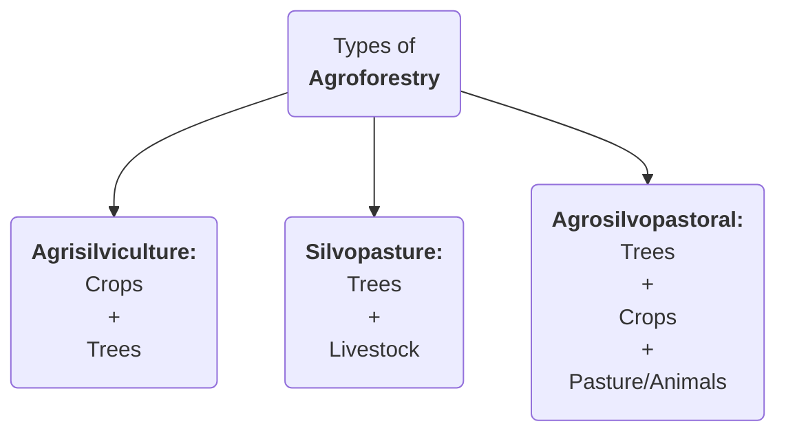

```table-of-contents
```
---
### Edible oil imports
#GS3 #Agriculture #Data
- **News**: India **reduced BCD** on major imported crude **edible oils** from 20% to **10%**.
- **Status**:
	- India accounts for:
		- **15-20%** of the **global oilseed area**
		- **6-7%** of **vegetable oil production**
		- **9-10%** of total **oilseed consumption**
	- **India** is world's **largest importer** of edible oilseeds followed by **China** and **USA**. India imports **57% (2022-23)** of its edible oil consumption.
	  
	- India imports the following oilseeds:
	```mermaid
	%%{init: {"pie": {"textPosition": 0.5}, "themeVariables":{"pieOuterStrokeWidth": "2px", "pieTitleTextSize":"25px", "pieSectionTextSize":"25px", "pieLegendTextSize":"25px"} } }%%
		pie title Share of India's total oilseed import
	    "Palm oil      (Indonesia & Malaysia) [57%]" : 57
	    "Soyabean oil  (Argentina & Brazil)   [29%]" : 29
	    "Sunflower oil (Ukraine & Russia)     [14%]" : 14
	```

	-  India's **oilseed production** among **9 major oilseeds**:
	```mermaid
	%%{init: {"pie": {"textPosition": 0.5}, "themeVariables":{"pieOuterStrokeWidth": "2px", "pieTitleTextSize":"20px", "pieSectionTextSize":"20px", "pieLegendTextSize":"20px"} } }%%
	pie title India's oil-seed production
	    "Soyabean" : 34
	    "Rapeseed & Mustard" : 31
	    "Groundnut" : 27
	    "Others" : 8
	```
	
- **Initiatives to promote domestic oil edible oilseed production**:
  - **NMEO-OP**
  - **NFSM-OS&OP**: for 9 oilseed crops area expansion and Oil Palm & Tree Borne Oilseeds.
---
### State of World Marine Fishery Resources 2025 Report
#GS3 #Environment #Fisheries #Report
- By **FAO**
- **Data**:
	- Only **29% of deep-sea** fish stocks are being **sustainably fished**
	- **64.5%** of all fishery stocks are **exploited within sustainable levels**, while **35.5% are overfished**
	- **>50% of migratory shark stocks** are unsustainable
	  
- **Challenges:** late maturation, slow growth, infrequent spawning, **IUU fishing**
  
- <b><u>WTO Agreement on Fisheries Subsidies at 12th MC 2022:</u></b>
	- Bans subsidies for vessels or operators involved in IUU fishing.
	- Prohibits subsidies for fishing overfished stocks unless measures are in place to rebuild them to sustainable levels.
	- Forbids subsidies for fishing activities outside coastal state jurisdiction
	- **India's concerns:**
		- What about small scale fishermen of India? They need subsidies but they lack technical supports compared to mechanized fishermen of developed countries.
		- Apply **"Polluter pays"** and **"CBDR"** principles.
---
### CROPIC
#GS3 #Agriculture #SciTech
- **CROPIC** is **Collection of Real Time Observations & Photo of Crops** which is planned by the **Ministry of Agriculture & Farmers Welfare** using **AI**.
- Crops will be photographed 4-5 times during their cycle, and pictures will be analysed to assess their health and potential mid-season losses using AI.
- Initiative under **PMFBY** with dual purpose of monitoring crop health and automation of crop loss assessment and payment of claims to affected farmers.
---
### Price Support Scheme (PSS):
#GS3 #Agriculture #Scheme 
- <b><u>PM-AASHA (PM-Annadata Aay Sanrakshan Abhiyan)</u></b> encompasses:
	1. **PSS: Price Support Scheme**
	2. **PDPS: Price Deficiency Payment Scheme**
	3. **MIS: Market Intervention Scheme**
	4. **PSF: Price Stabilization Fund**
---
### Digital Agriculture Mission (DAM):
#GS3 #Agriculture #SciTech #DPI
- At the **National Conference on Agri Stack***, GoI announced:
	- Rs.4000 Cr for developing Farmer Registries (including legal heir status) and Rs.2000 Cr for digital crop surveys.
	- Introduced **Digitally Verifiable Credential (DVC)** or **Kisan Pehchan Patra**
- <b><u>Digital Agriculture Mission:</u></b> for DPI in Agriculture
	- **Agri Stack**: digital good like *Aadhar* built in a *federal architecture* with collaboration between Union and States.
		- **3 registries under Agri Stack:**
			1. **Farmer's Registry:** created and managed by States
			2. **Geo-referenced village maps:** for conducting digital crop surveys
			3. **Crop Sown Registry** through **Digital Crop Survey (DCS)**
	- **Krishi Decision Support System (KDSS):** a **GIS** integrating geospatial and non-geospatial data including satellite, weather, soil, etc.
	- **Nationwide Soil Resource Mapping Project:** initiated by the *Soul and Land Use Survey of India* **(SLUSI)**, at village level.
	- **Digital General Crop Estimation Survey (DGCES):** automates General Crop Estimation Survey process
---
### Coffee
#GS3 #Agriculture #Crops
- India's coffee **exports** jumped about **125%** to **USD 1.8 Billion** in the last 11 years
- Coffee is a **tropical plant** and there are more than **60 different species**. However, two dominates the world trade:
	- **Arabica** - represents **75% production**
	- **Robusta** (bitter and stronger)
		- ****India majorly produces ROBUSTA (72%) and exports the same***
- **Climatic conditions:**
	- Annual rainfall of **150-300cm** 
	- Temperature range between 
		- **15-24 degree Celsius (Arabica)**
		- **24-30 degree Celsius (Robusta)**
	- **Soils:** deep, fertile, rich in *organic matter*, *well drained* and *slightly acidic*
- **Production of Coffee:**
	- **Global:**
		1. **Brazil** - 30.8%
		2. Vietnam
		3. Indonesia
		4. Columbia
		5. Ethiopia
	- **India:**
		1. **Karnataka** - 70%
		2. Kerala - 23%
		3. Tamil Nadu - 6%
	- **Various coffee producing hills in India:** #GS1 #Geography #Hills
		- ***Anaimalais*** - Tamil Nadu
		- ***Araku Valley*** - Andhra Pradesh
		- ***Bababudangiris*** - Karnataka
		- ***Bilgiris*** - Karnataka
		- ***Manjarabad*** - Karnataka
		- ***Pulneys*** - Tamil Nadu
		- ***Shevroys*** - Tamil Nadu
---
### NSO Report on Agriculture and Allied sector
#GS3 #Economy #Agriculture #Data #Report 
- **NSO** under **MoSPI** released the report offering a comprehensive overview of agriculture and allied sector in the last decade.
- **Agriculture sector:**
	- ***Economic contribution***: **16% GDP** for FY24 (Economic Survey 2024-25)
	- ***Livelihood:*** Supports **46% population**
- **HIGHLIGHTS:**
	- **Gross Value Added (GVA) and Gross Value of Output (GVO):** in agriculture and allied sector 
		- **GVA** rose by **225%** (current prices) from *FY12* to *FY24*
		- **GVO** rose by **54.6%** (current prices) from *FY12** to *FY24*
	- **Rising share or allied sector:** ***~46%*** of total GVO
	  <p align="center"></p>
	 
	- **Crop sector:** Largest contributor - **54%** of total GVO
		- ***Uttar Pradesh*** is **top cereal-producing** state
		- **Paddy** and **wheat** constitute nearly ***85%*** of GVO of **all cereals** in FY24
	- **Floriculture:** GVO **doubled** from FY12 to ***INR 28,000 crore*** in FY24
		- #Data <b><u>NOTE:</u></b>
			- **State wise floriculture cultivation:**
				1. **Tamil Nadu - 21%**
				2. **Karnataka - 16%**
				3. **Madhya Pradesh - 14%**
			- **State wise horticulture cultivation:**
				1. **Uttar Pradesh - 13%**
				2. **Madhya Pradesh - 10%**
				3. **Gujarat**
			- **Orchid production:** ***"orchid state of India"*** is **Arunachal Pradesh**
				1. **Arunachal Pradesh**
				2. **Sikkim**
				3. **West Bengal**
	- **Condiments and spices:** the top states are
		1. **Madhya Pradesh - 19.2%**
		2. **Karnataka - 16.6%**
		3. **Gujarat - 15.5%**
	- **Fishing and Aquaculture:** increased contribution from 4.2% (FY12) to **7% (FY24)**
		- The share of **inland fisheries** has **decreased** to ***50.2% (still majority)*** whereas the share of **marine fisheries increased**
- **Initiatives for Agriculture and allied sectors:**
	- **Agriculture Investment Fund (INR 1 lakh crore):** to address the existing gaps in **post-harvest infrastructure** in the country
	- **Digital Agriculture Mission:** to support various digital agriculture initiatives
	- **Pradhan Mantri Matsya Sampada Yojana:** aims to **formalize the fisheries sector** and support fisheries micro and small enterprises
	- **Mission for Integrated Development of Horticulture (MIDH):** a centrally sponsored scheme for the holistic growth of horticulture sector
	- **Other initiatives:**
		- **Fisheries & Aquaculture Infrastructure Development Fund*
		- **PM Fasal Bima Yojana**
		- **Rashtryia Krishi Vikas Yojana**
---
### Rules to promote Agroforestry
#GS3 #Environment #Agriculture #AgroForestry #Rules
- Government released **model rules** for ***"Felling of Trees in Agricultural Land"*** to **promote Agroforestry**
- **Highlights of rules:**
	- The existing **State Level Committee (SLC)**, constituted under the ***"Wood-Based Industries (Establishment & Regulation) Guidelines, 2016"*** will **oversee** these rules
		- It will **advise the state** on promoting **agroforesty** and boosting **timber production** by ***easing tree falling*** and ***transit rules***
	- **Registration of plantation areas:** applicants shall register on the ***National Timber Management System*** with land ownership details
	- **Felling Permission:** A ***Felling Permit*** is issued for agricultural lands **felling more than 10 trees**, while a **NOC** is issued for lands  **felling 10 or fewer trees**.
- **Agroforestry:**
	- #Definition Agroforestry involves **growing trees & agricultural crops** together on the **same land**
		- Government defines agroforestry land, for all calculation purposes, as having over **10% tree cover on agricultural land**
	- **Types of Agroforestry:**


- **Data on Agroforestry:** #Data 
	- It covers ***8.65%** (28.42 million hectares)* of India's total geographical area
	- It's share in **Agiculture GVO** is around ****7.7%***

- **Benefits:**
	- **Environmental benefits:** support increasing tree cover outside forests and promoted **sustainable land use** aligning with **NDCs**
	- **Economic benefits:** it helps ***Double farmer's income*** by boosting *productivity, improving soil health*, and *conserving water*
	- **Social benefits:** improvement in **rural living standards** from sustained employment and higher incomes
- **Initiatives to promote agroforestry:**
	- **National Agroforestry Policy, 2014:** to promote agroforestry and to create a framework for research, development, and scaling up agroforestry practices.
	- **Sub-Mission on Agroforestry (SMAF):** it is under the **National Mission for Sustainable Agriculture**
	- **GROW initiative:** launched by **NITI Aayog**, aiming to transform India's wastelands through agroforestry
	- **Amendments to the Forest Act 1927 in 2017:** redefined **bamboo** as **grass** instead of a tree, simplifying its harvesting and transit
---
### International Potato Centre (CIP) - Regional Centre in South Asia
#GS3 #Agriculture #InternationalOrganizations 
- Founded in **1971** and focuses on :
	- **Potato**
	- **Sweetpotato**
	- **Andean roots and tubers crops(ARTC)**
		- Andean roots are grown in the Andes mountains of South America
- **HQ:** at **Lima, Peru**
- Cabinet approved establishment of **South Asia Regional Centre** of the **CIP** at **AGRA**
- **India and Potato:**
	- ***India is 2nd largest producer of Potato after China**
	- **Indian Potato yield** - **25 tn per Ha**  - half of the **potential yield** of **50tn per Ha**
	- **State wise production:**
		1. Uttar Pradesh ~15MnTn
		2. West Bengal ~15MnTn
		3. Bihar ~9 MnTn
		4. Gujarat, Maharashtra, & Punjab
---
### Natural Rubber
#GS3 #Agriculture #Crops 
- **World's top producers of Rubber:**
	1. **Thailand**
	2. *Indonesia*
	3. *Vietnam*
	4. *Ivory Coast*
	5. **India** ~ 843,000 Tn (almost **similar to China**)
	6. **China**  ~ 843,000 Tn
- **Thailand** is world's largest producer of Rubber while, ***India ranks 5th/6th globally*** which China being almost equal
	- Interestingly, ***India has one of the highest Rubber Yield** (2022 in kg/Ha)* even *higher than China's*
- **State wise Rubber Production in India:**
	1. **Kerala** - 74%
	2. **Tripura**
	3. **Karnataka**
	4. **Assam**
	5. **Tamil Nadu**
	6. **Meghalaya**
- ***iSNR/BSNA initiative:***
	- ***"Indian/Bharat Standard Natural Rubber"*** initiative by **Rubber Board of India** 
	- It will establish a **traceable rubber supply chain** in India
	- It will comply with **EUDR (EU's Deforestation Regulation)** regulations
		- **EUDR** will be enforceable from *30th Dec, 2025*
- **Rubber Board of India:**
	- **Statutory** under the **Rubber Act, 1947**
	- It functions under **Ministry of Commerce and Industry**
	- Headquarter - **Kottyam, Kerala**
---
### Maize
#GS3 #Agriculture #Crops 
- 11th ***India Maize Summit 2025*** held in **Delhi**
- Maize is a **kharif crop** and is used both as **food** and **fodder**
- Globally, it is known as the ***"queen of cereals"*** because it has the **highest genetic yields potential** among the cereals.
- **Growing conditions:**
	- **Soil:** well drained *sandy loamy to silt loamy* soil
		- It grows well in **old alluvial soil**
	- **pH:** *5.5-7.5*
	- **Temperature:** *21-27 degree C*
- **Country wise production:**
	1. USA
	2. China
	3. Brazil
	4. Argentina
	5. EU
	6. India
- **State wise production in India:**
	1. **Karnataka** - 16.54%
	2. **Madhya Pradesh** - 11.37%
	3. **Maharashtra** - 10.91%
---
### Japonica Rice and DAP
#GS3 #Agriculture #SciTech #Fertilizer
- Researchers at the **National institute of Plant Genome Research (NIPGR)** have used **CRISPS-Cas9** gene-editing technology to increase the ***phosphate uptake and transport*** in the ***Japonica rice varities.***
	- **40% higher yield** with the **recommended dose of Phosphate fertilizer**
	- **20% higher yield** with **10% recommended dose of Phosphate fertilizer**
- **Plant Nutrients:**
	- **Macronutrients:** in higher quantities
		- ***N, P, K, Ca, Mg,*** and  ***Sulphur***
		- ***C, H, O***
	- **Micronutrient:** in lower quantities
		- ***Fe, Mn, B, Mo, Cu, Zn, Cl, Ni, Co, Na, Si***
- **Role of Phosphorus in Plants:**
	- It is **essential mineral for plant growth** and its limited availability leads to productivity drops drastically.
	- It is noted especially for its role in **capturing and converting sun's energy** into useful plant compounds
	- It is essential for **stimulated root development, increased N-fixing capacity of legumes, improved flower formation and seed production, etc.**
- ***DAP supply squeeze caused by China***
	- **DAP** has **46% Phosphorus** and **18% Nitrogen**
	- China has reduced it's DAP ***(Di-Ammonium Phosphate)*** exports, which is the **second most used fertilizer in India after Urea**
	- In **2023-24:** India imported around **40% DAP** form **China
	- In **2024-25:** DAP imports from China were at **18%**
		- Presently, DAP imports are sourced from:
			1. **Saudi Arabia**
			2. **Morocco**
			3. **China**
	- India is handling the **rising prices and low supply of DAP** through:
		1. Diversifying import basket - importing from **Saudi Arabia** and **Morocco**
		2. India is shifting to ***20:20:0:13*** OR ***Ammonium Phosphate Sulphate (APS)*** - now it is **India's third most consumed fertilizer***
			- **APS** has **20% Pohsphorus** and also has **13% Sulphur** which is not present in DAP
				- ***Silverlining*** as India needs **Sulphur** for **oilseeds and pulses***. Thus, increasing **APS** is good!
- **Facts about DAP:**
	- It is **highly soluble** and thus, **dissolves quickly in soil**
	- **India is the largest agricultural consumer of DAP** in the world
	- **Additional uses of DAP:**
		- *Fire retardant*
		- *Metal finishing*
---
### Nano-fertilizers and Biostimulants
#GS3 #Agriculture #Fertilizer 
- The **Union Minister of Agriculture** asked **CMs** to **immediately stop forced sale** and **forced tagging** of **nano-fertilizers** and **biostimulants** to farmers.
	- Many retailers are not selling conventional fertilizers to farmers unless they buy nano-fertilizers
- **Nano-fertilizers:** are nutrients that are **encapsulated** or **coated** within **nanomaterial $\leq$ 100 nm** 
	- Use of nanoparticles helps to control the release of nutrients, making them **efficient**
- **Biostimulants:** **substances** and/or **microorganisms** whose function when applied to plants or the **rhizosphere** is to **stimulate natural processes** to benefit crop quality independently of its nutrient conent.
	- **Popular biostimulants:**
		- *Humic acids, Seaweed extracts, Liquid manure composting, beneficial bacteria* and *fungi*

---
### PM Dhan-Dhaanya Krishi Yojana (PMDDKY)
#GS3 #Agriculture #Scheme 
- Cabinet approved **PMDDKY** scheme, which was announced in the **Budget**
- It takes inspiration from **NITI Aayog's Aspirational District Programme (ADP)**
- **Features:**
	- **Duration:** ***6 years***
	- **Coverage:** Targets ***100 districts***
	- **Sectors of focus:** exclusively designed to **enhance agricultural** and **allied sectors** in **under-performing districts**
- **Implementation strategy:**
	- **Convergence:** Around *36 existing schemes* across *11 departments,* other *state schemes* and *local partnerships* with *private sector*
	- **Identification of Districts:** is based on
		- ***Low productivity***
		- ***Low cropping intensity***
		- ***Less credit disbursement***
	- The **number of districts in each state/UT** will be based on the **share of** ***Net Cropped Area*** and ***Operational holdings***
		- A ***minimum 1*** district will be selected from each state
<p align="center"></p>

- **Governance and Monitoring of PMDDKY:**
	- **Committees** will be formed at **district, state** and **national** level for effective *planning, implementation and monitoring*
	- **Each district** will have a **dedicated plan** developed by the ***District Dhan-Dhaanya Samiti*** which will **include** ***progressive farmers***
		- The **District Plans** will align with national goals of *crop-diversification, water and soil conservation, self-sufficiency* in agriculture, and the expansion of *natural & organic farming*
	- **Progress** of the scheme in each *Dhan-Dhaanya District* will be monitored on ***117 KPIs*** and **NITI Aayog** will **review and guide** the district plans
---
### Agricultural Outlook 2025-2034 Report
#GS3 #Agriculture #Report 
- Released by **OECD** and **FAO**, providing comprehensive assessment of the ten-year prospects for **agricultural commodities (including fish)** and their **markets** at *national, regional* and *global levels*.
- **Global Market Trends (2024) as per the report:**
	- **Biofuels:** Its demand is projected to **grow at 0.9% annually,** led by India, Brazil and Indonesia
	- **Cotton:**
		- Increased global use
		- **India** set to **overtake China** as the top producer
- **Agricultural marketing in India:**
	- It encompasses **all activities and organizations** engaged in the flow of farm-produced goods, raw materials, and derivatives, such as textiles, from farms to customers
	- **Issues pertaining to Agricultural Markets in India:**
		- **Weak Infrastructure:** Inadequate **cold storage** and transport lead to **Rs. 92,000 crore** in **post harvest losses** as per **CIPHET**
		- **Lack of a national Integrated market:** the **Agricultural Produce Market Committee (APMC) markets** are **fragmented**
			- **Agricultural marketing falls in under state list** and is regulated by APMCs established by state governments under the respective *APMC Acts*
		- **Limited market access:** small farmers in remote and rural areas lack access to markets or are dependent on local traders who offer low prices
	- **Steps taken by government to improve Agri-Marketing:**
		- **National Agriculture Market (e-NAM):** enables farmers to sell produce online to buyers across multiple markets, ensuring price transparency and wider reach
		- **10,000 FPOs scheme:** strengthen market linkages, especially for small and marginal farmers
		- **Agriculture Infrastructure Fund:** supports post-harvest infrastructure like warehouses, cold chains, and community assets with interest subvention and financial aid
		- **Agricultural Marketing Infrastructure (AMI):** enhances rural storage capacity through construction of godowns/warehouses.
---
### Mission Organic Value Chain Development for North Eastern Region (MOVCDNER)
#GS3 #Agriculture #OrganicFarming #Scheme 
- The Union Minister announced the extension of **MOVCDNER** by **one year** for **Assam**
- It was launched during **2015-16**
- **Aim:** to harness the immense potential of organic farming in the North Eastern States of India
- **Implementation:** across **Arunachal Pradesh, Assam, Manipur, Meghalaya, Mizoram, Nagaland, Sikkim,** and **Tripura**
- **Objective:** develop certified organic production in a value chain mode, ensuring a seamless connection between organic growers and consumers
- **Coverage:** this program **covers everything from providing organic seeds and certification** to setting up facilities for collecting, processing, and marketing organic products
---
