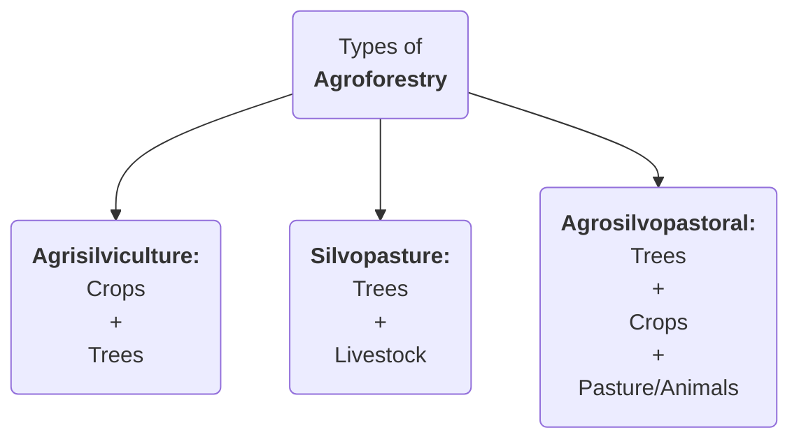

### Edible oil imports
#GS3 #Agriculture #Data
- **News**: India **reduced BCD** on major imported crude **edible oils** from 20% to **10%**.
- **Status**:
	- India accounts for:
		- **15-20%** of the **global oilseed area**
		- **6-7%** of **vegetable oil production**
		- **9-10%** of total **oilseed consumption**
	- **India** is world's **largest importer** of edible oilseeds followed by **China** and **USA**. India imports **57% (2022-23)** of its edible oil consumption.
	  
	- India imports the following oilseeds:
	```mermaid
	%%{init: {"pie": {"textPosition": 0.5}, "themeVariables":{"pieOuterStrokeWidth": "2px", "pieTitleTextSize":"25px", "pieSectionTextSize":"25px", "pieLegendTextSize":"25px"} } }%%
		pie title Share of India's total oilseed import
	    "Palm oil      (Indonesia & Malaysia) [57%]" : 57
	    "Soyabean oil  (Argentina & Brazil)   [29%]" : 29
	    "Sunflower oil (Ukraine & Russia)     [14%]" : 14
	```

	-  India's **oilseed production** among **9 major oilseeds**:
	```mermaid
	%%{init: {"pie": {"textPosition": 0.5}, "themeVariables":{"pieOuterStrokeWidth": "2px", "pieTitleTextSize":"20px", "pieSectionTextSize":"20px", "pieLegendTextSize":"20px"} } }%%
	pie title India's oil-seed production
	    "Soyabean" : 34
	    "Rapeseed & Mustard" : 31
	    "Groundnut" : 27
	    "Others" : 8
	```
	
- **Initiatives to promote domestic oil edible oilseed production**:
  - **NMEO-OP**
  - **NFSM-OS&OP**: for 9 oilseed crops area expansion and Oil Palm & Tree Borne Oilseeds.
---
### State of World Marine Fishery Resources 2025 Report
#GS3 #Environment #Fisheries #Report
- By **FAO**
- **Data**:
	- Only **29% of deep-sea** fish stocks are being **sustainably fished**
	- **64.5%** of all fishery stocks are **exploited within sustainable levels**, while **35.5% are overfished**
	- **>50% of migratory shark stocks** are unsustainable
	  
- **Challenges:** late maturation, slow growth, infrequent spawning, **IUU fishing**
  
- <b><u>WTO Agreement on Fisheries Subsidies at 12th MC 2022:</u></b>
	- Bans subsidies for vessels or operators involved in IUU fishing.
	- Prohibits subsidies for fishing overfished stocks unless measures are in place to rebuild them to sustainable levels.
	- Forbids subsidies for fishing activities outside coastal state jurisdiction
	- **India's concerns:**
		- What about small scale fishermen of India? They need subsidies but they lack technical supports compared to mechanized fishermen of developed countries.
		- Apply **"Polluter pays"** and **"CBDR"** principles.
---
### **CROPIC**
#GS3 #Agriculture #SciTech
- **CROPIC** is **Collection of Real Time Observations & Photo of Crops** which is planned by the **Ministry of Agriculture & Farmers Welfare** using **AI**.
- Crops will be photographed 4-5 times during their cycle, and pictures will be analysed to assess their health and potential mid-season losses using AI.
- Initiative under **PMFBY** with dual purpose of monitoring crop health and automation of crop loss assessment and payment of claims to affected farmers.
---
### Price Support Scheme (PSS):
#GS3 #Agriculture #Scheme 
- <b><u>PM-AASHA (PM-Annadata Aay Sanrakshan Abhiyan)</u></b> encompasses:
	1. **PSS: Price Support Scheme**
	2. **PDPS: Price Deficiency Payment Scheme**
	3. **MIS: Market Intervention Scheme**
	4. **PSF: Price Stabilization Fund**
---
### Digital Agriculture Mission (DAM):
#GS3 #Agriculture #SciTech #DPI
- At the **National Conference on Agri Stack***, GoI announced:
	- Rs.4000 Cr for developing Farmer Registries (including legal heir status) and Rs.2000 Cr for digital crop surveys.
	- Introduced **Digitally Verifiable Credential (DVC)** or **Kisan Pehchan Patra**
- <b><u>Digital Agriculture Mission:</u></b> for DPI in Agriculture
	- **Agri Stack**: digital good like *Aadhar* built in a *federal architecture* with collaboration between Union and States.
		- **3 registries under Agri Stack:**
			1. **Farmer's Registry:** created and managed by States
			2. **Geo-referenced village maps:** for conducting digital crop surveys
			3. **Crop Sown Registry** through **Digital Crop Survey (DCS)**
	- **Krishi Decision Support System (KDSS):** a **GIS** integrating geospatial and non-geospatial data including satellite, weather, soil, etc.
	- **Nationwide Soil Resource Mapping Project:** initiated by the *Soul and Land Use Survey of India* **(SLUSI)**, at village level.
	- **Digital General Crop Estimation Survey (DGCES):** automates General Crop Estimation Survey process
---
### Coffee
#GS3 #Agriculture #Crops
- India's coffee **exports** jumped about **125%** to **USD 1.8 Billion** in the last 11 years
- Coffee is a **tropical plant** and there are more than **60 different species**. However, two dominates the world trade:
	- **Arabica** - represents **75% production**
	- **Robusta** (bitter and stronger)
		- ****India majorly produces ROBUSTA (72%) and exports the same***
- **Climatic conditions:**
	- Annual rainfall of **150-300cm** 
	- Temperature range between 
		- **15-24 degree Celsius (Arabica)**
		- **24-30 degree Celsius (Robusta)**
	- **Soils:** deep, fertile, rich in *organic matter*, *well drained* and *slightly acidic*
- **Production of Coffee:**
	- **Global:**
		1. **Brazil** - 30.8%
		2. Vietnam
		3. Indonesia
		4. Columbia
		5. Ethiopia
	- **India:**
		1. **Karnataka** - 70%
		2. Kerala - 23%
		3. Tamil Nadu - 6%
	- **Various coffee producing hills in India:** #GS1 #Geography #Hills
		- ***Anaimalais*** - Tamil Nadu
		- ***Araku Valley*** - Andhra Pradesh
		- ***Bababudangiris*** - Karnataka
		- ***Bilgiris*** - Karnataka
		- ***Manjarabad*** - Karnataka
		- ***Pulneys*** - Tamil Nadu
		- ***Shevroys*** - Tamil Nadu
---
### NSO Report on Agriculture and Allied sector
#GS3 #Economy #Agriculture #Data #Report 
- **NSO** under **MoSPI** released the report offering a comprehensive overview of agriculture and allied sector in the last decade.
- **Agriculture sector:**
	- ***Economic contribution***: **16% GDP** for FY24 (Economic Survey 2024-25)
	- ***Livelihood:*** Supports **46% population**
- **HIGHLIGHTS:**
	- **Gross Value Added (GVA) and Gross Value of Output (GVO):** in agriculture and allied sector 
		- **GVA** rose by **225%** (current prices) from *FY12* to *FY24*
		- **GVO** rose by **54.6%** (current prices) from *FY12** to *FY24*
	- **Rising share or allied sector:** ***~46%*** of total GVO
	  <p align="center"></p>
	 
	- **Crop sector:** Largest contributor - **54%** of total GVO
		- ***Uttar Pradesh*** is **top cereal-producing** state
		- **Paddy** and **wheat** constitute nearly ***85%*** of GVO of **all cereals** in FY24
	- **Floriculture:** GVO **doubled** from FY12 to ***INR 28,000 crore*** in FY24
		- #Data <b><u>NOTE:</u></b>
			- **State wise floriculture cultivation:**
				1. **Tamil Nadu - 21%**
				2. **Karnataka - 16%**
				3. **Madhya Pradesh - 14%**
			- **State wise horticulture cultivation:**
				1. **Uttar Pradesh - 13%**
				2. **Madhya Pradesh - 10%**
				3. **Gujarat**
			- **Orchid production:** ***"orchid state of India"*** is **Arunachal Pradesh**
				1. **Arunachal Pradesh**
				2. **Sikkim**
				3. **West Bengal**
	- **Condiments and spices:** the top states are
		1. **Madhya Pradesh - 19.2%**
		2. **Karnataka - 16.6%**
		3. **Gujarat - 15.5%**
	- **Fishing and Aquaculture:** increased contribution from 4.2% (FY12) to **7% (FY24)**
		- The share of **inland fisheries** has **decreased** to ***50.2% (still majority)*** whereas the share of **marine fisheries increased**
- **Initiatives for Agriculture and allied sectors:**
	- **Agriculture Investment Fund (INR 1 lakh crore):** to address the existing gaps in **post-harvest infrastructure** in the country
	- **Digital Agriculture Mission:** to support various digital agriculture initiatives
	- **Pradhan Mantri Matsya Sampada Yojana:** aims to **formalize the fisheries sector** and support fisheries micro and small enterprises
	- **Mission for Integrated Development of Horticulture (MIDH):** a centrally sponsored scheme for the holistic growth of horticulture sector
	- **Other initiatives:**
		- **Fisheries & Aquaculture Infrastructure Development Fund*
		- **PM Fasal Bima Yojana**
		- **Rashtryia Krishi Vikas Yojana**
---
### Rules to promote Agroforestry
#GS3 #Environment #Agriculture #AgroForestry #Rules
- Government released **model rules** for ***"Felling of Trees in Agricultural Land"*** to **promote Agroforestry**
- **Highlights of rules:**
	- The existing **State Level Committee (SLC)**, constituted under the ***"Wood-Based Industries (Establishment & Regulation) Guidelines, 2016"*** will **oversee** these rules
		- It will **advise the state** on promoting **agroforesty** and boosting **timber production** by ***easing tree falling*** and ***transit rules***
	- **Registration of plantation areas:** applicants shall register on the ***National Timber Management System*** with land ownership details
	- **Felling Permission:** A ***Felling Permit*** is issued for agricultural lands **felling more than 10 trees**, while a **NOC** is issued for lands  **felling 10 or fewer trees**.
- **Agroforestry:**
	- #Definition Agroforestry involves **growing trees & agricultural crops** together on the **same land**
		- Government defines agroforestry land, for all calculation purposes, as having over **10% tree cover on agricultural land**
	- **Types of Agroforestry:**


- **Data on Agroforestry:** #Data 
	- It covers ***8.65%** (28.42 million hectares)* of India's total geographical area
	- It's share in **Agiculture GVO** is around ****7.7%***

- **Benefits:**
	- **Environmental benefits:** support increasing tree cover outside forests and promoted **sustainable land use** aligning with **NDCs**
	- **Economic benefits:** it helps ***Double farmer's income*** by boosting *productivity, improving soil health*, and *conserving water*
	- **Social benefits:** improvement in **rural living standards** from sustained employment and higher incomes
- **Initiatives to promote agroforestry:**
	- **National Agroforestry Policy, 2014:** to promote agroforestry and to create a framework for research, development, and scaling up agroforestry practices.
	- **Sub-Mission on Agroforestry (SMAF):** it is under the **National Mission for Sustainable Agriculture**
	- **GROW initiative:** launched by **NITI Aayog**, aiming to transform India's wastelands through agroforestry
	- **Amendments to the Forest Act 1927 in 2017:** redefined **bamboo** as **grass** instead of a tree, simplifying its harvesting and transit
---
