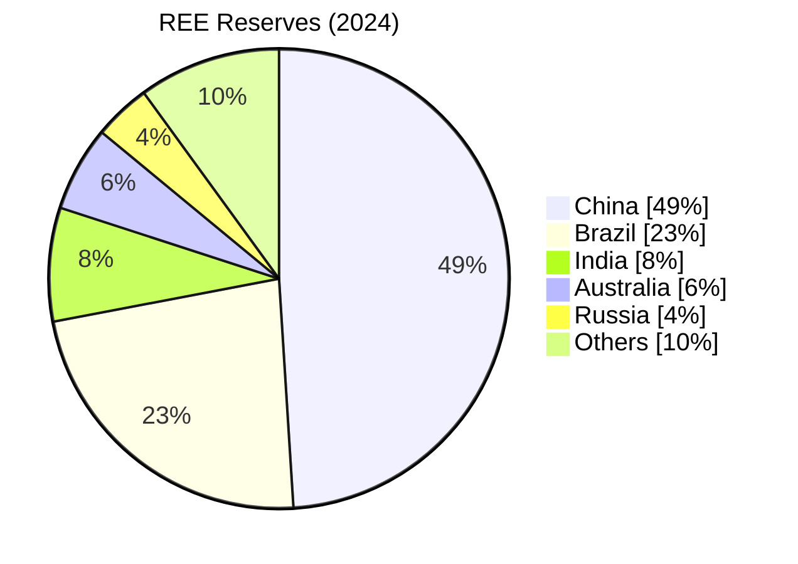

```table-of-contents
```
---
### Silver & Climate Change:
#GS3 #Environment #Minerals #EnergyTransition #ClimateChange 
- **Data on Silver:**
	- Used to capture sunlight through **rooftop solar panels**
	- Each **mobile phone** contains about 100-200 mg of Silver
	- Each **laptop** contains around 350 mg of Silver
	- Only **15% of Silver** is **recuperated** and the rest is discarded.
- **Silver and Energy Transition:**
	- ***2025 Sprott Silver Report***: Silver demand is expected to increase by **170% a year**, due to the higher demand for **solar panels**.
	- **IEA** predicts that by **2035**, ***every other car sold worldwide will be electric***, which will increase demand for Silver.
- <b><u>NEWS:</u></b> **Finnish** researchers have come up with an efficient **chemical method to recycle Silver** - using ***organic fatty acids***, such as linolenic or oleic acids found in seeds, nuts, and vegetable oils.
	-  Traditional methods of silver recycling requires toxic substances like cyanide.
	- The proposed method can also be used for ***"Urban Mining"***, where silver retrieval from waste electrical and electronic wastes (**WEEE**).
- <b><u>SILVER PRODUCTION:</u></b>
	- **Country wise:** ***{"MCP"}***
		1. Mexico - 24.8%
		2. China - 13.2%
		3. Peru - 12%
	- **India** is **12th largest Silver producer**
		1. Rajasthan - 56.6%
			- *Khetri Copper mines*
		2. Andhra Pradesh - 12-15%
		3. Telanganga - 6-7.5%
---
### Sustainable Nickel:
#GS3 #Environment #Minerals #EnergyTransition #EVs 
- Importance of Nickel is in various *clean energy technologies*, especially ***Electric Vehicles (EVs)***. The **demand** for Nickel is expected to surpass **6MnT a year by 2040*.
	- Nickel is used in **batteries**
- Nickel **extraction** is **highly carbon-intensive**: For **1T Nickel** around **20T CO2** is emitted
- <b><u>NEWS:</u></b> New method developed by researchers using **Hydrogen plasma**, which is about **18% energy efficient** and **cut 84% CO2** compared to present.
- <b><u>NICKEL PRODUCTION:</u></b>
	- **Country wise:** ***{"IPR"}***
		1. Indonesia
		2. Philippines
		3. Russia
	- **India:**
		1. Odisha - 92%
		2. Jharkhand
		3. Nagaland
		4. Karnataka
- **Nickel Laterite Deposits:** *soil based* ores are often overlooked, but the new method particularly deals with Laterite deposits.
	- Contains 0.4-0.9% Nickel as ***nickeliferous limonite*** in ***chromite mine***.
	- In **India**, found in **Odisha's Sukinda** region
---
### India's Copper cathode imports 
#GS3 #SciTech #Economy #Minerals 
- <b><u>NEWS:</u></b> India's **Copper cathode** imports declined **34% y-o-y** due to a 3 month supply disruption triggered by a **quality control order (QCO)**.
- <b><u>COPPER PRODUCTION:</u></b>
	- **Highest Copper producing countries:**
		1. Chile - 23%
		2. DRC - 11%
		3. Peru
		4. China
			- In ***Refined Copper*** China is global leader with **44% global refined Copper** production
		5. Indonesia
	- **Copper production in India:**
		1. Madhya Pradesh - 46%
			- ***Bahghat (Malanjkhand)*** mines
		2. Rajasthan - 33%
			- ***Khetri (Jhunjhunu & Alwar)*** mines
		3. Jharkhand - 21%
			- ***Singhbum*** mines
---
### Copper and Aluminium Vision Documents
#GS1 #GS3 #Geography #Economy #Resources #Minerals 
- At the **International Conference on Sustainable Responsible Mining** organised by **Indian National Committee of the World Mining Congress** at ***Hyderabad***, two **vision documents** were released for **Copper and Aluminum** by the central government.
- <b><u>Copper Vision Document:</u></b> Anticipates a **six fold (6x) increase in demand** by **2047** and outlines to add **5 MTPA** (Million Tonnes Per Annum) of smelting and refining capacity by 2030.
	- **Copper reserves in world:**
		1. **Chile** - largest share - **19% world's Copper reserves** 
		2. Peru - 12%
		3. Australia - 10%
	- **Copper production in the world:**
		1. **Chile**
		2. Congo
		3. Peru
		4. China
		5. USA
	- **Copper in India:**
		1. **Rajasthan** - **52.25%**
		2. Madhya Pradesh
		3. Jharkhand
 - <b><u>Aluminum Vision Documents:</u></b> Outlines a strategic roadmap to scale up aluminium production **six fold (6x) by 2047** and sims to expand **Bauxite production capacity** to **150 MTPA**
	- **Aluminium/Bauxite reserves in the world:
		1. **Guinea**
		2. Australia
		3. Vietnam
		4. Brazil
		5. Jamaica
	- **Aluminium production in the world:**
		1. **China** - 58% of global production
		2. **India** - 6% global production
		3. Russia
		4. Canada
		5. UAE
		- **Bauxite production in the world:**
			1. **Guinea**
			2. Australia
			3. **China**
			4. Brazil
			- *India is 6th largest producer of Bauxite (2024)*
	- **Aluminium in India:**
		1. **Odisha** - 41% of India's reserves and **73% of India's production**
		2. Chattisgarh
		3. Andhra Pradesh
---
### Gold Production and Reserves
- **Gold production in the world:
	1. **China**
	2. Russia
	3. Australia
	4. Canada
	5. USA
	6. Ghana
	7. Mexico
- **Gold in India - state wise:**
	1. **Karnataka**
	2. Jharkhand
	3. Andhra Pradesh
	4. Chattisgarh
	5. Maharashtra
---
### Rare Earth Element (REE) Reserves
#GS1 #GS3 #Resources #Minerals 
- A report by **CareEdge** highlighted that, ***India holds 8% of the world's REE reserves but contributes to less than 1% of global production/mining.***
- **China** on the other hand, holds ***49%* of world's total *reserves* and contributes to *69% production/mining* of REE, with *90%* share of REE *refining*.**
- **World RRE Reserves:**


- India's REE reserves are mainly found in **monazite sand** which also contains **Thorium**
- **Coastal states** have the most **rare earth deposits** namely, **Tamil Nadu, Kerala, Andhra Pradesh** and **Odisha**
---
