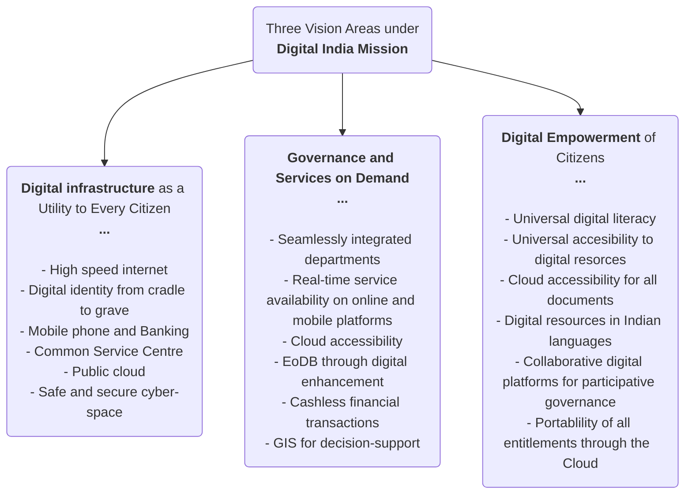
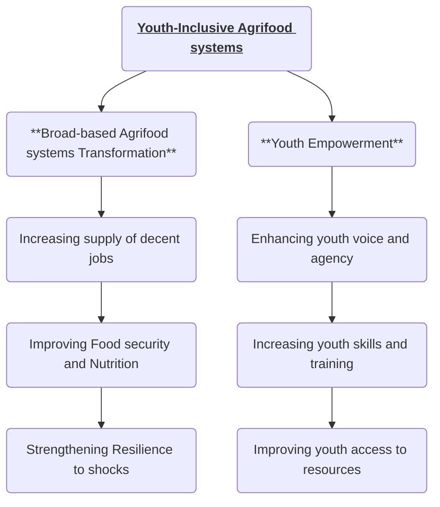

### PMUY (Ujjawala Yojana)
#Scheme
- By **MoPNG**
- To provide clean cooking fuel such as LPG available to rural and deprived households which were using traditional cooking fuels.
- **Ujjwala 2.0**: Additional allocation of **1.6 Cr** LPG connections by Dec 2022 with special focus on migrants, over the **8 Cr** target already achieved by 2020.
- **Eligibility**:
	- Women only with >18 age eligible under various social assistance schemes as per SECC
- **Data:** March 2025 --> **10.33 Cr** PMUY connections
- **PAHAL**: Aadhar based **DBT** under PMUY
---
### UGC's Anti-Ragging Regulations 
#GS2 #Education #SocialIssues
- **2009 UGC Regulation on Anti-Ragging**: UGC issued notices to multiple **HEI** to comply with the regulations.
	- **Before admission:** Institutions must include anti-ragging **warnings** and must collect **signed undertakings** from students and parents.
	- **On admission:** comprehensive information leaflets about their rights and join sensitization programs.
	- **Setting up committees**:
		- Anti-Ragging Committee
		- Anti-Ragging Squad
		- Monitoring Cell on Ragging
	- **Punishments:** ranging from suspension, expulsion to fines.
- **Other anti-ragging measures:** #MainsValueAddition
	- **National Anti-Ragging Helpline:** to register complaints etc.
	- <b><u>Raghvan Committee (2007)</u></b>: #committee Recommended making **ragging** a **criminal offense** and recommended **collective responsibility** among faculty, staff etc.
	- **Supreme Court Judgement (2009):** toll-free anti-ragging helpline and engagement with NGOs.
---
### Census 2027:
#GS1 #Demography #Census
- <b><u>Legal provisions:</u></b> under the provisions of ***Census Act, 1948*** and ***Census Rules, 1990***
- <b><u>Census 2011:</u></b> conducted in 2-phases with various reference dates
	1. *Phase 1:* *"House Listing"*
	2. *Phase 2:* "*Population Enumeration (PE)*"
- <b><u>Proposed Census 2027:</u></b> will be conducted again in **2 phases** along with **enumeration of caste**:
	- *Phase 1: "House Listing"* in **2026**
	- *Phase 2: "Population Enumeration"* in **Feb 2027**
	- **Reference date** will be ***00:00 hrs*** of <b><u><i>1st March 2027</i></u></b>
		- For **UT of Ladakh** and *non-synchronous snow bound areas of* **UT of J&K** and the states of **Uttarakhand** and **Himachal Pradesh**, the **Reference date** will be ***00:00 hrs*** of ***1st Oct 2027***
	- It will be India's **1st digital census** conducted through mobile apps available in *16 languages* (Hindi + Eng + 14 regional).
	- It will also be the **1st census in Independent India** to include **enumeration of caste** as well.

---
### DIGIPIN: 
#GS3 #GS2 #Scheme 
- New **digital address system** called **DIGIPIN**
- **Unique** ***10 character alphanumeric code*** that can be generated for any **property** that is approximately **4x4 sq.m.**
	- All types of properties, including rural, urban and even **maritime** zones
- Developed by **Department of Posts** with collaboration with **IIT Hyderabad** and the **National Remote Sensing Centre** (under **SRO**)
- DIGIPIN is **encoded geographic coordinates** and do **not store personal information**.
- DIGPIN is intended act as an extra layer of precision on top of existing postal addresses and is **not to replace** the traditional **6 digit PIN code**.
---
### NAKSHA
#GS2 #GS3 #Scheme 
- Under **DoLR** (Department of Land Records), **MoRD** (Ministry of Rural Development)
- NAKSHA or **National Geospatial Knowledge-based land Survey of urban HAbitations** is *pilot programme* under the Digital India Land Records Modernization Programme **(DILRMP)**
- **100% centrally funded** initiative
- Applicable to **cities** with an **area < 35 sq. km** and **population < 2 lakhs** and covers **157 Urban Local Bodies (ULBs)** in **27 states and 3 UTs**
- Uses advanced **aerial** and **on-ground survey** methods to create a detailed, **GIS** based digital maps
---
### MGNREGS SPENDING CAP
#GS2 #GS3 #Scheme #Employment #SocialSecurity 
- Union Finance Ministry has **capped spending** under the **MGNREGS** at **60%** of its **annual allocation** for the **first half of FY26**
- MGNREGS has been brought under the **Monthly Expenditure Plan/Quarterly Expenditure Plan (MEP/QEP)**, a **spending control mechanism** introduced by Finance Ministry in 2017
- Largest **social security** programme offering **demand based employment as a statutory right**
- **Section 3(1) of MGNREGA Act 2005:** ***guarantees 100 days of employment*** in a year to **ruaral HH** whose adult members volunteer to do **unskilled manual labor**
	- **Legally back guarantee** for any rural adult to **get work within 15 days** of demanding it
- **1/3 of MGNREGA beneficiaries** are **women**
- 100 days have not became **de facto upper limit** as the **NREGA software** does not allow data entries for employment above 100 days to a household in a financial year **unless specifically requested by state/UT**
	- In some cases, **government** allows **additional 50 days of wage** employment like, **ST HHs in forest areas** are entitled to get **150 days** provided that such families have no other private property expect for land rights under the FRA, 2006
	- Under the **Section3(4)**, the government can also provide an **additional 50 days** of unskilled work in **rural areas** where a **drought** or any **natural calamity** is notified by **MHA**.
---
### Samarth Program 
#GS3 #Economy #Scheme 
- By **C-DOT** (Center for Development of Telematics) under the **Department of Telecommunications, Ministry of Communications
- It is a cutting edged **Startup Incubation Program** for development of India's telecommunications and IT sectos
	- It aids with **Startup grants:** upto **Rs.5 lakh/startup**, world class **infrastructure**, mentorship and networking
- Implemented by Software Technology Parks of India (**STPI**) and The Indus Entrepreneurs (**TiE**)
	- <b><u>NOTES:</u></b> **STPI** is a science and technology organization under the **MeiTY**
---
### SCIAP: Sustainable Cities Integrated Approach Pilot in India
#GS3 #Economy #Environment #Urbanisation #Scheme 
- **GEF** launched the **SCIAP** in 2016
- **Implemented** by ***UNIDO*** (United Nations Industrial Development Organisation) in collaboration with ***UN-Habitat*** and **MoHUA's, *NIUA***
- Implemented in **5 cities** in India - *Bhopal, jaipur, Musyru, Vijaywada, and Guntur*
- Three main project components are:
	1. **Sustainable Urban Planning and Management** handled by the ***UN-Habitat***
	2. **Investment Projects and Technology Demonstrations** handled by **UNIDO**
	3. ***Partnerships and Knowledge Management Platform*** handled by **NIUA**
---
### Performance Grade Index (PGI) 2.0 - MoEducation
#GS2 #Governance #Education 
- **PGI** is released by **Ministry of Education** to holistically assess the performance of school education systems across all the states and UTs utilising data from:
	- **UDISE+**
	- **NAS** - National Achievement Survey
	- **PM-POSHAN** portal
	- **PRABAND** portal - for Samagra Siksha fund managment
	- **Vidyanjali** portal - school volunteer programme with support from private sector
- **Structure for PGI2.0:** total weight-age of **1000 points** across **73 indicators** which are grouped under 2 categories:
	1. **Outcome**
	2. **Governance & Management**
- The categories are further divided into **6 domains:**
	1. *Learning Outcomes*
	2. *Access*
	3. *Infrastructure & Facilities*
	4. *Equity*
	5. *Governance Process*
	6. *Teacher Education & Training*
- Based on the score there are **10 grades**"
	- **Daksh**: 941-100 score
	- **Utkarsh**
	- **Atti-Uttam**
	- **Uttam**
	- **Prachesta** - 3 levels
	- **Akanshi** - 3 levels
- <b><u>TRENDS:</u></b>
	- No state achieved the top 4 grades i.e, **no state** in **Daksh, Utkarsh, Atti-Uttam or Uttam** grade
	- **Top performer:** **Only** ***CHANDIGARH*** the ***Prachesta-1** grade
	- **Lowest performer:** ***MEGHALAYA*** is the **only** state in 10th grade, **Akanshi-3**
	- 24 states/UTs **improved scores** in FY24 compared to FY23
	- 12 states/UTs including ***Bihar, Andaman & NIcobar, Chattisgarh, Jharkhand, Karnataka*** etc. **saw decline** in scores
---
### Global Tobacco Epidemic 2025 Report
#GS2 #Governance #Health #Agriculture 
- It is the **10th report** released by **WHO** on *global tobacco epidemic that tracks the progress* made by countries in tobacco control since 2008
	- Countries reduce harms caused by tobacco by adopting and implementing **Tobacco Control Provisions** of the ***WHO Framework Convention on Tobacco Control (WHO-FCTC)*** #convention 
- **WHO-FCTC's Tobacco Control Provisions** reduce the demand for tobacco as well as others reduce tobacco production, distribution, availability and supply.
- To support countries in implementation, **WHO** launched ***"MPOWER"*** in 2008
- <b><u>WHO "MPOWER" Tobacco Control Measures</u></b> ***(total 6)*** to reduce tobacco use are:
	- ***MPOWER:*** ***"Monitor, Protect, Offer, Warn, Enforce and Raise"***
		1. <b><u>Monitor</u></b> *tobacco use* and *prevention policies*
		2. <b><u>Protect</u></b> people from tobacco smoke with **smoke-free air legislation**
		3. <b><u>Offer</u></b> **help to quit tobacco use**
		4. <b><u>Warn</u></b> about the dangers of tobacco with **pack labels & mass-media**
		5. <b><u>Enforce</u></b> **bans** on **tobacco advertising**, promotion and sponsorship
		6. <b><u>Raise</u></b> **taxes** on tobacco
- **Findings of the 2025 report:**
	- **155 countries** have implemented **at least one** policy prescription which has benefited **1.6 billion people**
	- Out of the ***6 "MPOWER"*** measures, most progress has been in **large graphic health warning on cigarette packages**
	- India has implemented stringent measures to **curb tobaccco advertising, promotion and sponsorship (TAPS)** across all forms of media
	- Least-adopted MPOWER measure is **tobacco-tax**, even in India
	- India became the **first country globally to apply tobacco control regulations** specifically to **digital streaming content**
---
### ULLAS - Nav Bharat Saaksharta Karyakram/ New India Literacy Programme
#GS2 #Governance #Education #Scheme 
- **Centrally SPONSORED scheme** - 60:40%
- Under **Ministry of Education** for FY 2022-2027 to **cover non-literates of the age 15 and above** in **all states/UTs**
- **Targets** **Foundational Literacy and Numeracy** for **5 Crore** learners
- It is being implemented in **Hybrid mode** (both online and offline)
- **Tripura** became the **3rd fully literate** state under ULLAS
	- The three states are:
		- **Mizoram**
		- **Goa**
		- **Tripura**
	- State must achieve a **benchmark of 95% literacy** among the **individuals aged 15 years and above**
---
### Sustainable Development Report 2025
#GS3 #Economy #SustainableDevelopment #Report 
- 2025 **Sustainable Development Report** has the theme - ***"Financial Sustainable Development to 2030 and Mid-Century"***
- **Sustainable Development Report** has been released annually since 2016 by the ***UNSDN* (UN Sustainable Development Solutions Network)**
	- **UNSDN** was launched in **2012** to **mobilize scientific & technological expertise** for the **implementation** of the **SDGs** and the **Paris Climate Agreement**.
- <b><u>Sustainable Development Goals (SDG):</u></b>
	- SDGs are 17 global goals established by **UN** in **2015** as a part of the 2030 Agenda for Sustainable Development
	- SDGs are built upon the backdrop of the **Millennium Development Goals (MDGs)** - which targeted *extreme poverty* from *2000-2015*
- **Findings of the SDR 2025:**
	- ***Global commitment to the SDGs is strong:*** 190 out of the 193 countries have presented National Action Plans for advancing sustainable development.
	- ***SDGs are far off-track:*** **None** of the SDGs are on track to be achieved by 2030
	- ***Support for UN multilateralism:*** 
		- ***Barbados*** ranks highest, while the ***USA*** ranks last in the **2025 UN Multilateralism** ***(UN-Mi)***
	- ***India entered top 100 in SDR 2025:***
		- Ranked **99** from 109th in 2024
	- **Finland** is ranked **1st** overall
- **Challenges to SDG progress:**
	- Global conflicts
	- Structural vulnerabilities
	- Limited fiscal space
	- Delayed capital support by high-income countries to support Multilateral Development Banks
---
### NAVYA Initiative
#GS3 #Economy #Skilling #Scheme 
- It stands for ***Nurturing Aspirations through Vocational Training for Young Adolescent Girls***
- A **joint initiative** of the ***Ministry of Skill Development & Entrepreneurship*** and ***Ministry of Women & Child Development***
- Objective is to provide **vocational training** to **adolescent girls (aged 16-18 years)** through ***PMKVY 4.0***, with a **minimum qualification of Class 10**.
	- **PMKVY 4.0** provides **NSQF aligned skill development training** including reskilling and upskilling
- Larger aim is to **link girls with employment and entrepreneurship opportunities** beyond conventional boundaries, such as graphic designer, smartphone technician, drone assembly expert, etc.
- **Target:** **27 aspirational districts** across **19 states**
---
### Amended BharatNet Program (ABP)
#GS3 #Economy #SciTech #Scheme 
- **Gujarat** became the **first state** to implement the **ABP** under a ***state-led model***
- **Background:**
	- BharatNet was launched to provide **broadband connectivity** to **all Gram Panchayats (GPs)** across the country
- **Amended BharatNet Program (ABP)** was approved in 2023 as a **design improvement**
- **Purpose:**
	- **Optical Fibre (OF) connectivity:** to **2.64 lakh GPs** in a ***ring topology**
		- **Ring topology** is a network design where connected devices form a circular data channel
		- OF connectivity to the remaining **non-GP** villages on **demand**
- **Features:**
	- **IP-MPLS (Internet Protocol Multi-Purpose Label Switching)** network with router at blocks and GPs
	- **Operation and maintenance** for **10 years**
	- **Minimum 25 Mbps download speed** for each FTHH subscriber
	- **Last Mile network** to be  implemented through **BharatNet Udyami mdoel**
---
### Critical and Emerging Technologies Index
#GS3 #SciTech #EmergingTech #Report 
- **Critical and Emerging Technologies Index** has been published by the **Havard Kennedy School** to assess hoe <b><u>25 countries</u></b> perform across <b><u>5 technology sectors</u></b>:
	- AI
	- Biotechnology
	- Semiconductors
	- Space
	- Quantum
- It identifies **6 criterias** to define each technology sector:
	- *Geopolitical significance*
	- *Systemic leverage*
	- *GDP contribution*
	- *Dual-use potential*
	- *Supply chain risk*
	- *Time to maturity*
- **Key findings of the report:**
	- **India lags significantly** behind the top three - ***USA, China, and Europe*** - across most technology sectors
	- **India trails** in **critical tech**, particularly ***semiconductor technology***
---
### Global Peace Index
#GS2 #IR #Report #Data 
- **10th edition** of the **Global Peace Index** is released by the **Institute for Economics and Peace (IEP)** covering 163 countries and 99.7% of world's population - there are ***59 active state-based conflicts,*** most since the WWI
- The report is published **annually** since *2007* and provides data-driven analysis of:
	- Trends in peace
	- Economic value of peace
	- Ways to develop peaceful societies
- The index is based on <b><u>23 qualitative and quantitative indicators</u></b> across **3 domains:**
	1. ***Level of Societal Safety***
	2. ***The extent of ongoing domestic and international conflict***
	3. ***Degree of militarisation***
- **Findings:**
	- **Deterioration of global peacefulness** by *0.36%* - ***94/163 countries recorded deterioration, while 66 recorded improvements***
	- **Internationalization of conflicts** is becoming more common, leading to difficulty in reaching solutions. The reasons are:
		- **Geopolitical fragmentation**
		- Increasing **power competition**
		- Rise of **influential middle-level powers**
	- **Shift towards *"Forever Wars"* and failure of traditional resolution strategies** #Data #MainsValueAddition - ***only 9% of conflicts today result in a decisive military victory*** and just ***4% end with negotiated settlements***
		- The report suggests the following to **de-escalate** the conflicts:
			- Need for sustained investments in **positive peace** which is **correlated** with *higher GDP growth, lower interest rates, societal well-being* and *more resilience to shocks*
	- **17/23 indicators** recorded **deterioration**
	- **Nuclear-armed states expanding their arsenal since 2022** - especially in Asia (as per SIPRI)
	- **Arms race in advanced technologies** - *AI-enabled drones and counter-space systems*
	- The global **economic impact of violence** reached ***USD 20 Trillion*** #Data in 2024, equivalent to ***11.6% of global GDP*** with military expenditure alone accounting for USD 2.7 Trillion.
- **World's most peaceful countries:**
	1. Iceland
	2. Ireland
	3. New Zealand
	4. Austria
- **India:** ranked ***115th/163*** with a *GPI score of 2.229* (higher score means lower peace) - **0.58% improvement** from 116th in 2024
- **South Asia** recorded largest **deterioration** of all the regions, with significant falls in peacefulness in **Bangladesh** and **Pakistan.** It became the **second least peaceful region globally**
- The **least peaceful country** is ***Russia***
---
### Global Terrorism Index
#GS3 #InternalSecurity #Terrorism #Report #Data 
- Established in 2007, and released by **IEP (Institute for Economics Peace)**
- It is part of the **3 indices/reports released by IEP**:
	- **Global Peace Index**
	- **Global Terrorism Index**
	- **Ecological Threat Report**
- **GTI 2025:**
	- The number of countries experiencing at least one terrorist incident **increased** from 58 to **66** - the most countries affected since 2018/
	- **India:** ranked **14th** in terms of most terror incidents
	- **Pakistan:** ranked **2nd** in terms of most terror incidents - after **Burkina Faso** which is the most terror affected country
---
### eMARG and PMGSY
#GS3 #Economy #Infrastructure #Scheme 
- **About PMGSY:**
	- Started as a **totally Centrally Sponsored Scheme**, but later in *2015-16* the funding pattern was modified to **Centrally Sector Scheme - 60:40 between centre and  states (expect for NE and Himalayan states)**
	- **PMGSY Phase I:**
		- Launched in Dec 25, 2000 to improve **rural infrastructure** through **road construction**
	- **PMGSY Phase II:**
		- Launched in 2013, with another component, called the **Road Connectivity Project for Left Wing Extremism Affected Areas (RCPLWEA)** launched in 2016
	- **PMGSY Phase III:**
		- Started in 2019
	- **PMGSY Phase IV:**
		- Started in Sep 2024, to provide **all-weather road connectivity** to **25,000 unconnected habitations of population size 500+ in pains, 250+ in NE and hill states/UTs, special category areas and 100+ in LWE areas**
- Technical support for implementation by **National Rural Infrastructure Development Agency (NRIDA)**, which comes under the **MoRD (Rural Development)**
- **NRIDA** has written to all states about **QR codes** -  to get **public feedback about the quality and maintenance of roads**
- **eMARG: electronic Maintenance of Rural Roads**
	- e-governance solution for managing and monitoring rural road maintenance
	- It is a **mobile-cum-web-based** dashboard/portal
	- A **QR code** can be generated for each road, to be displayed on the maintenance information display board on the road.
	- The submitted feedback photographs will be analysed using AI to advise on Performance Evaluation(PE) marks.
---
### Global Liveability Index 2025
#GS2 #Governance #Urbanisation #Report 
- Released by the **Economist Intelligence Unit (EIU)** based on **30 indicators** for **173 cities** across several factors like:
	- Stability
	- Healthcare
	- Culture
	- Environment
	- Education
	- Infrastructure
- **Most liveable cities:** 
	1. Copenhagen, Denmark
	2. Vienna, Austria
- **Least liveable city:**
	1. Damascus, Syria
	2. Tripoli, Libya and Dhaka, Bangladesh (both bottom Rank 2)
	3. Karachi, Pakistan (Rank 3 from bottom)
---
### AMRUT
#GS1 #Society #Urbanisation #Scheme #Data
- India celebrated **10 years of AMRUT (Atal Mission for Rejuvenation and Urban Transformation)**, which was launched in 2015 and was India's **first water focused mission**
	- AMRUT 2.0 was launched in 2021
	- It is a **centrally SPONSORED scheme** under **UMoH&UA** covering **all ULBs**.
	- Funds are shared among states and UTs based on **urban population** and **number of towns**
- **Objectives:**
	- Ensure every household has access to a **tap** and **sewage connection**
	- Increase the **amenity value of cities** #Eg Parks
	- Reduce **pollution** by promoting **public transport**, etc.
- **Coverage:** ***500 selected cities and towns*** - now **485 cities, including 15 merged cities**
- **Other key initiatives under AMRUT:**
	- **Jal Hi AMRIT:** to treat and reuse water safely
	- **AMRUT Mitra:** to foster skills among SHG women related to water management in their communities
- **Achievements:**
	- **99 lakh streetlights** replaced with **LEDs**
	- **48 lakh tonnes** of **CO2 reduction per year**
	- **INR 5,000 crore** raised through **Municipal Bonds**
	- **3,599 cities** implemented ***online Building Permission system***
	- **GIS-based Master Plans** for AMRUT cities
---
### Science and Technology (S&T) Clusters Initiatives
#GS3 #SciTech #Scheme 
- **S&T Clusters Annual Report 2024-2025** highlighted various initiatives launched under the program including ***kalaanubhav.in*** which is an AR/VR-enabled ***artisan marketplace**
- **S&T Clusters Initiatives** was launched in 2020 based on the recommendations of **PM-STIAC** (Prime Minister's Science, Technology, and Innovation Advisory Council)
	- It aims to bring together stakeholder, like academic institutions, R&D organisations, industry, local governments, to **deliver demand-driven solutions through innovative ideas**
	- It operates through a ***consortium-based approach***
- **Nodal Implementing Agency:** Office of the Principal Scientific Adviser (PSA), which works under the Cabinet Secretary
---
### Energy Transition Index (ETI), 2025  
#GS3 #Environment #Report  
- Released by **World Economic Forum (WEF)**  
- **Findings:**  
	- Top performers area:  
		1. Sweden  
		2. Finland  
		3. Denmark  
		4. Norway  
	- **India** ranked **71 (2025)** which *dropped from 63 (2024)*  
- It ranks countries on their *progress towards energy transition from fossil fuels to clean energy*  
- It uses **43 indicators** under **two main categories:**  
	- **System Performance (energy security, equity & sustainability)**  
	- **Transition Readiness (regulation, infrastructure, investment)**  
- It is based on **43 indicators** with data from multiple sources on a scale from **0 to 100**  
---  
### Annual report on Children in Armed Conflict  
#GS2 #GS1 #Society #IR #Report #VulnerableSections  
- Released by **UN Secretary-General**  
- **Findings:**  
	- **25% surge** in grave violations against children under the age of 18  
	- **40K grave violations** against children in 2024  
	- Highest number of children affected are in **Israel, Palestine, DRC, Somalia, Nigeria, and Haiti**  
	- **Most prevalent violations in 2024:** Killing and maiming, denial of humanitarian access, recruitment and use  
	- **Perpetrators:**  
		- Non-State armed groups - 50%  
		- Government forces - killing and attack on schools  
---
### Skills For The Future Report
#GS3 #Economy #Skilling #Report 
- **Ministry of Skill Development and Entrepreneurship** released the ***"Skill For the Future: Transforming India'a Workforce landscape*** report, in the backdrop of the emerging **knowledge-drive global economy**
---
### SPREE Scheme
#GS3 #Economy #Scheme 
- **SPREE (Scheme to Promote Registration of Employers/Employees)** scheme was approved for launch by **Employees' State Insurance Corporation (ESIC)**
- It was earlier launched in 2016 and facilitated the registration of over **88,000 employers** and **1.02 crore employees** under the **Employees' State Insurance Act**
- **Renewed SPREE (2025):** a one-time enrollment window will be open for unregistered and left-out workers
- **Other initiatives to improve Employee Insurance:**
	- **Approves Amnesty Scheme (2025-2026):** to reduce *litigation* and to promote *EoDB*
	- **Revised ESI AYUSH Policy:** approval for Yoga therapists and Panchakarma attendants in ESIC hospitals
---
### Adi Karmyogi Programme
#GS1 #Society #Tribals #Scheme 
- Launched by **Ministry of Tribal Affairs (MoTA)**
- It aims to build a **cadre of highly motivated officers** and change makers dedicated to **grassroots transformation**
	- It will take **capacity-building** to about **20 lakh field-level stakeholders** by creating a batch of *trainers* and *master trainers* at the State, district and block levels
	- It will emphasize **citizen-centric ideation** and **delivery**
- Target is to reach **1 lakh tribal villages and habitations**
---
### UN Report on Child and Maternal Health
#GS1 #GS2 #Governance #Health #Data #Report #MainsValueAddition 
- Reports by **UN Inter-agency groups:**
	- ***Trends in maternal mortality 2000 to 2023***
	- ***Levels & Trends in Child Mortality 2024***
- **Key achievements of India:**
	- **Decline in *"zero-dose children"*:** Reduced from *0.11% (2023)* to <b><u>0.06%</u> (2024)</b> of total population
		- "<b><u><i>Zero-dose children</i></u></b>" are those who did not receive their first dose on **DPT** *(Diptheria-Tetanus-Pertussis)* vaccine
	- **Polio-Free Status:** maintained since *2014* through **National Immunization Days**
	- **Reduction in mortality indicators:**

| **INDICATOR**                           | **DEFINITION**                                                                         | **INDIAN DECLINE SINCE 1990** | **GLOBAL DECLINE SINCE 1990** |
| --------------------------------------- | -------------------------------------------------------------------------------------- | ----------------------------- | ----------------------------- |
| 1. **Maternal Mortality Rate (MMR)**    | Number of maternal deaths during a given time period per 1,00,000 (1 lakh) live births | **86%**                       | 48%                           |
| 2. **Under-Five Mortality Rate (U5MR)** | Number of deaths of children under 5 years of age per 1,000 live births                | **78%**                       | 61%                           |
| 3. **Neonatal Mortality Rate (NMR)**    | Number of neonatal (birth to 29 days) deaths per 1,000 live births                     | **70%**                       | 54%                           |

- **Achievements of Universal Immunization Programme (UIP):**
	- **Reach:** provides free vaccination services annually to **~3 crore pregnant women** and **~2.6 crore infants*** (0-1 year)
	- **Vaccines:** includes **12 vaccine-preventable diseases** (up from 6 in 2013)
		- **New introduces vaccines:** *Inactivated Polio vaccine, Rotavirus vaccine, Pneumococcal Conjugate vaccine, Measles-Rubella vaccine, Adult Japanese Encephalitis vaccine, Tetanus-Diphtheria vaccine*
- **Various initIatIves/achievements for vaccination:**
	- ***Zero Dose Implementation Plan 2024:*** rolled across 143 districts in 11 states with high burden on unvaccinated children
	- **Mission Indradhanush:** vaccinated **5.5 crore children** and **1.32 crore pregnant women** in 2017
	- **Village Health and Nutrition Days (VHNDs):** community-level immunization and outreach
	- **U-WIN** portal for tracking of immunization status
---
### RBI's Financial Stability Report (FSR)
#GS3 #Economy #RBI #Data #Report #MainsValueAddition 
- It is **biannual report** released by the **RBI**
- It reflects the collective assessment of the **sub-committee** of the **FSDC** on resilience of the Indian financial system and risks to financial stability
	- **FSDC: Financial Stability and Development Council**
		- Established in 2010 and is chaired by the ***Finance Minister*** with members including **heads of financial regulators:** ***RBI, SEBI, IRDAI, PFRDAI*** and other members
		- It is responsible for ensuring **financial stability** and **coordination**
- **Highlights of the report:**
	- **India still driver of global growth:**
		- **Resilience of the Indian economy:** real GDP is projected to grow at ***6.5% in FY26***, driven by *strong domestic demand* which shields the economy from global shocks
		- **Strong financial institutions and banking health:**
			- #Data **GNPA** (Gross non-performing asset ratio) - ***2.3%**
			- #Data**NNPA** (Net non-performing asset ratio) - ***0.5%***
			- #Data Till 2025, the **CRAR** of *SCBs (Schedule Commercial Banks)* has increased to a record high of ***17.3%***
		- **Strong corporate sector performance:** the **large borrower cohort's  GNPA** ratio declined from *3.8% (September 2023)* to ***1.9% (March  2025)***
	- **Inflation trends:**
		- **Domestic inflation:** **CPI** dropped to a **6 year low** of ***2.8% (May 2025)***
		- **Imported inflation:** slower global growth may ease commodity and oil prices, though tensions in the Middle East may add some uncertainties
	- **Global Macro-financial Risks:**
		- **Spillovers from advanced economies to emerging economies:** Emerging markets face rising risks from **global trade tensions, ongoing geopolitical conflicts, rising global public debt**
		- **Uncertainty over US trade policy:** led to market volatility, tighter financial conditions
		- **Climate related shocks:** have potential to disrupt business operations through the ***materialization of physical hazard***
- **NOTE:** ***Global Financial Stability Report*** is released by **IMF**
---
### SDG-NIF Progress Report 2025
#GS3 #Economy #SustainableDevelopment #Report 
- **MosPI** released the **SDG-National Indicator Framework (NFI) Progress Report 2025**
	- The **NIF** reflects *India's commitment to SDGs*
- **Highlights:**

| **SDG GOAL#**                               | **PROGRESS**                                                                                                                                                                                                                                                                           |
| ------------------------------------------- | -------------------------------------------------------------------------------------------------------------------------------------------------------------------------------------------------------------------------------------------------------------------------------------- |
| **SDG2:** *Zero Hunger*                     | - **Agriculture productivity** improved - **Income per worker** improved from **Rs.61K (FY16)** to ***Rs.94K (FY25)***                                                                                                                                                              |
| **SDG6:** *Clean Water and Sanitation*      | - **Rural access to safe drinking water** increased from *94.6% (FY16)* to ***99.62% (FY25)***                                                                                                                                                                                         |
| **SDG7:** *Clean Energy*                    | - **Renewable energy generation** in total generation rose from *16% (FY16)* to ***22%(FY25)*** - **Per capita renewable energy generation** capacity increased from *64W (FY16)* to ***156.3W (FY25)***                                                                            |
| **SDG8:** *Decent work and Economic growth* | - **Social protection coverage** expanded from *22% (2016)* to ***64.3% (2025)***                                                                                                                                                                                                      |
| **SDG9:** *Industry and Innovation*         | - **Emission intensity of GDP** reduced by **36% from 2005** to 2020 showing ***greener growth***                                                                                                                                                                                      |
| **SDG10:** *Reduced Inequality*             | - From **FY12 to FY24**, the **Gini coefficient** of **household expenditure** decreased from **0.283** to ***0.237*** in **RURAL AREAS** - From **FY12 to FY24**, the **Gini coefficient** of **household expenditure** decreased from **0.363** to ***0.284*** in **URBAN AREAS** |
| **SDG12:** *Responsible Consumption*        | - **Waste processed** has increased from *18% (FY16)* to ***81% (FY25)***                                                                                                                                                                                                              |
| **SDG15:** *Life on Land*                   | - **Forest cover** rose from *21.24% (2015)* to ***21.76% (2023)***                                                                                                                                                                                                                    |
- **Some concerns highlighted in the report:**
	- Rising **adolescent birth rates** in girls
	- Rise in **road accident fatalities**
	- Decline in **issuance of soil health cards**
	- Reduction in **primary government expenditure** as a proportion of original approved budget
---
### District SDG Index 2023-24 for NER
#GS3 #Economy #SustainableDevelopment #Report 
- Released by **NITI Aayog** for the **North East Region (NER)**
- It ranked, ***Hnahthial (Mizoram)*** as the **best performing district** in NER and places ***all districts*** of **Mizoram, Sikkim, & Tripura** in the ***front runner status***
- This ensures **SDG localisation** through ***bottom-up approach*** and ***local development policy***
- **India and SDG Localisation:**
	- **NITI Aayog:**
		- *Competitive and Cooperative federalism*
		- **SDG India Index**
		- **Agenda 2030**, etc.
	- **Schemes/Initiatives:**
		- **Panchayat Advancement Index (PAI)**
		- **Rashtriya Gram Swaraj Abhiyan (RGSA)**
		- **PMAY**
		- State schemes like CM's **Samagra Gramya Unnayan Yojana** of Assam
---
### 10 Years of Digital India Mission
#GS3 #SciTech #DPI #Scheme #Data
- It was launched in 2015 with an aim to transform India into a **digitally empowered society and knowledge economy**
- It is an **umbrella programme** covering **multiple government Ministries and Departments**
- Overall coordination is performed by **MeITY**
- It identifies **3 vision areas:**

- **Major achievement under Digital India Mission:** #MainsValueAddition
	- **Digital Economy:** #Data contributing ***11.75% to national income in FY23*** and expected to reach ***13.4% by FY25***
		- India ranks **3rd** in the world for **digitization of economy**
	- **Connectivity and Infrastructure:**
		- #Data **Internet connections** increased from *25 crore (2014)* to ***97 crore (2024)*** and **BharatNet** connected ***2.18 lakh Gram Panchayats*** with high speed internet
	- **Digital Finance and Financial inclusion:**
		- **Digital payments:** #Data India accounts for **49% of global real-time digital payments** in 2023 with ***UPI*** being live in 7 countries
			- *1. Bhutan, 2. France, 3. Mauritius, 4. Nepal, 5. Singapore, 6. Sri-Lanka, 7. UAE*
		- **Aadhar-enabled DBT:** #Data saved **Rs. 3.5 lakh crore** by eliminating ***fake beneficiaries***
	- **Advancing strategic tech capabilities:** through *IndiaAI Mission, India Semiconductor Mission* (six projects approved), and *SEMICON India 2025*
	- **e-Goverance:** training of civil servants on *Karmayogi Bharat iGOT platform,* and improving access to central and state government services through *UMANG*
---
### WaveX
#Gs3 #Economy #MICE 
- **WaveX**
	- Is a dedicated **Startup accelerator platform** launched under **MoI&B's WAVES initiative**, aimed at nurturing innovation in the media, entertainment, and language technology sectors
- **MoI&B** launched the **"WAVEX Startup Challenge 2025"** under its flagship **startup accelerator programme, "WaveX"**
	- under this there is a challenge titled, ***"BhashaSetu"*** - Real time language tech for Bharat, is a national hackathon to develop AI-powered multilingual translation solution across *at least 12 major Indian languages*
---
### Employment Linked Incentive (ELI) Scheme
#Gs3 #Economy #Employment #Scheme 
- Announced in **Budget 2024-25** 
- **Details of the Scheme:**
	- Under the **Ministry of Labour & Employment**
	- Outlay of Rs. 99,446 crore (*~1,00,000 lakh crore*) over 2 years
	- It targets to generate **3.5 crore hobs** including **1.92 crore** for **first-time employees**
- **Two parts of the scheme:**
	- <b><u>PART A: Incentive to first time employees</u></b>
		- First time employees **registered** with **EPFO** and earning **up to INR 1 lakh/month** are eligible
			- Around **1.92 crore** beneficiaries
		- **Incentive amount:** ***1 month EPF wage** (up to Rs.15,000)* disbursed in two installments:
			- After 6 months of continuous employment
			- After 12 months and successful completion of a financial literacy programme
		- **Savings provision** to deposit the incentive in a *savings instrument* with a lock-in period
		- **Payment mechanisms:** DBT through **ABPS**
	- <b><u>PART B: Incentives for employers</u></b>
		- Special focus in manufacturing sector
		- **Eligibility:** All **EPFO-registered establishments** hiring the following:
			- At least **2 additional employees** for *(workforce < 50)*
			- At least **5 additional employees** for *(workforce $\geq$ 50)*
		- **Incentives to employers:** Up to **Rs. 3000/month** for **2 years**
			- Extended to **4 years** for **manufacturing** sector
		- **Minimum employment period:** **6 months** of sustainable employment per new hire
		- **Salary cap:** employees earning up to **Rs. 1lakh/month**
		- It will create around **2.6 crore additional jobs**
		- **Payment mechanisms:** directly to PAN-linked accounts
---
### Research Development and Innovation (RDI) Scheme
#GS3 #Research #Scheme #GS2 #Education
- Outlay of **Rs.1 lakh crore** to encourage **private sector participation** in R&D, particularly in **sunrise sectors** including *economic security, strategic purpose, self-reliance,* etc.
- **Nodal department:** ***DST***
- It will provide **long-term financing or re-financing** with **long tenors at low/nil interest rates** to spur private investments
- **Objectives:**
	- *Finance transformative projects* at higher levers of **Technology Readiness Levels (TRL)**
	- Support **acquisition** *of critical and strategic technologies*
	- Facilitate setting up of a **Deep-tech Fund of funds**
- **Two-tiered Funding Mechanism:**
	1. ***Special Purpose Fund (SPF):*** established within the **Anusandhan National Research Foundation (ANRF)**, acting as the **custodian of funds**
	2. ***Second Level Fund Managers:*** funds from SPF are allocated her, in the form of **long-term concessional loans** or **equity funding** (for startups)
- The strategic direction is provided by the **Governing board** of **ANRF**, chaired by **Prime Minister**
---
### National Sports Policy (NSP) 2025
#GS2 #Governance #Sports #Policy #Scheme 
- India's first **National Sports Policy (NSP)** was launched in **1984** with further policies launched later. The new policy will supersede the existing **NSP, 2001**
- It will be called, ***"Khelo Bharat Niti, 2025"***
- **Pillars of the  NSP or Khelo Bharat Niti, 2025**
	- **Excellence on global stage** through strengthening of sports programs from *grassroots to elite levels*, enhance capacity and governance of the **National Sports Federation**, etc.
	- **Economic Development:** Promoting the **economic potential** of sports through **sports tourism**, promoting **Start up and entrepreneurship**, encouraging **PPP and CSR**, etc.
	- **Sports for social development:** ensuring **social inclusion** through the participation of women and weaker sections, etc.
	- **Sports a people's movement:** driving **mass participation**, promoting a **culture of fitness** and universal access to sports facilities, etc.
	- **Integration with National Education Policy 2020:** by **integrating sports into school curricula** with specialized training for teachers, etc.
- **Strategic Framework for the KBN 2025:**
	- **Governance:** through a **robust regulatory framework** including a legal framework
	- **Private sector funding & support:** innovative mechanisms like **PPP** and **CSR**
	- Leveraging **emerging technologies** including AI and data analytics and creating a **National Level Monitoring Framework**, etc.
- **India and Sports:**
	- **Constitutional scheme:** Sports is a ***"state"*** subject
	- Dedicated **Ministry of Youth Affairs and Sports (MYAS)** with two separate departments of *Youth Affairs* and *Sports*
	- ***Sports Authority of India (SAI)*** was setup in 1984 under the **Societies Registration Act, 1860** under the **Department of Sports**
	- **Schemes:**
		- *TOP (Target Olympic Podium Scheme), 2014*
		- *Khelo India, 2017*
		- *Fit India Movement, 2019*
- **Significance of sports sector:**
	- Assert India's **soft power** and regional aspirations
	- Establish India as a **global sporting powerhouse**, and a strong contender for **2036 Olympic Games**
	- Reap country's **favorable demographic dividend** aligning with the principles of *Viksit Bharat*
---
### Financial Fraud Risk Indicator
#GS3 #Economy #Scheme 
- RBI directed all SCBs, SFBs, Payment Banks, and Cooperative banks to integrate the **Financial Fraud Risk Indicator (FRI)** developed by **DoT** into their systems.
- It ensures **automatic data exchange** between **banks** and **DoT's Digital Intelligence Platform** through **API** integration, enabling **real-time responsiveness**
- **DIP: Digital Intelligence Platform** 
	- Under **Department of Telecommunications (DoT)**
	- It is an **online secure platform** for sharing information related to **misuse of telecom** resources among stakeholders to prevent cyber-crimes
- **Financial Fraud Risk Indicator**
	- It was launched by **DoT's Digital Intelligence Unit (DIU)**
	- It is a risk-based metric that **classifies a mobile number** to have been associated with *Medium, High, or Very High risk of financial fraud*
		- The classification is an outcome of inputs obtained from various stakeholders including:
			- **I4C:** India Cuber Crime Coordinating Centre
			- **NCRP:** National Cybercrime Reporting Portal
			- **DoT's** **Chakshu portal**
			- Intelligence shared by banks and financial institutions
		- **DIU** regularly shares the **Mobile Number Revocation List (MNRL)** with stakeholders detailing numbers to be disconnected sue to cyber crime links, failed re-verification, etc. 
---
### PARAKH
#GS2 #Governance #Education #Scheme 
- **PARAKH Rashtriya Sarvekshan Dissemination Portal** was launched recently to provide **open access to National and State-level data on student performance** and serve as a key resource for States/UTs to design targeted plans to enhance learning outcomes.
- **PARAKH:**
	- It stands for **Performance Assessment, Review and Analysis of Knowledge for Holistic Development**
	- It was set us a **National Assessment Centre** in 2023 in the **NCERT** as an independent constituent
	- **Focus Areas:**
		- Capacity development
		- Achievement survey
		- School Boards equivalence
		- Holistic progress cards
---
### Nutritional Intake in India Report
#GS2 #Govenance #Health #Nutrition #Data #MainsValueAddition 
- **NSO** has released the report based on **Household Consumption Expenditure Surveys** of **2022-23 and 2023-24**
- **Findings of the report:** #Data 
	- **Avg. per capita per day calorie intake:**
		- **Rural:** *2233 Kcal (FY23)* declined to *2212 Kcal (FY24)*
		- **Urban:** *2250 kcal (FY23)* declined to *2240 kcal (FY24)*
	- **Cereals** continue to be the most important source of protein. However, their contribution to **protein intake** **dropped ~14% in rural** and **~12% in urban** India since FY10, ***offset by increased egg, fish, meat, and milk**
	- **Expenditure and calorie intake:** with an increase in the **MPCE**, the average calorie intake also increases.
	- **Narrowing gap:** calorie intake gap between the **bottom 5% and top 5%** has significantly narrowed in FY24
---
### "3 by 35" Initiative by WHO & "Health Taxes"
#GS2 #Governance #Health #Agriculture 
- **WHO** launched ***"3 by 35"*** initiatives aiming to ***raise prices on tobacco, alcohol, and sugary drinks*** by ***at least 50%*** through ***health taxes*** over the next 10 years.
- It can **mobilize an additional USD 1 Trillion*** in public revenue globally over the next decade
- It will function as a **collaborative alliance** with coordinated efforts from coalition of *development partners, civil society, academic institutions, and national governments.*
- **Health Tax:**
	- Levied on products that have **negative public health impact** #Eg Tobacco, Alcohol, etc.
	- **WHO** recommends **taxation** as one of the most cost-effective tools for addressing population levels of **obesity** and other related **non-communicable diseases (NCDs)**
- **Need for Health Tax:**
	- **Health impact:** consumption of tobacco, alcohol, and sugary drinks **fuels the NCD epidemic** which accounts for over **75% of global deaths**
	- **Economic impact:** these products create **negative externatlities** *(costs to others)* and **negative internalities** *(hidden costs to customers)*
		- ***Tobacco use costed the global economy USD 1.4 Trillion in 2012***
	- **Revenue generation:** ***50% tax*** generate up to **USD 3.7 Trillion** in new revenue globally within five years, or an average of **USD 740 Billion** per year - equivalently to **0.75% of global GDP**
	- **Promote equity:** as NCDs impact lower-income populations disproportionately
- **Steps taken in India for curbing consumption for unhealthy products:**
	- **Areated beverages in India** are taxed at **28% GST** and an additional **12% compensation cess**
	- **High-Fat Sugar Salt (HFSS)** foods in India are taxed at **12% GST rate**
	- **FSSAI limits Trans Fatty Acids (TFA)** in food products to 2% y mass of total oils and fats
- **Successful global case studies:**
	- **Colombia (2016):** Increase in taxation of cigarettes in Colombia causes **34% drop in cigarette consumption**
	- **Saudi Arabia:** A **50% SSB (Sugar, Sweet and Beverages) tax** resulted in a **19% decrease** in consumption of SSBs within a year
---
### NITI Aayog report on Chemical Industry in India
#GS3 #Economy #Industries #Chemicals #Report
- **NITI Aayog** released ***"Chemical Industry: Powering India's Participation in Global Value Chains"*** report providing an extensive analysis of India's chemical sector
---
### 2nd Amendment to Natural Gas Pipeline Tariff Regulations 2025
#GS3 #Economy #Fuel #NaturalGas #Regulation
- **PNGRB** approved second amendment to the *Natural Gas Pipeline Tariff Regulations, 2025*. The amendments aim to develop more *transparent, consumer-oriented, and investment-friendly* natural gas infrastructure in India anchored in the vision of ***One Nation, One Grid, One Tariff***
- **Reforms in Narutal Gas Pipeline Tariffs:**
	1. **Streamlined Tariff Zones:** It reduces the number of **Unified Tariff Zones (UTZ)** for *3* to ***2***, simplifying the transportation system.
		- **Earlier 3 Zones and now only 2:**
			- ***Zone - 1:*** up to distance of **300 Km** from the gas source
			- ***Zone - 2:*** being **300-1200 Km** from the gas source
			- ***Zone - 3:*** being more than **1200 Km**
	2. **Boost to Domestic PNG and CNG:**  Benefit of the **Unified Zonal Tariff Zone 1** has been **extended nationwide** to **CNG and PNG** ***domestic segments***, regardless the distance from the source.
	3. **Efficient Fuel Procurement Mandate:** It mandates that the pipeline operators to **procure $\geq$ 75% of annual system-use gas** via **long-term contracts (3 years)**, aiming to *lower procurement risks* and *reduce transaction costs*.
	4. **Pipeline Development Reserve (PDR) - A Sustainable Infra Model:** It creates a **PDR** using **earnings** from **pipeline entities that exceed 75% utilization benchmark**
		- **50%** of these net-of-tax earnings will be **reinvested intro infrastructure development**, while the rest of 50% will be passed on to **consumers through tariff adjustments** - creating a performance-linked, self-sustaining model for growth.
- ***PETROLEUM AND NATURAL GAS REGULATORY BOARD (PNGRB)***
	- It is a **statutory** body formed under the ***Petroleum and Natural Gas Regulatory Board Act, 2006***
	- **Functions:**
		- **Regulation** of *refining, transportation, distribution, storage, marketing, supply and sale of petroleum products and natural gas* **EXCLUDING *production* of crude oil and natural gas** so as to ensure uninterrupted and adequate supply of petroleum products and natural gal in all parts of the country.
		- It **registers** entities to market notified petroleum and petroleum products.
		- **Protects the interest of consumers** by fostering fair trade and competition and ensure competitive market for gas.
		- **Maintain a data bank of information** on activities related to petroleum, petroleum products and natural gas.
	- **Appeals** against the decisions of the PNGRB go before the **Appellate Tribunals for Electricity** established under the ***Electricity Act 2003*** 
---
### UMEED Portal
#GS2 #Polity #Mionrities #Portal
- Union Ministry of **Minority Affairs** launched ***UMEED Central Portal***
- It is **operationalized** by the  **Unified Waqf Management, Empowerment, Efficiency and Development (UMEED) Rules 2025**
- It aims to serve as a *centralized digital platform* for *real-time uploading, verification, and monitoring* of Waqf properties.
- **Features:**
	- Creation of a **digital inventory** with **geo-tagging** of **all Waqf properties.**
	- **Online grievance redressal system** for better responsiveness
	- **Transparent leasing** and **usage tracking**
	- Integration with **GIS mapping** and other **e-Governance tools**
	- **Public access** to verified records and reports
---
### RECLAIM Framework
#GS3 #Economy #Resources #Coal 
- ***Coal Ministry*** has launched the ***RECLAIM* framework** - a community engagement and development framework for ***Mine closure and Re-purposing***
- It is developed by ***Coal Controllers Organisation*** under the **Ministry of Coal** in partnership with the **Heartfulness Institute.**
- Objective is to serve a structured guide for ***inclusive community engagement*** and development throughout the ***mine closure and post-closure phase***
- The framework is as follows:

---
### Fugitive Economic Offenders Act, 2018
#GS3 #InternalSecurity #MoneyLaundering #Act 
- It defined a **Fugitive Economic Offender (FEO)**
	- He/she is an individual with an **arrest warrant** for a **scheduled offence** who has **left India** to **avoid prosecution** or refuses to return from abroad.
		- ***Scheduled offence:*** are offences specified in the **schedule** of the Act with **total value of Rs. 100 crore** or more
- To be declared a **FEO**, the concerned **authority must submit an application** with a **Special Court** - a special court of session under the **PMLA 2002**
---
### FaceAuth: Aadhar-based face authentication
#GS3 #Economy #Agriculture #PDS #DPI 
- **Himachal Pradesh** became the ***first state*** to introduce **Aadhar-based face authentication (FaceAuth)** for distribution of ration under the **Public Distribution System (PDS)**
- It was introduced by **UIDAI** as an **additional mode of authentication**
	- Other methods of authentication include **OTP-based, fingerprint,** and **iris-based**
- It is based on a **1:1 matching** with the **facial image stored in the repository against the Aadhar number.**
---
### Status of Youth in Agrifood Systems Report
#GS1 #GS3 #SocialIssues #Agriculture #Youth #Report 
- Report released by **Food and Agricultural Organization (FAO)** providing an assessment on **leveraging synergies** between **youth** and **Agrifood systems** for ***eliminating unemployment***
- #Data **85% of world's population - 1.3 billion youth** live in **lower income countries** and nearly ***half of all youth (46%) still live in rural areas***
- **Highlights of the Report:**
	- **Economic growth:** Employment could generate a **1.4% boost in global GDP** with *45%* driven by *increased youth participation in Agrifood sytems*.
	- **Youth participation:** around **44% of working youth** relies on agrifood systems for employment, compared to **38% of working adults**
	- **Decline in working youth in agrifood systems:** it has decreased from **54% (2005)** to ***44% (2021)***
	- **Food insecurity:** has risen from *16.7% (2014-16)* to ***24.4% (2021-23)***
- **Challenges of Youth participation in Agriculture:**
	- **Social status:** #Eg Farmers are perceives as having lower social status
	- **Climate change:** #Eg Risks associated with it demotivates young people
	- **Skewed internal migration:** #Eg In India, **SC/ST individuals aged 16-40** are **over-represented in short-term migration** 
	- **Women inequality:** #Eg Women **relinquish their share of inherited land** in favour of brothers
	- **Landlessness:** #Eg Most young people are landless and start farming on rented land
- **Making Agrifood systems work for Youth:**

---
### Enemy Properties Act 1968
#GS2 #Policy #Act 
- It defines an ***"enemy"*** as a **country (and its citizens)** that committed **external aggression against India** i.e, *Pakistan* and *China*.
- Enemy Property means any property for the time being **belonging to or held or managed on behalf of an enemy subject or an enemy firm.**
- The act vests these assets to the **Custodian of Enemy Property for India, Ministry of Home Affairs**
- **2017 Amendment to the Enemy Properties Act 1968:** ***expanded the definition of enemy*** to counter a court judgement. The definition of ***enemy*** now includes:
	- **Legal heir** or **successor of enemy** weather or not citizen of India or the citizen of a country which is not an enemy.
	- **Enemy** who has **changed his nationality.**
---
### Battery Passport
#GS3 #SciTech #Scheme 
- **NITI Aayog** has started deliberations with ministries on the proposed ***Battery Passport Framework***
	- ***European Union Battery Regulation (2023)*** also mentioned the need for **battery passport** for **industrial batteries** with a **capacity** greater than ***2kWh***
- **Battery Passport:**
	- It is a **unique ID** for every battery containing information on the product including its **origin, performance, composition, end of life,** etc. digitally embedded in a ***QR Code***
- **Significance:**
	- Improves *safety* and *quality standards*
	- Accelerate *export* of EVs from India
	- Promote *transparent* and *circular supply chain*
---

