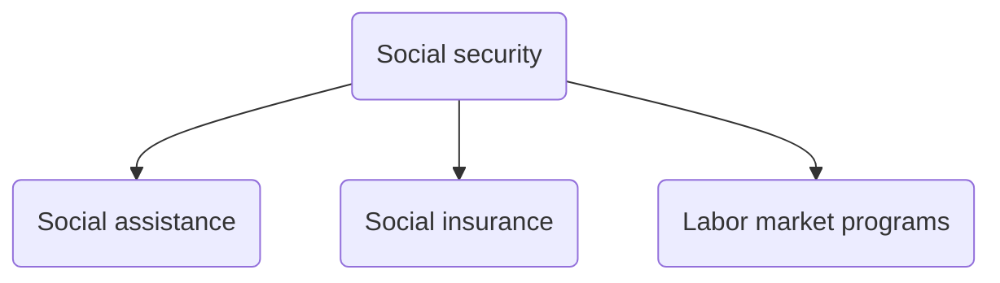

### ILO Social Security Report
#GS1 #GS2 #Society #SocialJustice #InternationalOrganizations #Data
- Social security coverage of India increased from **19% (2015)** to **64.3% (2025)**.
- <u><b>Social Security</b></u>:
	- Protection that a society provides to individuals and households to ensure *access to healthcare* and to *guarantee income security*, particularly in cases of old-age, unemployment, sickness, invalidity, and maternity, etc.
	- **3 pillars of social security**:

- <u><b>Initiatives in India</b></u>:
	1. **PM-SYM (Old Age Protection) (18-40 years):** 50%-50% contribution by the subscriber and GoI.
	2. **PM-JJBY (18-50 years):** life insurance up to ₹2 Lakh on death due to any cause. 
	3. **PM-SBY (18-70 years)**
	4. **PDS**
	5. **NSAP**
		1. IGNOAPS
		2. IGNWPS
		3. IGNDPS
		4. NFBS
		5. Annapurna scheme
	6. **PMAY-Gramin**
---
### State of World Population Report 2025
#GS1 #Society #Demography #Report #Data 
- Released by **UNFPA** (United Nations Population Fund) based on the new data from **UNFPA-YouGov** survey.
- Report title: ***"The real fertility crisis: The pursuit of reproductive agency in a changing world"***
- <b><u>Takeaways:</u></b>
	1. **1 in 3 Indians (36%)** face **unintended pregnancies**, challenging the narratives around ***"population explosion" vs. "population collapse"***.
	2. Real crisis is that **1 million** individuals are **unable to achieve their true fertility goals**
	3. **1 in 5 people globally** expect not to have the number of children they desire. This is driven by, **prohibitive cost of parenthood, job insecurity, housing concerns, lack of suitable partner, sexism and economic precarity**, etc.
	4. For **India**, **financial limitations** are the biggest **barrier to reproductive freedom**. The issues along with % of Indian's surveyed facing the issue:
		- Job insecurity - 21%
		- Housing constraints - 22%
		- Lack of reliable childcare - 18%
		- Poor general well-being - 15%
		- Infertility - 13%
		- Limited access to pregnancy-related care - 14%

- <b><u>India's demographic indicators:</u></b>

| **INDICATOR**            | **VALUES**   |
| ------------------------ | ------------ |
| Population               | 1.46 Billion |
| Population% (Age 0-14)   | 24%          |
| Population% (Age 15-64)  | 68%          |
| Population% (Age 65+)    | 7%           |
| TFR                      | 1.9          |
| Life expectancy (Male)   | 71           |
| Life expectancy (Female) | 74           |
- <b><u>High fertility and low fertility duality case of India:</u></b>
	1. **Below replacement level TFR** (1.9 below 2.1). However, many people especially **women, face significant barriers to making free and informed decisions** about their reproductive choices.
	2. **Inter-state disparity:**
		- Below 2.1 TFR in **31 states/UT**
		- High TFR in **Bihar (3.0), Meghalaya (2.9) & UP (2.7)**
	3. **Urban-rural gap:** Rural areas generally have higher TFR. Still, 7 states still to achieve below 2.1 TFR in rural areas.
- **Infertility in India:** estimate of **27.5 million couples** face the issue and GoI need to consider inclusion of infertility under government's health insurance scheme.
--- 
### Global Gender Gap Report 2025
#GS2 #VulnerableSections #Women #Report 
- Released by **World Economic Forum (WEF)** and **India** ranked **131/148** with a parity score of **64.4%**. India's score improved by rank decreased from 129 in 2024.
- **4 dimensions:**
	1. Economic participation and opportunity (India increased 📈)
	2. Educational attainment (India increased 📈)
	3. Health & survival (India increased 📈)
	4. Political empowerment (India decreased 📉)
- Index ranges from 0(inequality) to 1(equality) i.e, **measure of equality**.
- <b><u>Takeaways:</u></b>
	- **Global gender gap** is at **68.8%** for 148 countries
	- ***Full parity still remains 123 years away at current rates***
	- **Various sub-indices:**
		- Health & survival gap- 96.2%
		- Educational attainment gap - 95.1%
		- Economic participation & opportunity gap - 61%
		- Political empowerment gap - 22.9%
	- Women represent **41.2%** of the **global workforce**
	- Still, women only hold **28.8%** of **top leadership positions**
- **Top performers:** Iceland > Finland > Norway > UK > Nzw
	- **Bangladesh** top performer in South Asia
- <b><u>Other Gender Indices:</u></b>
	- **GENDER INEQUALITY INDEX:** by **UNDP** -> India = 102/172 (2023)
	- **GENDER DEVELOPMENT INDEX:** by **UNDP**
	- **GLOBAL GENDER PARITY INDEX (GGPI):** by **UNDP** & **UN Women**
	- **WOMEN's EMPOWERMENT INDEX:** by **UNDP** & **UN Women**
---
### Global Trends Report: Forced Displacement
#GS1 #GS3 #VulnerableSections #Refugees #Migration
- Released by **UNHCR*** (United Nations High Commissioner for Refugees)
- **Highlights:**
	- Estimated **123.2 million** people worldwide were forcibly displaces at the end of 2024
		- **Children** account for **40%** of all forcibly displaces people
	- More than 1/3 of all forcibly displaced are due to **armed conflicts** and were from Sudanese, Syrian, Afghan and Ukraine.
	- **Internally displaced people: 73.5 million** at the end of 2024
- **Challenges posed by Forced Displacement:**
	- Vulnerability to **food insecurity** due to disrupted livelihood and dependency on aid.
	- **Public expenditure shock:** increase in government spending on the part of host governments.
	- **Social tensions:** due to competition over scarce resources.
	- **Unemployment issue:** due to changes in labor and consumer market.
- **Initiatives undertaken for forced displacement:** #MainsValueAddition 
	- **Global Compact for Migration (2018):** #convention Adopted by majority of UN members, with provides framework for international migration.
		- It is **NOT legally binding**
	- **Global Program on Forced Displacement (2009):** #convention established by **World Bank** to enhance development of forcefully displaced population.
---
### Census 2027:
#GS1 #Demography #Census
- <b><u>Legal provisions:</u></b> under the provisions of ***Census Act, 1948*** and ***Census Rules, 1990***
- <b><u>Census 2011:</u></b> conducted in 2-phases with various reference dates
	1. *Phase 1:* *"House Listing"*
	2. *Phase 2:* "*Population Enumeration (PE)*"
- <b><u>Proposed Census 2027:</u></b> ***India's 16th population census***, will be conducted again in **2 phases** along with **enumeration of caste**:
	- *Phase 1: "House Listing"* in **2026**
	- *Phase 2: "Population Enumeration"* in **Feb 2027**
	- **Reference date** will be ***00:00 hrs*** of <b><u><i>1st March 2027</i></u></b>
		- For **UT of Ladakh** and *non-synchronous snow bound areas of* **UT of J&K** and the states of **Uttarakhand** and **Himachal Pradesh**, the **Reference date** will be ***00:00 hrs*** of ***1st Oct 2027***
	- It will be India's **1st digital census** conducted through mobile apps available in *16 languages* (Hindi + Eng + 14 regional).
	- It will also be the **1st census in Independent India** to include **enumeration of caste** as well.
- <b><u>Details of the Notified Census 2027:</u></b>
	- The two phases with details are:
		1. **House-listing phase:** enumerators collect data on the head of the HH, the number of members, use of the building, material of construction, number of rooms, ownership status, sources of water & electricity, type of toilet, assets like TV, phone etc.
		2. **Population enumeration:** focuses on individual data - age, sex, DoB, education, occupation, religion, caste/tribe, disability status etc.
	- It will allow **self-enumeration** for the first time and offers nearly **real-time monitoring**
	- The **Census Managmeent and Monitoring System (CMMS)** will allow supervision and resolution of field issues without delay
	- Around **30 lakh enumerators**, primarily **school teachers** are to be deployed in addition to **1.2 Lakh functionaries** at district and sub-district levels and **46K trainers**  
	- <b><u>Changes in Process and Technology:</u></b>
		1. **Self-enumeration**
		2. **GPS integration:** while 2011 used physical maps. This time there will be **GPS tagging** and **geo-fencing** to avoid coverage gaps
		3. **Mobile tracking and validation**: real-time alerts and error correction
		4. **Coding system:** The **Registrar General of India**, has introduced a new coding system to make data collection more accurate.
		5. **New questions in 2027 Census questionnaire** for higher granularity of the collected data

---
### Manosphere
#GS1 #Society #VulnerableSections #Women 
- As per **UN Women**, rising ***manosphere*** is as serious threat to gender equality
- ***Manosphere*** is an umbrella term for a **"network of online communities"** that promote **narrow and aggressive definitions of masculinity**, along with the *false narrative* that feminism and gender equality have harmed men's rights.
	- Rooted in **misogyny**
	- **Anti-feminism** rhetoric
	- **Weaponisation of digital platforms**
- **Initiatives to counter Manosphere:**
	- **Global:**
		- ***Beijing Platform for Acction (1995)*** #MainsValueAddition : calls for **balanced & non-stereotypical portrayals of women in media**, including digital spaces
		- ***"Making All Spaces Safe" Initiative of UNFPA*** #MainsValueAddition : to combat **technology facilitated gene-based violence**
		- ***EU's Digital Services Act:*** prohibits misogynistic and gender-based hate content on digital platforms
	- **India:**
		- ***Indecent Representation of Women (Prohibition) Act, 1986*** #MainsValueAddition : outlaws indecent/derogatory portrayal of women in digital media
		- ***IT Rules, 2021:*** requires social media to remove objectionable content within 24 hours of complaint
		- ***Digital Shakti*** #MainsValueAddition : **Digitally empowering women & girls in cyberspace**, creating safer online environments for them
---
### Women in STEM  
#GS2 #Governance #Education #Women #Data  
- As per **MoEducation**, for the first time in over a decade, ***more girls passed Class 12 with Science (~28 lakh) than with Arts (~27 lakh) in 2024***  
- It marks **shift from traditional gender trend**  
- **Data:**  
	- **Gender-gap in science (Class 12th)** is narrowing and stands at **46%**  
	- **AISHE 2021-22:** Women comprises **52%** of students in sciense disciplines  
	- In **medicine**, female representation is on par with men and their presence is steadily increasing  
- **Initiatives:**  
	- ***Vigyan Jyoti:*** aims to encourage girls to pursue higher education and career in STEM  
	- ***CURIE initiative:*** supports R&D infrastructure in women universities to attract, train and retain promising girl students in S&T domain  
	- ***WISE-KIRAN scheme:*** encourages women scientists to engage in groundbreaking research in Science & Engineering  
---  
### QS World University Rankings 2026  
#GS2 #Governance #Education  
- India has **54 universities in the Rankings**, making it **4th** after **US, UK, and China** in terms of **most represented country**  
- **IIT Delhi - 123rd**, is India's top ranked institution  
  
<b><u>India's Research and Development Ecosystem:</u></b>  
- India ranked **39th/133** in the **Global Innovation Index 2024**  
- **CONCERNS:**  
	1. **Low GERD (Gross Expenditure on Research & Development): 0.64% of GDP**  
		- China - 2.43%  
		- USA - 3.5  
		- **Economic Survey 2020-2021:** India needs to increase its GERD to **2%**  
	2. **Inadequate private sector participation:**  
		- Central government - 43.7%  
		- **Private sector - 36.4%**  
			- Compared to **70%** in countries like **USA, and China**
		- State governments - 6.7%  
		- Higher Education Institutions - 8.8%  
		- Public Sector Industries - 4.4%  
	3. **Poor utilization of funds:** in FY23  
		- **DoBT - 72%** utilization of allocated budget  
		- **DoST - 61%** utilization of allocated budget  
	4. **Sub-optimal Industry-Academia convergence:** poor transformation of technologies developed in Indian labs for larger good of society  
	5. **Brain drain:** to developed countries  
- **INITIATIVES:**  
	- **Draft National Science, Technology, and Innovation (STIP) (2020):** to **double** the number of Full-Time Equivalent (FTE) researchers, GERD and private sector contribution to GERD **every 5 years**.  
	- **Anusandhan National Research Foundation (ANRF):** Established under the **ANRF Act, 2023** to seed, grow and promote R&D and foster a culture of research and innovation throughout the country  
	- **IMPacting Research INnovation and Technology (IMPRINT):** aimed at bridging gap between **scientific knowledge base** created through **fundamental research** and **applied research** and fruitful translation to engineering innovation  
---  
