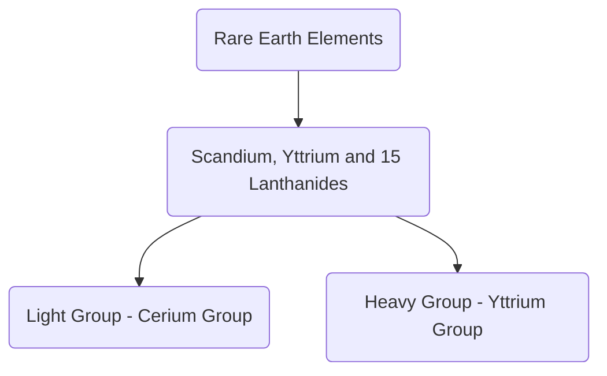

## 1. RARE EARTH ELEMENTS #LevelUpCA
#GS1 #GS3 #Geography #Economy #Resources #Minerals 

<b><u>NEWS/INTRO:</u></b> 
- Amid the ongoing **US-China trade war**, ***Beijing has suspended exports of REEs*** in April, 2025
- <b><u>Definition:</u></b> Rare earth elements are a **group of 17 chemical elements that occur together in the periodic table** and have similar properties like high density and conductivity. These consists of ***Scandium, Yttrium*** and ***15 Lanthanides*** and their main **minerals** are ***Bastnasite, Loparite***, and ***Monazite***.

<b><u>ARE THEY RARE?</u></b>
- These are **plentiful in earth's crust**. However, they occur in **low concentrations** making them **very difficult to mine for economic extraction**
- Their extraction also causes **environmental damage**

<b><u>WHY THEIR DEMAND IS INCREASING?/APPLICATIONS OF REE:</u></b> ***"Seeds of Modern Technology"***
- They are used in **electronic devices** - computer memory, rechargeable batteries, cell phones, catalytic converters, magnets, fluorescent lights etc.
	- Explosion in the last 30 years -> **Telecommunication revolution**
		- #Eg **Neodymium** - permanent magnets
		- #Eg **Europium** - necessary for **LED bulbs** and **Color TV screens**
		- #Eg **Samarium** - used in **optical lasers**
- **Critical Defence use:**
	- **Alloys** used in **armored vehicles & projectiles** use REM
	- **Defence Electronics:**
		- Night vision goggles, precision guided weapons, communication equipment, GPS equipment, Batteries, etc.
		- Their substitutes are not effective and diminishes the military superiority
- **Batteries of electric and hybrid electric vehicles:** will further increase demand of REE - ***EV requires 6X (6times) more critical minerals than ICE vehicles***
	- Demand growth driven by *climate change concerns* and struggle for *energy independence* (as oil import decreases with more EVs)
- **Chemical applications:** REE are also used as **Catalysts, Phosphors,** and **Polishing compounds**
	- They are used in *air pollution control* and *illuminated screens*, etc.
- **Emerging medical technologies:** uses several REE
- ***"Sunrise technologies currently being developed are rare earth intensive"***

<b><u>PRODUCTION TRENDS OF REE:</u></b>
- <b><u>Before 1965:</u></b> very little demand
	- Supply from **placer deposits in India and Brazil**
	- **South Africa** was leading supplier in **1950s**
- **Color Television** - ***first explosion of demand:*** essentially **Europium** to produce colors
	- **USA** became leading producer
	- **China:** began to produce notable amounts in 1980s and became l**leading producer in 1990s and early 2000s*
		- <b><u>Why China was able to become world leader in REE?</u></b>
			- Long term vision of developing the future electronics industry
			- Consistent government support
			- Mineral availability - largest reserves of REE ~44 Million Tonnes
			- Weak environmental laws -> less roadblocks in extraction
			- Cheap production - China utilized its demographic dividend by providing cheap labor for REE mining, to the world
			- Huge demands in China - as became leader in electronics
- In **2010-2011**, **China controlled 90% of the supply of REE** - and imposed *extreme export restrictions*
	- Price rise of more than 700% in REE
	- Downstream industries crippled and the world was left scurrying to fend for REE
- After **aggressive production** by **USA, Australia, and Canada** - ***China's share came down to 60%***, but still China dominates **90% processing**
	- Western countries are cooperating to develop alternatives through **China plus one** strategy

<b><u>INDIA AND RARE EARTH METALS:</u></b>
- India's economy has **two massive input deficiencies** which **threatens its stability:**
	- **Oil** - 87% imported
	- **REE** - ~100% import dependence for most REEs
- India has **great potential for domestic production** as it has **one of the largest reserves of REE: ~7 Million Tonnes** and ranks roughly **5th** in the world
- ***NEWS:*** As per a recent report by **CareEdge**, India holds **8% of world's REE reserves**.
- **Distribution in India:**
	- States of **Andhra Pradesh, Karnataka, Odisha and Kerala**
	- **Monazite sand** in **Andhra and Kerala** is particularly rich in REEs
		- Most of the **REEs available in India** are ***light REEs*** such as *Lanthanum, Cerium, Samarium and Terbium, etc.*
		- **China** has **monopoly** over the world market regarding ***heavy REEs***
		- <b><u>NOTES: <i>Monazite</i></u></b> is a mineral mainly containing **REE** and **Thorium** 
			- Estimated Monazite resources ~ 12-13 Mn Tn
			- State wise reserves - ***Costs*** of **Andhra > Odisha > TN > Kerala**
- Despite having one of the largest reserves in the world, India's ***total production of REE is just 1% of the global production***.

<b><u>REASONS FOR LOW REE PRODUCTION IN INDIA:</u></b> 
1. **Classification of REMs as "Atomic Minerals":** mining reserved for government entities which lack capacity
	- It was done as **REEs occur along with Thorium and Uranium** #Eg Monazite
	- Mining was **reserved for government companies** -  *only two in India*
		- *India Rare Earth Ltd (IREL)*
		- *Kerala Minerals and Metals Ltd* (owned by Kerala government)
	- ***Negligible involvement of private sector*** in mining of REEs
2. **Expertise mismatch:** government policies led to **separation of Rare Earth ecosystem from private sector led electronics and metallurgy ecosystem**. Privates could have provided expertise in mining just like they did in electronics!
3. **Incentive mismatch:** IREL was able to earn a lot of **revenue by production of other minerals** from beach sand (like *Ilmenite (Ti), Zircon, etc.*) and thus, have **little incentive to focus on globally competitive REEs**
4. **Technological gap and Limited R&D:**
	- India lacks *advanced separation and refining technology* for REEs
	- *High capital cost* of setting up domestic processing industry
	- India's *funding in material science R&D* is a fraction of Chinese funding
5. **Lack of skilled workforce & infrastructure deficiency:** REE requires *highly specialized workforce* where India is facing shortage. Similarly, **mining regions** are facing infrastructural deficiencies
6. **Lack of proper linkage between minerals and manufacturers:** as mining is done mostly by IREL, while downstream industries like electronics are disconnected and rely on **imports**
7. **Over-regulation:**
	- #Eg In *2019*, the central government *amended* the *Atomic Minerals Concessions Rules, 2016*, whereby *threshold values, to be classified as an atomic mineral, for a range of minerals were reduced* - this decision ***effectively nationalized beach sand*** and forced several private players out
8. **Environmental issues** and **Health issues** due to REE mining and extraction 
9. **Coastal Regulation Zone (CRZ) norms** also hinder mining of REE on the **monazite** rich coasts of India

<b><u>WHY LOW PRODUCTION AND IMPORT DEPENDENCY IS A CAUSE OF CONCERN?</u></b>
- **Significant supply chain risks:** When China restricts the supply of REEs, the local industries may suffer
- May **negatively hamper India's goal of becoming a manufacturing powerhouse** - ***we need REEs to shift from assembling to manufacturing!***
	- #Eg India must also manufacture Iphone parts rather than importing and assembling them, and this will require domestic REE extraction ecosystem
- **Limits domestic innovation:** IPR and technological expertise remains outside India's control. This hampers competitiveness of domestic economy.

<b><u>STEPS TAKEN BY GoI TO ENHANCE REE PRODUCTION:</u></b>
1. <b><u>Mines and Minerals (Development and Regulation) Amendment Act, 2023:</u></b>
	- ***REEs classified as Critical Minerals*** (Part-D of the 1st Schedule)
	- **Central government empowered to exclusively auction mining lease** and composite license for certain critical minerals (including REEs)
		- **Revenue** from the auction will be **accured** to the **state governments**
		- Minerals of **"rare earth" group (not containing Uranium and Thorium),** **fertilizer minerals** such as ***Potash, Glauconite, and Phosphate***, are **removed from the list of atomic minerals**
	- The amendment also provides for **provision for grant of a new mineral concession**, ***Exploration License (EL)***
		- **EL** shall permit the licensee to undertake **reconnaissance and prospecting operations** for critical and deep seated minerals in the **newly proposed 7th Schedule of the Act**
			- These minerals include **REEs**
2. <b><u>National Critical Mineral Missions:</u></b> launched in 2025 with an objective of **securing critical mineral supply** for **30 critical minerals** including REEs 
3. <b><u>Rare Earth Theme Park:</u></b> **IREL**0 is in process of setting up futuristic concept of **Rare Earth and Titanium Theme Park** at **Bhopal, MP**
	- It will setup a **pilot plant based on laboratory scale technologies** developed by **BARC** and **R&D institutes**
	-  Build confidence of budding entrepreneurs and startups
4. <b><u>International cooperation:</u></b>
	- India has officially joined the **Mineral Security Finance Network (MSFN)**, a Us-led initiative aimed at **securing supply chain for critical minerals** to counter Chinese dominance and monopoly
		- **MSFN** is an **extension of Mineral Security Partnership (MSP)** which India joined in 2023, with an aim of ensuring stable supply chains of critical minerals for clean energy transition

<b><u>SIGNIFICANCE OF ABOVE MEASURES:</u></b>
1. It will allow **REEs** to be **mined by private sector**. This will also **increase investments in REEs** in India
2. Through **MSFN and MSP**, India will ensure **international cooperation for stable supply and extraction** of REEs
3. This will **reduce India's import dependence** on REE

<b><u>WAY FORWARD:</u></b>
1. **Demerge IREL** into **two different entities** with appropriate amendments to the Atomic Energy Act's schedule:
	- One focusing exclusively on **Thorium extraction** and retained under DAE
	- Remaining entity **specializing in other available rare earth processing** which can come under the ***future Department of Rare Earth***
2. **Attract private sector:**
	- **Simplifying bidding and mining process** for REEs
	- **Financial incentives** - cheaper capital, tax incentives, etc.
3. **Focus on domestic value addition:** rather than exporting away low value ores, build an ecosystem to extract REEs from the ores.
4. **Better linkages and integration:** 
	- **Advanced Market Commitments (AMC):** AMCs are basically **binding pre-orders** i.e, the government has a clear advance commitment or purchasing certain good at a particular price
4. **Improved R&D:** need to set up **domestic R&D centres of excellence** along with **acquisition of foreign data and talent**
5. **Circular Economy:** India should **set specific recycling targets** on the lines of EU which targets that **recycling should meet 25% demand of critical minerals (including REEs) by 2030**
6. **Strengthen international collaboration:** by taking ahead **MSP and MSFN membership**
	- **Diversify sources:** #Eg *collaborate with Myanmar* to grow REE mining activities. China is already engaging a lot with Myanmar.

<b><u>CONCLUSION:</u></b> ***"Rare earth metals mining in India needs to increase to insulate India's economy and military from external shocks. This can be done by reforming policies, increasing R&D, promoting private players in the sector, and strategic international collaboration"***.

---
